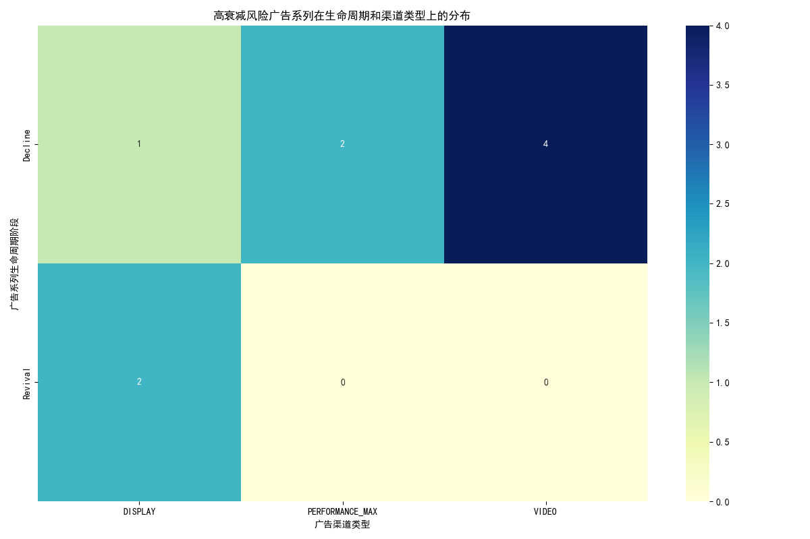
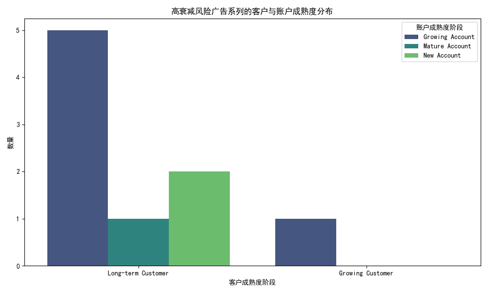

# 谷歌广告获客效率衰减分析与优化策略报告

## 1. 摘要

本次分析旨在识别并诊断 Google Ads 中出现获客效率衰减的广告系列，并提供针对性的优化建议。通过对运行超过120天的广告系列进行深入分析，我们成功定位了一批在近30天内**客户获取成本 (CAC) 增长超过25%** 且 **客户终身价值与成本比 (LTV/CAC) 下降超过20%** 的高风险广告系列。

**核心发现：**
- **主要风险领域**：衰减问题主要集中在处于 **`Decline` (衰减期)** 和 **`Revival` (复苏期)** 生命周期的广告系列，尤其是在 **`VIDEO` (视频)** 和 **`PERFORMANCE_MAX` (最高效果)** 渠道类型中。
- **客户与账户特征**：这些高衰减风险的广告系列主要针对的是 **`Long-term Customer` (长期客户)**，并且普遍发生在 **`Growing Account` (成长中账户)**。
- **潜在原因**：数据表明，衰减可能由多种因素导致，包括渠道饱和、创意疲劳、目标受众枯竭以及对高价值客户群体的策略失焦。

**核心建议：**
- **衰减期 (Decline) 视频广告**：立即审查并更新广告创意，测试新的目标受众细分，并考虑小幅削减预算以改善效率。
- **复苏期 (Revival) 展示广告**：重新评估出价策略和预算分配，重点关注高转化率的展示位置和受众，避免盲目扩大规模。
- **预算与资源重新分配**：将从低效广告系列中节省的预算，重新投资于那些显示出 **`scale_opportunity` (规模化机会)** 且针对高价值客户（如 `Enterprise` 或 `Consumer Premium`）的广告系列。
- **策略调整**：针对“长期客户”，应从“拉新”思维转向“再激活”或“价值提升”思维，调整沟通信息和出价策略。

---

## 2. 分析背景与方法

营销团队观察到多个长期广告系列存在效率衰减模式。为应对此挑战，我们关联分析了 `google_ads__customer_acquisition_analysis` 和 `google_ads__campaign_report` 两个数据表，旨在：
1. 精准识别运行超过120天且满足特定衰减标准（CAC增长>25%，LTV/CAC下降>20%）的广告系列。
2. 深入分析不同生命周期、渠道类型、客户与账户成熟度对衰减的影响。
3. 结合多维度指标，构建综合衰减风险评估，并提供差异化优化建议。

---

## 3. 核心发现与诊断

我们识别出 9 个广告系列表现出显著的获客效率衰减。它们的分布和特征揭示了问题的共性。

### 3.1. 高衰减风险广告系列的分布特征

衰减问题并非随机分布，而是高度集中在特定的生命周期阶段和广告渠道类型中。

**图1：高衰减风险广告系列在生命周期和渠道类型上的分布**

从上方的热力图可以看出：
- **`Decline` (衰减期)** 的广告系列风险最高，尤其是在 `VIDEO` (4个) 和 `PERFORMANCE_MAX` (2个) 渠道中。这表明当广告进入衰减期后，传统的视频和PMax策略可能正在失效。
- **`Revival` (复苏期)** 的广告系列也显示出风险，特别是在 `DISPLAY` (展示广告) 渠道中（2个）。这可能意味着在尝试复苏广告时，所采取的策略（如放宽定向、提高出价）反而导致了效率的恶化。

### 3.2. 客户与账户成熟度分析

进一步分析这些衰减广告系列所针对的客户群体和账户状态，我们发现了更深层次的问题。

**图2：高衰减风险广告系列的客户与账户成熟度分布**

如图所示：
- **客户维度**：绝大多数 (8 out of 9) 衰减广告系列的目标受众是 **`Long-term Customer` (长期客户)**。这揭示了一个关键问题：我们可能在用拉新策略去触达已有客户，导致成本上升而效率下降。例如，针对长期客户展示高成本的视频拉新广告，其转化效率远低于新客户。
- **账户维度**：大部分问题出现在 **`Growing Account` (成长中账户)**。这表明在账户的快速扩张期，可能因管理疏忽或策略粗放，未能及时发现并调整效率下降的广告系列。

### 3.3. 具体衰减案例分析

通过查看 `decayed_campaigns.csv` 的数据，我们可以发现具体的案例：
- **案例1：`Campaign_ACC_ECOM_002_4` (Decline - VIDEO)**
    - **CAC 增长率**: 46.4%
    - **LTV/CAC 下降率**: 38.7%
    - **分析**: 这是一个典型的衰减期视频广告，针对的是 `Consumer Premium` 客户。尽管客户价值高，但 CAC 急剧上升，可能是因为创意内容已让该受众群体产生疲劳，或者竞争加剧导致出价成本飙升。
- **案例2：`Campaign_ACC_EDU_001_3` (Revival - DISPLAY)**
    - **CAC 增长率**: 75.6%
    - **LTV/CAC 下降率**: 89.8%
    - **分析**: 这是一个尝试“复苏”的展示广告，但结果灾难性。极高的 CAC 增长和 LTV/CAC 下降表明复苏策略（可能是大幅提高预算或放宽定向）完全失败，导致了大量的低质量点击和极低的转化。

---

## 4. 优化建议与行动方案

基于以上分析，我们提出以下差异化的优化建议：

### 4.1. 针对 `Decline` (衰减期) 的广告系列

- **`VIDEO` 和 `PERFORMANCE_MAX` 渠道**:
    - **诊断**: 创意疲劳和受众饱和是主要原因。
    - **行动**:
        1. **立即暂停或大幅削减预算**：为分析和调整争取时间，停止无效花费。
        2. **更新广告创意**: 制作全新的视频/图文素材，采用不同的叙事角度或视觉风格。
        3. **测试新受众**: 排除已高度覆盖的受众，探索新的兴趣、行为或相似受众群体。
        4. **调整出价策略**: 从“最大化转化”转向“目标每次转化费用 (tCPA)”或“目标广告支出回报率 (tROAS)”，设置更严格的效率目标。

### 4.2. 针对 `Revival` (复苏期) 的广告系列

- **`DISPLAY` 渠道**:
    - **诊断**: 复苏策略可能过于激进，导致预算浪费在低质量流量上。
    - **行动**:
        1. **审查流量来源**: 分析展示位置报告，排除表现差的网站和应用。
        2. **收紧受众定向**: 移除效果不佳的受众群体，更专注于历史转化表现好的受众。
        3. **降低出价**: 将出价策略回调至更保守的水平，确保每一次点击的价值。

### 4.3. 预算重新分配与高价值客户策略

- **识别增长机会**: 关注数据中 `scale_opportunity` 值为 1 的广告系列，这些是系统认为有潜力扩大规模的领域。将从衰减广告系列中削减的预算优先投入到这些高效的广告系列中。
- **聚焦高价值客户**: 分析显示，即使在衰减的广告系列中，也存在`Enterprise` 或 `SMB Premium` 等高价值客户群体。我们应创建专门的广告系列来服务这些客户，使用定制化的信息和更高的出价，而不是将他们与普通消费者混合在同一个广告系列中。
- **调整长期客户策略**: 对于 `Long-term Customer`，广告目标应从“获取”转变为“交叉销售”、“向上销售”或“品牌再营销”。使用再营销列表 (Remarketing Lists)，投放定制化的优惠或新功能信息，其成本和效率远优于重新“获取”他们。

---

## 5. 结论

通过本次深入分析，我们不仅识别出了具体的低效广告系列，更重要的是揭示了其背后的结构性问题：**生命周期阶段与渠道策略的错配，以及对长期客户的营销策略失焦**。

我们建议营销团队立即根据本报告提出的行动方案，对识别出的9个高风险广告系列进行干预。长期来看，应建立一个常规性的广告系列健康度审查机制，定期评估长期广告的 CAC 和 LTV/CAC 动态，并根据其所处的生命周期阶段和目标客户的成熟度，动态调整策略和预算，从而实现持续高效的客户获取。
