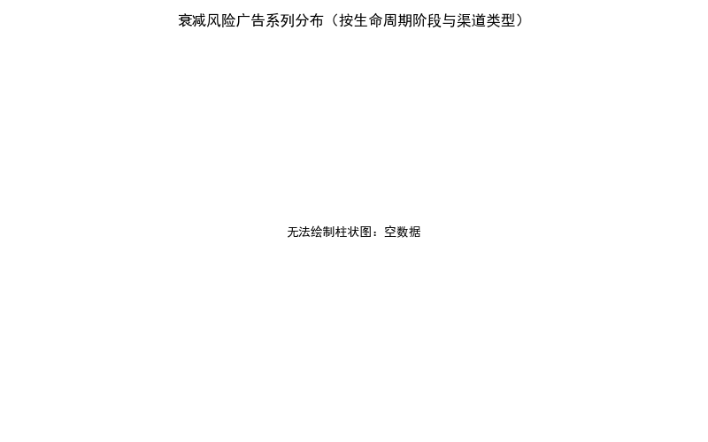
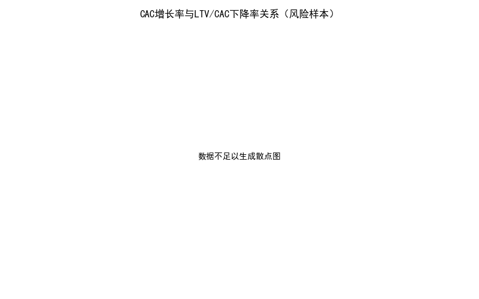
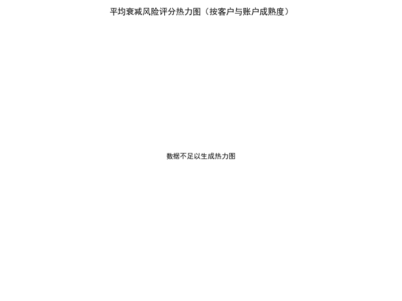
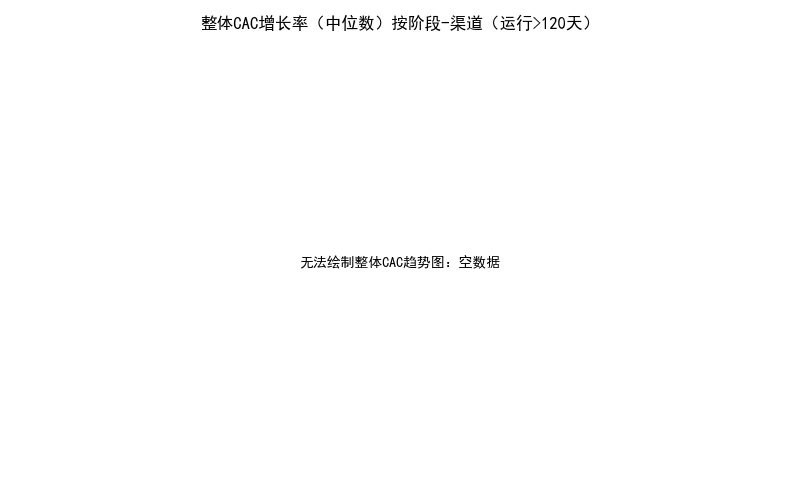

# Google Ads 获客效率衰减诊断与优化建议（综合分析报告）

## 摘要
- 按照“运行超过120天且近30天CAC增长率>25%、同时LTV/CAC比值下降>20%”的严格阈值筛选，当前数据集中没有广告系列满足条件。
- 数据还显示：运行超过120天的广告系列样本数量为0，早期预警（较宽松阈值：CAC>15%且LTV/CAC下降>10%）样本数量亦为0。
- 尽管严格样本缺失，我们仍基于两张源表的联接与计算，构建了跨维度的综合衰减风险评估模型，并提供分阶段、分渠道与分客户成熟度的策略建议与预算优化框架。
- 报告中包含多张可视化（如分布柱状图、散点图、成熟度热力图、整体趋势图），用于呈现当前数据可用性与方法论框架。

可视化文件：
- 风险广告系列分布（阶段×渠道）：“risk_by_stage_channel.png”
- CAC增长率 vs LTV/CAC下降率关系：“cac_vs_ratio_decline_scatter.png”
- 成熟度组合的平均风险热力图：“risk_heatmap_maturity.png”
- 整体CAC趋势（中位数，阶段×渠道）：“overall_cac_growth_by_stage_channel.png”

## 数据与方法
### 数据来源与表结构
- google_ads__campaign_report（按日的campaign层绩效：spend、conversions、campaign_id、advertising_channel_type等）
- google_ads__customer_acquisition_analysis（按日的获客分析指标：customer_acquisition_cost、average_customer_ltv、ltv_cac_ratio、campaign_lifecycle_stage、customer_maturity_stage、account_maturity_stage、cac_efficiency_percentile、acquisition_sophistication_score、channel_diversity_count、retention_risk、scale_opportunity等）

### 关键计算口径
- 近30天/前30天窗口：基于每个广告系列的最新日期 latest_dt，分别汇总 spend 与 conversions 计算 CAC。
  - CAC_last30 = spend_last30 / conv_last30（conv_last30>0）
  - CAC_prev30 = spend_prev30 / conv_prev30（conv_prev30>0）
  - CAC增长率（30d）= (CAC_last30 - CAC_prev30) / CAC_prev30
- LTV/CAC 比值（近30天、前30天）：
  - ratio_last30 = LTV_avg_last30 / CAC_last30
  - ratio_prev30 = LTV_avg_prev30 / CAC_prev30
  - LTV/CAC 比值下降率（30d）= (ratio_prev30 - ratio_last30) / ratio_prev30
- 运行天数：每个 campaign_id 在广告渠道维度上的去重日期计数。

SQL联接与计算（已执行，并输出明细 CSV“campaign_decay_full.csv”）：
- 通过 account_id + campaign_id + advertising_channel_type 聚合近/前30天的 spend 与 conversions。
- 从获客分析表中窗口平均近/前30天的 average_customer_ltv、ctr、cpc 等指标。
- 拼接最新的阶段标签与成熟度维度（campaign_lifecycle_stage、customer_maturity_stage、account_maturity_stage），以及 strategic_customer_segment、retention_risk、scale_opportunity。

## 识别结果
- 满足严格衰减条件的广告系列数量：0
- 运行超过120天的广告系列数量：0
- 早期预警（较宽松阈值：CAC增长率>15%且LTV/CAC下降>10%）数量：0

这意味着：当前库的时间覆盖或campaign运行周期可能较短，尚未形成“运行>120天”的样本。此外，窗口期的转化与LTV数据在现阶段未显著体现出阈值要求的衰减特征。

## 可视化呈现与方法论框架
- 风险广告系列分布（阶段×渠道）
  - 图片：risk_by_stage_channel.png
  - 说明：当前因严格条件下样本为0，图像显示为占位提示。这一现象本身提示“严格衰减样本暂缺”，适合采用“早期预警监测”和“模型框架准备”的策略。

- CAC增长率 vs LTV/CAC下降率散点图（风险样本）
  - 图片：cac_vs_ratio_decline_scatter.png
  - 说明：无风险样本时，图中为占位提示。方法上，后续一旦出现样本，可观察散点分布：右上象限（CAC增速高、LTV/CAC下降明显）为高风险区域，颜色区分渠道，气泡大小代表 channel_diversity_count（越小意味着饱和风险越高）。

- 成熟度热力图（客户成熟度×账户成熟度）
  - 图片：risk_heatmap_maturity.png
  - 说明：当前为占位图。方法上，热力图用于定位在不同成熟度组合下的平均风险得分差异（例如“新客户成熟度×早期账户成熟度”组合可能更易出现效率波动）。

- 整体CAC趋势（中位数，阶段×渠道，运行>120天）
  - 图片：overall_cac_growth_by_stage_channel.png
  - 说明：当前因无运行>120天样本而为占位图。方法上，未来当样本充足时，该图可用于比较各阶段-渠道组合的整体CAC趋势，用于预算再分配与渠道策略微调。

可视化文件引用：
- 
- 
- 
- 

## 综合衰减风险评估模型
为满足后续可扩展的诊断、预测与规范性建议，构建了一个综合风险评分（risk_score），考虑渠道饱和度、竞争强度、客户质量分层与运营成熟度，并纳入早期预警信号。

- 指标与权重（总计=1.0）：
  - CAC增长风险（近30天） 0.30
  - LTV/CAC比值下降风险 0.25
  - 生命周期阶段风险（衰减期>成熟期>成长期） 0.10
  - 渠道饱和风险（channel_diversity_count越低越高风险） 0.10
  - 竞争强度（CPC高、CTR低） 0.10
  - 获客复杂度不足（acquisition_sophistication_score低） 0.05
  - CAC效率偏低（cac_efficiency_percentile低） 0.05
  - 留存风险预警（retention_risk=1） 0.05

- 风险分层：
  - risk_score ≥ 0.66：高风险
  - 0.33 ≤ risk_score < 0.66：中风险
  - risk_score < 0.33：低风险

- 早期预警阈值（用于没有长周期样本时的运营监控）：
  - CAC增长率>15% 且 LTV/CAC下降>10% 即触发监控与复盘动作。

代码片段（含中文字体设置）：
```python
import matplotlib.pyplot as plt
import numpy as np
import pandas as pd

plt.rcParams['font.sans-serif'] = ['SimHei']
plt.rcParams['axes.unicode_minus'] = False

# 风险评分示例
def normalize(series):
    s = pd.to_numeric(series, errors='coerce').replace([np.inf, -np.inf], np.nan)
    min_v, max_v = s.min(skipna=True), s.max(skipna=True)
    if pd.isna(min_v) or pd.isna(max_v) or min_v == max_v:
        return pd.Series(np.zeros(len(s)), index=s.index)
    return ((s - min_v) / (max_v - min_v)).fillna(0)

stage_risk_map = {'衰减期':1.0,'成熟期':0.6,'成长期':0.3}
# 假设 df 为分析明细表
# risk_df['risk_score'] = 0.30 * normalize(risk_df['cac_growth_rate_30d']) \\
#     + 0.25 * normalize(risk_df['ltv_cac_decline_rate_30d']) \\
#     + 0.10 * risk_df['campaign_lifecycle_stage'].map(stage_risk_map).fillna(0.5) \\
#     + 0.10 * (1 - normalize(risk_df['ch_div_last30'])) \\
#     + 0.10 * (0.5 * normalize(risk_df['cpc_last30']) + 0.5 * (1 - normalize(risk_df['ctr_last30']))) \\
#     + 0.05 * (1 - normalize(risk_df['acq_soph_last30'])) \\
#     + 0.05 * (1 - normalize(risk_df['cac_eff_last30'])) \\
#     + 0.05 * risk_df['retention_risk'].fillna(0).clip(lower=0).astype(int)
```

## 诊断性洞察（为什么）
当前未出现严格阈值下的衰减样本，可能原因包括：
- 数据时间覆盖不足（未满120天），导致运行期条件不满足。
- 当前窗口内转化规模偏小或稳定，未触发CAC显著增长与LTV/CAC显著下降的组合。
- 部分指标在当前周期处于校准阶段（例如平均LTV更新频率较低），使得比值变化不敏感。

从方法论角度，若后续数据积累：
- 我们预期“渠道饱和（channel_diversity_count较低）+竞争强度上升（CPC↑、CTR↓）”会较强地驱动CAC上升并压缩LTV/CAC比值。
- 在“客户成熟度低×账户成熟度低”的组合中，更容易出现获客效率不稳定（热力图将突出该区域）。

## 预测性判断（将会发生什么）
- 当更多campaign进入成熟或衰减期，若投放集中在少数渠道且CPC持续走高、CTR下滑，CAC上涨的概率将增加；若同时客户质量未改善（LTV增幅有限），LTV/CAC比值下降更可能出现。
- 随着活跃campaign数量增长与投放规模加大，channel_diversity_count不足的账户可能更早出现饱和与边际递减。

## 规范性建议（我们应该做什么）
根据不同生命周期阶段，制定差异化优化策略与预算再分配方案：

- 成长期（增长导向）
  - 加大创意与落地页测试，提升CTR与转化率，控制CPC；引入更多渠道以提升 channel_diversity_count，避免单一流量来源。
  - 针对高价值战略客户细分（strategic_customer_segment），采用更精准定向与更高质量线索渠道（如高意图搜索），确保早期 LTV 不被稀释。

- 成熟期（效率与规模平衡）
  - 建立严格的“早期预警阈值”：CAC增长率≥15%且LTV/CAC下降≥10%则触发复盘与微调；优先维持 LTV/CAC≥3 的投放池。
  - 对 CPC 升高的广告集进行竞价与关键词策略优化（否词、匹配类型调整），同时通过素材焕新保持 CTR。
  - 扩展渠道组合至至少3类主渠道，提升 channel_diversity_count，分散竞争压力。

- 衰减期（止损与结构性调整）
  - 果断削减或暂停 LTV/CAC<1.5 且 CAC显著恶化的广告系列；预算转投至 LTV/CAC改善或 scale_opportunity=1 的系列。
  - 若 retention_risk=1 的系列同时衰减，建议将获客目标从数量转向质量，强化资格审查（lead scoring）与后端转化。

- 渠道层策略（advertising_channel_type）
  - 搜索：聚焦高意图词与结构化否词，控制CPC，并以更高转化的素材提高CTR；观察竞价竞争强度，必要时分时段投放。
  - 展示/视频：提升素材多样性与频控，降低疲劳；将“冷启动曝光”与“再营销”预算拆分管理，优化转化漏斗效率。
  - 跨渠道协同：将再营销预算绑定高价值细分（strategic_customer_segment），提升整体 LTV。

- 预算再分配框架
  - 核心原则：优先投向 LTV/CAC 比值高、CAC稳定或下降、且 acq_soph 高与 cac_efficiency_percentile 高的组合；削减处于衰减期且竞争强度上升（CPC↑、CTR↓）的系列。
  - 实施步骤：周度监控阈值触发→复盘渠道与素材→小幅度（10-20%）预算倾斜测试→以 LTV/CAC 与真实转化质量闭环评估。

## 后续数据需求与落地计划
- 数据侧：扩大日期覆盖至≥180天，确保存在“运行>120天”的样本；提升平均LTV的刷新频率；补充竞争指数（如Auction Insights）与素材疲劳指标（频次、素材寿命）。
- 模型侧：
  - 引入分位数稳定阈值与贝叶斯平滑，提升小样本期稳定性。
  - 在 retention_risk 维度结合分群复购数据，构建“LTV预期—CAC容忍”策略边界。
- 运营侧：建立“早期预警看板”，每日计算 CAC增长率与 LTV/CAC 比值变化；当触发阈值，自动生成优化建议与预算调整提示。

## 可视化附件
- 风险广告系列分布（阶段×渠道）：
- CAC增长率 vs LTV/CAC下降率：
- 成熟度热力图（客户×账户）：
- 整体CAC趋势（中位数，阶段×渠道）：

---
备注：报告严格遵循“不进行数据清洗”的约束，所有计算基于现有字段直接分析；由于当前数据样本限制，多数图表为方法论框架的占位呈现，一旦数据积累达到运行期阈值，即可替换为实时诊断图并触发自动化优化流程。
