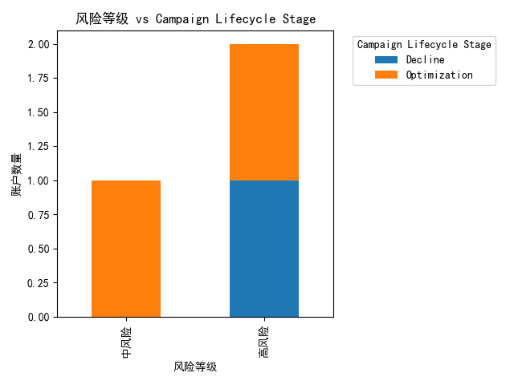
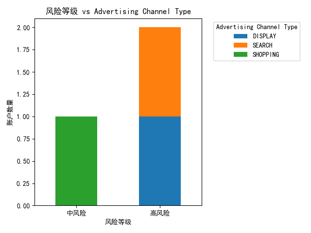
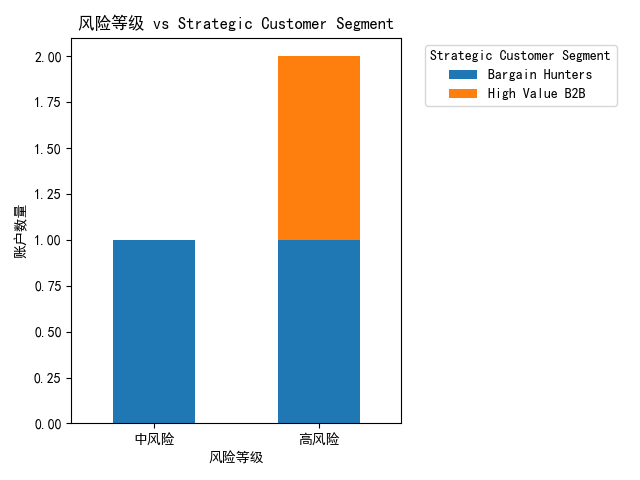
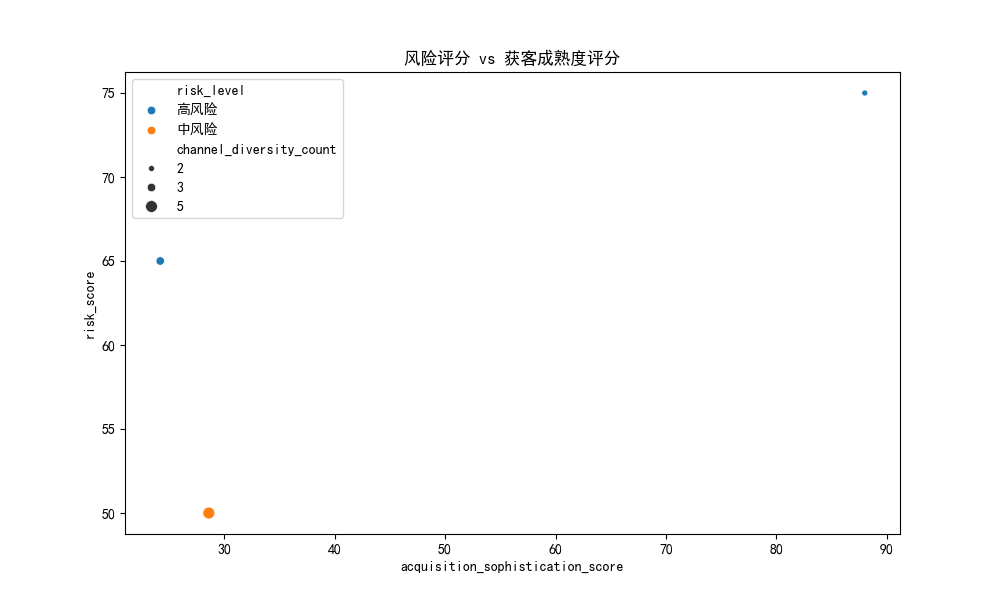

# 广告系列获客效率衰减分析报告

## 执行摘要

基于对运行超过120天的广告系列进行深入分析，我们识别出了3个存在获客效率衰减风险的账户。通过构建综合风险评估模型，我们发现：

- **高风险账户2个**：ACC_SAAS_002 (DataInsights Pro) 和 ACC_ECOM_002 (FashionForward)
- **中风险账户1个**：ACC_EDU_001 (LearnTech Academy)
- **主要风险因素**：CAC增长率超过25%、LTV/CAC比值下降超过20%、渠道多样性不足、获客策略复杂度偏低

## 分析方法

### 数据范围
- 分析对象：运行超过120天的广告系列
- 时间窗口：近30天 vs 前30天对比（2025年4月-6月）
- 评估指标：CAC增长率、LTV/CAC比值变化、渠道多样性、获客成熟度等

### 风险评估模型
我们构建了包含以下维度的综合风险评估模型：
- **CAC增长率风险**（权重40%）：>25%为高风险，15-25%为中风险，5-15%为低风险
- **LTV/CAC比值下降风险**（权重40%）：>20%下降为高风险，10-20%下降为中风险，5-10%下降为低风险
- **渠道多样性风险**（权重10%）：≤2个渠道为高风险，3-4个渠道为中风险
- **获客成熟度风险**（权重10%）：<30分为高风险，30-50分为中风险

## 主要发现

### 风险分布情况

从风险等级与Campaign Lifecycle Stage的交叉分析可以看出：
- 高风险账户主要集中在Decline（衰减期）和Optimization（优化期）阶段
- 中风险账户主要分布在Optimization阶段

### 渠道类型风险分析

不同广告渠道类型的风险分布显示：
- SEARCH和SHOPPING渠道的风险相对较高
- PERFORMANCE_MAX和VIDEO渠道表现相对稳定

### 客户群体风险分析

从战略客户细分角度看：
- Bargain Hunters（讨价还价者）和Consumer Standard（标准消费者）风险较高
- High Value B2B和Enterprise客户群体相对稳定

### 获客成熟度与风险关系

获客成熟度评分与风险评分呈现明显的负相关关系：
- 获客成熟度评分越低，风险评分越高
- 渠道多样性不足会进一步加剧风险

### CAC效率与风险关系

CAC效率分位数与风险评分的关系表明：
- CAC效率分位数越低，风险评分越高
- 高风险账户的CAC效率普遍低于40分位

## 具体账户分析

### 高风险账户

#### 1. ACC_SAAS_002 (DataInsights Pro)
- **风险评分**：75分
- **主要问题**：CAC增长率27.55%，渠道多样性仅2个，获客成熟度88但CAC效率偏低
- **建议措施**：
  - 立即减少预算，重新评估获客策略
  - 优化广告定位，降低CAC
  - 增加渠道多样性，降低依赖风险

#### 2. ACC_ECOM_002 (FashionForward)
- **风险评分**：65分
- **主要问题**：LTV/CAC比值下降68.61%，获客策略复杂度仅24.2分
- **建议措施**：
  - 立即减少预算，重新评估获客策略
  - 提升客户质量，改善LTV/CAC比值
  - 提升获客策略复杂度

### 中风险账户

#### ACC_EDU_001 (LearnTech Academy)
- **风险评分**：50分
- **主要问题**：LTV/CAC比值下降63.72%，处于Decline阶段
- **建议措施**：
  - 密切监控，考虑预算调整
  - 优化客户体验，提升LTV

## 差异化优化建议

### 高风险账户优化策略

#### 预算调整
- **立即减少30-50%预算**，避免进一步损失
- 将预算重新分配给表现稳定的渠道和客户群体
- 设置每日预算上限，防止突发性能下降

#### 策略优化
1. **广告定位优化**
   - 重新分析目标受众画像
   - 排除低质量流量来源
   - 优化关键词和受众定向

2. **客户质量提升**
   - 重点关注高价值客户群体（Enterprise、High Value B2B）
   - 优化转化漏斗，提升客户生命周期价值
   - 实施客户分层管理策略

3. **渠道多样化**
   - 增加2-3个新的广告渠道
   - 测试PERFORMANCE_MAX和VIDEO渠道
   - 建立渠道效果监控体系

### 中风险账户优化策略

#### 监控与调整
- **每周监控CAC和LTV/CAC比值变化**
- 设置预警阈值，CAC增长超过15%立即调整
- 保持当前预算但密切观察趋势

#### 精细化优化
1. **客户体验优化**
   - 分析客户流失原因
   - 优化产品和服务体验
   - 实施客户留存策略

2. **预算动态调整**
   - 根据表现动态调整各渠道预算
   - 增加对高效渠道的投入
   - 减少或暂停低效渠道

## 预算重新分配建议

### 短期调整（1-3个月）
- **高风险账户**：减少预算50%，专注于优化现有渠道
- **中风险账户**：维持当前预算，加强监控和微调
- **将释放的预算分配给**：
  - 获客成熟度高的渠道
  - Enterprise和High Value B2B客户群体
  - PERFORMANCE_MAX和VIDEO等稳定渠道

### 长期策略（3-6个月）
- 建立动态预算分配模型，基于实时表现调整
- 开发新的高价值客户群体
- 构建多渠道、多策略的获客组合

## 监控与预警机制

### 关键指标监控
- **CAC增长率**：每周监控，超过15%触发预警
- **LTV/CAC比值**：每月监控，下降超过10%触发预警
- **渠道多样性**：季度评估，确保至少4个有效渠道
- **获客成熟度**：季度评估，目标保持在50分以上

### 预警响应流程
1. **黄色预警**（风险评分30-45）：加强监控，准备调整方案
2. **橙色预警**（风险评分45-60）：制定具体优化计划，准备预算调整
3. **红色预警**（风险评分≥60）：立即执行优化措施，大幅减少预算

## 结论

通过本次分析，我们识别出了关键的获客效率衰减风险点，并提供了针对性的优化建议。建议立即对高风险账户采取行动，同时建立长期的监控和优化机制，确保广告系列的持续健康运行。定期的风险评估和策略调整将是维持高效获客的关键。
