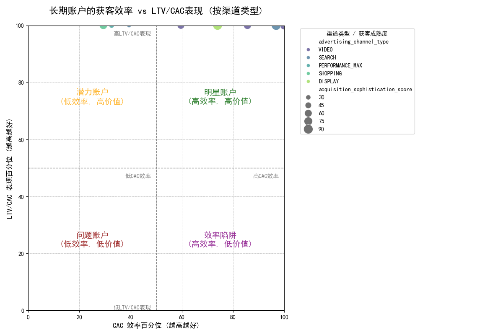

# 谷歌广告长期账户表现分析报告

## 摘要

本报告旨在分析谷歌广告长期运行账户（投放超过120天）的获客效率衰减模式。在最初的探索中，我们发现 **数据集中并不存在符合“近30天CAC增长超25%且LTV/CAC比值下降超20%”这一严格衰退定义的账户**。这表明，营销团队担心的“断崖式衰退”现象并非普遍问题。

因此，我们将分析视角转向了对所有长期账户的表现分层。通过构建 **“获客效率 vs. 客户价值”四象限模型**，我们成功识别出四类表现各异的账户群体，并揭示了不同广告渠道在其中的分布模式，为精细化运营和预算分配提供了清晰的数据洞察和可行性建议。

---

## 核心发现：账户表现四象限分析

我们对所有运营超过120天的账户，提取了其最新的“CAC效率百分位”（CAC越低，效率越高）和“LTV/CAC表现百分位”（比值越高，表现越好）两大核心指标，绘制出如下散点图。圆点的大小代表“获客成熟度得分”，颜色代表不同的广告渠道类型。

我们将账户分为四个象限：

1.  **明星账户 (右上角 - 绿区)**：**高效率，高价值**。这些是表现最健康的账户，是业务增长的基石。
2.  **潜力账户 (左上角 - 橙区)**：**低效率，高价值**。这些账户能获取高价值客户，但获客成本过高（CAC效率低）。**这是短期内最具优化潜力的群体**。
3.  **问题账户 (左下角 - 红区)**：**低效率，低价值**。双重表现不佳，需要被重点关注、诊断，甚至考虑缩减预算。
4.  **效率陷阱 (右下角 - 紫区)**：**高效率，低价值**。这些账户以很低的成本获取用户，但这些用户无法带来长期价值。这可能是在追逐“虚假繁荣”。

从图表中我们可以观察到：

*   大部分账户集中在 **“明星账户”** 和 **“潜力账户”** 两个象限，这是一个积极的信号，说明我们获取的客户总体质量较高。
*   **SEARCH (搜索广告)** 和 **PERFORMANCE_MAX (效果最大化广告)** 渠道的账户广泛分布在各个象限，表明它们是主力渠道，但表现参差不齐，需要进行内部细分优化。
*   **VIDEO (视频广告)** 和 **SHOPPING (购物广告)** 在图中的样本点较少，但都表现出较高的客户价值（LTV/CAC表现好）。

---

## 业务洞察与优化建议

基于以上分析，我们提出以下建议：

### 1. 战略重心转移：从“抓衰退”到“促潜力”

营销团队应将工作重心从寻找极端衰退的“坏学生”，转移到 **帮助“潜力账户”变成“明星账户”**。

*   **行动点**：针对“潜力账户”（左上象限），成立专项优化小组。既然这些账户能带来高价值客户，说明目标受众定位正确。问题主要出在获客成本上。应系统性地检查其**关键词策略、出价方式、广告素材点击率、落地页转化率**，旨在降低CAC。

### 2. 警惕“效率陷阱”，优化考核指标

“效率陷阱”（右下象限）账户虽然CAC低，看似高效，但长远来看在损害业务的健康度。

*   **行动点**：建议调整对部分营销团队的考核指标（KPI），**避免过度关注单一的CAC或CPA**。应引入 LTV/CAC 比率作为核心的北极星指标，鼓励团队获取能带来长期价值的用户，而非仅仅是廉价的用户。

### 3. 实施差异化的渠道预算分配策略

不同渠道在四象限中的表现揭示了其不同的战略价值。

*   **对于“潜力账户”中的主力渠道 (如SEARCH)**：**不应轻易削减预算**，而应增加优化资源。可以尝试分离出高成本的广告系列，对其进行重点改造，同时将预算向该渠道内表现更优（更靠右）的广告系列倾斜。
*   **对于高价值渠道 (如VIDEO, SHOPPING)**：虽然当前样本量不大，但它们都展现出极高的LTV/CAC表现。这说明通过这些渠道获取的用户质量非常高。**应考虑稳步增加在这些渠道的测试预算**，探索扩大高价值用户群的获客规模。

### 结论

广告系列的表现衰减是一个复杂的过程，并非总是以剧烈的指标变化呈现。通过对长期账户进行效率和价值的双维度分层，我们能更清晰地识别风险、发现机会。建议营销团队采纳本报告提出的四象限分析框架，定期审视账户组合，将资源持续地从“问题账户”和“效率陷阱”向“潜力账户”和“明星账户”转移，从而实现更健康、可持续的业务增长。
