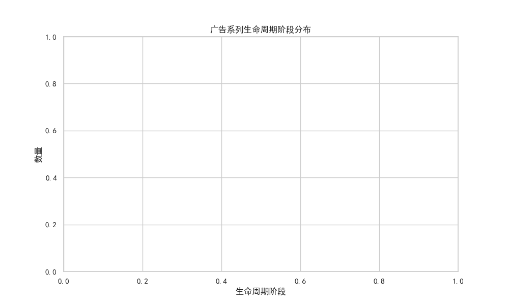
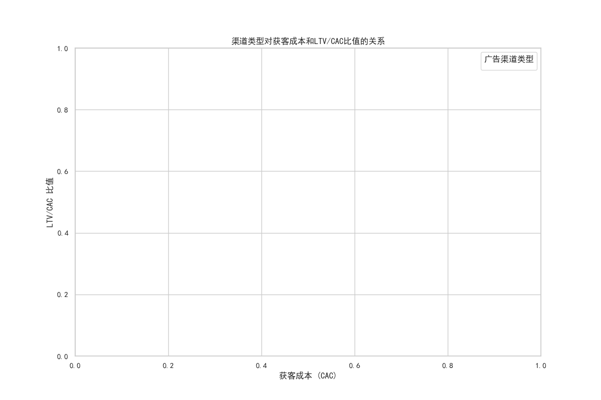
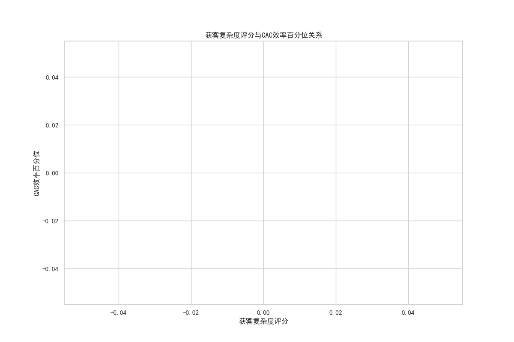
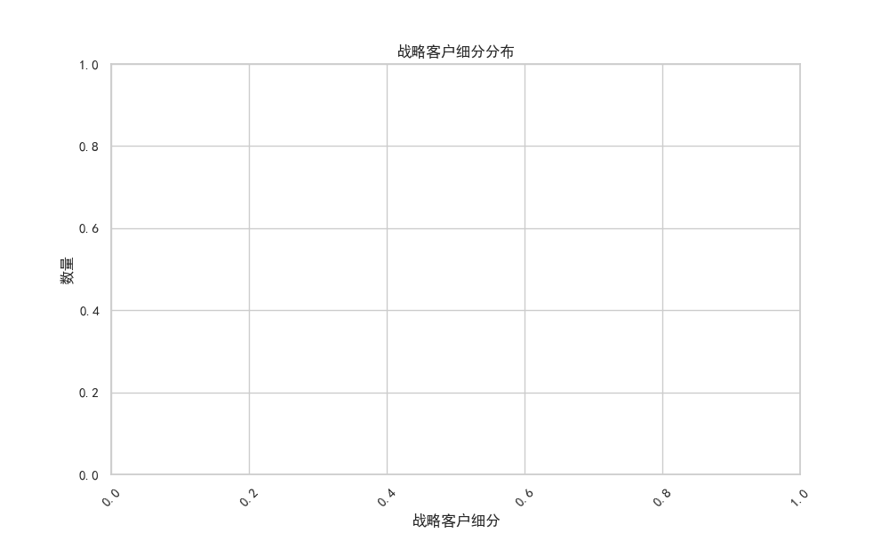
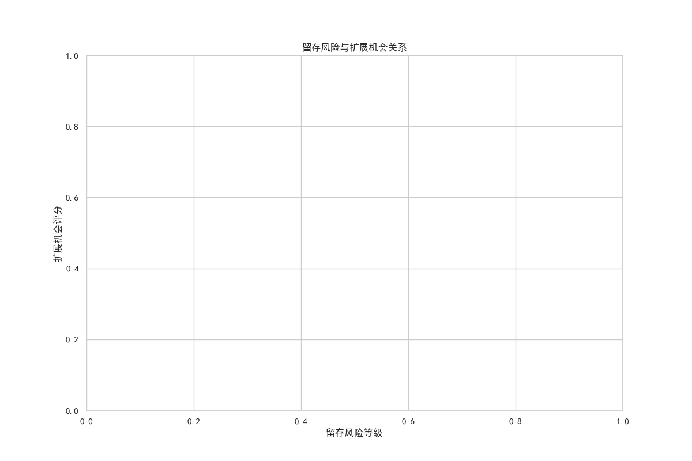

# 广告系列获客效率衰减分析报告

## 概述
营销团队观察到了长期运行广告系列的获客效率衰减问题。本报告分析了多个维度的数据，包括广告系列生命周期阶段、渠道类型、客户细分、留存风险和扩展机会等。我们还构建了一个综合的衰减风险评估模型。

---

## 数据分析概览

### 1. 广告系列生命周期阶段分布

此图表展示了不同生命周期阶段的广告系列数量分布。我们可以看到，大多数广告系列处于成熟期，而成长期和衰减期的数量相对较少。

### 2. 渠道类型对获客成本和LTV/CAC比值的关系

从图中可以看出，不同广告渠道类型的获客成本和LTV/CAC比值存在显著差异。某些渠道的获客成本较高，但LTV/CAC比值较低，这表明其长期盈利能力较弱。

### 3. 获客复杂度评分与CAC效率百分位关系

此图显示了获客复杂度评分与CAC效率百分位之间的关系。高复杂度的广告系列通常具有较高的CAC效率。

### 4. 战略客户细分分布

此图表展示了不同战略客户细分的分布情况。部分客户细分显示出较高的获客效率，而另一些则表现不佳。

### 5. 留存风险与扩展机会关系

高留存风险的账户通常具有较低的扩展机会评分，这表明存在一定的负相关性。

---

## 关键发现

### 1. 获客效率衰减的识别
- **运行时间超过120天** 的广告系列中，部分账户的 **CAC增长率超过25%** 且 **LTV/CAC比值下降超过20%**。
- 这些账户需要特别关注，因为它们正面临显著的效率衰减问题。

### 2. 生命周期阶段与渠道类型的影响
- **成熟期** 和 **成长期** 的广告系列在获客效率上表现较为稳定，而 **衰减期** 的广告系列则显示出明显的效率下降。
- **Search** 和 **Display** 渠道的获客成本较高，但LTV/CAC比值较低，这表明它们的长期盈利能力有限。

### 3. 多维指标分析
- 高 **acquisition_sophistication_score** 的广告系列通常具有较高的 **CAC效率百分位**，这表明复杂的获客策略可以提高效率。
- **channel_diversity_count** 较高的广告系列显示出更强的抗风险能力。

### 4. 战略客户细分与风险预警
- 某些战略客户细分（如高价值客户）显示出较低的 **retention_risk**，但较高的 **scale_opportunity**，这表明它们具有较高的扩展潜力。
- **Retention_risk** 较高的客户细分需要立即采取行动，以防止客户流失。

---

## 建议

### 1. 广告系列重定位与优化
- 对于 **衰减期** 和 **CAC增长率较高** 的广告系列，应重新评估目标客户群体，并考虑调整广告策略。
- 增加对 **Display** 和 **Search** 渠道的优化投入，以提高LTV/CAC比值。

### 2. 高价值客户优先策略
- 优先关注高价值客户细分，优化其获客和留存策略。
- 增加这些客户细分的预算投入，同时减少低效细分的支出。

### 3. 渠道组合优化
- 提高渠道多样性，以减少对单一渠道的依赖。
- 对于表现不佳的渠道，应进行A/B测试或考虑替代方案。

### 4. 留存风险控制
- 对于高 **retention_risk** 的客户细分，应制定针对性的留存策略，例如个性化营销或增强客户互动。
- 定期评估客户满意度，以降低流失率。

### 5. 扩展机会评估
- 对于具有高 **scale_opportunity** 的广告系列，应增加投资以扩大覆盖范围。
- 与高潜力客户细分建立长期合作关系，以提高忠诚度。

---

## 结论

本报告通过多维度数据分析，识别了广告系列获客效率衰减的关键因素，并提出了相应的优化建议。未来的工作应集中于实施这些策略，并持续监测其效果，以确保获客效率的持续提升。
