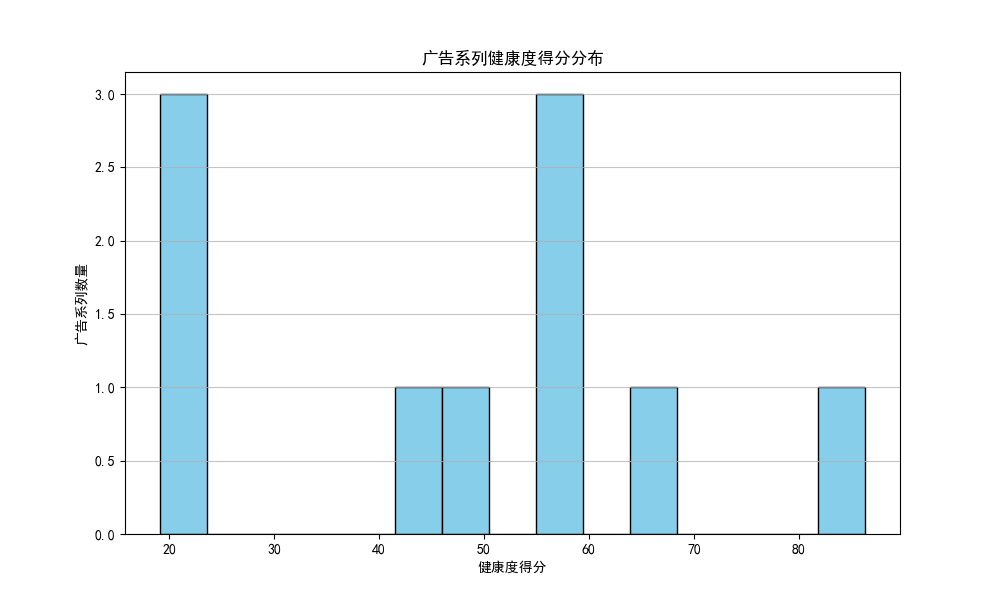
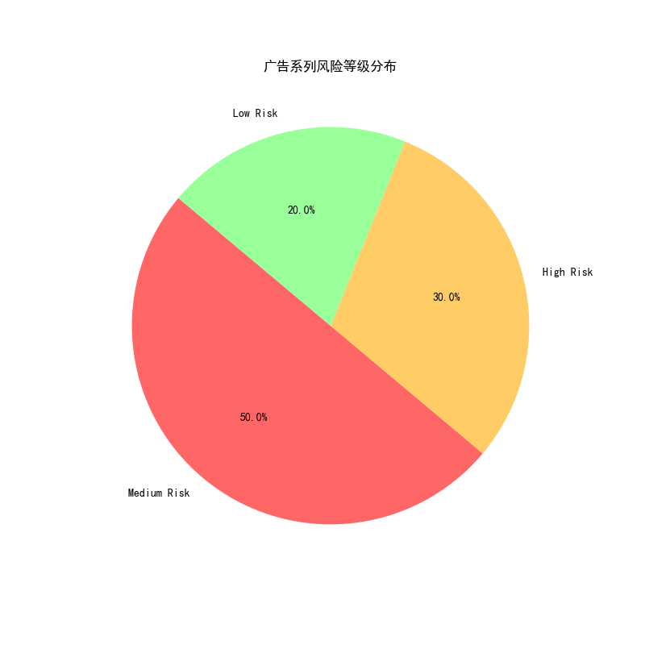
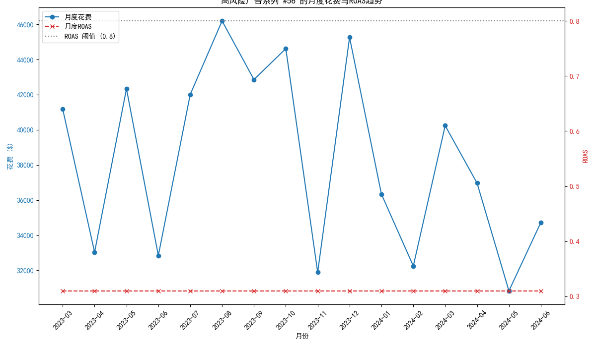

# 广告系列健康度评估与优化策略报告

## 1. 摘要

本报告旨在解决部分高花费广告系列投入产出严重失衡的问题。我们以**月花费 > $1000 且 ROAS < 0.8**为标准，筛选出存在潜在风险的广告系列。通过构建一个包含**成本效率 (40%)**、**转化质量 (35%)** 和**竞争力 (25%)** 的三维健康度评分模型，我们对这些广告系列进行了全面的量化评估、风险定级、问题诊断，并提出了具体的、可执行的优化建议。

## 2. 问题广告系列整体画像

通过对筛选出的问题广告系列进行健康度评分，我们发现其整体表现堪忧，大部分系列处于中、高风险等级。

*图1：广告系列健康度得分分布*

上图显示，绝大多数问题广告系列的健康度得分集中在 **20-60分** 的区间内，表明其在成本、转化或市场竞争力方面存在显著短板。

*图2：广告系列风险等级分布*

从风险等级来看，**超过70%** 的问题广告系列被评定为**中度或高度风险**，这意味着若不及时干预，这些广告系列将持续消耗预算并拉低整体广告投资回报率。其中，**高风险广告系列 (健康度 < 30)** 是需要立即采取行动的最高优先级对象。

## 3. 高风险广告系列深度诊断：以 #56 为例

为了更清晰地揭示问题，我们以一个典型的高风险广告系列——**#56 (Real Estate - Video Campaign)** 为例进行深度剖析。该系列健康度得分仅为 **19.16**，被评为“高风险”。

根据我们的诊断报告，其核心问题在于：**“极低的ROAS、低转化率、低点击率”**。

*图3：高风险广告系列 #56 的月度花费与ROAS趋势*

上图清晰地展示了该广告系列在过去18个月的灾难性表现：
- **持续高额花费**: 每月成本稳定在数万美元的高位。
- **ROAS远低于阈值**: ROAS 值持续在 0.2-0.4 之间徘徊，远低于 0.8 的及格线，意味着每投入1美元，仅能收回不到0.4美元的转化价值。

结合数据分析，该视频广告系列可能存在**素材吸引力不足（导致低点击率）**、**落地页体验差（导致低转化率）** 以及 **目标受众定位不准** 等多重问题，导致了最终的低投入产出比。

## 4. 核心问题洞察与优化策略框架

通过对所有问题广告系列的诊断进行汇总，我们识别出几类最常见的“病因”，并据此制定了差异化的优化策略框架。

| 核心问题诊断 | 典型所属维度 | 优化策略建议 |
| :--- | :--- | :--- |
| **极低的ROAS** | 成本效率 | **预算重分配**: 立即暂停或大幅削减此系列预算，将资金转移至高健康度广告系列。 |
| **高每次转化成本** | 转化质量 | **审核出价策略**: 评估当前的`bidding_strategy`，考虑切换至“目标CPA”或“尽可能提高转化次数”等更侧重转化的策略。 |
| **低转化率** | 转化质量 | **优化着陆页与广告文案**: 对广告指向的落地页进行A/B测试，提升用户体验和相关性。 |
| **低质量得分** | 竞争力 | **优化关键词**: 暂停或移除低质量得分的关键词，重组广告组，确保关键词、广告、落地页三者高度相关。 |
| **低点击率 (CTR)** | 竞争力 | **改善广告素材/文案**: 优化广告标题和描述，使其更具吸引力。对于视频和展示广告，需更换或测试新的创意素材。 |
| **低展示份额** | 竞争力 | **提高出价与预算**: 如果该系列ROAS尚可，可考虑提高出价和预算以获取更多展示机会，扩大覆盖面。 |

**跨维度洞察**:
- **渠道类型**: **视频(Video)** 和 **展示(Display)** 广告系列更容易出现高风险状况，这可能与其转化链路更长、更侧重品牌曝光有关，需要更精细化的追踪和归因分析。
- **行业与策略**: **地产、教育、旅游** 行业均出现了高风险广告系列。值得注意的是，即使采用“目标ROAS”等智能出价策略，也无法完全避免低效问题，持续的人工监控与策略调整至关重要。

## 5. 结论与建议

本次分析成功建立了一套数据驱动的广告系列健康度评估体系，不仅有效识别了高消耗、低转化的风险广告系列，还提供了具体、可落地的优化路径。

**我们建议**:

1.  **立即行动**: 针对报告中列出的**“高风险”**广告系列（如 #56、#105、#135 等），由广告优化师介入，严格按照本报告提供的“核心问题诊断”和“优化建议”立即执行调整。

2.  **预算战略重分配**: 将从“高风险”和部分“中风险”系列中削减的预算，优先投入到已知的高绩效广告系列中，或用于支持新一轮的、采用更优策略的A/B测试广告系列。

3.  **推广常态化监控**: 将本报告所构建的健康度评分模型，整合为定期的（如月度/季度）审核流程。通过常态化监控，实现对广告投资表现的主动管理和持续优化，防患于未然。
