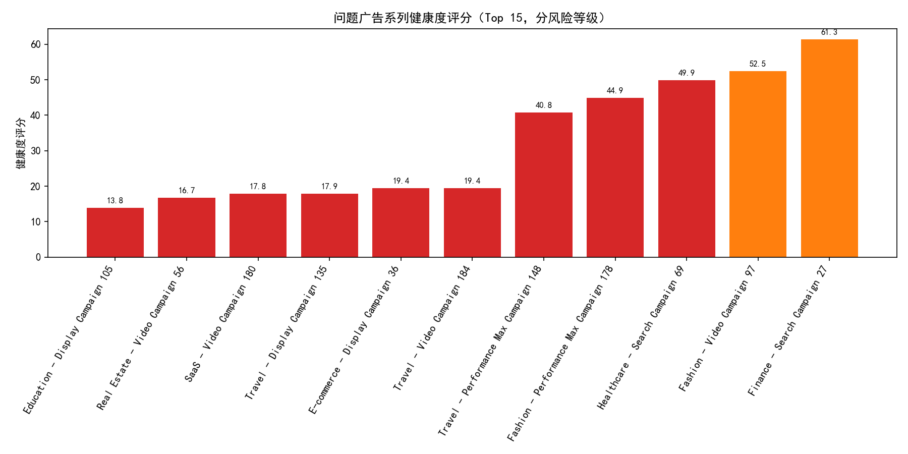
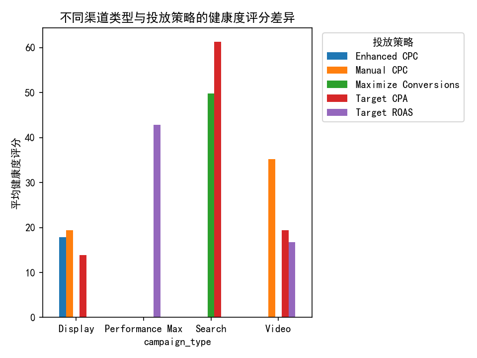
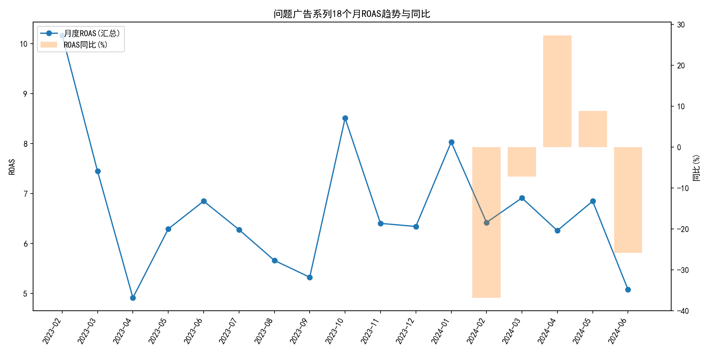
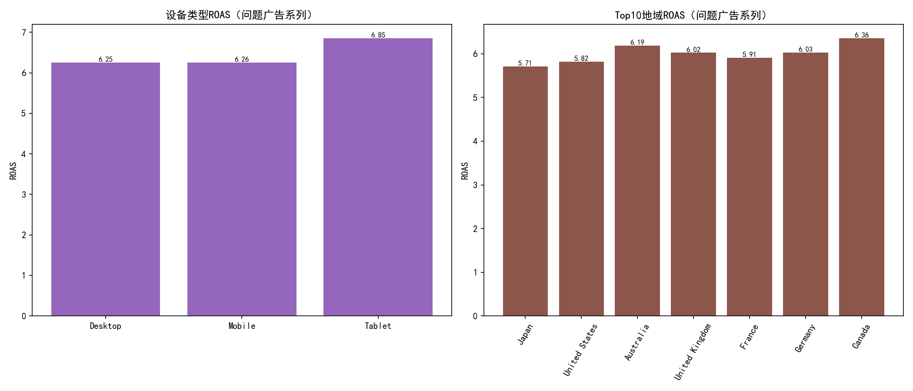

# 广告系列健康度评估与优化报告（基于google_ads多表数据）

本报告围绕“月花费>$1000且ROI(ROAS)<0.8”的问题广告系列，构建了一套三维健康度评分模型（成本效率40%、转化质量35%、竞争力25%），并在18个月的历史数据上进行诊断、趋势与差异分析，输出逐系列的风险等级与优化方案。

数据源与范围
- 数据库：dacomp-058.sqlite
- 主表：google_ads__campaign_report（月度）、google_ads__device_report（月度，设备维度）、google_ads__geo_report（月度，地域维度）、google_ads__keyword_report（季度，关键词维度）
- 时间窗口：最近18个月（2023-02 至 2024-06）
- 问题广告系列筛选条件：在最近18个月内存在“当月cost>1000且roas<0.8”的月份

总体发现（问题广告系列）
- 问题广告系列数：11
- 平均健康度评分：32.22（偏低）
- 平均风险月占比：0.915（说明多数月份均处于“高花费低回报”的不健康状态）
- ROAS季节性波动（CV）：0.059（季节性不强，问题多为结构性与策略性）

一、评分模型方法论

1. 维度与权重
- 成本效率（40%）
  - 指标：ROAS（越高越好）、Cost per Conversion（越低越好）
  - 聚合：成本效率分数 = 0.7*norm(ROAS) + 0.3*(1 - norm(Cost/Conv))
- 转化质量（35%）
  - 指标：Conversion Rate（CVR，越高越好）、Avg Conversion Value（转化价值/转化次数）
  - 聚合：转化质量分数 = 0.7*norm(CVR) + 0.3*norm(Avg Conv Value)
- 竞争力（25%）
  - 指标：Quality Score、Impression Share、CTR、Avg Position（排名越靠前越好）
  - 处理：排名取逆向标准化（越靠前得分越高）
  - 聚合：竞争力分数 = 0.3*norm(Quality) + 0.3*norm(Imp Share) + 0.2*norm(CTR) + 0.2*(1 - norm(Avg Position))

2. 指标处理与归一化
- 近18个月聚合：平均（率类指标）、求和（价值类）
- 标准化方法：Min-Max规范化到[0,1]，再按权重汇总并映射到[0,100]
- 风险定义：按评分值设阈
  - 健康度<50：高风险
  - 50≤健康度<75：中风险
  - ≥75：低风险

二、核心可视化

- 问题广告系列健康度评分柱状图（Top 15）
  

- 渠道类型与投放策略的健康度评分差异
  

- 18个月ROAS趋势与同比变化
  

- 设备与地域维度的风险对比
  

说明：以上图片由下述Python绘图代码生成（节选）。为保证中文显示，已设置字体参数。
```python
import matplotlib.pyplot as plt
plt.rcParams['font.sans-serif'] = ['SimHei']
plt.rcParams['axes.unicode_minus'] = False
# 其余绘图逻辑见脚本：ads_health_analysis.py
```

三、分维度差异洞察

1) 渠道类型（campaign_type）
- 平均健康度（问题系列样本）：
  - Display：17.02（最差）
  - Video：26.61
  - Performance Max：42.82
  - Search：55.60（相对最好）
解读：展示类（尤其Display）与视频在成本效率与竞争力上偏弱，Search因意图更强、质量分数与CTR更优，综合健康度更高。建议对Display与Video聚焦关键词/受众的相关性与创意匹配，强化排除与定向。

2) 投放策略（bidding_strategy）
- 平均健康度（问题系列样本）：
  - Enhanced CPC：17.87（最差）
  - Manual CPC：29.90
  - Target CPA：31.52
  - Target ROAS：34.13
  - Maximize Conversions：49.86（相对最好）
解读：手动与半自动（ECPC）在复杂库存与多维度竞价环境中容易出现出价不稳与学习不足；智能化策略（Maximize Conversions）在问题样本中相对更稳。建议：对ROAS波动大且表现差的系列优先尝试智能策略并设置合理目标值与保护阈。

3) 行业（industry）
- 平均健康度（问题系列样本，由低到高）：
  - Education：13.84、Real Estate：16.75、SaaS：17.85、E-commerce：19.36、Travel：26.00、Fashion：48.68、Healthcare：49.86、Finance：61.35
解读：Education、Real Estate、SaaS与E-commerce问题最突出，多与竞争强、意图弱化、页面转化体验不一致等相关；Finance/Healthcare的单次价值与意图更清晰，策略可控性高，健康度更优。

4) 设备类型（device_type）
- 问题系列总体设备ROAS（汇总）：Desktop=6.25、Mobile=6.26、Tablet=6.85
解读：表层ROAS并不低，但这些系列在月度维度出现了“cost>1000且roas<0.8”的时段性失衡，设备粒度上也可能存在阶段性投放低效的现象。建议：按月/周粒度检查各设备的实际ROI波动，并结合地理维度做交叉优化（见后文逐系列方案）。

5) 地域（geo_target）
- Top消耗地域中存在ROAS偏低的市场（图示Top10地域ROAS），结合成本份额聚焦“高消耗低回报”的子市场优先治理。

四、18个月趋势与同比、季节性

- 时间：2023-02 至 2024-06
- 观察：问题广告系列总体ROAS的季节性波动CV=0.059，季节性影响不强。叠加同比柱（见图），可以看到ROAS同比围绕零附近小幅波动，说明主要矛盾在结构性配置和策略侧，而非强季节性。
- 策略含义：优先进行结构（预算/地域/设备/关键词）与出价策略上的系统优化，而不是过度依赖季节性“自然修复”。

五、风险识别与逐系列诊断+优化方案

下列为每个问题广告系列的健康度评分、风险等级、核心问题诊断与建议（节选显示关键点；设备/地域“问题位”基于18个月汇总下的低ROAS与高成本份额识别）：

1) Education - Display Campaign 105
- 评分/风险：13.84，高风险
- 核心问题：成本效率低、竞争力不足、质量得分低、展示份额低
- 优化建议：
  - 关键词与创意优化：提高相关性与广告扩展，聚焦高转化词；增加否定词；必要时提高优质词出价
  - 出价策略：校准目标值（放宽/分层），启用设备/地域调整以加速学习
- 设备/地域提醒：Desktop（成本占比31%，ROAS=4.43）；Japan（ROAS=4.30）

2) Real Estate - Video Campaign 56
- 评分/风险：16.75，高风险
- 核心问题：点击率偏低（创意与定向匹配问题）
- 优化建议：创意测试与受众细分；提升相关性、强化行动号召；分层目标CPA/ROAS并配合地域/设备调节
- 设备/地域提醒：Desktop（31%，ROAS=5.17）；United States（ROAS=5.13）

3) SaaS - Video Campaign 180
- 评分/风险：17.85，高风险
- 核心问题：转化质量弱、CTR偏低（意图与落地页体验）
- 优化建议：提升落地页加载与表单转化；引入强利益点与信任要素；A/B测试提升CVR；尝试目标CPA/ROAS并设置保护阈
- 设备/地域提醒：Mobile（60%，ROAS=5.37）；Japan（ROAS=4.06）

4) Travel - Display Campaign 135
- 评分/风险：17.87，高风险
- 核心问题：成本效率低、质量得分偏低
- 优化建议：尝试目标CPA/ROAS的智能出价；提升创意与页面一致性，增强质量得分
- 设备/地域提醒：Tablet（9%，ROAS=5.84）；United States（ROAS=4.32）

5) E-commerce - Display Campaign 36
- 评分/风险：19.36，高风险
- 核心问题：成本效率低、竞争力不足、展示份额低
- 优化建议：尝试目标CPA/ROAS智能出价并配置最低ROAS/最高CPA约束；补齐广告扩展与商品数据质量
- 设备/地域提醒：Tablet（10%，ROAS=4.65）；Japan（ROAS=4.67）

6) Travel - Video Campaign 184
- 评分/风险：19.38，高风险
- 核心问题：转化质量弱、CTR偏低
- 优化建议：强相关创意+更精准受众分层；目标值校准并联动设备/地域调整；落地页A/B测试提升CVR
- 设备/地域提醒：Mobile（60%，ROAS=5.21）；Canada（ROAS=4.99）

7) Travel - Performance Max Campaign 148
- 评分/风险：40.77，高风险
- 核心问题：竞争力不足、质量得分偏低、平均排名偏低
- 优化建议：关键词与创意双向优化，提升相关性与质量分；目标值分层（高潜人群更高出价），并用设备/地域调节加速优化
- 设备/地域提醒：Mobile（61%，ROAS=7.36）；Germany（ROAS=6.96）

8) Fashion - Performance Max Campaign 178
- 评分/风险：44.88，高风险
- 核心问题：质量得分偏低
- 优化建议：完善标题/描述与受众匹配，强化商品Feed质量与结构化标注；目标值适配产品毛利
- 设备/地域提醒：Mobile（60%，ROAS=7.44）；France（ROAS=6.37）

9) Healthcare - Search Campaign 69
- 评分/风险：49.86，高风险
- 核心问题：展示份额偏低（预算或出价约束）
- 优化建议：适度放宽预算或提高高价值词的出价上限；确保结构化扩展与高相关落地页
- 设备/地域提醒：Mobile（61%，ROAS=6.47）；United States（ROAS=5.82）

10) Fashion - Video Campaign 97
- 评分/风险：52.48，中风险
- 核心问题：转化质量弱
- 优化建议：落地页A/B测试、简化转化路径，引入更强促销与信任背书
- 设备/地域提醒：Desktop（31%，ROAS=4.26）；United States（ROAS=4.60）

11) Finance - Search Campaign 27
- 评分/风险：61.35，中风险
- 核心问题：暂无明显单项短板（综合偏稳）
- 优化建议：分层目标值、启用设备/地域调节以挖掘增量；关注高价值词上限与预算充足度
- 设备/地域提醒：Desktop（28%，ROAS=5.40）；Australia（ROAS=5.23）

六、规范性建议与优化路线图

A. 预算重分配
- 跨系列：从Display/Video的高消耗低分支线收缩，转投Search与表现较稳的Performance Max中高意图分层；
- 跨设备：对汇总ROAS显著落后的设备降低出价系数，成本份额高但R/ROI偏低的设备优先治理；
- 跨地域：先治理成本前10地域中ROAS相对较低的市场（图示Top10），必要时降权或排除，预算转向ROAS更优市场。

B. 关键词与创意优化
- 高意图词优先，低转化词限价或否定；完善否定词列表；
- 强化广告相关性与扩展，系统性A/B测试，聚焦CTR与质量得分提升；
- 对平均排名偏低的系列，提高核心词出价上限并结合更高质量广告素材。

C. 出价策略与目标值
- 对手动/ECPC表现差系列，尝试智能出价（Target CPA/ROAS/Maximize Conversions），并设置保护阈（最低ROAS、最高CPA）；
- 对学习不充分的系列，采用目标值分层（高潜人群宽、低潜收紧），并配合设备/地域出价调整，提升学习效率。

D. 转化体验与数据
- 针对“转化质量弱”的系列，优化落地页加载、表单、信任与优惠要素，进行CVR导向A/B；
- 确保转化追踪与价值度量准确，提升转化价值信号的稳定性（避免错误低估ROAS）。

七、附录：生成图表的Python配置（节选）
- 所有图表已保存在当前目录，文件名分别为：health_scores.png、type_strategy_score.png、monthly_roas_trend.png、device_geo_risk.png
- 字体配置：
```python
plt.rcParams['font.sans-serif'] = ['SimHei']
plt.rcParams['axes.unicode_minus'] = False
```

致谢与说明
- 本报告未做数据清洗，直接基于数据库中现有字段与聚合计算完成分析。
- 如需进一步细化（例如SKU/查询词级别诊断），建议引入查询词报告与商品Feed质量数据进行联合建模。
