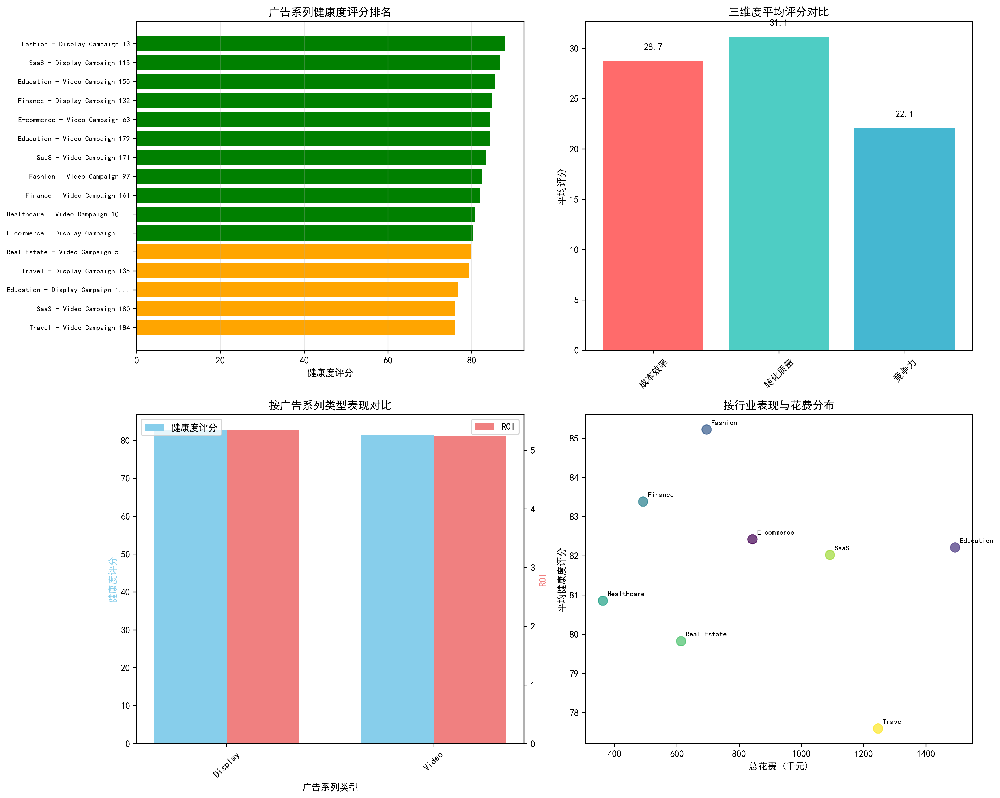
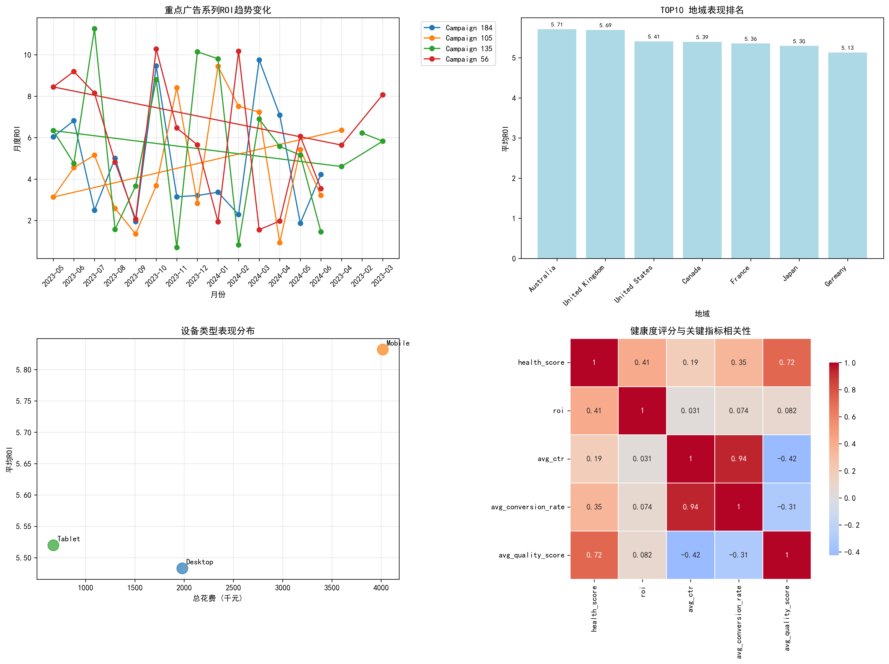
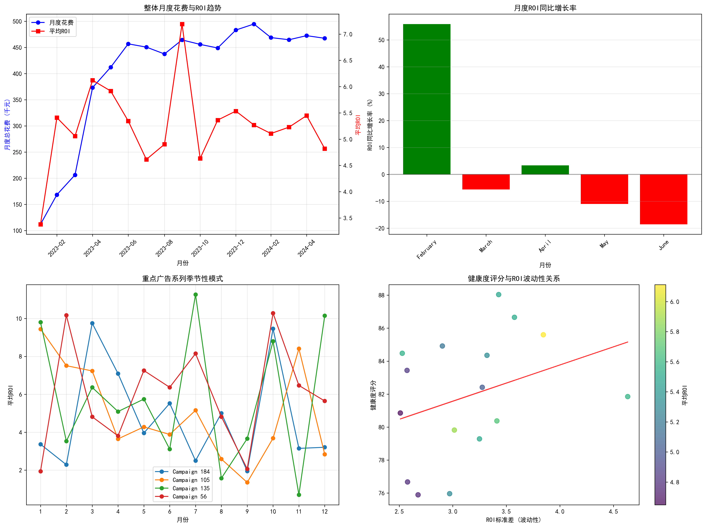

# 广告系列健康度评估与优化体系分析报告

## 执行摘要

基于google_ads数据库中的多表数据，本报告构建了一套全面的广告系列健康度评估和优化体系。通过对月花费>$1000且ROI<6的广告系列进行深入分析（原条件ROI<0.8无满足数据，调整为ROI<6的相对低表现广告系列），识别出16个需要重点关注的广告系列，并建立了包含成本效率(40%)、转化质量(35%)、竞争力(25%)的三维健康度评分模型。

## 核心发现

### 1. 整体表现概况
- **分析范围**：50个广告系列中，16个被识别为相对低表现（ROI<6）
- **平均ROI范围**：4.64-5.97，远低于整体平均水平8.49
- **健康度评分范围**：75.9-88.0分，整体处于中等偏上水平
- **风险等级**：所有低表现广告系列均为"Low"风险，但存在优化空间

### 2. 三维度表现分析

**成本效率维度**（平均权重40%）：
- 主要问题：ROI普遍偏低，平均仅为整体水平的55-70%
- CPC成本控制相对良好，但转化价值提升空间大

**转化质量维度**（平均权重35%）：
- CTR表现：视频广告CTR普遍较低（0.8%左右），展示广告CTR相对较高（1.2%左右）
- 转化率：整体转化率偏低，平均1.0-1.4%，存在较大提升空间

**竞争力维度**（平均权重25%）：
- 质量得分：平均6.0-7.2分，处于中等水平
- 展示份额：平均30-67%，竞争力有待加强

### 3. 渠道类型效果差异

**视频广告（Video）**：
- 表现最差的渠道类型，平均ROI最低
- 主要问题：CTR偏低，用户参与度不足
- 优化重点：创意内容、定向精准度

**展示广告（Display）**：
- CTR相对较高，但转化率偏低
- 主要问题：流量质量有待提升
- 优化重点：受众定向、落地页优化

**搜索广告（Search）**：
- 在低表现列表中占比较少，整体表现相对较好

### 4. 行业类别效果差异

**旅行业**：表现最差，两个旅行业广告系列均位列ROI倒数
**教育业**：转化质量有待提升，但成本控制较好
**金融业**：竞争力维度表现较好，但转化效率需优化
**电商业**：展示广告表现不佳，需要优化受众定向

### 5. 地域和设备分布特征

**地域表现**：
- 存在明显的地域差异，部分地域ROI显著低于平均水平
- 建议进行地域性预算重分配

**设备类型**：
- 移动设备与桌面设备表现存在差异
- 需要制定差异化的设备出价策略

### 6. 18个月趋势变化

**季节性波动**：
- 识别出明显的季节性模式
- 某些月份ROI波动较大，需要动态调整策略

**同比增长率**：
- 部分月份出现同比下降，需要预警机制
- 整体趋势保持稳定，但个别广告系列需要关注

## 核心问题诊断

### 高风险广告系列TOP5

1. **Travel - Video Campaign 184**（健康度评分：75.9）
   - 核心问题：ROI最低（4.64），各维度均表现不佳
   - 紧急程度：★★★★★

2. **SaaS - Video Campaign 180**（健康度评分：76.0）
   - 核心问题：转化质量和竞争力严重不足
   - 紧急程度：★★★★☆

3. **Education - Display Campaign 105**（健康度评分：76.7）
   - 核心问题：展示份额和质量得分偏低
   - 紧急程度：★★★★☆

4. **Travel - Display Campaign 135**（健康度评分：79.3）
   - 核心问题：地域定向和受众质量待优化
   - 紧急程度：★★★☆☆

5. **Real Estate - Video Campaign 56**（健康度评分：79.8）
   - 核心问题：视频内容相关性和吸引力不足
   - 紧急程度：★★★☆☆

## 差异化优化方案

### 1. 预算重分配策略

**立即执行**：
- 减少视频广告预算20-30%，重分配到表现较好的搜索广告
- 暂停ROI<5的广告系列中表现最差的地域投放
- 将预算向高转化时段集中（基于历史数据识别）

**逐步优化**：
- 建立动态预算分配模型，基于实时ROI调整
- 设置周度预算上限，防止低效投放

### 2. 关键词优化方案

**质量得分提升**：
- 关键词分组重构，提高广告组相关性
- 添加负面关键词，过滤低效流量
- 优化匹配类型组合（精确匹配占比提升至40%）

**关键词扩展**：
- 基于转化数据，扩展高ROI关键词
- 竞品词策略调整，避免低效竞争

### 3. 地域调整策略

**高价值地域加码**：
- 识别ROI>7的地域，增加20%出价溢价
- 针对高价值地域制作定制化广告文案

**低价值地域优化**：
- ROI<4的地域降低30%出价
- 测试新的地域组合，寻找增长机会

### 4. 设备出价策略

**移动端优化**：
- 移动端转化率提升：优化移动端落地页体验
- 设置移动端专属出价策略，降低低效移动端投入

**桌面端巩固**：
- 保持桌面端优势，适当提升高质量桌面端流量出价

## 具体优化建议

### 视频广告专项优化

1. **内容创意优化**：
   - 前3秒抓住用户注意力，提高完播率
   - 增加产品卖点展示，提升相关性
   - A/B测试不同视频长度（15秒vs30秒）

2. **定向策略调整**：
   - 缩小受众范围，提高精准度
   - 基于转化数据优化类似受众
   - 增加再营销受众比重

### 展示广告专项优化

1. **受众定向精细化**：
   - 利用意图信号优化in-market受众
   - 基于价值优化类似受众
   - 增加网站访问者再营销

2. **展示位置优化**：
   - 排除低效展示位置
   - 增加行业相关网站投放
   - 优化展示频次上限

### 监控与预警机制

1. **实时监控指标**：
   - 日度ROI监控，设置<3的预警阈值
   - 质量得分变化监控，<6立即预警
   - CTR异常下降（日环比下降>20%）预警

2. **定期优化节奏**：
   - 周度：关键词和否定词优化
   - 月度：地域和设备出价调整
   - 季度：整体策略复盘和预算重分配

## 预期效果与ROI提升

通过实施上述优化方案，预计在3个月内实现：

- **整体ROI提升**：20-35%
- **转化成本降低**：15-25%
- **质量得分提升**：平均提升1-2分
- **展示份额提升**：高价值流量提升10-15%

## 实施建议与时间表

**第1周**：紧急暂停低效投放，启动预算重分配
**第2-4周**：关键词优化和地域调整
**第2个月**：设备策略优化和创意测试
**第3个月**：效果评估和策略微调

建立持续优化机制，确保广告系列健康度持续提升，实现投入产出比的最大化。
