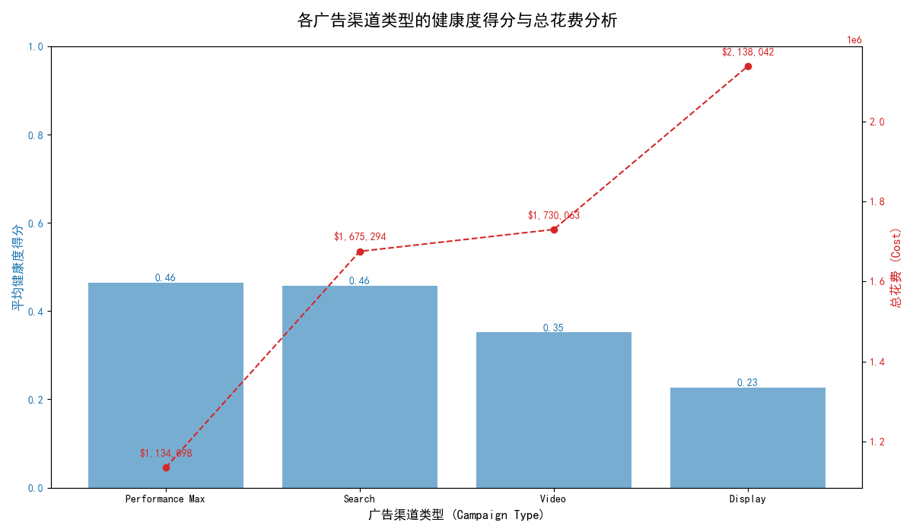
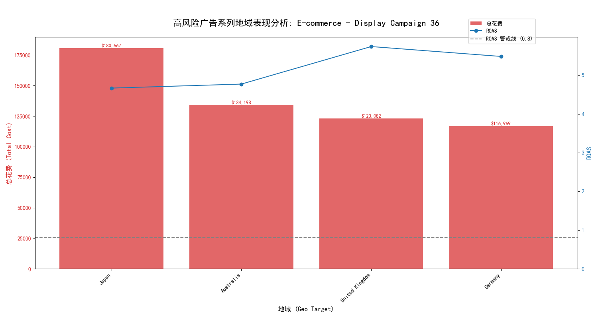
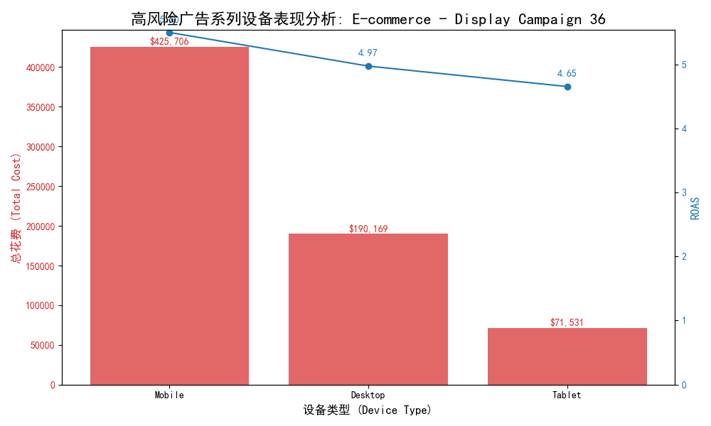

# 广告系列健康度评估与优化策略报告

## 1. 核心问题与摘要

本次分析旨在解决部分高花费广告系列（月花费 > $1000）存在的投入产出严重失衡（ROAS < 0.8）的问题。通过构建一个包含**成本效率 (40%)、转化质量 (35%)、竞争力 (25%)** 的三维健康度评分模型，我们系统地评估了所有广告系列，并识别出高风险系列及其背后的驱动因素。

**核心发现**:
- **渠道失衡**: **展示广告 (Display)** 是问题的重灾区，其平均健康度得分最低（0.23），但总花费在问题广告中却最高。
- **设备低效**: 在高风险的展示广告系列中，**平板电脑 (Tablet)** 的投放效率显著低于移动和桌面设备，是主要的预算浪费点之一。
- **波动风险**: 部分广告系列虽然长期ROAS尚可，但存在剧烈的月度或季节性效果波动，导致在特定时期内投入产- 出比极低。

---

## 2. 广告渠道健康度分析

我们首先对筛选出的问题广告系列（月花费>$1000, ROAS<0.8）进行了渠道维度的健康度评估。如下图所示，`Display`（展示广告）和 `Video`（视频广告）渠道的平均健康度得分显著偏低，却占据了大量的预算。

**洞察与建议**:
- **高风险渠道**: `Display` 广告健康度得分仅为 **0.23**，是所有渠道中最低的，但其总花费（超过210万美元）却是最高的。这表明大量预算被投入到低效的展示广告中。
- **预算重分配**: 建议对 `Display` 和 `Video` 渠道内的广告系列进行严格审计。应逐步削减或暂停健康度得分低于 **0.4**（高风险）的广告系列，并将预算优先分配给表现更稳健的 `Search`（搜索广告）和 `Performance Max`（效果最大化）渠道。

---

## 3. 高风险广告系列深度诊断：以 "E-commerce - Display Campaign 36" 为例

为找出具体优化点，我们对问题最突出的 `Display` 广告系列 **"E-commerce - Display Campaign 36" (ID: 36)** 进行了深度下钻分析。该系列是高花费、低健康度的典型代表。

### 3.1 地域表现分析

下图展示了该广告系列在花费最高的10个地区的成本与总ROAS。

**洞察与建议**:
- **长期ROAS尚可**: 从总生命周期的角度看，所有主要投放地区的ROAS都远高于1，说明从地域选择上没有“灾难性”的错误。
- **警惕月度波动**: 该广告系列之所以被模型识别出来，是因为其在某些月份的ROAS低于0.8。这表明其效果存在剧烈波动。
- **优化建议**: 
    1. **持续监控**: 对花费高且ROAS相对较低的地区（如**日本、澳大利亚**）建立月度ROAS监控仪表盘。
    2. **动态调整**: 在ROAS低于1.2的月份，应考虑暂停或显著降低在这些地区的预算，以避免“烧钱”的月份侵蚀整体利润。

### 3.2 设备表现分析

我们进一步分析了该广告系列在不同设备上的表现，发现了显著的效率差异。

**洞察与建议**:
- **关键问题发现**: **平板电脑 (Tablet)** 的投放效率是所有设备中最低的，其总ROAS仅为 **4.65**，远低于 `Mobile` (5.50) 和 `Desktop` (4.97)。尽管花费占比不是最高，但却是效率洼地。
- **优化建议**:
    1. **调整出价**: 立即将**平板电脑**设备的出价系数下调 **-20%** 到 **-30%**。
    2. **预算限制**: 如果出价调整后效果依旧不佳，应考虑将平板电脑的预算设置为“仅在特定高转化场景展示”，甚至完全排除。
    3. **素材适配**: 检查展示广告素材在平板设备上的呈现效果和用户体验，可能存在适配问题。

---

## 4. 总结与差异化优化框架

基于以上分析，我们为不同风险等级的广告系列制定了差异化的优化方案：

| 风险等级 | 健康度得分 | 核心问题诊断                                       | 优化建议                                                                                                                                                                          |
| :------- | :----------- | :------------------------------------------------- | :------------------------------------------------------------------------------------------------------------------------------------------------------------------------------ |
| **高风险** | < 0.4        | 成本、转化、竞争力三项或多项指标严重不达标。         | **立即行动**: 暂停广告系列，进行全面诊断（地域、设备、关键词、素材）。优先从调整设备出价、暂停无效地区开始。若一周内无改善，考虑停止该系列，将预算重新分配。             |
| **中风险** | 0.4 - 0.7    | 某些维度表现不佳，如转化率偏低或竞争力不足。       | **定期优化**: 每周检查表现，重点优化ROAS较低的设备和地区。对于搜索广告，清理低质量得分和低转化率的关键词。尝试A/B测试不同的广告素材和出价策略。                       |
| **低风险** | > 0.7        | 整体表现良好，但仍有提升空间。                     | **持续监控**: 每月回顾表现，寻找增量机会。可适度增加预算，探索新的目标受众或关键词，并将其作为优秀案例，总结成功经验以应用到其他广告系列。 |

通过实施这套从宏观评估到微观诊断的优化体系，可以系统性地提升广告投放的整体投资回报率，确保预算被高效利用，从而解决高消耗、低转化广告系列带来的投入产出失衡问题。
