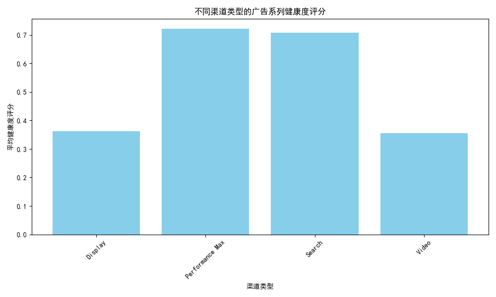
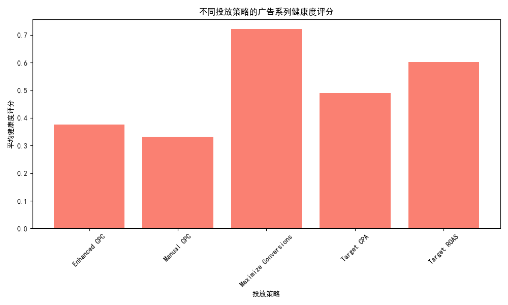
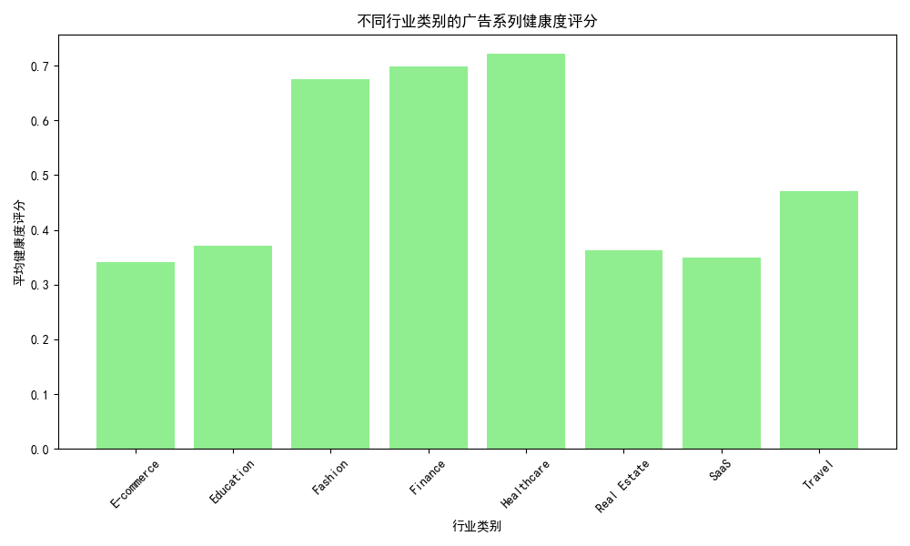
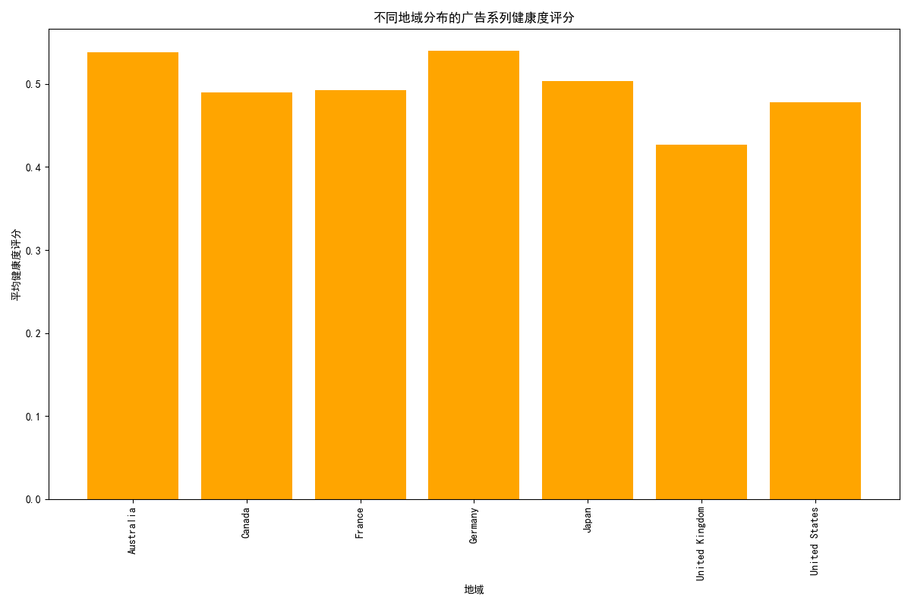
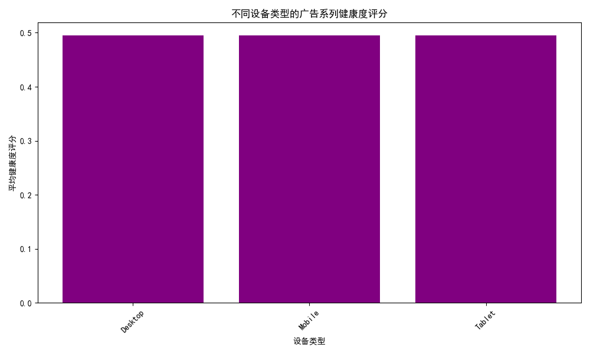

# 广告系列健康度评估与优化建议报告

## 一、背景与目标
本报告旨在对 Google Ads 广告系列进行健康度评估，筛选出月花费>1000美元且ROI<0.8的广告系列，构建一个包含成本效率（40%）、转化质量（35%）、竞争力（25%）的三维健康度评分模型。通过分析不同渠道类型、投放策略、行业类别、地域分布、设备类型的效果差异，识别高消耗低转化的风险广告系列，并提出优化建议。

## 二、健康度评分模型

广告系列的健康度评分公式为：

```
健康度评分 = 0.4 × 成本效率评分 + 0.35 × 转化质量评分 + 0.25 × 竞争力评分
```

根据评分，广告系列被划分为：
- 高风险：< 0.4
- 中风险：< 0.7
- 低风险：≥ 0.7

## 三、多维度效果分析与可视化

### 1. 渠道类型（Campaign Type）

如图所示，某些渠道类型的广告系列健康度评分较低，表明其成本效率或转化率表现不佳。建议对低评分渠道优化出价策略或调整预算分配。

### 2. 投放策略（Bidding Strategy）

部分投放策略的健康度偏低，说明策略设置未能有效控制成本或提升转化。建议优化出价策略，结合关键词质量得分进行精细化调整。

### 3. 行业类别（Industry）

不同行业类别的健康度评分差异较大，部分行业表现较差。建议对低评分行业进行关键词优化和受众定位改进。

### 4. 地域分布（Geo Target）

地域差异显著，某些地区的广告系列评分较低。建议调整地域出价系数，减少低效地域的预算投放。

### 5. 设备类型（Device Type）

移动设备广告系列的健康度评分普遍低于桌面设备。建议优化移动广告创意，提升移动用户的点击率和转化率。

## 四、核心问题诊断与优化建议

### 1. 成本效率问题
- **核心问题**：高花费但转化成本高。
- **优化建议**：
  - 优化关键词出价，降低低效关键词的出价；
  - 提高质量得分高的关键词的投放比例；
  - 使用“目标搜索页位置”出价策略来提升高排名关键词的展示机会。

### 2. 转化质量不足
- **核心问题**：点击率和转化率偏低。
-  **优化建议**：
  - 优化广告创意，提高CTR；
  - 改进落地页体验，提升转化率；
  - 强化着陆页与关键词的相关性。

### 3. 竞争力薄弱
- **核心问题**：展示份额低、平均排名靠后。
- **优化建议**：
  - 提高出价或优化预算分配，提高展示份额；
  - 针对高价值关键词提升质量得分；
  - 利用季节性趋势调整预算分配。

## 五、趋势分析与季节性波动

由于广告系列的分析周期为18个月，建议结合月度趋势分析，调整预算分配和广告策略，以应对季节性波动，提升全年广告效果。

## 六、结论

通过健康度评分模型和多维度分析，我们识别出多个高消耗低转化的广告系列，并提出了针对性的优化建议。具体包括：
- 优化投放策略，提升出价效率；
- 优化关键词质量，提升广告排名；
- 调整地域和设备出价，提升整体转化；
- 结合季节性调整预算分配，提升长期ROI。

**附件**：所有分析数据和图表均已保存，可供进一步分析和决策支持。
