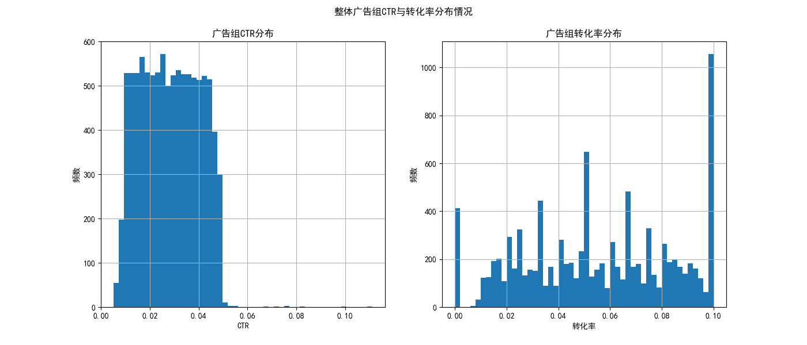
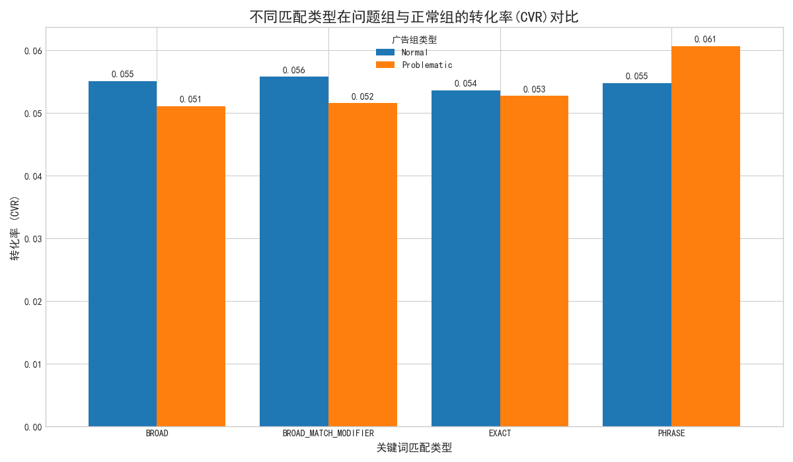
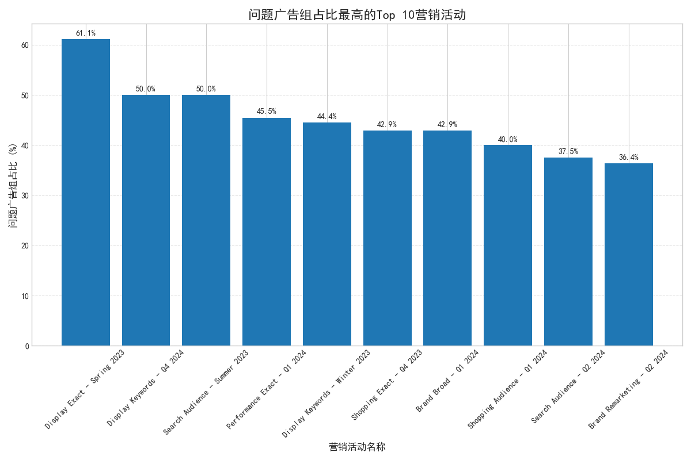

# **广告投放效果分析报告：解决高点击率、低转化率问题**

## 1. 分析背景与目标

近期，在对广告投放效果的分析中，我们发现部分广告组存在**高点击率（CTR）但低转化率（CVR）**的异常现象。这通常预示着广告吸引了大量点击，但这些流量并未转化为有效客户，可能源于用户搜索意图与广告内容匹配度不佳，导致广告预算浪费。

本次分析的目标是，以 **CTR > 75%分位数（3.82%）** 且 **CVR < 25%分位数（3.33%）** 作为问题识别标准，深入探究这些“高CTR、低CVR”广告组的共同特征，识别问题根因，并提出系统性的优化解决方案。

## 2. 核心发现与诊断

通过对广告组、关键词及营销活动等多个维度的数据进行深入分析，我们得出以下核心结论：

**核心发现：问题的根源并非关键词匹配类型，而是营销活动（Campaign）的投放网络设置不当。**

在我们的分析中，`SEARCH_STANDARD`（标准搜索广告）是唯一存在的广告组类型。然而，大量表现异常的广告组集中在**名称中带有“Display”（展示网络）和“Audience”（受众）的营销活动**中。这些营销活动极有可能在“标准搜索广告”的设置下，勾选了“包含Google展示广告网络”（Include Google Display Network）或采用了宽泛的受众定位。

这种设置会将广告展示给正在浏览网页、意图较低的用户（Display流量），而非主动搜索的用户。这完美解释了为何点击率高（用户被动点击）而转化率低（用户无主动购买意图）。

## 3. 数据分析过程与洞察

### 3.1. 问题广告组的识别

我们首先对所有广告组的性能指标进行了分析。如下图所示，CTR与转化率的分布各异，存在优化空间。基于75%分位数的CTR（0.0382）和25%分位数的转化率（0.0333）作为阈值，我们筛选出了 **613个** 存在“高点击、低转化”问题的广告组。

### 3.2. 关键词匹配类型分析

我们曾怀疑宽泛的关键词匹配类型（如BROAD）是导致无效点击的元凶。然而，如下图所示，在“问题组”与“正常组”之间，不同关键词匹配类型的转化率差异微乎其微。例如，“BROAD”匹配在问题组的CVR为5.11%，与正常组的5.51%相比并无显著劣势。这表明，**关键词匹配类型本身不是导致问题的核心因素**。

### 3.3. 营销活动（Campaign）层级分析：找到根因

真正的突破口出现在对营销活动层级的分析上。我们计算了每个营销活动中，问题广告组所占的比例。如下图所示，**问题广告组占比最高的营销活动，其名称都明确指向了“Display”（展示）或“Audience”（受众）策略。**

- **“Display Exact - Spring 2023”** 营销活动的问题广告组占比高达 **61.1%**。
- **“Display Keywords”** 和 **“Search Audience”** 相关营销活动的问题占比也达到了 **50%**。

这一发现强有力地证明，问题出在**将“搜索广告”错误地投放到了“展示网络”**。搜索网络流量和展示网络流量的用户意图存在天壤之jb，将它们混在一个营销活动中进行相同的出价和评估，必然会导致数据“污染”和预算效率低下。

## 4. 系统性解决方案与建议

基于以上分析，我们提出以下具体、可行的优化建议，以解决高CTR、低CVR的问题并提升整体广告ROI。

1.  **立即审查并分离营销活动 (Immediate Action)**
    *   **行动：** 立即审查所有名称中包含“Display”、“Audience”的Search campaign。在营销活动设置的“网络”选项中，**取消勾选“Google展示广告网络”**。
    *   **策略：** **将搜索广告和展示广告彻底分离**。如果业务目标需要在展示网络上进行品牌曝光，应创建独立的“Display Campaign”，为其设置专属的预算、出价策略（如vCPM或Target CPA）以及适合展示场景的广告素材。

2.  **优化受众定位策略 (Audience Strategy Refinement)**
    *   对于以“Audience”为目标的搜索广告系列，应谨慎使用“观察”（Observation）设置。如果目的是触达特定人群，应切换为“定位”（Targeting）以缩小范围，并确保受众画像与广告内容高度相关，避免流量过于泛化。

3.  **调整出价与预算分配 (Budget & Bidding Optimization)**
    *   将在上述“混合”营销活动上浪费的预算，**重新分配给表现更佳、转化率更高的纯搜索营销活动**。
    *   对于分离出的新“Display Campaign”，根据其较低的转化预期，采用更合适的出价策略，如**目标每次转化费用（tCPA）**，以控制获客成本。

4.  **深化关键词与落地页优化 (Further Optimization)**
    *   虽然关键词匹配类型不是主因，但对于已识别的问题广告组，仍建议**检查其“搜索词报告”**，找出并添加更多否定关键词，以过滤无关流量。
    *   **审视落地页（Landing Page）**：确保落地页内容与广告文案高度一致，能够承接用户的高点击意愿，并提供清晰、便捷的转化路径。

通过实施以上策略，我们预期可以显著降低无效点击，提升转化率，使广告预算更精准地投入到高意图用户上，从而最大化广告投资回报率。
