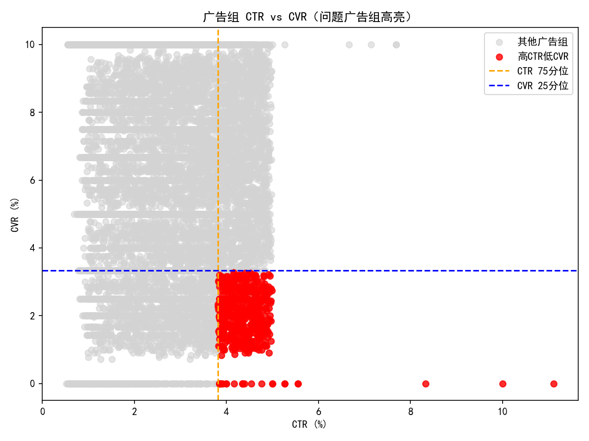
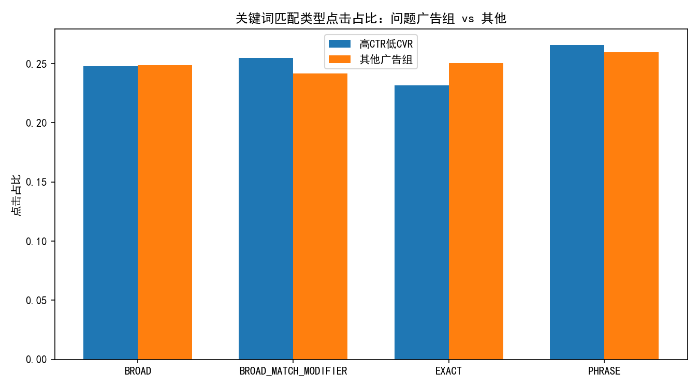
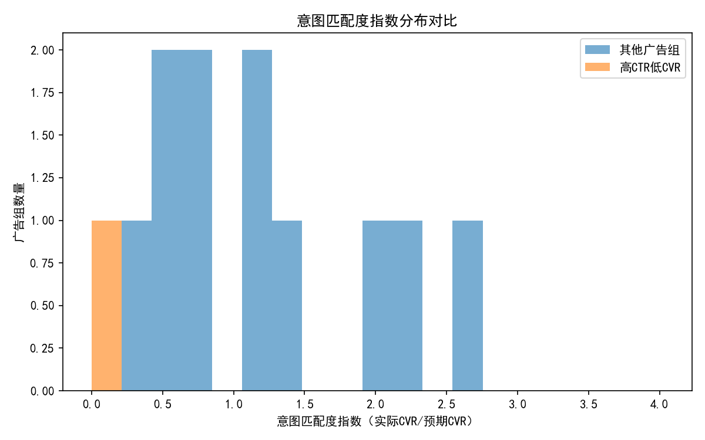
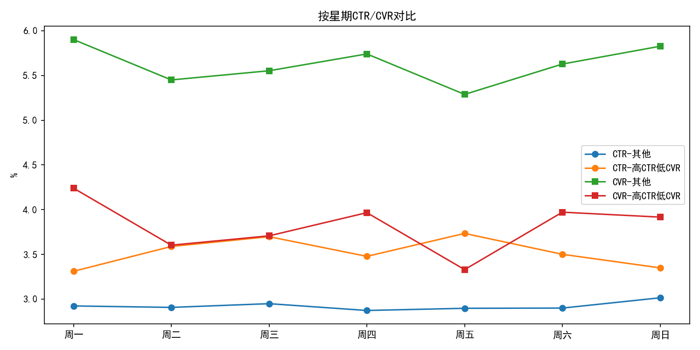
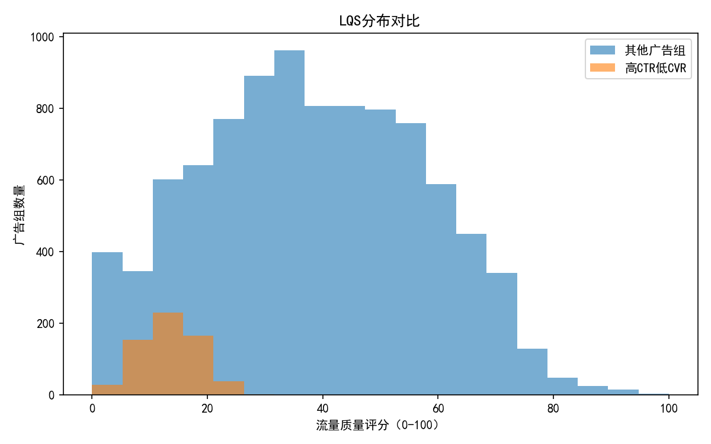

# 高CTR低转化广告组诊断与优化方案（搜索广告）

## 摘要
- 识别标准：以整体广告组的CTR和CVR分位数为基准，判定CTR>75%分位数且CVR<25%分位数为问题广告组。
- 结果规模：在共计 9,993 个广告组中，识别出 616 个存在“高CTR低转化”的问题广告组。
- 全局阈值：CTR 75分位=3.82%，CVR 25分位=3.33%。
- 问题广告组总体表现：累计点击 20,380、展示 465,210、转化 424；总体CVR≈2.08%，ROAS≈0.85（转化价值/消耗=48,732/57,228）。
- 意图匹配度指数（IMI）中位数：问题广告组≈0.20，其他广告组≈1.20，提示问题组的实际CVR显著低于同关键词的预期CVR。
- 流量质量评分（LQS）中位数：问题广告组≈13.36，其他广告组≈37.29，说明问题广告组的综合效率明显偏低。

## 数据与方法
- 数据源：SQLite数据库中的两张报表表，google_ads__ad_group_report（广告组日粒度），google_ads__keyword_report（关键词维度）。
- 指标计算：
  - CTR=Clicks/Impressions；CVR=Conversions/Clicks；ROAS=Conversion Value/Spend；Value per Click=Conversion Value/Clicks。
  - 意图匹配度指数 IMI=实际CVR/预期CVR。预期CVR基于同关键词（keyword_text+match_type）的全局加权基线，按广告组内关键词点击加权求和。
  - 流量质量评分（LQS）=标准化CVR(50%)+标准化ROAS(30%)+标准化每次点击价值(20%)，范围0-100。
- 识别流程：计算总体的CTR与CVR分位数阈值，标记CTR>P75且CVR<P25的广告组为“高CTR低CVR”问题组。

## 可视化与发现
1) CTR vs CVR散点（问题广告组高亮）
- 图示：ctr_cvr_scatter.png
- 观察：红色点集中于高CTR且低CVR的象限，验证识别规则的有效性；阈值线（橙色/蓝色）清晰界定问题区域。



2) 关键词匹配类型点击占比对比（问题组 vs 其他）
- 图示：match_type_share.png
- 观察：问题广告组中 PHRASE 与 Broad Match Modifier（BMM）的点击占比略高（PHRASE≈26.6%，BMM≈25.5%），Exact占比略低（≈23.2%），相较其他广告组（Exact≈25.0%，PHRASE≈25.9%，BMM≈24.2%）。这暗示更广的匹配触发带来较高点击但较低意图匹配。



3) 意图匹配度指数分布对比
- 图示：imi_distribution.png
- 观察：问题广告组的IMI分布偏左，典型值远低于其他广告组（问题组中位≈0.20 vs 其他≈1.20），表明落地链路与用户搜索意图匹配较差。
- 注：行业字段缺失，预期CVR以“同关键词全局”近似，仍能区分明显的匹配差异。



4) 按星期的CTR/CVR对比（汇总）
- 图示：weekday_cvr_ctr.png
- 观察：问题广告组在全周均表现为CTR更高而CVR更低；周五的CVR相对更弱（问题组≈3.33%），建议进行时段与预算加权优化。



5) 流量质量评分（LQS）分布对比
- 图示：lqs_distribution.png
- 观察：问题广告组的LQS整体偏低，长尾中低质量流量占比高，提示需要结构化治理（关键词、时段、出价、落地页）。



## 诊断与根因归纳
- 匹配类型倾向：问题广告组更偏向广义匹配（PHRASE、BMM），易触发非精确意图的查询；高CTR源于更广覆盖与吸引性文案，但转化落在低意图人群。
- 意图-落地页断层：IMI显著低（≈0.20），意味着同关键词的预期转化比实际高出数倍。可能原因包括：
  - 关键词-广告文案-落地页信息一致性不足（卖点、价格、优惠、品牌/类目不一致）。
  - 落地页首屏价值阐述不清、加载速度、表单/CTA摩擦、信任元素缺失（评价、保障、资质）。
- 时段差异：工作周内相对一致，但周五更弱；可能受用户下班前“探索性”搜索增多影响，意图偏浅。
- 预算配置与出价策略：缺少设备、地域、出价策略等字段，但从LQS分布看，疑似存在“为量而价”的投放，即为获取点击压低质量门槛，导致转化效率偏低。

## 影响评估与预测
- 当前问题广告组总体CVR≈2.08%，低于阈值3.33%。若通过意图匹配优化使IMI从0.20提升至0.80（接近其他组水平的一半），则CVR可望提升约4倍/至≈8.3%（保守估计可按目标CVR≈4.0%-6.0%）。
- 以现有点击 20,380 计，CVR从2.08%提高到4.0%将新增≈391次转化；按当前平均每次转化价值≈115（48,732/424）估算，增量转化价值≈45,000；若通过时段与匹配优化同步降低无效点击，ROAS提升到≥1.1是可达的。

## 系统性解决方案
围绕“关键词优化、受众细分、落地页改进、出价调整、时段优化”五条主线：

1) 关键词与意图优化
- 强化Exact匹配占比：将高价值词转为Exact，提升意图纯度；PHRASE/BMM仅在明确需要扩量时使用，并设置严格否定词。
- 查询报告治理：高频但低转化的搜索词加入否定列表；清理品牌误匹配、竞争对手、价格敏感词等不匹配意图词。
- 意图分层建组：将探索性词（信息查询）与交易性词（下单/试用）拆分广告组，匹配相应文案与落地页。

2) 受众细分与再营销（需补充数据字段）
- 受众分层：引入受众属性（兴趣、生命周期、RFM分层），对高价值人群增加出价或单独组投放。
- 再营销：针对浏览过关键页面但未转化的用户，使用更明确的CTA与优惠策略，提升二次转化率。

3) 落地页改进（针对IMI偏低）
- 首屏承诺与关键信息一致化：与关键词/广告文案同频，突出核心卖点与差异化。
- 降低摩擦：优化页面速度、精简表单字段、显著化CTA位置与文案（例如“立即试用/领取优惠”）。
- 信任与社会证明：强化评价、资质认证、保障政策、案例；减少跳出。
- A/B测试驱动：围绕标题、主视觉、CTA、价格展示、USP进行MVT/A-B测试，持续提升CVR与LQS。

4) 出价与预算调整
- 结构化出价：
  - 提升Exact词出价与预算，确保优先入场。
  - 对PHRASE/BMM词设置更保守的CPC上限与目标CPA；对低IMI/低LQS广告组降价或暂停。
- 智能出价策略（如Target CPA/ROAS）：在意图纯度较高的组别启用以放大ROI；在意图混杂的组别先进行清理再考虑智能出价。

5) 时段与投放节奏优化
- 周五与低CVR时段：降低预算或投放强度，优先保障工作日中高效时段；结合小时级数据（建议后续接入）做更细颗粒的时段出价调整。
- 频控与展示节奏：对探索性群体降低频次，提高转化效率。

6) 监控与治理机制
- 以IMI和LQS为核心治理指标：
  - 诊断阈值建议：IMI<0.6且LQS<20的广告组优先整改/暂停；IMI在0.6-0.9进行文案与落地页协同优化；IMI>1的广告组可扩量。
- 周期性审查：每周检查搜索词报告、否定词库、Exact词的转化表现，动态调整结构。

## 数据补充建议
当前数据缺少设备（mobile/desktop）、地域（省市）、受众（兴趣/再营销）、出价策略（手动/智能）、落地页质量得分等字段。为进一步诊断并提升预测与规范性建议的精度，建议：
- 接入设备分布与地域维度：用于设备/地域出价修正与机会识别。
- 接入出价策略与质量得分：分析不同策略与质量得分对IMI与LQS的影响，提升规范性优化策略的准确度。
- 接入小时级时段：开展dayparting优化。

## 附：绘图代码片段（示例）
以下为本次分析使用的Python绘图片段示例，完整脚本见分析文件。请注意包含中文显示设置。

```python
import matplotlib.pyplot as plt
import pandas as pd

# 中文显示设置
plt.rcParams['font.sans-serif'] = ['SimHei']
plt.rcParams['axes.unicode_minus'] = False

# 读取聚合数据并计算CTR/CVR
adg = pd.read_csv('adgroup_agg.csv')
adg['ctr'] = adg['clicks'] / adg['impressions']
adg['cvr'] = adg['conversions'] / adg['clicks']

# 使用预先计算的分位数阈值
ctr_p75 = 0.038202
cvr_p25 = 0.033333
adg['flag'] = (adg['ctr'] > ctr_p75) & (adg['cvr'] < cvr_p25)

plt.figure(figsize=(8,6))
plt.scatter(adg.loc[~adg['flag'],'ctr']*100, adg.loc[~adg['flag'],'cvr']*100, c='lightgray', label='其他广告组', alpha=0.6)
plt.scatter(adg.loc[adg['flag'],'ctr']*100, adg.loc[adg['flag'],'cvr']*100, c='red', label='高CTR低CVR', alpha=0.8)
plt.axvline(ctr_p75*100, color='orange', linestyle='--', label='CTR 75分位')
plt.axhline(cvr_p25*100, color='blue', linestyle='--', label='CVR 25分位')
plt.xlabel('CTR (%)')
plt.ylabel('CVR (%)')
plt.title('广告组 CTR vs CVR（问题广告组高亮）')
plt.legend()
plt.tight_layout()
plt.savefig('ctr_cvr_scatter.png', dpi=150)
plt.close()
```

## 结论
- 高CTR低转化的根因主要在于关键词匹配类型相对偏广导致的意图偏差，以及文案-落地页链路的一致性不足，叠加某些低效率时段带来的转化下滑。
- 以IMI与LQS为治理核心，执行“关键词结构收紧+落地页一致性强化+出价与时段精细化”的组合拳，可显著提升CVR与ROAS，预计能将问题广告组的CVR从≈2.08%提升至≥4.0%，ROAS提升至≥1.1，带来可观的增量转化与价值。
