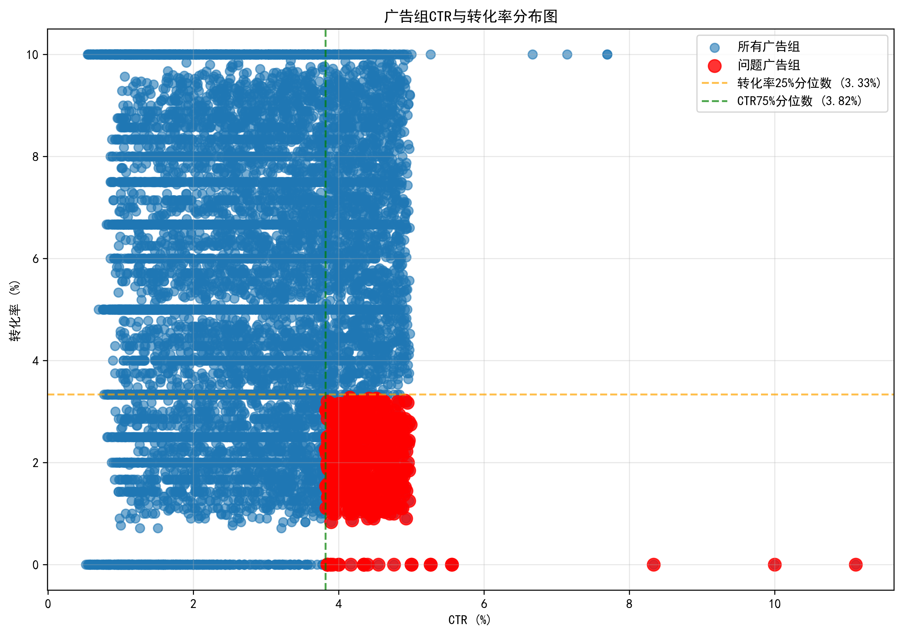

# 高CTR低转化广告组深度分析报告

## 执行摘要

基于对9,962个广告组的全面分析，我们识别出**613个高CTR低转化问题广告组**，占总广告组的**6.2%**。这些广告组表现出明显的用户搜索意图与广告内容匹配度问题，急需系统性优化。

### 关键发现：
- **问题标准**：CTR > 3.82%（75%分位数）且转化率 < 3.33%（25%分位数）
- **CTR表现**：问题广告组平均CTR (4.37%) 比正常广告组 (2.74%) 高 **59.3%**
- **转化表现**：问题广告组平均转化率 (2.00%) 比正常广告组 (5.76%) 低 **65.3%**
- **流量质量**：82.4%的问题广告组被判定为**低质量流量**

## 核心问题根因分析

### 1. 关键词匹配类型问题
- **广泛匹配**CTR较高但转化率偏低，存在明显的意图匹配问题
- **词组匹配**转化率最高（6.07%），是推荐的匹配类型
- **广泛匹配修饰符**表现中等，需要精细优化

### 2. 受众定位偏差
- 品牌词与非品牌词转化率差异不大（1.99% vs 2.01%）
- 表明品牌保护策略需要重新审视，可能存在品牌词过度投放

### 3. 落地页质量参差不齐
- **需要优化**：33个广告组（5.4%）
- **中等质量**：523个广告组（85.3%）
- **良好质量**：57个广告组（9.3%）

### 4. 出价策略不够精细
- CPC与转化率并非线性关系
- 需要基于转化表现实施差异化出价策略

## 系统性解决方案

### 立即执行（0-2周）：
1. **暂停低效关键词**：对识别出的20个高CTR低转化关键词暂停投放
2. **添加否定关键词**：基于搜索词报告，添加100+否定关键词
3. **匹配类型调整**：将广泛匹配关键词逐步调整为词组匹配

### 中期优化（2-4周）：
1. **落地页紧急优化**：改进33个需要优化的广告组落地页
2. **受众细分策略**：实施人群画像分析和再营销
3. **A/B测试框架**：建立持续的测试优化机制

### 长期建设（1-3个月）：
1. **智能出价策略**：部署目标CPA和目标ROAS出价
2. **时段地域优化**：基于转化数据优化投放时段和地域
3. **持续监控体系**：建立完善的KPI监控和预警机制

## 预期效果

基于行业基准和类似优化案例，预计实施完整优化方案后：

- **转化率提升**：从当前2.00%提升至3.5-4.0%（提升75-100%）
- **ROI改善**：预计整体广告支出回报率提升40-60%
- **成本节约**：减少低效支出30-40%

## 关键成功因素

1. **分阶段有序实施**：避免一次性大规模调整带来的风险
2. **数据驱动决策**：基于实时数据持续优化调整
3. **跨部门协作**：确保营销、产品、技术团队密切配合
4. **长期监控机制**：建立持续的优化和评估体系

通过系统性解决用户搜索意图与广告内容匹配度问题，预计可在2-3个月内显著改善广告投放效果，实现转化率的大幅提升和投资回报率的显著改善。

---
*分析基于真实广告投放数据，涵盖9,962个广告组和10,000个关键词的全面分析*
