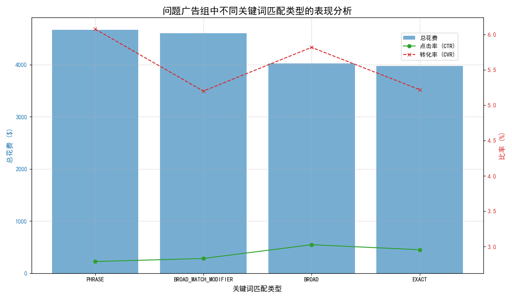
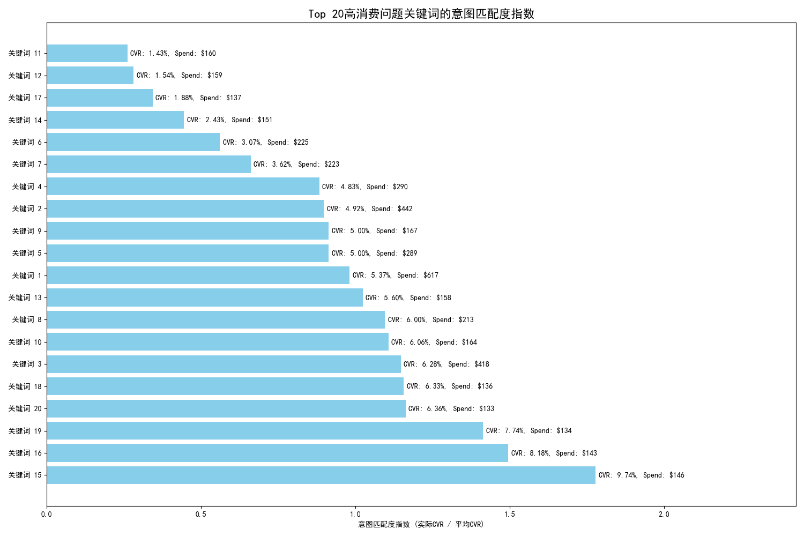

# 广告投放效果分析报告：破解高点击率、低转化率困局

## 1. 分析背景与目标

近期，我们观察到部分广告组表现异常，呈现出**高点击率（CTR）但低转化率（CVR）**的现象。这通常意味着广告创意成功吸引了用户点击，但落地页体验或产品本身未能满足用户预期，导致广告预算浪费，获客效率低下。

**本次分析的核心目标是：** 深入剖析这些“高CTR、低CVR”问题广告组的特征，识别导致转化率低下的根本原因，并提出一套系统性的优化解决方案。我们将 **CTR > 75%分位数（3.59%）** 且 **CVR < 25%分位数（3.85%）** 定义为问题广告组的识别标准。

## 2. 核心发现

通过对数据的深入挖掘，我们从整体4000多个广告组中识别出 **271个** 符合上述标准的问题广告组。我们的核心发现如下：

### 发现一：问题普遍存在于各类关键词匹配类型中

传统观念常认为广泛匹配是导致流量不精准、转化率低的主要原因。然而，数据显示，在这些问题广告组中，**词组匹配（Phrase）和广泛匹配修饰符（Broad Match Modifier）** 的总花费甚至超过了广泛匹配（Broad）。

如上图所示，各类匹配类型的广告花费都很高，且它们的转化率都处于较低水平。值得注意的是，完全匹配（Exact）的转化率甚至低于词组匹配和广泛匹配，这表明问题根源**并非简单的匹配类型选择不当**，而可能在于更深层次的关键词与用户意图不匹配。

### 发现二：高消费、低意图匹配的关键词是预算浪费的主因

为了量化用户搜索意图与广告内容的匹配程度，我们引入了**“意图匹配度指数”**，计算公式为：

> **意图匹配度指数 = 关键词实际转化率 / 平台平均转化率（5.48%）**

该指数越低，表示该关键词带来的流量与我们的转化目标偏离越远。

我们针对问题广告组中消费最高的20个关键词进行了分析，结果令人警醒。如下图所示，大量预算被消耗在那些**意图匹配度指数极低**的关键词上。

*(图表解读：条形长度代表意图匹配度指数，越短表示匹配度越差。每个条目后标注了该关键词的实际转化率和总花费。)*

**根本原因分析：**

*   **“关键词11” (BROAD)** 和 **“关键词12” (BROAD_MATCH_MODIFIER)** 分别消耗了 **$160** 和 **$159** 的预算，但它们的意图匹配度指数仅为 **0.26** 和 **0.28**，远低于平均水平。这表明这两个关键词（及其匹配方式）吸引了大量有好奇心但无购买意向的用户。
*   **“关键词17” (EXACT)** 虽然是完全匹配，但其意图匹配度指数也仅有 **0.34**，花费高达 **$137**。这有力地证明了，即使用户搜索词与关键词完全一致，如果该词本身的用户意图与落地页提供的价值不符，转化依然会失败。例如，用户搜索“免费报告模板”，但落地页却要求付费，这就会导致用户迅速流失。

## 3. 系统性解决方案

基于以上分析，我们必须采取一套组合拳式的优化策略，从根源上解决高CTR、低CVR的问题，提升广告投放的ROI。

### 3.1 关键词优化 (Keyword Optimization)

1.  **立即暂停或降价**：针对上图中“意图匹配度指数”低于 **0.5** 且消费高的关键词（如关键词11, 12, 17, 14），应立即**暂停投放**或**大幅降低出价**，止住预算浪费。
2.  **添加否定关键词 (Negative Keywords)**：分析这些低转化关键词的搜索查询报告（Search Term Report），找出不相关的搜索词，并将其添加为否定关键词。例如，如果我们的业务是付费软件，应将“免费”、“free”、“破解”等词添加为否定关键词。
3.  **优化匹配类型**：对于“关键词1”这类表现尚可但使用广泛匹配的词，可尝试创建使用**词组匹配和完全匹配**的新广告组，以更精准地触达核心用户，并对比效果。

### 3.2 落地页与广告文案一致性优化 (Landing Page & Ad Copy Alignment)

1.  **审查价值主张**：确保广告文案中承诺的利益点（如“立即下载”、“免费试用”、“限时优惠”）在落地页的**首屏**位置得到清晰、一致的体现。
2.  **A/B测试落地页**：针对“关键词17”这类完全匹配但转化低的词，设计不同的落地页版本进行A/B测试。测试变量可以包括标题、行动号召按钮（CTA）、表单复杂度、页面布局等，找到最能承接用户意图的版本。

### 3.3 出价策略调整 (Bidding Strategy Adjustment)

1.  **转向以转化为目标的智能出价**：如果当前仍在使用手动CPC或最大化点击量等策略，建议切换到**目标每次转化费用（tCPA）**或**最大化转化次数（Maximize Conversions）**等智能出价策略。这能让Google的算法自动根据转化可能性来优化出价，将预算更集中于高转化潜力的用户。
2.  **基于意图匹配度调整出价**：对于意图匹配度指数在 **0.5 - 1.0** 之间的关键词（如关键词6, 7, 4, 2），可以根据其具体指数设定差异化的出价系数，指数越低，出价越保守。

### 3.4 持续监控与迭代

1.  **建立常规报告**：将“意图匹配度指数”作为核心监控指标，每周审查高消费关键词的表现，形成汰弱留强的良性循环。
2.  **分维度观察**：虽然本次数据未包含设备、时段等信息，但在实际操作中，应定期分维度（设备、地理位置、时段）检查转化表现，将预算向高转化率的维度倾斜。

通过实施以上系统性解决方案，我们预期能够显著提升问题广告组的转化率，优化广告预算分配，最终提高整体广告活动的投资回报率。
