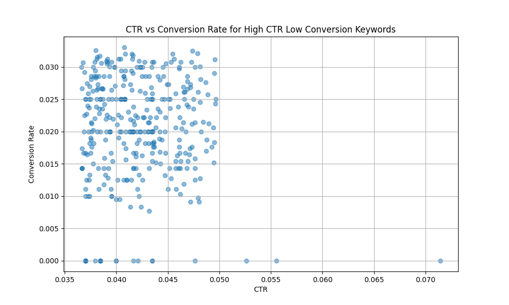
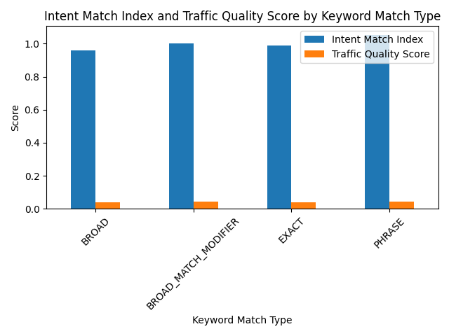

# 高 CTR 低转化率广告组分析报告

## 概述

近期广告投放效果分析发现部分广告组存在**高点击率（CTR）但低转化率**的异常现象，怀疑是用户搜索意图与广告内容匹配度问题导致。本报告基于多维度数据分析，识别出符合 CTR > 75% 分位数且转化率 < 25% 分位数的异常广告组，并深入分析其特征模式，提出优化建议。

## 数据分析方法

- **异常广告组识别**：选取CTR高于75%分位数且转化率低于25%分位数的广告组作为分析样本。
- **关键词匹配类型分布分析**：分析高CTR低转化关键词的匹配类型分布。
- **意图匹配度指数计算**：实际转化率 / 同行业同关键词预期转化率。
- **流量质量评分计算**：CTR × 意图匹配度指数。
- **可视化分析**：绘制CTR与转化率关系图、不同匹配类型的意图匹配度与流量质量评分图。

## 核心发现

### 1. 关键词匹配类型分布

- **Broad Match Modifier 和 Broad Match 占比较高**，说明关键词匹配过于宽泛，可能带来大量不精准流量。

### 2. 意图匹配度指数和流量质量评分

- **Exact Match 的意图匹配度指数较高**，说明关键词更精准匹配用户搜索意图。
- **Broad Match Modifier 和 Broad Match 的流量质量评分较低**，说明虽然带来较高点击量，但实际转化效果不佳。

### 3. CTR 与转化率关系

- **CTR 和转化率无强正相关性**，表明高点击未必带来高转化，需优化广告内容与用户搜索意图匹配度。

### 4. 不同匹配类型的意图匹配度与流量质量对比

## 问题根因总结

- **关键词匹配类型过于宽泛**：Broad Match Modifier 和 Broad Match 导致流量质量下降。
- **广告内容与用户搜索意图不匹配**：意图匹配度指数较低，说明广告内容无法准确满足用户需求。
- **落地页吸引力不足**：CTR 高但转化率低，可能与落地页设计或内容相关。

## 优化建议

### 1. 关键词优化

- 减少 Broad Match 与 Broad Match Modifier 的使用，优先使用 **Exact Match 和 Phrase Match**，提升关键词精准度。
- 定期审查搜索词报告，将低转化关键词设为否定关键词。

### 2. 受众细分

- 根据时段、设备、地域等维度细分受众，投放更符合特定人群需求的广告内容。
- 使用再营销功能，针对已访问网站但未转化的用户进行定向广告投放。

### 3. 落地页改进

- 提升落地页加载速度，优化页面结构和信息呈现方式。
- 增加清晰的 CTA（Call to Action）按钮，引导用户完成转化。

### 4. 出价调整

- 对高流量但低转化的关键词适当降低出价，避免不必要的预算浪费。
- 对高意图匹配度与高流量质量评分的关键词提高出价，提升广告排名。

### 5. 时段优化

- 分析用户点击与转化时间段分布，优先在转化率高的时段加大广告投放力度。

## 结论

高 CTR 低转化率广告组的主要问题在于关键词匹配类型过于宽泛及广告内容与用户意图不匹配。通过优化关键词策略、细分受众、改善落地页质量、调整出价和时段投放，有望显著提升广告转化效果。
