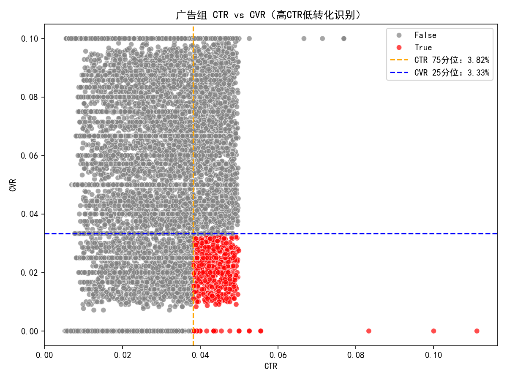
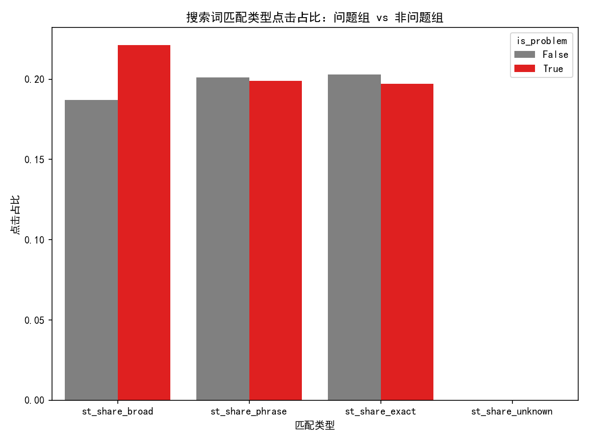
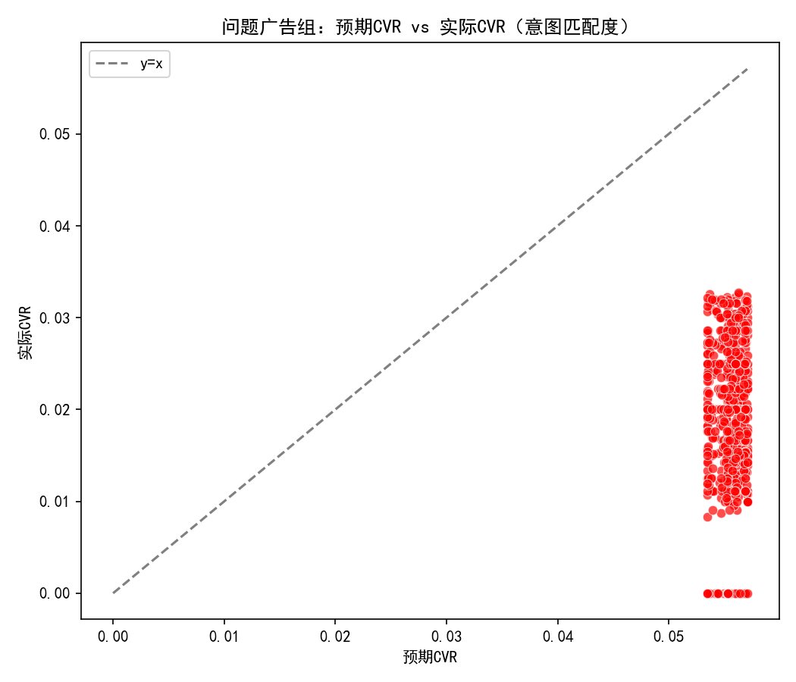

# Google Ads 广告组高CTR低转化率诊断与优化建议

## 摘要结论
- 识别标准：以广告组层级的 CTR>75%分位数且 CVR<25%分位数作为“高CTR低转化率”的问题判定。
- 阈值结果：CTR 75%分位阈值约为 3.82%，CVR 25%分位阈值约为 3.33%。
- 规模与影响：
  - 共识别问题广告组 616 个，占全部 9,993 个广告组的 6.2%。
  - 问题组消耗了约 10.5% 的总花费，但仅贡献约 3.9% 的总转化。
  - 若问题组达到“预期CVR”，预计可新增约 706 次转化，带来约 81,142 的增量转化价值；问题组整体 ROAS 有望从当前 0.85 提升到约 2.27。
- 意图匹配度（实际CVR/预期CVR）：问题组均值为 0.36，显著低于非问题组的 1.04，说明“用户意图与广告内容/落地页”的匹配存在系统性缺口。
- 流量质量：问题组的广泛（BROAD）匹配占比略高，EXACT/PHRASE略低；与CVR的相关性总体较弱，但在表现上确实更倾向于低意图流量和好奇点击，需针对性治理。

配图：
- ctr_cvr_scatter.png
- matchtype_share_bar.png
- intent_expected_vs_actual.png
- landingpage_cvr.png

## 数据与方法
- 使用表：
  - google_ads__ad_group_report（广告组层级的曝光、点击、消耗、转化与价值）
  - google_ads__search_term_report（搜索词匹配类型与点击/转化）
  - google_ads__keyword_report（关键词匹配类型与点击/转化）
  - google_ads__url_report（落地页URL的点击分布）
- 指标口径：
  - CTR=Clicks/Impressions；CVR=Conversions/Clicks；CPA=Spend/Conversions；ROAS=ConversionsValue/Spend。
  - 预期CVR：基于全局的搜索词匹配类型或关键词匹配类型的CVR作为“基准”，按每个广告组内部各匹配类型的点击占比加权估算。若无明细则回退到整体CVR。
  - 意图匹配度=实际CVR/预期CVR，用于衡量“广告与用户意图”是否匹配。
- 问题组判定：ctr>75%分位且cvr<25%分位。

下图展示了问题识别与结构性差异。

### 1) 高CTR低CVR广告组识别与阈值


说明：
- 橙色竖线为CTR 75分位阈值（≈3.82%），蓝色横线为CVR 25分位阈值（≈3.33%）。
- 红色点为“高CTR低CVR”问题广告组，灰色为其他广告组。红点聚集在右下象限，表现为“容易被点，但难以转化”。

### 2) 搜索词匹配类型构成对比（问题组 vs 非问题组）


观察：
- 问题组的BROAD占比更高（约22.1% vs 18.7%），EXACT/PHRASE略低，显示出更宽泛、意图不够明确的流量结构。
- 相关性分析：st_share_broad 与 intent_match_ratio 的相关系数≈0.009、与CVR的相关系数≈-0.023，整体线性相关不强，但从均值层面确有不利影响。

### 3) 意图匹配度：预期CVR vs 实际CVR（问题组）


解读：
- 大部分问题广告组的点位于y=x参考线下，说明实际CVR显著低于按匹配类型构成推算的“预期CVR”，存在明显的意图落差。
- 问题组均值：expected_cvr≈5.55%，但实际cvr≈2.00%，意图匹配度≈0.36。

### 4) 落地页分散度与CVR关系


提示：
- 非问题组呈现更集中且一致的落地页（样本均值：url_count=1、top1_share=1），一致性更好。
- 问题组存在落地页追踪缺失或分散度更高的可能性（部分样本缺失），需要排查落地页的追踪完整性与一致性。

## 诊断洞察
- 高CTR低CVR的根因很可能是“创意诱导点击”但缺少强意图或落地页体验不匹配（如点击动机与站点价值主张不一致、转化流程摩擦过大）。
- 广泛匹配流量更容易带来低意图点击，尤其在“Display Audience/Remarketing”等Campaign中，问题广告组集中度较高（如 Performance Audience - Q2 2023、Brand Remarketing - Q3 2023 等），需重点优化。
- 意图匹配度显著偏低表明：即使按全局匹配类型的CVR水平估计，问题组仍未达到应有的转化表现，说明“广告文案-关键词-落地页”的Message Match不充分。
- 经济影响：问题组当前ROAS≈0.85，若达到预期CVR，有望提升至≈2.27，带来显著的增量转化与价值。

补充量化：
- 问题组点击/花费占比：约10.35%/10.52%，但转化占比仅3.9%。
- 预计增量转化≈706，增量价值≈81,142（基于问题组加权的每次转化价值≈114.93）。

## 策略建议与落地方案
围绕“关键词策略、受众定位、落地页体验、创意与竞价”四个方向，提出分层次优化：

1) 关键词策略（Search/Shopping为主）
- 收紧匹配类型：
  - 将广泛（BROAD）高流量低CVR的关键词迁移到单独广告组，明确预算上限，主力预算向PHRASE/EXACT倾斜。
  - 引入否定词库：根据 search_term 报表，拉取低转化/不相关搜索词，批量加入否定词，减少“好奇点击”。
- 提升查询-广告-落地页的Message Match：
  - 在广告文案标题中植入关键查询词，确保落地页首屏的主标题与广告承诺一致。
  - 对不同意图（信息搜集 vs 交易）构建差异化落地页，减少页面跳转与表单步骤。
- 预算与结构：
  - 将“问题广告组”中的核心词拆分至更细颗粒度的Ags，保证对应的广告文案与落地页更强匹配；对表现好的EXACT词加预算。

2) 受众定位（Display/Remarketing/Audience）
- 收紧受众：对Affinity/In-market/自动扩展的受众进行细分测试，优先投向转化历史更好的Segment；关闭意图不明的受众扩展或降低出价。
- 频次与质量控制：
  - 设置频次上限和广告轮替以减少无效重复曝光和随意点击。
  - 排除低质量投放位置（Placements）和App类别；对Placement层级进行黑名单维护。
- Remarketing优化：
  - 缩短或分层回溯窗口（如7/14/30天），按转化接近度分组；用更强的优惠和明确CTA提升回流转化。
  - 对“Brand Remarketing - Q3 2023”等集中问题Campaign重点排查创意与LP一致性。

3) 落地页体验
- 强化一致性与预期回应：
  - 首屏就给出与广告承诺一致的关键信息（价格、优惠、适用条件、主卖点），减少“点击后找不到承诺”的落差。
  - 精简表单与转化路径：减少必填项、提供快捷登录/支付/预约选项；移动端首屏CTA明显。
- 技术与追踪：
  - 加载速度与核心Web性能优化（LCP/FID/CWV）；确保事件追踪与归因完整，避免评估偏差。
  - 检查URL参数与UTM规范，确保不同广告组有稳定且可衡量的LP，不要随机跳转到通用页。

4) 创意与竞价
- 创意预筛与资格化文案：
  - 在文案中加入资格条件、价格区间或差异化主张，降低无意向的好奇点击。
  - 使用响应式搜索广告（RSA）但固定关键标题，确保核心意图词总是出现。
- 智能竞价与价值规则：
  - 对Search采用tCPA/tROAS，结合Value Rules提高高意图Segment的权重，让系统偏向“更易转化”的流量。
  - 对Display/Audience谨慎开启“优化定位”，观察对CVR的影响，必要时关闭以稳定意图。

## 优先级与试点建议
- 按“问题广告组数量”与“花费/点击规模”排序，优先治理如下Campaign：
  - Performance Audience - Q2 2023、Brand Remarketing - Q3 2023、Brand Keywords - Summer 2023、Search Audience - Q3 2023 等。
- 试点方案（2-4周）：
  - 在上述Campaign中挑选TOP问题广告组，执行：
    - 关键词收紧 + 大规模否定词清单；
    - 文案与LP强Message Match（专用落地页）；
    - Display受众收紧与Placement清理；
    - 启用tCPA/tROAS并设定合理目标。
  - 指标验证：关注问题组的意图匹配度（目标≥0.8）、CVR提升（目标≥50%）、ROAS（目标≥1.8）。

## 量化评估框架
- 以“意图匹配度=实际CVR/预期CVR”为核心诊断指标，结合CTR、CPA、ROAS构成多维评分。
- 追踪“预期→实际”的闭环，量化增量：
  - ∆Conversions = Σ(clicks × expected_cvr) − Σ(actual conversions)
  - ∆Revenue = ∆Conversions × 加权平均每次转化价值
- 每周复盘问题广告组清单，滚动更新否定词、受众与LP，并观察图表演变。

## 图表与数据文件
- 广告组意图与质量特征明细：adgroup_intent_quality.csv
- 图表文件：
  - ctr_cvr_scatter.png
  - matchtype_share_bar.png
  - intent_expected_vs_actual.png
  - landingpage_cvr.png

## 关键Python绘图代码片段
用于保证中文显示与负号显示的Matplotlib配置：
```python
import matplotlib.pyplot as plt
plt.rcParams['font.sans-serif'] = ['SimHei']
plt.rcParams['axes.unicode_minus'] = False

# 示例：CTR vs CVR 散点图
import seaborn as sns
sns.scatterplot(data=feat, x='ctr', y='cvr', hue='is_problem', palette={True:'red', False:'gray'}, alpha=0.7)
plt.axvline(ctr_p75, color='orange', linestyle='--')
plt.axhline(cvr_p25, color='blue', linestyle='--')
plt.title('广告组 CTR vs CVR（高CTR低转化识别）')
plt.xlabel('CTR')
plt.ylabel('CVR')
plt.tight_layout()
plt.savefig('ctr_cvr_scatter.png', dpi=150)
```

## 附注
- 本分析不进行数据清洗，基于现有汇总与分位数判定，可能存在跟踪缺失或跨渠道归因影响，需结合后续追踪完善情况进行迭代。
- 建议结合线下转化与CRM闭环数据进一步校准“预期CVR”的基准参数，提升意图匹配度指标的业务贴合度。
