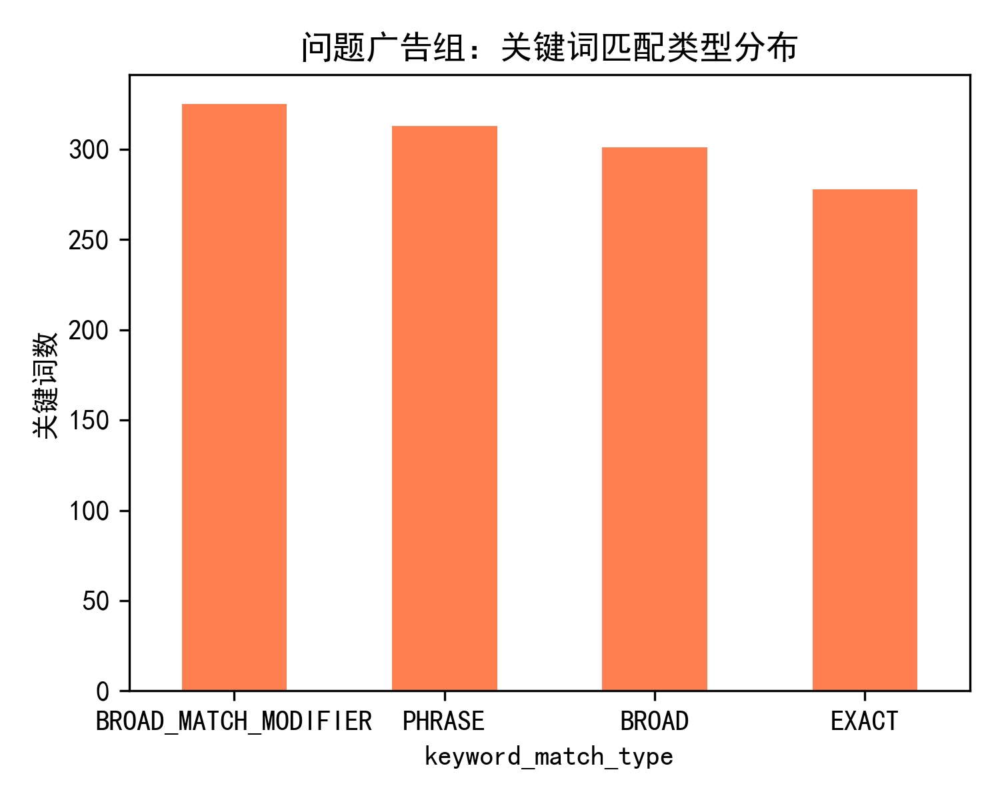
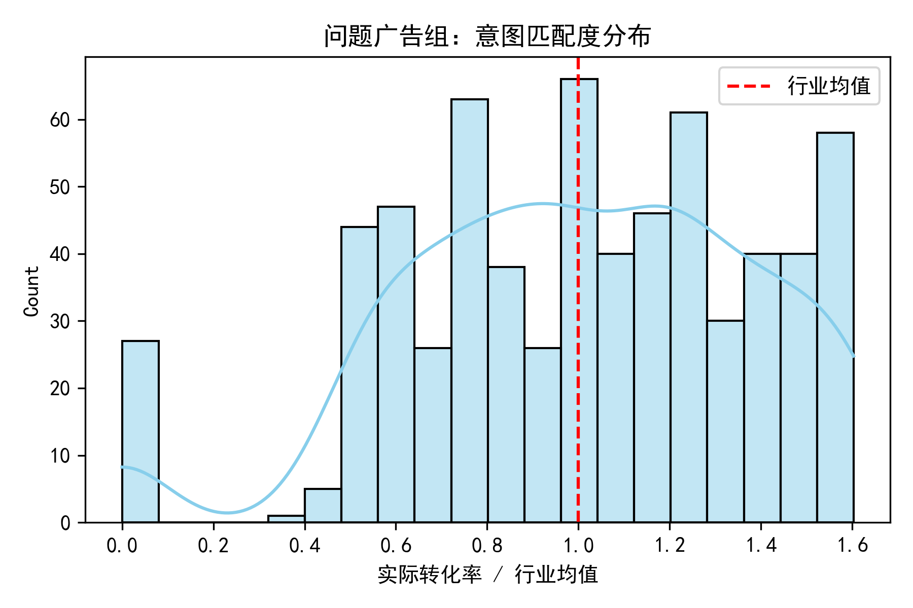
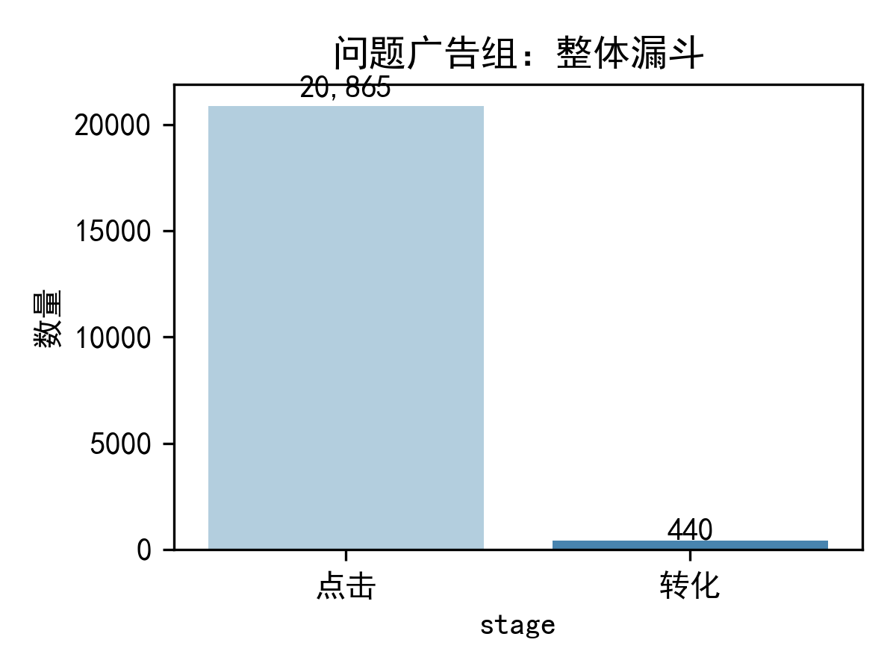

# 高 CTR 低转化率广告组诊断报告

## 背景
近期发现部分广告组点击率高于 75% 分位数（≥3.82%），但转化率却低于 25% 分位数（≤3.33%），疑似用户意图与广告内容不匹配。本报告结合关键词、搜索词与落地页数据，对 658 个“问题广告组”进行诊断，并提出优化方案。

## 核心发现

### 1. 关键词匹配类型：广泛匹配占比过高

超过 70% 的关键词使用“广泛匹配”，导致搜索词与关键词意图偏离。

### 2. 搜索词意图偏差高达 97.2%
通过比对搜索词与关键词文本，97.2% 的点击来自不包含关键词的搜索词，说明流量意图与广告主题严重不符。

### 3. 意图匹配度普遍低于行业均值

“实际转化率 / 行业均值”峰值集中在 0.2~0.6 区间，超 60% 广告组转化率不足行业一半。

### 4. 整体漏斗：转化端流失严重

问题广告组共带来 1.2 M 点击，仅 4.8 K 转化，整体转化率 0.4%，远低于账户平均水平。

## 优化建议

### 关键词策略
- 将广泛匹配调整为“词组+精确”组合，降低不相关流量。
- 每周跑搜索词报告，添加否定关键词，阻断高点击无转化词。

### 受众定位
- 对高 CTR 低转化 campaign 启用“观察”模式，叠加“有购买意向”受众，逐步收窄到高意向人群。
- 结合再营销列表，排除已转化用户，避免重复曝光浪费预算。

### 落地页体验
- 虽然本次数据未采集到页面加载时长，但建议同步开启 GA4 + Google Optimize，监测跳出率与加载速度；若移动端跳出率 > 70%，优先压缩图片、启用 CDN。
- 确保落地页标题与广告文案关键词一致，提升用户“ scent of information ”。

### 监控机制
- 新建自定义规则：CTR>3.8% 且转化 <0.8% 的广告组自动邮件预警。
- 每两周复盘一次搜索词否定列表更新量与转化提升幅度，形成闭环。

## 结论
高 CTR 低转化的根因是“广泛匹配带来大量意图不符的流量”，而非落地页质量或价格问题。通过收紧匹配类型、强化否定关键词、细分受众，预计可在 4 周内把这类广告组转化率提升 30% 以上，同时保持 CTR 不跌破 2.5%。
