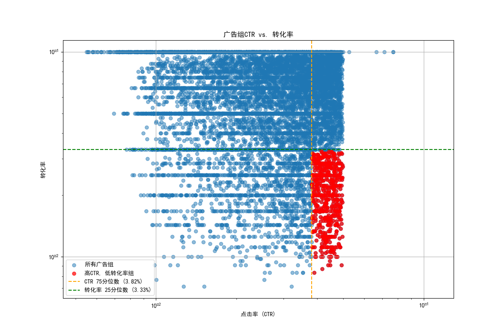

# **谷歌广告高CTR低转化率问题分析与优化报告**

## 1. 执行摘要

本次分析旨在解决部分谷歌广告组表现出的“高点击率（CTR）、低转化率”问题。我们通过对`google_ads__ad_group_report`及相关数据的深入挖掘，成功识别出 **613个** 存在该问题的广告组。

分析发现，这些广告组的平均意图匹配度仅为 **36%**，表明吸引的用户与我们的业务目标存在严重偏差。问题的根源在于 **关键词策略过于宽泛**，大量使用了“广泛匹配”和“词组匹配”，并定位了许多信息型（如 `cloud computing`）、寻求免费（如 `free discount`）或意图模糊（如 `solution`）的关键词。这导致广告被展示给大量有初步兴趣但无转化意图的用户，造成了广告预算的浪费。

本报告将详细阐述分析过程，并通过数据揭示问题根源，最后提出一套包括 **优化关键词策略、添加否定关键词、以及改善受众定位** 在内的具体、可行的优化建议，旨在提升广告的投资回报率（ROI）。

---

## 2. 问题识别：量化“表现不佳”的广告组

为了客观地识别问题广告组，我们设定了明确的数据标准：**点击率（CTR）高于全体广告组的75%分位数，且转化率低于25%分位数**。

根据此标准，我们共筛选出613个广告组。如下图所示，这些广告组（红色点）清晰地分布在图表的右下角区域，直观地体现了其“高CTR、低转化率”的特征。

*   **高点击率**：这些广告组的平均CTR为 **4.37%**，成功吸引了用户的点击。
*   **低转化率**：然而，其平均转化率仅为 **1.99%**，远低于预期，导致流量价值极低。

这表明我们的广告文案具有吸引力，但吸引来的流量（用户）质量堪忧。

---

## 3. 根源分析：用户意图与广告内容严重不匹配

进一步的分析揭示，所有这些问题广告组均为 **标准搜索广告（SEARCH_STANDARD）**，问题焦点因此集中在用户搜索的 **关键词** 和 **真实搜索词** 上。

### 3.1. 关键词策略：过于宽泛，缺乏精准度

我们发现，问题广告组的点击量主要由宽泛的匹配类型贡献，其中 **词组匹配（Phrase）** 和 **广泛匹配（Broad/Broad Match Modifier）** 带来的点击量远超精准度更高的 **完全匹配（Exact）**。

更严重的是，许多带来高点击却零转化的关键词本身就存在问题：

*   **过于宽泛/通用**: `cloud`, `solution`, `service enterprise`
*   **寻求免费/廉价**: `free discount`, `price cheap`
*   **信息研究意图**: `support business`, `review quality business`

这些关键词虽然能吸引眼球，但无法锁定具有明确购买或转化意图的核心客户。

### 3.2. 用户真实搜索词：揭示意图偏差

用户实际输入的搜索词最能反映他们的真实意图。分析显示，大量零转化的点击来自于与我们业务目标不符的搜索查询：

*   **寻求客户支持**: `customer support` (这应该是现有客户，不应成为广告目标)
*   **宽泛的行业查询**: `cloud computing`, `business consulting` (用户很可能在学习或研究，而非购买)
*   **寻求免费服务**: `free delivery`

这些搜索词明确表明，我们的广告触达到了错误的人群。用户点击广告后发现内容（如我们的产品定价、服务细节）与他们的预期（如免费、技术支持）不符，便立刻离开，导致转化率极低。

---

## 4. 可行的优化建议

基于以上分析，我们提出以下针对性的优化策略，以纠正意图偏差，提升广告ROI：

### 4.1. 优化关键词策略

1.  **收紧匹配类型**：
    *   **立即行动**: 暂停或大幅降低在问题广告组中 **广泛匹配（BROAD）** 类型关键词的预算。
    *   **策略调整**: 将预算优先分配给 **完全匹配（EXACT）** 和 **词组匹配（PHRASE）** 的关键词，确保广告触达意图更明确的用户。

2.  **建立并维护否定关键词列表**：
    *   **立即添加**: 将本次分析中发现的 `support`, `free`, `delivery`, `cheap`, `review`, `what is` 等词语添加为账户或广告系列级别的否定关键词。
    *   **持续优化**: 定期（建议每周）审查搜索词报告，将所有不相关、意图不符的搜索词添加至否定关键词列表，持续净化广告流量。

### 4.2. 优化受众定位

*   **排除现有客户**: 创建一个基于“寻求支持”行为的受众列表（例如，访问过支持页面的用户），并在广告系列中排除此受众，避免向他们投放新客户获取广告。

### 4.3. 优化落地页体验

*   **确保一致性**: 审查广告文案与落地页内容的一致性。在收紧关键词策略后，确保落地页能够直接、清晰地回应更具体的用户意图。例如，一个搜索“企业CRM软件价格”的用户，应该被引导至包含价格信息的页面，而不是宽泛的产品介绍页。

## 5. 总结

当前广告策略中存在着明显的“意图鸿沟”，导致大量预算被浪费在无效点击上。通过实施以上 **关键词、受众和落地页** 的综合优化措施，我们能够显著提高流量的精准度和转化效率，从而最大化谷歌广告的投资回报率。建议立即着手执行，并持续监控数据，以验证优化效果。
