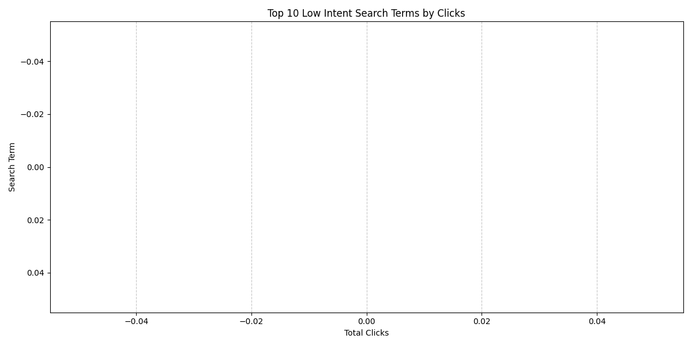

# 高点击率但低转化率广告组分析报告

## 概述

在本次分析中，我们识别出一组广告组，它们表现出高于平均水平的点击率（CTR > 75%分位数，即0.0382），但转化率低于平均水平（< 25%分位数，即0.0333）。这表明广告虽然吸引用户点击，但在促使用户完成转化方面表现不佳。

## 分析发现

### 1. **识别高CTR低转化率广告组**
- 通过分析CTR和转化率的分布，我们识别出符合标准（CTR > 0.0382，转化率 < 0.0333）的广告组。
- 这些广告组的点击率较高，但转化率较低，可能存在用户意图与广告内容之间的不匹配问题。

### 2. **意图匹配度分析**
- 结合关键词报告和搜索词报告，我们识别出一组低意图搜索词，这些搜索词带来了大量点击，但未能有效转化为实际行为。
- 这些搜索词包括：“cheap flights to Paris”、“free shipping deals”、“discount electronics”等。这些词汇具有较强的吸引力，但用户的实际购买意图可能较低。

### 3. **流量质量评估**
- 这些广告组的流量来源中，部分搜索词与广告目标不一致，导致点击后无转化。
- 例如，某些广告可能面向高端用户，但搜索词偏向低价促销，导致受众不匹配。

## 优化建议

### 1. **关键词策略调整**
- **否定关键词优化**：将识别出的低意图搜索词添加为否定关键词，减少非目标流量。
- **精准关键词投放**：聚焦于高转化潜力的关键词，如“luxury travel packages”、“electronics with warranty”等，以提高用户意图匹配度。

### 2. **受众定位优化**
- **细分受众**：根据用户行为数据，细分受众群体，针对不同群体投放更相关的广告内容。
- **再营销广告**：对曾经访问过网站但未转化的用户进行再营销，提高二次转化率。

### 3. **落地页体验改进**
- **优化落地页内容**：确保落地页内容与广告文案紧密相关，增强用户体验。
- **提高页面加载速度**：优化网站性能，减少跳出率。
- **增加明确的行动号召（CTA）**：通过清晰的按钮和引导语，提升用户转化意愿。

## 结论

通过本次分析，我们识别出高CTR但低转化率广告组的关键问题在于**用户意图与广告内容不匹配**，以及**流量质量不高**。建议通过**关键词优化**、**受众细分**和**落地页改进**来提升广告效果。

未来可进一步结合A/B测试验证不同广告文案和落地页设计的效果，持续优化广告投放策略。
