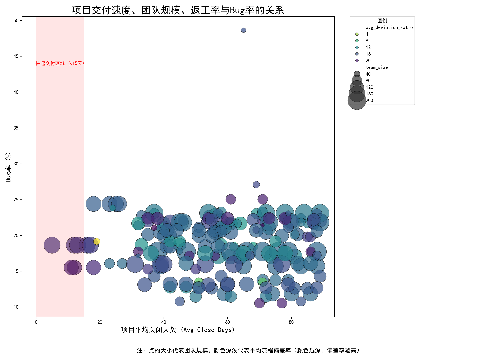

# 项目速度与稳定性的权衡：深度分析报告

## 摘要

本次分析旨在探究项目交付速度、团队稳定性与项目长期健康度之间的复杂关系。通过对项目数据进行深度分析，我们发现，**某些追求极致速度（平均关闭时间低于15天）且团队规模庞大的项目，往往伴随着更高的Bug率和流程偏差率，这揭示了其看似高效背后潜藏的质量与可持续性风险。** 本报告建议，组织应重新审视对“速度”的单一追求，转向构建更稳定、更小而精的团队，以实现速度与质量的平衡，保障项目的长期成功。

---

## 1. 分析背景

业务观察到一个现象：部分项目交付速度极快，但团队成员（我们使用“团队规模”作为代理指标）变动似乎也很大。这引出了一个核心问题：**这种“快速但不稳定”的模式是否可持续？它对项目质量有何影响？** 为了解答这个问题，我们对项目数据进行了深入挖掘。

## 2. 关键指标与分析方法

我们整合了项目信息、问题日志和性能数据，构建了以下关键指标，并从“速度”、“稳定性”和“质量”三个维度进行分析：

*   **交付速度**: `avg_close_time_days` (项目平均关闭天数)。
*   **团队稳定性 (代理指标)**: `team_size` (项目参与的总独立成员数)。我们假设，在同一项目周期内，参与人数越多，意味着核心团队越不稳定或职责越分散，增加了沟通和协调成本。
*   **质量指标**:
    *   `bug_rate` (%)：项目中“Bug”类型问题的占比，直接反映产品质量。
    *   `avg_deviation_ratio` (平均流程偏差率)：衡量任务返工、流程反复等非标准流程行为的频率，作为过程质量的指标。

我们采用SQL进行数据聚合，并利用Python进行可视化分析，最终生成了核心洞察图表。

## 3. 核心发现：速度、稳定性与质量的博弈

上图清晰地揭示了交付速度、团队规模和项目质量三者间的动态关系：

**图表解读:**
*   **X轴**: 项目平均关闭天数（越往左，速度越快）
*   **Y轴**: Bug率（越高，质量越差）
*   **点的大小**: 团队规模（越大，代表稳定性越差）
*   **点的颜色**: 平均流程偏差率（颜色越深，代表返工等问题越严重）

**核心洞察:**

1.  **“快速交付”陷阱显现**：在图表左侧的“快速交付区域”（<15天），我们可以看到大量 **尺寸巨大** 且 **颜色较深** 的数据点。这表明，许多快速交付的项目是通过投入大量人力（大团队）来实现的。然而，这种模式的代价是 **高昂的Bug率和严重的流程偏差**。团队规模的膨胀带来了沟通复杂性的指数级增长，导致了更多的协调问题、需求误解和返工，最终体现在产品质量的下滑上。

2.  **规模成为质量的“诅咒”**：观察图表可以发现，**最大的几个数据点（代表团队规模最大）无一例外地都处于较高的Bug率区间**。这印证了“布鲁克斯法则”——向一个已经延误的项目增加人力，只会让它更延误（在这里则体现为质量更差）。大规模团队带来的管理和沟通开销，侵蚀了因人力增加而带来的潜在效率提升。

3.  **存在“小而美”的健康项目**：在图表左侧同样存在一些 **尺寸较小、颜色较浅、位置较低** 的点。这些项目同样实现了快速交付，但它们的团队规模更小，Bug率和流程偏差率也维持在很低的水平。这证明 **速度与质量并非不可兼得**，关键在于拥有一支稳定、高效、小而精的团队。

## 4. 结论与建议

快速交付本身不是问题，但以牺牲团队稳定性和过程质量为代价的“唯快不破”策略，是项目长期健康的“毒药”。**那些交付快但团队庞大的项目，其所谓的“高效率”只是一种假象，背后是质量债和流程债的不断累积，最终损害了产品的价值和团队的士气。**

基于以上分析，我们提出以下可行性建议：

1.  **推行“小而精”的团队模式**：效仿表现最佳的项目，组建规模更小、职责更清晰、成员更稳定的核心团队。这有助于降低沟通成本，提升决策效率和开发质量。组织应优先考虑为项目配备经验丰富的核心成员，而不是临时堆砌大量人力。

2.  **重新定义“项目成功”**：将评估标准从单一的“交付速度”扩展为包含 **质量指标（Bug率、返工率）** 和 **团队健康度（成员稳定性和满意度）** 的综合衡量体系。这能引导项目经理从“按时上线”的思维，转变为“高质量交付”的思维。

3.  **关注流程健康，而非仅仅是产出**：密切监控 `avg_deviation_ratio` 这类过程指标。高偏差率通常是团队混乱、需求不清或技术债的早期预警信号。通过定期的复盘会议和流程优化，解决导致返工和偏差的根本原因。

通过实施这些策略，我们可以在追求市场响应速度的同时，确保产品的卓越质量和团队的可持续发展，从而实现真正的项目成功。
