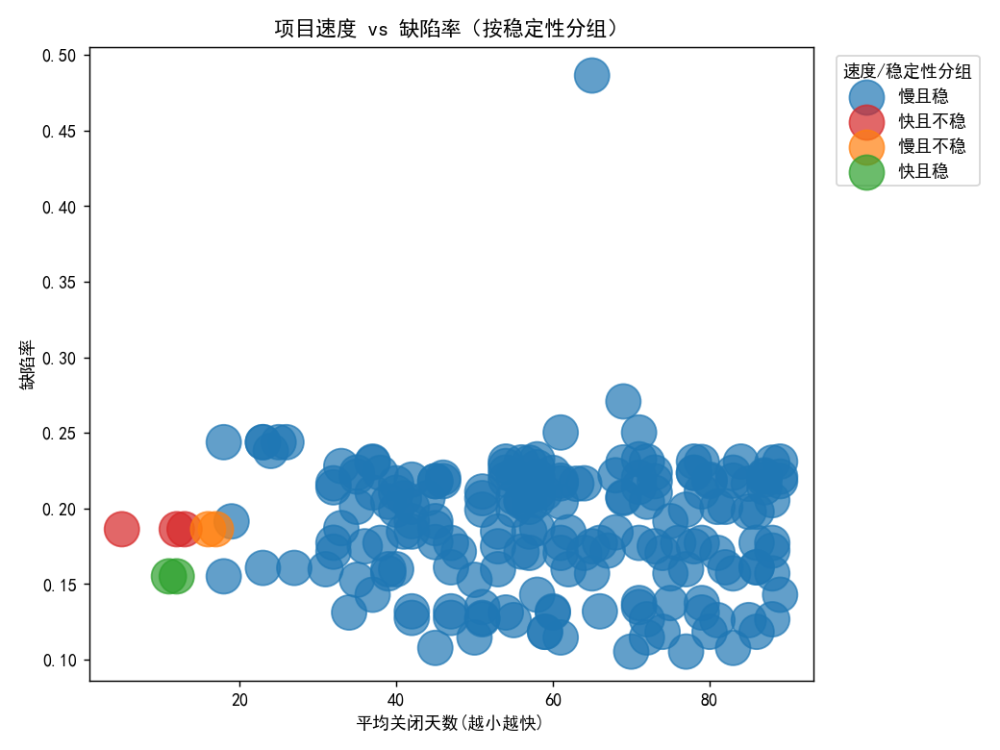
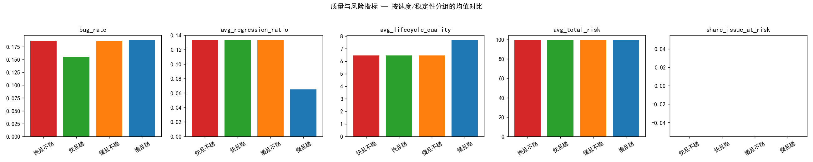
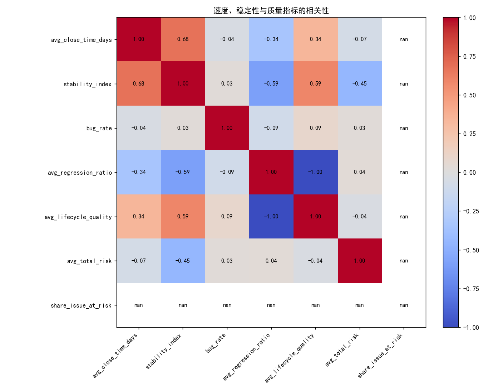

# 速度与稳定性：快速交付但人员不稳定的项目是否健康？

基于Jira三张主题表（项目、团队、问题粒度）构建项目级数据集，并重定义了“团队稳定性”后，对速度与质量、长期可持续性的关系进行分析。核心关注：avg_close_time_days<15天且团队稳定性低（重新定义稳定性后处于底部四分位）的“快且不稳”项目是否存在质量与可持续性隐患。

## 数据与方法
- 数据来源：
  - 项目：jira__project_enhanced（包含avg_close_time_days、count_closed_issues等）
  - 团队：jira__team_performance_dashboard（成员活跃度、consistency%、是否churn、最近是否inactive等）
  - 议题：jira__issue_intelligence_analytics（lifecycle_quality_score、regression_ratio、各类风险分、health_status等）
- 重定义团队稳定性（TSI）
  - TSI = (avg_consistency/100) × (1 − 0.5×share_at_churn − 0.5×share_inactive)，并截断到[0,1]
  - 直觉：活跃一致性越高越稳定；成员“流失风险/最近不活跃”的占比越高越不稳定
- 分组规则
  - 快速：avg_close_time_days < 15
  - 不稳：TSI处于底部四分位（Q25≈0.490）
  - 四象限：快且不稳、快且稳、慢且不稳、慢且稳
- 样本规模（项目数=200）：
  - 快且不稳=3，快且稳=2，慢且不稳=2，慢且稳=193（未分类=0）
  - 注：以15天为阈值的“快速”样本较少，应谨慎解读并做敏感性分析

## 可视化与主要发现

1) 速度 vs 缺陷率（按稳定性着色）

- 整体上，缺陷率与速度关系较弱，快且不稳项目在缺陷率上并未显著更差。
- 但请注意：缺陷率（Bug/总Issue）容易受“问题类型标注习惯”和“测试覆盖度”影响，未必能敏感反映返工与质量衰退。

2) 四象限的质量与风险指标对比（均值）

- 快且不稳 vs 其他（均值对比）：
  - 缺陷率 bug_rate：0.1863 vs 0.1880（差值≈-0.0017），几乎无差异
  - 回归/返工 avg_regression_ratio：0.1334 vs 0.0664，快且不稳≈其他的2倍
  - 生命周期质量 avg_lifecycle_quality：6.45 vs 7.68，快且不稳显著偏低（-1.23）
  - 总体风险 avg_total_risk：99.57 vs 99.33，略高（+0.24），差异较小
  - 处于风险状态的Issue占比 share_issue_at_risk：均为0.0（该字段可能较少被触发，提示指标敏感度不足）

解读：
- “快且不稳”的项目在缺陷率上看不出问题，但回归/返工（avg_regression_ratio）明显更高，生命周期质量（avg_lifecycle_quality）也更差。这意味着短期交付速度是“以返工换速度”，并在过程质量上隐含了长期风险（技术债/流程波动）。
- 总体风险分差异不大，可能因为该分数综合多维并且量纲差异较大，或在项目间差异度偏低；需要更贴近返工、流程偏差的指标来监控。

3) 速度、稳定性与质量指标的相关性

- 从热力图可见，速度（avg_close_time_days，越小越快）与缺陷率的线性相关性不强；
- 稳定性（TSI）与生命周期质量通常呈正相关、与回归/返工呈负相关的趋势更为显著（图中颜色对比），从侧面印证了“团队越稳定，过程质量越好，返工越少”。

## 诊断性洞察：为什么会出现“快但不稳”且质量隐患？
- 人员不稳定（churn/inactive占比高）导致知识断层和上下文频繁切换：
  - 新成员上手成本高、老成员流失带走关键上下文，导致“先上线后返修”的路径依赖。
- 程序化质量保障（回归测试、代码评审）受时间压力压缩：
  - 在追求短周期交付时，回归测试与refactor被压缩，回归/返工比例上升。
- 估算和计划偏差：
  - 团队一致性不足，容易高估“可在短时间内完成的范围”，后续通过返工拉齐预期。

## 预测性推断：继续“快且不稳”会怎样？
- 短期：仍能维持较低平均关闭时长，但返工占比可能继续走高，吞噬有效产能。
- 中期：生命周期质量下降，需求吞吐变慢（更多时间花在修修补补上），速度优势递减。
- 长期：技术债积累，模块复杂度上升，维护成本与交付风险上升，关键事件（版本事故）概率抬升。

## 规范性建议：如何既“快”又“稳”？
1) 将“返工/回归率”纳入团队级守门指标（Guardrail）
   - 将avg_regression_ratio设为红线KPI：建议目标<0.08，超过即触发“发布闸门”或额外回归测试。
   - 在迭代复盘中固定看板：本迭代返工点、根因、预防动作（测试用例缺口、设计评审缺失、跨模块协同）。

2) 稳定性运营：降低churn与inactive
   - 稳定性SLO：TSI>0.55（结合本期Q25≈0.49设定），当TSI<阈值时限制并行WIP或冻结跨团队临时借调。
   - 关键域建立双人结对/轮值（bus factor≥2），降低单点流失冲击。

3) 工程质量闸门前置
   - 回归测试覆盖最低标准：对“高复杂度/高风险”Issue（根据complexity_risk、process_risk）必须具备自动化回归；
   - 代码评审质量清单（跨模块变更需附影响面评估、回滚方案、关键路径Case）；
   - 在压缩周期时明确“不可压缩项”（回归用例集、关键接口契约测试、生产巡检清单）。

4) 计划与估算精度提升
   - 透明化“估算误差”与“返工成本”到迭代计划会议，推动范围调优；
   - 对历史“快且不稳”的迭代，强制进行Story拆分、风险条目化，降低隐藏工作与后置返修。

5) 监控与预警落地
   - 看板指标：
     - 周期时间分布（p50/p75/p90），而非只看均值；
     - 返工率（avg_regression_ratio）与生命周期质量（avg_lifecycle_quality）双指标并轨；
     - 稳定性TSI与人力变更事件（入/离/借调）联动；
   - 阈值驱动的预警：当TSI连降两期且返工率上行，即触发“减速—质量修复迭代”。

## 局限与后续工作
- 样本偏小：以15天为阈值的“快速”项目仅5个（其中3个不稳），结论方向性强于统计显著性，建议做阈值敏感性分析（如<10天、<20天）。
- 指标可用性：share_issue_at_risk在样本期内均为0，说明该字段触发少或口径局限，建议用lifecycle_deviation_ratio、process_risk_score等替代或补充。
- 质量口径：缺陷率依赖Issue类型标注，可能低估质量问题；应结合回归失败率、逃逸缺陷率、生产事故工单等外部质量信号。

## 结论
- “快且不稳”的项目在缺陷率上不显著更差，但“返工/回归比例显著更高、生命周期质量显著更低”，显示其速度建立在过程质量与可持续性上的透支。
- 因此，这类项目并不健康：短期速度优势可能通过长期返工成本与质量衰退而被抵消，建议将返工率与团队稳定性作为刚性约束，与周期时间一起纳入交付目标，形成“既快又稳”的工程化机制。

附：本次分析生成的可视化
- 速度 vs 缺陷率散点：见上图
- 质量指标分组对比：见上图
- 速度-稳定性-质量相关性热力图：见上图

图片文件：
- 速度_缺陷率_散点.png
- 质量指标_分组对比.png
- 速度_稳定性_质量_相关性.png
