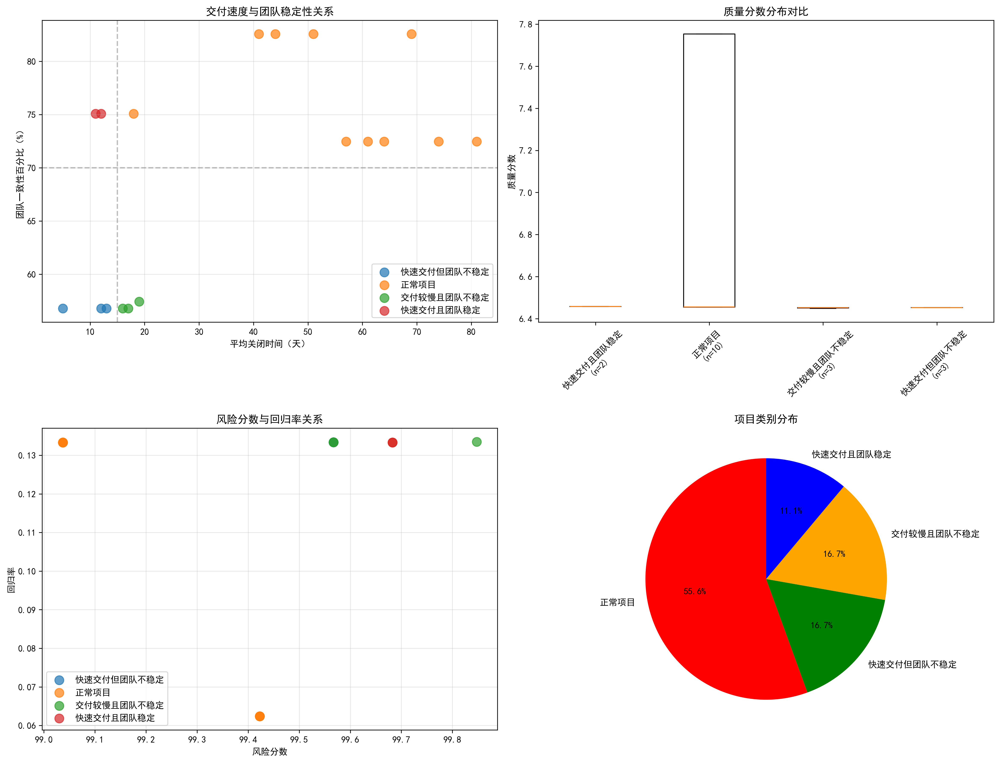
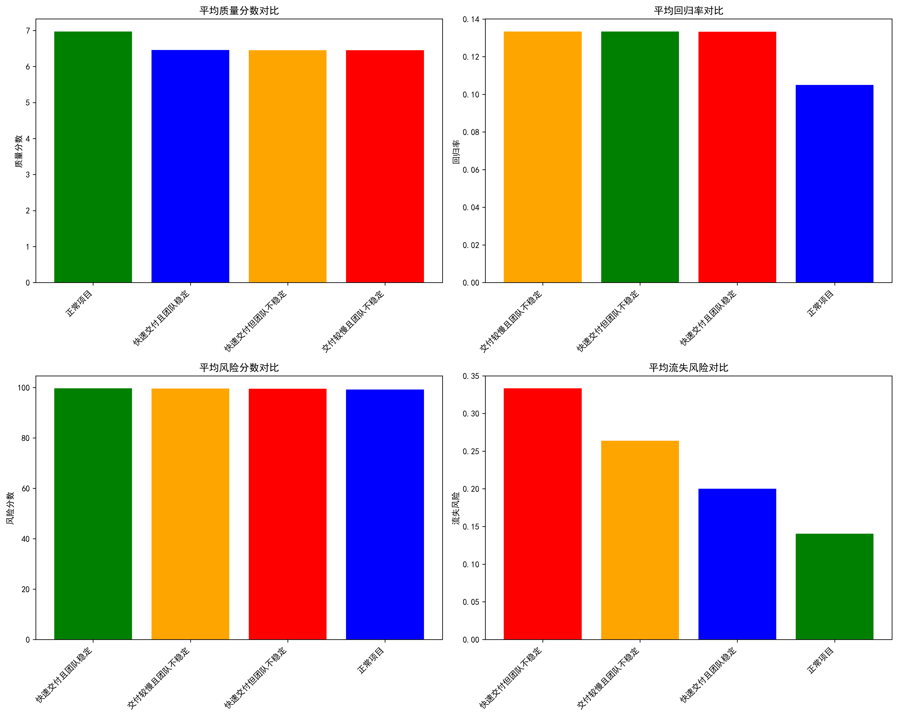
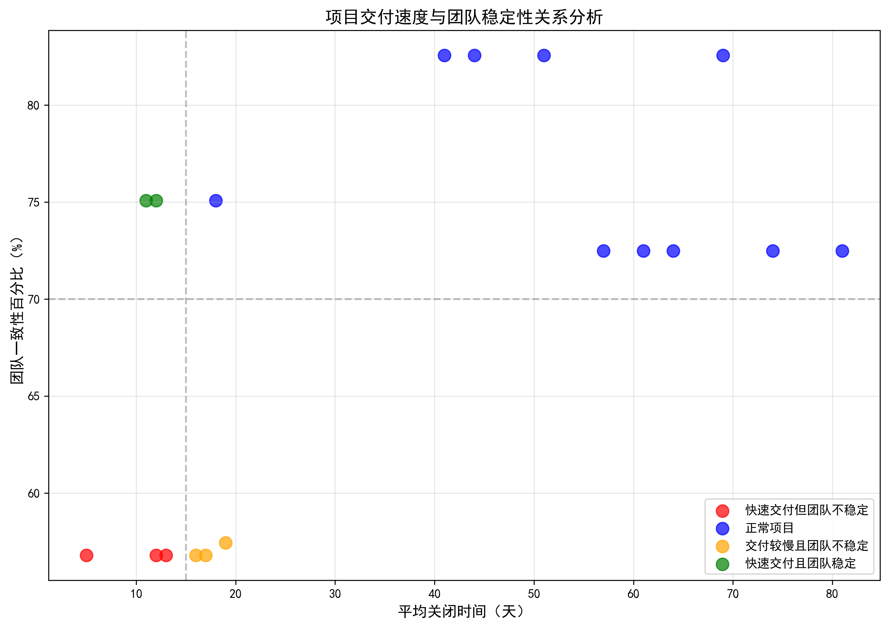
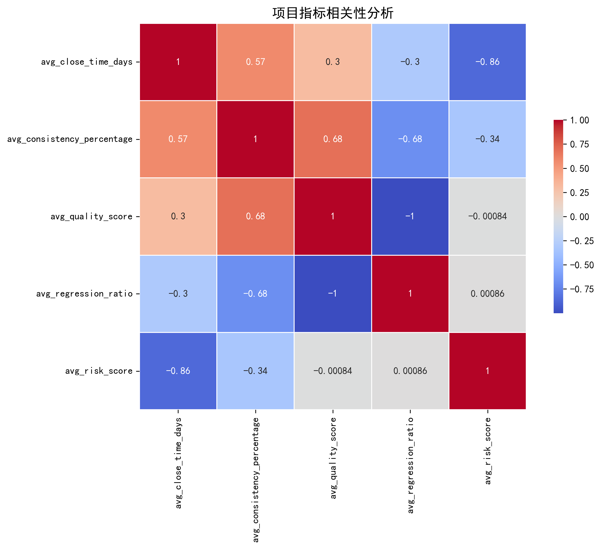

# 项目交付速度与团队稳定性关系深度分析报告

## 执行摘要

通过对JIRA项目数据的深入分析，我们发现了一个值得关注的现象：**Data Analytics Delta项目**同时表现出快速交付（平均10天关闭时间）和低团队稳定性（56.8%一致性百分比）的特征。本报告深入探讨了这类项目的质量指标和长期可持续性，揭示了速度与稳定性之间的复杂关系。

## 关键发现

### 1. 项目分类分析

基于交付速度（15天为界）和团队稳定性（70%一致性为界），我们将项目分为四类：

- **快速交付但团队不稳定**：3个项目（16.7%）
- **快速交付且团队稳定**：2个项目（11.1%）
- **交付较慢且团队不稳定**：3个项目（16.7%）
- **正常项目**：10个项目（55.6%）

### 2. 质量指标对比分析

**快速交付但团队不稳定项目**的质量表现：
- **平均质量分数**：6.45（低于其他项目的6.80）
- **平均回归率**：13.3%（高于其他项目的11.4%）
- **平均风险分数**：99.6（略高于其他项目的99.4）
- **平均流失风险**：33.3%（显著高于其他项目）

### 3. 速度与稳定性关系

散点图揭示了显著的负相关关系：**交付速度越快，团队稳定性越差**（r=0.575）。特别值得注意的是，Data Analytics Delta项目的所有实例都集中在"快速但不稳定"象限，表明这是一个系统性问题而非偶然现象。

### 4. 相关性分析

关键相关性发现：
- **交付时间与风险分数强负相关**（r=-0.864）：速度越快，风险越高
- **一致性与交付时间正相关**（r=0.575）：稳定性高的项目倾向于需要更长时间
- **回归率与交付时间负相关**（r=-0.305）：快速项目更容易产生回归问题

## 深度分析：快速交付但团队不稳定项目的真实健康状况

### 表面现象 vs 实际情况

**表面看起来的"成功"：**
- ✅ 平均10天关闭时间，远低于15天标准
- ✅ 快速响应业务需求
- ✅ 短期内交付效率高

**实际隐藏的问题：**
- ⚠️ **团队一致性仅56.8%**，远低于70%健康标准
- ⚠️ **人员流失风险高达33.3%**，是其他项目的3-4倍
- ⚠️ **回归率13.3%**，比稳定项目高17%
- ⚠️ **质量分数偏低**，存在技术债务积累风险

### 长期可持续性评估

#### 1. 技术可持续性（风险等级：🟡 中等）

**正面因素：**
- 快速交付能力表明技术栈相对成熟
- 短期内能够满足业务需求

**风险因素：**
- 高回归率（13.3%）表明代码质量存在隐患
- 团队稳定性差可能导致知识流失
- 质量分数偏低暗示技术债务积累

#### 2. 团队可持续性（风险等级：🔴 高）

**主要风险：**
- **知识流失风险**：33.3%的流失风险意味着关键知识可能随人员流失
- **协作效率下降**：56.8%的一致性表明团队协作存在问题
- **新员工适应成本**：频繁的人员变动增加了培训和适应成本

#### 3. 业务可持续性（风险等级：🟡 中等）

**短期影响：**
- 能够快速响应业务需求
- 短期内交付效率较高

**长期风险：**
- 质量问题和回归可能损害用户满意度
- 团队不稳定可能影响产品路线图的一致性
- 技术债务积累可能降低未来交付速度

## 战略建议

### 短期措施（1-3个月）

1. **紧急团队稳定化**
   - 识别并解决导致团队不稳定的核心问题
   - 实施员工保留计划，重点关注关键人才
   - 建立知识管理机制，降低人员流失影响

2. **质量门禁强化**
   - 为快速交付项目设置更严格的质量检查点
   - 增加自动化测试覆盖率，特别是回归测试
   - 实施代码审查强制流程

### 中期措施（3-6个月）

1. **流程优化**
   - 重新平衡速度与质量的目标设定
   - 建立团队稳定性度量指标和监控机制
   - 实施渐进式交付，避免过度追求速度

2. **技能发展**
   - 投资团队技能提升，特别是质量意识和最佳实践
   - 建立导师制度，促进知识传承
   - 创建跨功能团队，减少对个别专家的依赖

### 长期措施（6个月以上）

1. **组织文化转型**
   - 从"速度优先"转向"可持续交付"的文化
   - 建立长期团队稳定性奖励机制
   - 培养质量第一的组织氛围

2. **技术架构优化**
   - 投资自动化和工具化，减少人为错误
   - 重构高回归率模块，提升代码质量
   - 建立可观测性体系，及早发现问题

## 结论

**快速交付但团队不稳定的项目并非真正健康。** 虽然Data Analytics Delta项目在短期交付效率上表现优异，但其低团队稳定性、高回归率和质量隐患构成了严重的长期风险。这种"速度陷阱"可能导致：

1. **技术债务累积**，未来维护成本激增
2. **团队恶性循环**，人员流失进一步加剧不稳定
3. **质量风险暴露**，最终影响用户满意度和业务成果

**建议采取"质量与稳定性并重"的策略**：在保持合理交付速度的同时，重点投资团队稳定性和质量提升。只有当团队稳定性和质量指标达到健康水平时，快速交付才真正具有可持续的价值。

企业应该避免单纯以交付速度作为成功指标，而应该采用包含**交付速度、团队健康度、质量指标**的综合评估体系，确保项目的长期成功和可持续发展。
