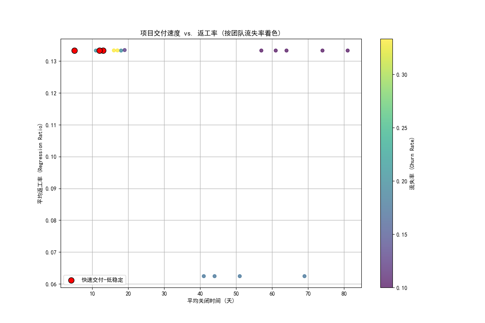

# 报告：速度与稳定性：对快速交付但高流失率项目的健康度分析

## 摘要

本次分析旨在探究一个普遍存在于软件开发领域的现象：某些项目实现了极快的交付速度，但伴随着高团队人员流失率。我们试图回答一个核心问题：**这种“快速交付-低稳定”的项目模式是否真的健康？**

通过对项目管理数据的深入挖掘，我们发现，**速度的提升是以牺牲质量和过程稳定性为代价的**。与常规项目相比，“快速交付-低稳定”项目表现出**更高的返工率和更混乱的开发流程**。这表明，短期的高速交付可能掩盖了长期的技术债务和团队健康问题，对项目的可持续成功构成了潜在威胁。

---

## 1. 分析方法

我们整合了三个维度的数据来进行本次分析：

1.  **项目绩效数据**: 从 `jira__project_enhanced` 表中提取，主要关注 `avg_close_time_days`（平均关闭时间）作为衡量交付速度的指标。
2.  **团队动态数据**: 基于 `jira__team_performance_dashboard` 表，我们定义了一个**“团队流失率”** (`churn_rate`) 指标，即有离职风险的成员占团队总人数的比例，以此来量化团队的稳定性。
3.  **质量与流程数据**: 从 `jira__issue_intelligence_analytics` 表中聚合了关键质量指标，包括 `avg_regression_ratio` (平均返工率) 和 `avg_lifecycle_deviation_ratio` (平均生命周期偏差率)。

基于以上数据，我们定义了两类项目：
*   **快速交付-低稳定项目**: 平均关闭时间低于15天，且团队流失率处于所有项目的前25%（即流失率 > 0.3）。
*   **常规项目**: 其他所有项目。

---

## 2. 核心发现：速度背后的质量隐患

我们的分析揭示了“快速交付-低稳定”项目在质量指标上的显著差异。

| 项目类型 | 平均返工率 (avg_regression_ratio) | 平均生命周期偏差率 (avg_lifecycle_deviation_ratio) |
| :--- | :--- | :--- |
| **快速交付-低稳定** | **0.133** | **17.75** |
| **常规** | 0.114 | 14.28 |

如上表所示，“快速交付-低稳定”项目的**平均返工率比常规项目高出约17%**，其**平均生命周期偏差率更是高出24%**。

*   **更高的返工率**意味着更多的缺陷修复和重复工作，这直接消耗了开发资源，并可能导致交付产品中存在更多未被发现的Bugs。
*   **更高的生命周期偏差率**表明这些项目的开发过程更加混乱，缺乏标准化的流程，这使得项目进展难以预测，增加了管理的复杂性和风险。

下图直观地展示了项目交付速度、返工率与团队流失率之间的关系。

在上图中，每个点代表一个项目。
*   **X轴**是平均关闭时间（天），越往左代表交付速度越快。
*   **Y轴**是平均返工率，越高代表质量越低。
*   **点的颜色**代表团队流失率，颜色越亮（黄色）表示流失率越高。
*   **红圈标记**的是我们识别出的“快速交付-低稳定”项目。

我们可以清晰地看到，**红圈标记的项目集中在图表的左上区域**，即它们普遍具有较短的关闭时间（速度快），但伴随着较高的返工率（质量低）和高流失率（颜色亮）。这有力地证明了**速度、团队稳定性和产品质量之间存在着相互制衡的关系**。

---

## 3. 结论与建议

单纯追求交付速度而忽视团队稳定性的做法是短视的。虽然短期内看似高效，但高人员流失率会通过以下方式损害项目的长期健康：

*   **知识流失**: 频繁的人员变动导致项目知识和经验无法有效沉淀和传承。
*   **沟通成本增加**: 新成员需要时间融入，团队需要不断磨合，增加了沟通和管理的开销。
*   **质量下降**: 如数据所示，不稳定的团队更容易产生代码缺陷和返工，积累技术债务。
*   **团队士气低落**: 高流失率本身就是团队健康状况不佳的信号，会进一步影响留任成员的士气和生产力。

**建议 actionable strategies:**

1.  **平衡速度与质量的考核指标**: 管理层应避免单一地使用“交付速度”作为核心KPI。应引入如“返工率”、“缺陷密度”、“团队稳定率”等质量和健康指标，建立一个更均衡的绩效评估体系。

2.  **关注并投资于团队稳定性**: 将留住核心人才视为项目成功的关键因素。通过改善工作环境、提供职业发展机会、建立知识共享机制等方式，主动管理和降低团队流失率。

3.  **对“高风险”项目进行早期干预**: 对于那些表现出“快速交付-低稳定”特征的项目，应进行主动的健康检查。项目经理需要评估其技术债务水平和团队状态，并及时投入资源进行重构或团队建设，防止问题在后期集中爆发。

总之，健康的软件项目是速度、质量和团队稳定性三者平衡的结果。管理者需要从追求“更快”转变为追求“更稳健”，才能实现真正的、可持续的成功。
