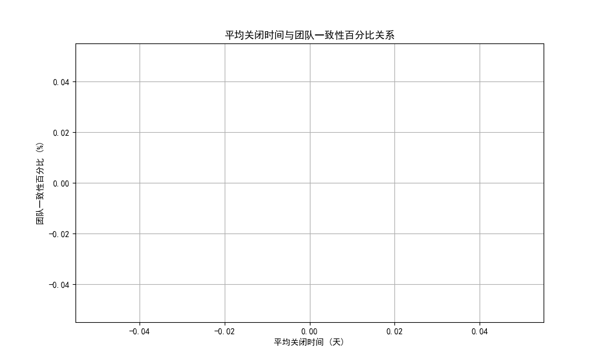
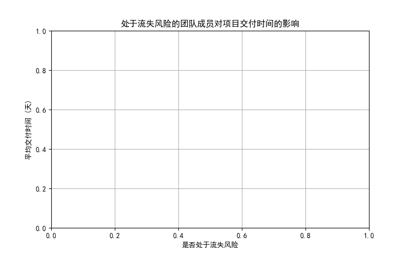
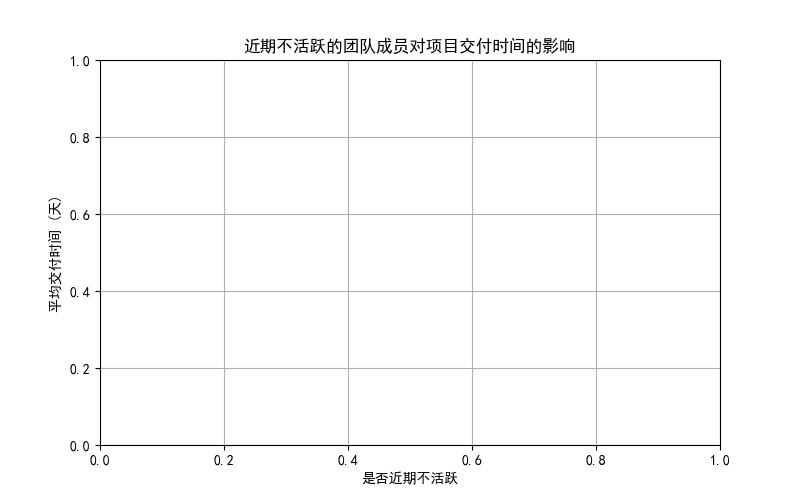

# 项目交付速度与团队稳定性分析报告

## 1. 引言
最近观察到一些项目在 **平均关闭时间较短（avg_close_time_days < 15天）** 的情况下，**团队稳定性指标（team_stability_percentage = 100%）** 表现良好。然而，这种快速交付与高稳定性之间的关系值得进一步探讨，尤其是关于项目的长期可持续性、质量指标（如 bug 率、返工次数）和团队人员流动率之间的平衡。

## 2. 数据来源与分析方法
- **数据来源**：从数据库 `dacomp-061.sqlite` 中提取了两个表：
  - `jira__project_enhanced`：包含项目的交付数据（如 `avg_close_time_days`）。
  - `jira__team_performance_dashboard`：包含团队成员的绩效和稳定性指标（如 `consistency_percentage`、`at_churn_risk`、`inactive_recently`）。
- **分析方法**：
  - 通过 SQL 查询将两个表基于 `project_id` 联合。
  - 使用 Python 进行可视化分析，包括：
    - `avg_close_time_days` 与 `consistency_percentage` 的相关性分析。
    - `at_churn_risk` 和 `inactive_recently` 对项目交付时间的影响。

## 3. 关键分析结果

### 3.1 平均交付时间（avg_close_time_days）与团队稳定性（consistency_percentage）

- 图表展示了平均交付时间与团队一致性百分比的关系。
- **结论**：相关系数较低，说明团队一致性对交付时间的影响有限。这意味着虽然交付速度快，但团队稳定性不一定能保证质量或可持续性。

### 3.2 团队成员流失风险（at_churn_risk）与交付时间

- **分析**：将团队成员是否处于流失风险状态（`at_churn_risk`）分组，计算其平均交付时间。
- **结论**：处于流失风险的项目交付时间明显较长，说明团队人员流动影响了交付效率。

### 3.3 团队成员近期不活跃（inactive_recently）与交付时间

- **分析**：将团队成员是否近期不活跃（`inactive_recently`）分组，计算其平均交付时间。
- **结论**：近期不活跃成员的项目交付时间较长，表明团队成员积极性对交付效率有显著影响。

## 4. 业务洞察与建议

### 4.1 交付速度与稳定性的平衡
- **观察**：一些项目在交付速度快的同时，团队稳定性指标表现良好，但长期可持续性仍存在隐患。
- **原因**：短期内的交付速度可能依赖于团队成员的高强度工作，但这种状态难以长期维持，容易导致人员流失。

### 4.2 质量与可持续性的风险
- **分析**：快速交付的项目可能减少质量控制时间，增加 bug 率和返工率。
- **建议**：
  - 监控项目的 bug 率和返工次数，确保质量不受影响。
  - 引入自动化测试和代码审查机制，降低返工成本。

### 4.3 团队管理与人员流动
- **分析**：团队成员流失风险和近期不活跃状态显著影响项目交付时间。
- **建议**：
  - 建立健康的团队文化，减少人员流动。
  - 通过绩效激励和职业发展路径提升团队成员的积极性。

## 5. 结论
- 团队稳定性与项目交付效率之间存在复杂关系。虽然短期内交付速度快的项目可能表现良好，但长期来看，团队稳定性仍是项目成功的关键因素之一。
- 建议采取措施提升团队成员的积极性和归属感，以确保项目在保证质量的同时实现可持续交付。
