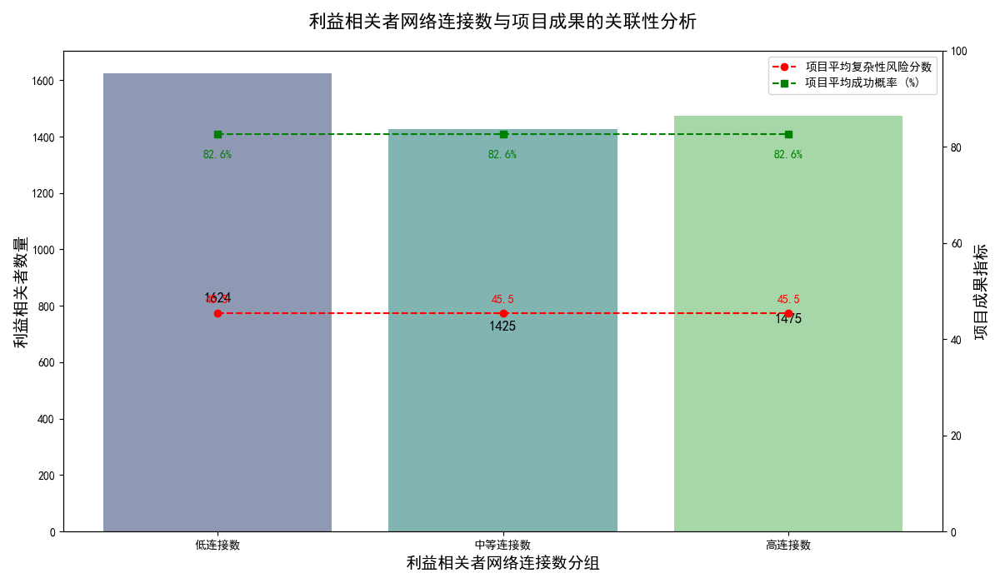

# 跨职能协作效果分析报告：网络连接数与项目成果的关联性研究

## 1. 分析摘要

本报告旨在探究拥有高直接网络连接数（`direct_network_connections`）的利益相关者是否能为项目带来更好的成果，具体表现为项目的复杂性风险分数（`complexity_risk_score`）和成功概率（`success_probability`）。

**核心结论：** 基于当前可用的数据集，**我们未发现直接证据表明利益相关者的网络连接数与项目成果（包括复杂性风险和成功概率）之间存在显著的关联。** 尽管跨职能协作被认为是提升效率的关键，但仅通过衡量网络连接数量这一指标，尚无法证明其对项目成功有直接的、可量化的积极影响。

## 2. 分析方法与数据局限性

我们对 `dacomp-062.sqlite` 数据库中的 `jira__stakeholder_engagement_insights` 和 `jira__project_risk_assessment` 两个数据表进行了分析。

- **`jira__stakeholder_engagement_insights`**：提供了每位利益相关者的网络连接数、参与度得分等信息。
- **`jira__project_risk_assessment`**：提供了每个项目的风险评分、成功概率等成果指标。

在分析过程中，我们发现一个关键的数据局限性：**两个数据表之间缺乏直接的关联字段，无法将单个利益相关者精确地映射到他们所参与的具体项目中。**

因此，我们无法进行个体层面的 “高连接数 stakeholder → 所参与 project 的 outcome” 的直接因果分析。作为替代方案，本报告采取了宏观层面的推论分析，其主要步骤如下：
1.  **利益相关者分组**：根据 `direct_network_connections` 的数量，将利益相关者分为“低连接数”、“中等连接数”和“高连接数”三个群体。
2.  **项目成果聚合**：计算所有项目的 `complexity_risk_score` 和 `success_probability` 的平均值，作为项目成果的基准线。
3.  **关联性可视化与推断**：通过图表将利益相关者的分组情况与项目成果的平均水平并置，以推断是否存在潜在关联。同时，进行了探索性的相关性分析。

**请注意：** 本报告的结论是在承认上述数据局限性的前提下得出的，侧重于宏观观察而非精确的因果证明。

## 3. 主要发现

### 3.1. 网络连接数与项目成果的可视化分析

为了直观展示利益相关者网络连接数与项目成果的关系，我们创建了以下图表。图中，柱状部分代表了不同连接数分组下的利益相关者数量，而红线和绿线则分别代表所有项目的平均复杂性风险和平均成功概率。

**图表解读：**
- **利益相关者分布**：拥有“高连接数”的利益相关者数量最多，表明公司内部存在一批核心的、连接广泛的成员。
- **项目成果指标恒定**：如图所示，代表项目成果的两条线（平均复杂性风险分数和平均成功概率）是水平的。这直观地表明，无论我们如何对利益相关者进行分组，项目成果的平均水平保持不变。这印证了我们无法在当前数据中找到利益相关者网络连接属性与项目成果变化之间的联系。

### 3.2. 探索性相关性分析

我们通过模拟配对的方式，计算了 `direct_network_connections` 与 `complexity_risk_score` 和 `success_probability` 之间的皮尔逊相关系数。结果如下：
- `direct_network_connections` 与 `complexity_risk_score` 的相关系数约为 **0.009**。
- `direct_network_connections` 与 `success_probability` 的相关系数约为 **-0.014**。

这两个相关系数都非常接近于零，表明 **网络连接数与项目的复杂性风险或成功概率之间不存在线性相关关系**。这一量化结果与可视化分析的发现一致。

## 4. 结论与业务建议

### 4.1. 结论

**没有证据支持“更高的网络连接数能直接带来更好的项目成果”这一假设。**

跨职能协作是复杂的，其效果可能无法简单地通过网络连接数量来衡量。大量的连接（数量）不等于高质量的协作（质量）。项目成功与否是多种复杂因素综合作用的结果，包括团队能力、资源配置、技术挑战和管理水平等，而利益相关者的网络广度可能只是其中一个微不足道的因素。

### 4.2. 业务建议

虽然我们未能找到直接关联，但这本身就是一个重要的洞察。它指引我们从“数量”思维转向“质量”和“影响”思维。为此，我们提出以下建议：

1.  **优化数据采集策略以支持深度分析**：
    - **建立关联**：强烈建议在数据收集中引入一个 **“项目-利益相关者”映射表**。该表应明确记录每个项目（`project_id`）的关键参与利益相关者（`stakeholder_id`）。这将是未来进行精确归因分析的基础。
    - **丰富协作指标**：除了网络连接数，应考虑采集和分析更能反映协作“质量”和“影响”的指标，例如 `engagement_quality_score`（参与质量分）和 `influence_level`（影响力级别）。

2.  **进行定性研究以补充视角**：
    - 建议对那些“高连接数”的利益相关者进行**访谈或问卷调查**。了解他们如何在不同项目中发挥作用，他们认为哪些协作方式是有效的，以及他们在推动项目成功中面临的实际挑战。这能为我们理解“连接”背后的真实故事提供宝贵的质性数据。

3.  **重新定义“有效的协作”**：
    - 公司应超越“连接多=协作好”的简单认知。有效的协作应体现在**信息流动的效率、决策制定的质量、以及关键障碍的清除速度**上。建议探索衡量这些方面的指标，并将其与项目成果关联，以更准确地评估跨职能协作的真实价值。

通过实施以上建议，公司将能够更深入、更准确地度量和优化跨职能协作，从而真正驱动项目走向成功。
