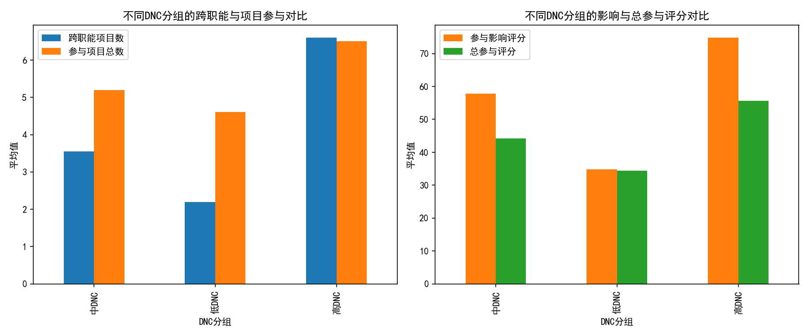
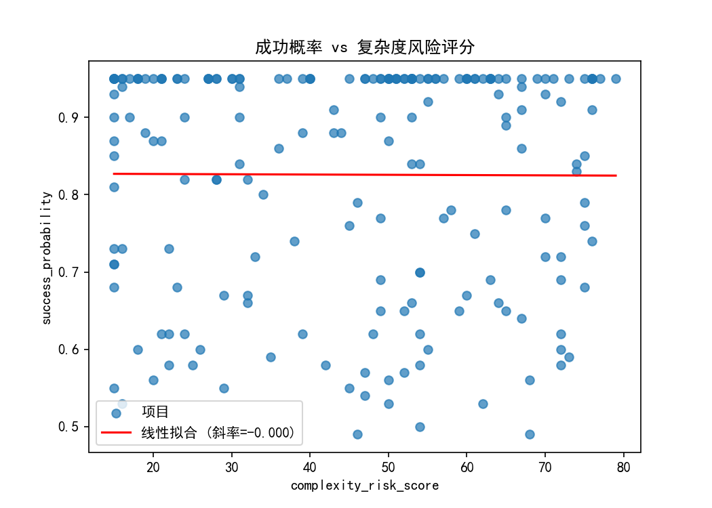

# Cross-functional collaboration 与项目结果关联分析报告

## 摘要
- 高 direct_network_connections（下称高DNC）的利益相关者显著地参与了更多跨职能项目，并呈现更高的参与质量与影响力指标。
- 在项目层面，complexity_risk_score 与 success_probability 的线性相关性几乎为零（皮尔逊相关系数 -0.0047），呈现明显的“天花板效应”（success_probability 75分位与最大值均为 0.95）。
- 现有数据未提供利益相关者与项目的直接映射，因此无法精确判定“高DNC参与的具体项目”在成功概率或复杂度上的差异；但从组织层面推断，高DNC可能通过更强的跨职能协作，缓冲复杂度带来的风险。
- 建议在高复杂度项目中系统性地嵌入高DNC“连接者”，并通过真实项目级关联数据来进行因果评估，优化成功概率模型以消除天花板效应。

---

## 数据与方法
- 数据源：SQLite 数据库 dacomp-062.sqlite
  - 表1：jira__stakeholder_engagement_insights（N=4,524）
    - 关键字段：direct_network_connections、cross_functional_projects、engagement_quality_score 等。
  - 表2：jira__project_risk_assessment（N=200）
    - 关键字段：complexity_risk_score、success_probability 以及团队与迭代相关指标。
- 方法：
  1) 利益相关者按 direct_network_connections 的四分位数分组（低/中/高），对跨职能与参与质量指标的分组平均值进行比较。
  2) 项目层面分析 complexity_risk_score 与 success_probability 的关系（散点图与一阶线性回归），并检查与团队稳定性、迭代采用率的相关系数。

代码片段（绘图时使用的中文字体设置）：

```python
import matplotlib.pyplot as plt
plt.rcParams['font.sans-serif'] = ['SimHei']
plt.rcParams['axes.unicode_minus'] = False
```

---

## 结果与可视化

### 1) 高DNC是否体现更强的跨职能协作与参与质量？
- 分组均值（节选）：
  - 跨职能项目数：高DNC≈6.60；中DNC≈3.55；低DNC≈2.19
    - 高DNC相较低DNC约为3.0倍（+201%）。
  - 参与质量评分（engagement_quality_score）：高DNC≈72.83；中DNC≈55.62；低DNC≈33.33
    - 高DNC相较低DNC约为2.19倍（+119%）。
- 结论：高DNC群体同时具备更广的跨职能参与与更高的参与质量与影响力，体现出“连接者”在跨团队协作中的关键作用。

配图：不同DNC分组的协作与参与对比



### 2) 项目复杂度与成功概率的关系
- 成功概率 vs 复杂度风险评分的皮尔逊相关系数：-0.0047（近似零相关）。
- 线性拟合结果：success_probability ≈ -0.0000 × complexity_risk_score + 0.8275。
- 成功概率的分布特征：
  - 均值≈0.826；中位数≈0.900；75分位=0.950；最大值=0.950。
  - 提示“天花板效应”，成功概率集中在高位区间，变化范围较小。
- 团队稳定性与成功概率的相关系数：-0.0636（极弱负相关）。
- 迭代采用率与成功概率的相关系数：0.0458（极弱正相关）。
- 结论：在当前数据下，复杂度风险分数与成功概率的线性相关性极弱，可能由以下因素导致：
  1) 成功概率指标存在上限约束或集中在高位（0.95），导致对复杂度变化不敏感。
  2) 跨职能协作与网络效应等其他变量可能在“复杂度提升”时提供缓冲，使成功概率维持在高位。

配图：项目成功概率 vs 复杂度风险评分（含回归线）



---

## 诊断性洞察（为什么）
- 高DNC利益相关者在协作幅度与参与质量上显著领先，说明跨职能连接者在资源对齐、信息流动与协调效率方面具备优势。
- 成功概率的“高位集中”与“近零相关”提示当前成功概率度量可能过于乐观或受限于打分上限，降低了与复杂度风险之间的可辨识度。
- 团队稳定性和迭代采用率与成功概率的相关性亦非常弱，进一步表明成功概率的波动空间不足或被其他不可观测因素主导。

## 预测性推断（将会发生什么）
- 若在高复杂度项目中持续引入高DNC利益相关者，可能通过提升跨职能协调效率来稳定成功概率，使其在高位维持（但因当前成功概率指标“天花板效应”，难以在数字层面显著上升）。
- 若优化成功概率模型（扩大量表范围、提升区分度），在未来数据中可能更清晰地观测到复杂度与协作强度对成功概率的真实影响。

## 规范性建议（我们应该做什么）
1) 项目级关联数据治理
   - 收集并建立“stakeholder—project参与映射”表，包含参与角色、时序信息与投入强度，以便进行因果层面的评估（如匹配或双重差分）。
   - 在高复杂度项目中优先配置高DNC“连接者”（例如项目经理、架构师或横向协调角色）。
2) 模型与指标优化
   - 对 success_probability 进行量表扩展或改版，减少上限聚集，提升对风险与协作策略变化的敏感度。
   - 将网络结构指标（如 direct_network_connections、engagement_breadth/depth/quality）纳入项目成功概率模型的特征工程，提升预测有效性。
3) 运营机制落地
   - 针对高复杂度与高风险类别项目，设置“跨职能协作加速器”：由高DNC连接者领衔，建立固定的沟通节奏、跨域问题快速响应机制与升级路径。
   - 建立对照实验：将高DNC配置到部分高复杂度项目，与常规配置的项目对比 success_probability 的动态轨迹与实际交付效果（价值点、延误成本）。
4) 持续监测与复盘
   - 定期监控 complexity_risk_score、success_probability 与协作网络指标的联动关系；针对出现弱相关或异常的项目，深入复盘协作痛点和组织瓶颈。

---

## 局限与后续工作
- 局限：缺少“利益相关者-项目参与”的直接映射，导致无法回答“高DNC参与的具体项目是否更好”这一问题的因果层面；成功概率存在明显天花板效应削弱分析敏感度。
- 后续：完善数据模型、开展因果评估（如倾向评分匹配、合成控制），在更高分辨率指标体系下评估跨职能协作策略对高复杂度项目的实际收益。
