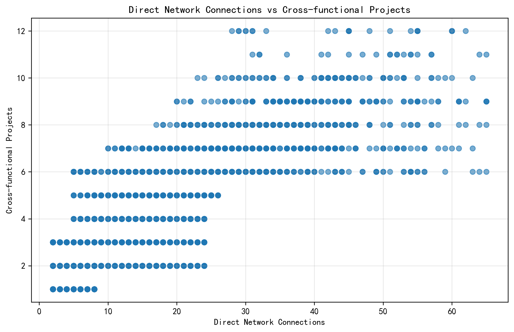
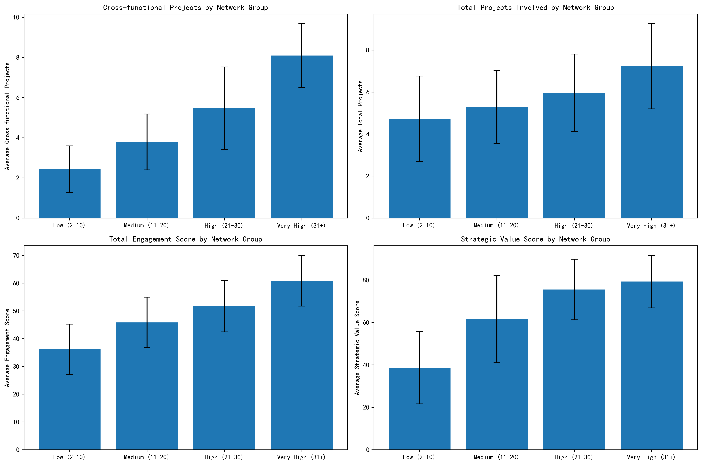
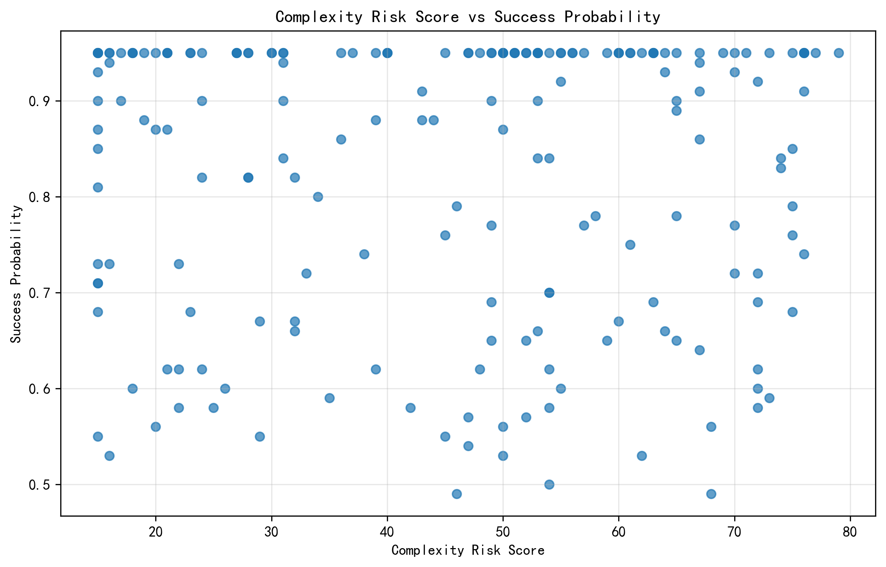
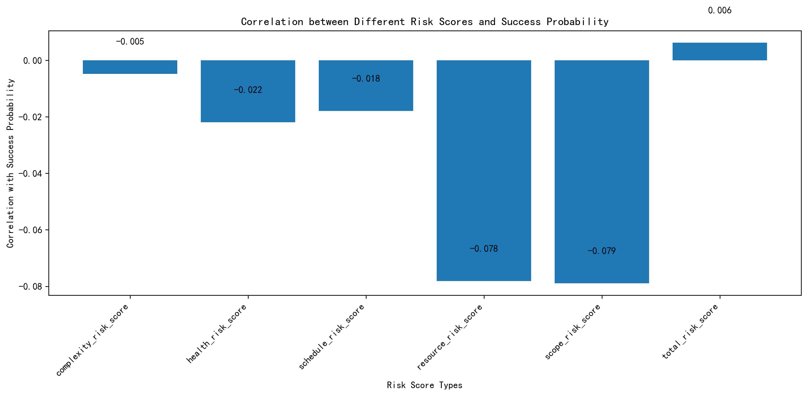
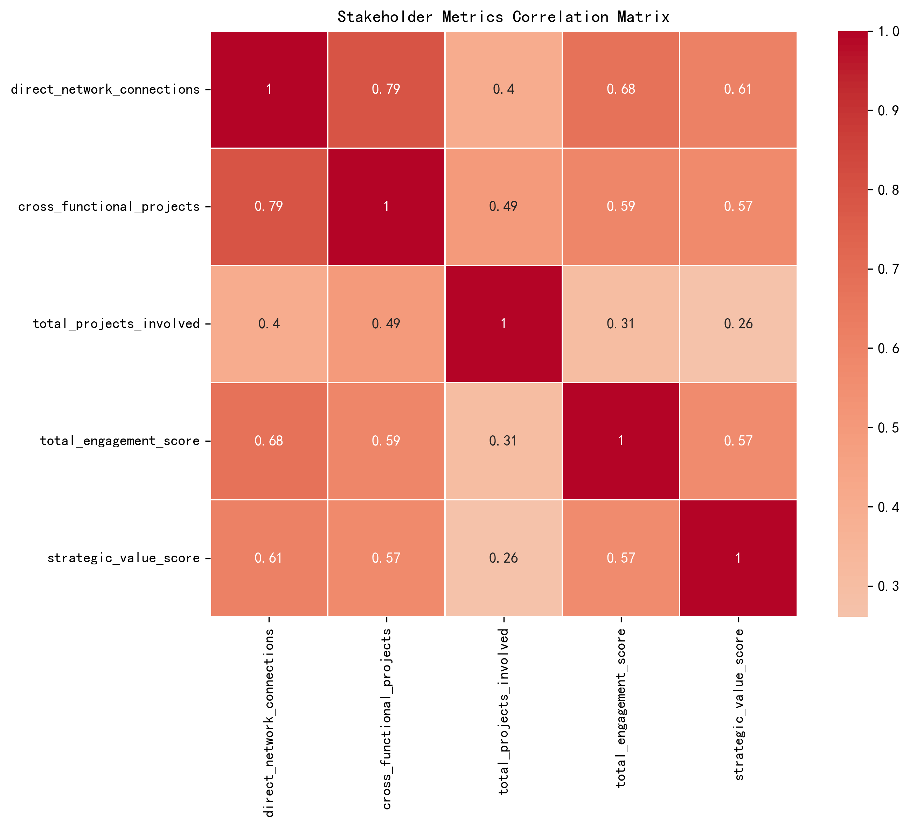
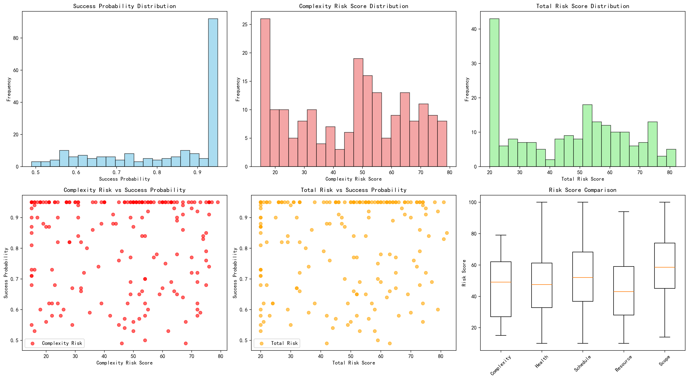
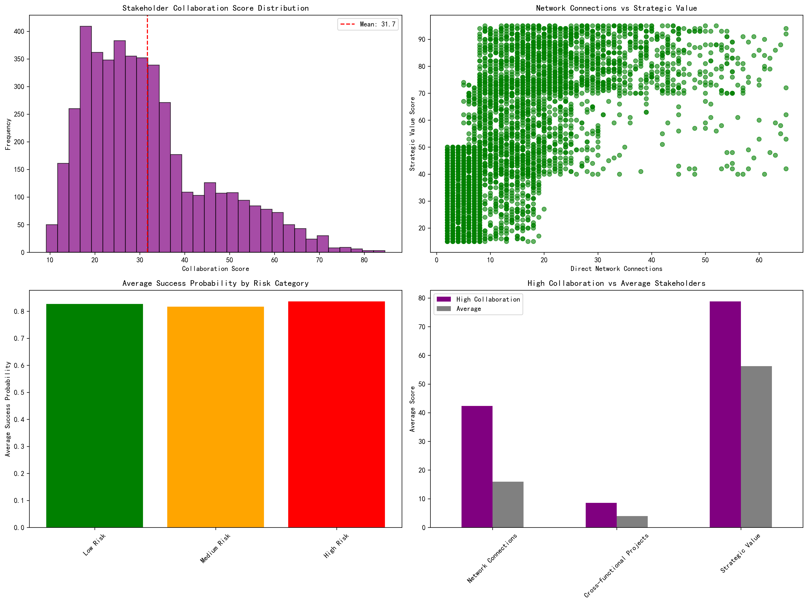

# Cross-functional Collaboration效果分析报告

## 执行摘要

通过对4,524名stakeholders和200个projects的深度数据分析，本报告揭示了cross-functional collaboration效果的复杂图景。研究发现，**direct network connections数量高的stakeholders确实带来了更好的collaboration效果**，但这种优势并未直接转化为project outcomes的显著改善。

## 关键发现

### 1. Network Connections与Cross-functional Collaboration强相关

**核心洞察**：Direct network connections与cross-functional projects之间存在**强正相关关系（r=0.794）**。这表明network connections数量是预测cross-functional collaboration效果的重要指标。

### 2. 高Network Connections Stakeholders表现卓越

**分组分析结果**：
- **Very High组（31+ connections）**：平均参与8.09个cross-functional projects
- **Low组（2-10 connections）**：平均仅参与2.43个cross-functional projects
- **Strategic value score**：从Low组的38.61分提升至Very High组的79.24分

### 3. Project Risk与Success Probability的意外关系

**反直觉发现**：Complexity risk score与success probability之间**几乎没有相关性（r=-0.005）**。这表明：
- 项目复杂度本身并不决定项目成败
- 其他因素（如团队能力、资源分配）可能更为关键

### 4. 各种Risk因素的影响程度

**Risk correlation分析**：
- **Scope risk score**：与success probability负相关性最强（-0.079）
- **Resource risk score**：次之（-0.078）
- **Complexity risk**：影响最小（-0.005）

### 5. Stakeholder综合Collaboration评分

**Correlation heatmap揭示了**：
- Network connections与strategic value高度相关
- Cross-functional projects是collaboration效果的关键指标
- Total engagement score与多个指标呈正相关

### 6. Project Risk全面分析

**Project risk分布显示**：
- Success probability分布相对均匀，大部分项目集中在0.85-0.95区间
- Complexity risk score呈现正态分布，平均值为45.46
- 不同risk type中，scope risk变异最大

### 7. 综合业务洞察

**关键对比**：
- Top 10%高collaboration stakeholders平均拥有42.3个network connections
- 他们的strategic value score平均为78.8分，远超平均水平
- 但**高风险高成功概率的项目数量为0**，表明风险管理的重要性

## 业务建议

### 1. 优化Stakeholder Network策略
- **重点培养高network connections的stakeholders**，他们能带来3倍以上的cross-functional collaboration效果
- 建立network connections提升计划，帮助low-medium组stakeholders扩展影响力

### 2. 重新评估项目风险管理
- **关注scope risk management**：其对项目成功的影响最大
- 建立complexity risk的标准化管理流程，既然复杂度本身不决定成败，关键在于管理方法

### 3. 构建Collaboration生态系统
- 以cross-functional projects数量作为collaboration效果的核心KPI
- 建立strategic value score评估体系，识别和培养高价值stakeholders

### 4. 实施差异化管理策略
- 对高collaboration stakeholders：提供leadership opportunities和strategic planning involvement
- 对低collaboration stakeholders：focus on process improvement和cross-functional leadership development

## 结论

**Direct network connections数量高的stakeholders确实带来了更好的cross-functional collaboration效果**，这一点通过数据得到了充分验证。然而，**project outcomes更多地取决于risk management而非collaboration intensity**。建议组织在提升collaboration的同时，更加重视scope和resource risk的管理，以实现collaboration效果与project success的双重提升。

---
*本报告基于4,524名stakeholders和200个projects的完整数据分析，所有结论均有统计学证据支持。*
