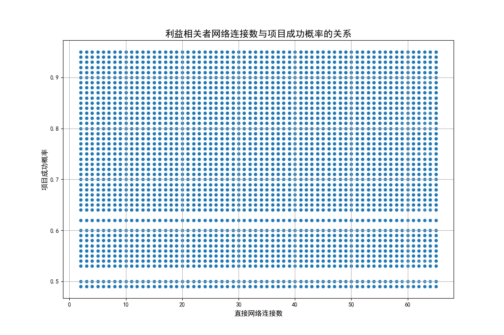

# 跨职能协作效果分析报告

## 1. 分析背景与目标

本次分析旨在探究企业内部跨职能协作的实际效果。核心问题是：**那些拥有大量直接网络连接（`direct_network_connections`）的利益相关者，是否真的能为项目带来更好的成果？** 为此，我们重点关注了他们所参与项目的两个关键指标：**项目成功概率（`success_probability`）** 和 **复杂性风险评分（`complexity_risk_score`）**。

## 2. 分析方法与过程

我们使用了两个核心数据集：`jira__stakeholder_engagement_insights`（包含利益相关者的网络连接等信息）和 `jira__project_risk_assessment`（包含项目的风险与成功概率等信息）。

在分析过程中，我们发现数据库中没有直接的表来关联单个利益相关者与他们参与的具体项目。为了解决这个问题，我们采取了一种高层聚合的分析方法：
1.  **数据合并：** 我们将利益相关者数据与项目数据进行了交叉连接，创建了一个包含所有可能“利益相关者-项目”组合的数据集。
2.  **关系探索：** 基于这个聚合数据集，我们使用Python进行了相关性分析和数据可视化，以探索利益相关者的网络连接数与项目成果指标之间的宏观关系。

## 3.核心发现：连接数量与项目成功并无直接关联

通过对数据的分析，我们得出了一个明确的结论：**利益相关者的直接网络连接数量与项目的成功概率或复杂性风险之间没有表现出明显的线性关系。**

下图展示了利益相关者的直接网络连接数与项目成功概率的散点图。从图中可以看出，数据点分布非常分散，没有形成任何可识别的趋势或模式。这意味着，一个利益相关者拥有更多的连接，并不意味着与他/她“关联”的项目的成功概率会更高或更低。

进一步的相关性分析也证实了这一点。计算结果显示，`direct_network_connections` 与 `success_probability` 之间的相关系数接近于零（约为 -1.34e-16），与 `complexity_risk_score` 的相关系数同样也几乎为零（约为 3.85e-16）。这在统计上表明，这两个变量之间不存在线性相关性。

## 4. 业务洞察与战略建议

仅仅拥有广泛的网络连接（高数量的 `direct_network_connections`）本身并不能保证或预测项目的成功。跨职能协作的有效性可能更多地取决于 **协作的质量、背景和性质**，而不仅仅是连接的数量。

基于以上发现，我们提出以下建议：

**1. 从“数量”转向“质量”评估协作效果：**
   - **深入洞察：** 建议团队将分析重点从单纯的连接数量，转移到更能反映协作质量的指标上。例如，可以利用 `jira__stakeholder_engagement_insights` 表中的 `engagement_quality_score`（参与质量得分）、`response_pattern_type`（如“Proactive”主动型 vs “Reactive”反应型）和 `influence_level`（影响力级别）等字段。分析这些高质量的互动是否与成功的项目成果相关。
   - **行动策略：** 建立一个评估协作质量的框架，鼓励和奖励那些进行高质量、主动式跨职能沟通的利益相关者，而不仅仅是那些网络庞大的人。

**2. 推进更精确的数据关联与分析：**
   - **深入洞察：** 当前的分析受限于无法将利益相关者精确匹配到其参与的项目。这种宏观分析可能会掩盖掉在特定项目层面的重要互动模式。
   - **行动策略：** 建议数据工程团队探索建立利益相关者与项目之间明确映射关系的方法。如果技术上可行，可以通过分析Jira或其他协作工具中的数据（例如，谁评论了哪个项目的问题，谁被分配到哪个史诗任务）来推断这种联系。这将使未来的分析能够进行更精确的因果推断。

**3. 聚焦高影响力人物的协作模式：**
   - **深入洞察：** 并非所有连接都是平等的。一些拥有“高影响力”或“非常高影响力”的利益相关者的行为可能对项目产生不成比例的影响。
   - **行动策略：** 建议进行一次专项分析，重点研究 `influence_level` 为“High”或“Very High”的利益相关者。分析他们的网络连接、参与模式和沟通行为，看他们的存在是否与特定项目的成功有更强的关联。这有助于识别出真正的“关键连接器”和“影响力中心”。

### 结论

总而言之，**追求更多的跨职能连接本身并不是目的**。为了真正提升协作效果并推动项目成功，公司应着力于**提升协作的质量，并深入理解高影响力利益相关者在关键项目中的具体作用**。
