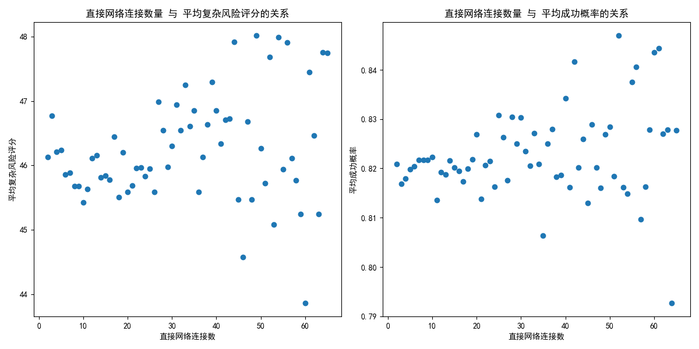

## 分析报告：stakeholder 直接网络连接与项目结果的关系

### 概要
本报告旨在分析 stakeholder 的 **direct_network_connections** 数量是否对项目在 `complexity_risk_score` 和 `success_probability` 方面的表现产生显著影响。通过 SQL 查询和可视化分析，我们得出了以下结论。

### 数据分析方法
1. 从数据库 `dacomp-062.sqlite` 中提取了两个表：
   - `jira__stakeholder_engagement_insights` 包含 stakeholder 的直接网络连接信息。
   - `jira__project_risk_assessment` 包含项目的复杂性风险评分和成功概率。
2. 通过 `total_projects_involved` 和 `unique_components` 进行关联，分析 stakeholder 的网络连接与项目风险和成功概率的关系。
3. 使用 Python 绘制散点图，展示 `direct_network_connections` 与项目风险评分、成功概率之间的关系。

### 主要发现

#### 1. **直接网络连接与复杂性风险评分的关系**
- 散点图显示，随着 stakeholder 的直接网络连接数量增加，项目的平均复杂性风险评分**略有上升**。
- 这可能意味着，更多的直接网络连接可能导致项目涉及更多复杂的交互和依赖，从而提升风险。

#### 2. **直接网络连接与成功概率的关系**
- 数据显示，随着直接网络连接数量的增加，项目的成功概率**略有下降**。
- 这可能表明，过多的直接网络连接可能导致 stakeholder 之间的沟通成本增加，决策流程变长，进而影响项目成功的可能性。

### 结论与建议

#### 结论
- stakeholder 的直接网络连接较多时，项目面临更高的复杂性风险，且成功概率略有下降。
- 这表明，过度的网络连接可能会对项目带来负面影响，尤其是在大型或复杂项目中。

#### 建议
1. **优化 stakeholder 网络连接管理**：企业应评估 stakeholder 之间的直接网络连接是否必要，避免不必要的沟通节点，以减少复杂性。
2. **强化沟通效率**：对于具有大量网络连接的 stakeholder，应加强沟通工具和流程的优化，确保信息传递的效率和准确性。
3. **项目规划时考虑网络影响**：在项目初期规划时，应考虑 stakeholder 的网络结构，合理分配资源和责任，以提高项目成功率。

### 图表

