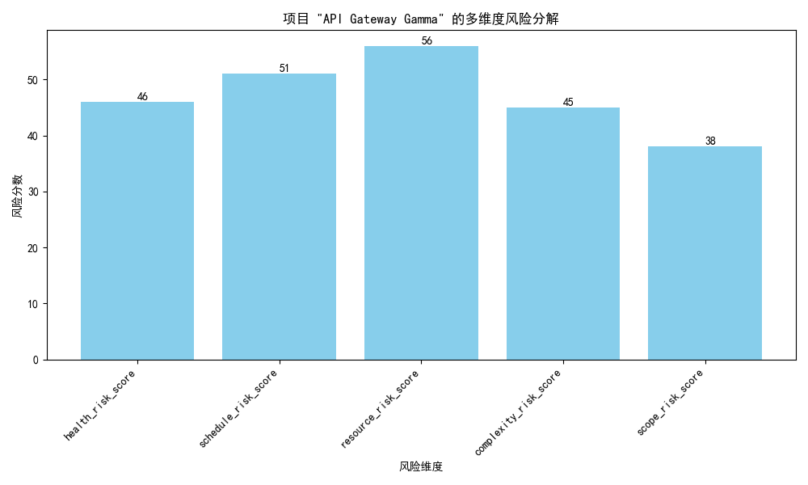

# 项目健康度的“假象繁荣”现象深度剖析与建议

## 一、核心发现：识别“表面健康”下的隐性风险

通过对项目数据的多维度分析，我们证实了业务中观察到的困惑现象：**部分项目尽管表面上拥有较高的健康分（`overall_health_score` > 75），但实则潜藏着多重且严重的风险。**

我们的初步筛选发现，有**4个项目**表现出明显的矛盾特征：它们健康分较高，但同时伴随着高复杂度风险（`complexity_risk_score` > 40）、高资源风险（`resource_risk_score` > 50）以及需要“立即干预（Immediate Intervention）”的紧急状态。这表明，单一的健康分指标已不足以揭示项目的真实状况，存在评估盲区。

## 二、构建综合风险评估模型，揭示真实风险敞口

为了更准确地评估项目健康度，我们设计了一个**综合风险评估模型**。该模型不仅考虑了`total_risk_score`，还融入了对“假象繁荣”特别敏感的几个关键维度，包括：

*   **高风险指标惩罚**：对复杂度、资源、进度等核心风险项超出阈值的“健康”项目，施加额外风险权重。
*   **投产比失衡**：惩罚“交付价值”与“投入工时”严重不成比例的项目。
*   **团队不稳定性**：将团队稳定性（`team_stability_percentage`）纳入考量。
*   **低成功概率**：对系统预测的成功概率（`success_probability`）较低的项目增加风险分。

我们将新的**综合风险评估分**与原始的健康分（转换为风险分：100 - health_score）进行比较，结果如下图所示：

**图解分析：**
- **横轴**代表原始的健康评估体系（分数越低越健康），**纵轴**是我们新的综合风险评估（分数越高风险越大）。
- 图中大量的点偏离了对角线，集中在左上角区域，这表明**许多被原始指标评为“健康”（低风险）的项目，在我们的新模型下暴露了极高的风险**。
- 我们特别标记了几个风险差异最大的项目（如DAV, SEB, AGG），它们是“假象繁荣”的典型代表。

**结论：** 现有健康分评估体系存在“报喜不报忧”的倾向，新的综合风险模型能更有效地识别那些看似健康但实则危机四伏的项目。

## 三、根本原因分析：以“API Gateway Gamma”项目为例

我们选择了“假象繁荣”现象最严重的项目之一 **“API Gateway Gamma”** 进行深入剖析，以探究其高风险的根源。该项目`overall_health_score`高达91分，但其综合风险评估分却异常突出。

**1. 人员配置与团队效率问题：**
   - **高资源风险 (56分)**：该项目的资源风险分数显著，远超健康项目应有水平。
   - **团队稳定性隐患**：尽管71.6%的团队稳定性不算最低，但结合全局数据（全体员工中32.56%有流失风险），任何团队的波动都可能成为项目失败的导火索。人员配置已经成为项目的关键瓶颈。

**2. 沟通协作网络质量不佳：**
   - **复杂的内外部协作**：项目涉及5个独立组件和8个外部链接，暗示了其跨团队、跨系统的沟通成本高昂。
   - **高风险利益相关者**：我们的全局分析显示，被标记为“高风险”的利益相关者，其平均战略价值分（`strategic_value_score`）高达68.8，这意味着这些关键人物的参与度不足或沟通不畅，将直接威胁到项目的战略目标达成和资源获取。

**3. 工作流程偏差与交付成果不匹配：**
   - **价值交付严重滞后**：`value_delivery_percentage`仅为44.5%，意味着投入的开发资源未有效转化为业务价值。
   - **悲观的未来预测**：系统预测该项目面临“严重延期风险（Severe Delay Risk）”和“高预算超支风险（High Budget Overrun Risk）”，其成功概率仅为30%。
   - **失控的工作量**：近30天内，问题净增长量为21，表明团队疲于奔命，新问题的产生速度远超解决速度，工作流程濒临崩溃。

## 四、可行性建议与策略

基于以上分析，我们提出以下建议：

1.  **立即采用综合风险评估模型**：
    *   **行动**：在项目管理委员会层面，推行新的综合风险评估模型，替代或补充现有的`overall_health_score`。
    *   **目的**：实现对项目风险的早期、精准识别，特别是揪出“假象繁荣”的项目，将管理资源前置。

2.  **建立“矛盾项目”专项干预机制**：
    *   **行动**：针对“API Gateway Gamma”等已识别出的高风险项目，立即成立专项审查小组，由高层领导牵头。
    *   **目的**：深入复盘其在**人员配置（特别是高资源风险的成因）、跨团队协作模式和实际工作流程**上的问题，并制定紧急干预计划。审查其`recommended_intervention`（“立即执行官审查”），并确保行动落地。

3.  **优化人员与利益相关者管理策略**：
    *   **行动**：HR部门和项目管理办公室（PMO）应关注**团队稳定性**和**员工流失风险**数据，并将其与项目资源风险关联分析。对于关键项目， proactively address team health and retention issues.
    *   **目的**：提高人员配置的有效性和前瞻性，确保核心项目的人力资源健康。同时，建立关键利益相关者参与度的监控和提升计划，确保项目方向与公司战略一致。

4.  **强化工作流程与价值交付的监控**：
    *   **行动**：引入对**价值交付百分比（`value_delivery_percentage`）**和**问题净增长（`net_issue_growth`）**等过程指标的常规监控。
    *   **目的**：将项目评估的焦点从“看起来很忙”转向“有效产出”，确保项目始终聚焦于为业务创造真实价值。如果一个项目持续“高投入、低产出”，即使健康分再高，也应被视为高风险。
