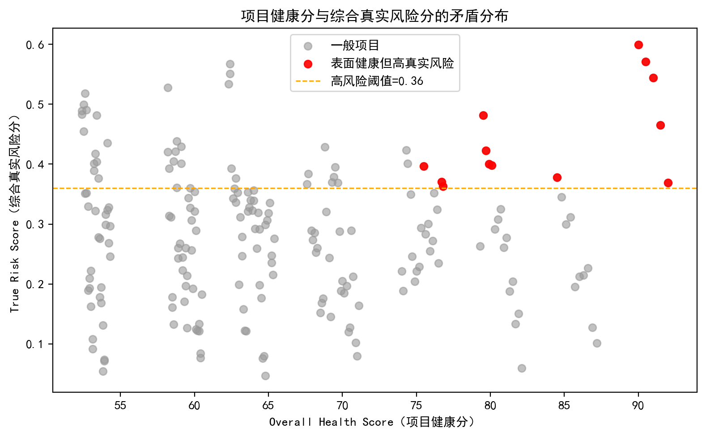
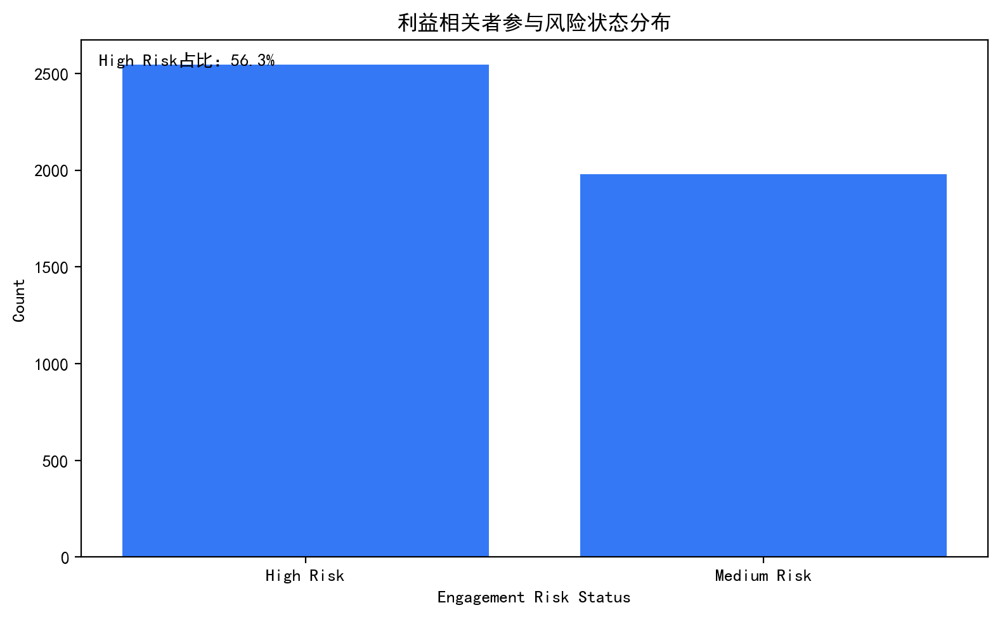
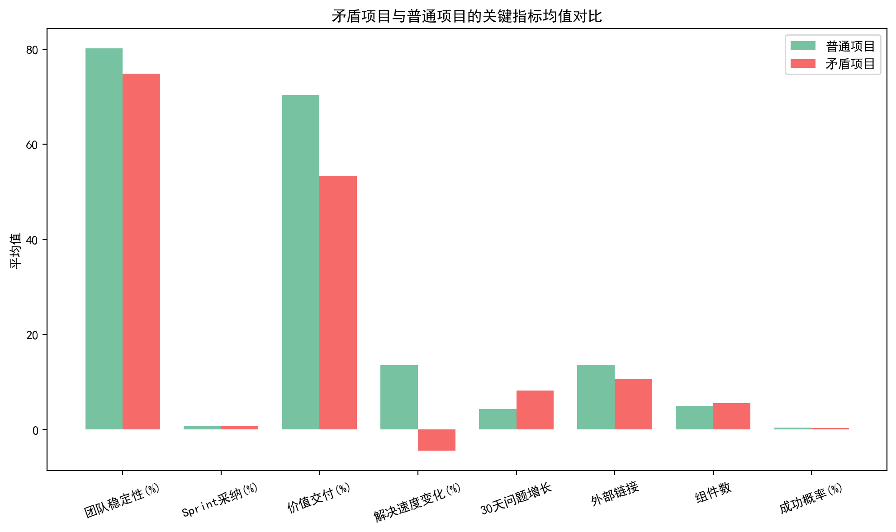
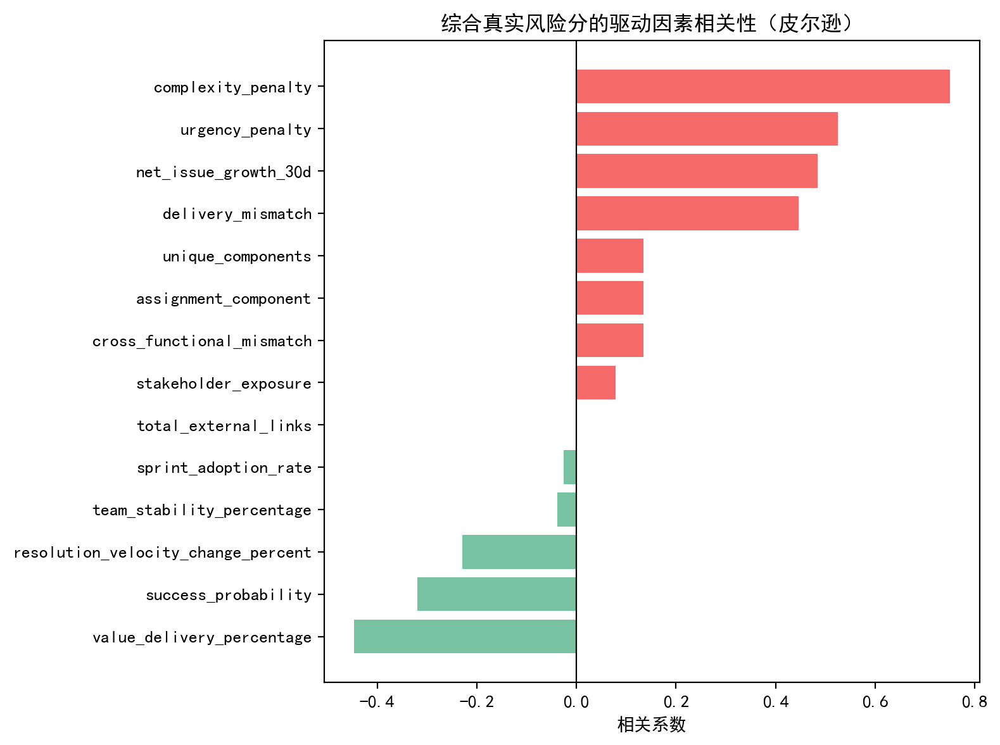

# 项目“表面健康但潜在高风险”综合分析与诊断报告

作者：数据分析师

摘要
- 核心发现：在200个项目中，42个项目健康分>75（表面健康），其中有13个项目被综合风险模型识别为“表面健康但高真实风险”（占表面健康项目的31.0%）。这部分项目呈现出高复杂度压力、交付偏差、以及问题增长和解决速度恶化等特征。
- 组织环境：团队用户层面，高绩效用户占比为36.8%；利益相关者High Risk占比为56.3%，且High Risk人群的跨功能参与较高，构成系统性外溢风险。
- 风险主因：综合风险的最强驱动是复杂度（相关系数0.75），其次是紧迫性（由近30天净问题增长与解决速度下滑构成，相关0.52）、问题增长（0.48）及交付偏差/价值实现缺口（0.45）。跨功能不匹配和分配风险虽次之，但在矛盾样本中明显抬升。
- 建议：对矛盾项目实施“复杂度拆解+积压治理+生命周期控制+跨功能治理+人员负载均衡+利益相关者干预”的组合拳，配套设定红线阈值和治理节奏，优先在复杂度和紧迫性高的项目集群推进。

可视化总览
- 项目健康分与综合真实风险分的矛盾分布见下图（红点为矛盾项目）：

- 利益相关者参与风险状态分布：

- 矛盾项目与普通项目的关键指标均值对比：

- 综合真实风险分的驱动因素相关性（皮尔逊）：


一、数据与方法
1. 数据来源
- jira__project_risk_assessment：项目层健康与风险要素（overall_health_score、complexity_risk_score、value_delivery_percentage、net_issue_growth_30d、resolution_velocity_change_percent、unique_components、total_external_links、success_probability等）。
- jira__team_performance_dashboard：用户层绩效画像（overall_performance_score、resolution_rate_percentage、avg_resolution_days、total_assigned_issues等），用于构建组织层“人员分配风险”基线。
- jira__stakeholder_engagement_insights：利益相关者网络与参与质量（engagement_risk_status、cross_functional_projects、engagement_quality_score等），用于构建“利益相关者风险压力”与“跨功能不匹配”代理。

2. 现象识别逻辑（分布量化）
- 表面健康：overall_health_score>75。
- 综合真实高风险：基于自建True Risk Score处于样本上四分位（75分位阈值）。

结果：200个项目中，表面健康42个；矛盾项目13个，占表面健康项目31.0%。

3. 综合风险评估模型（不训练ML）
- 目标：用多维构件刻画“真实健康状况”，避免单一健康分与团队表层绩效误导。
- 构件与权重（权重和=1）：
  - 复杂度压力 complexity_penalty（0.30）：complexity_risk_score归一化。
  - 紧迫性 urgency_penalty（0.25）：基于解决速度下滑和近30天问题净增长（0.6与0.4加权）。
  - 交付偏差 delivery_mismatch（0.20）：1 - value_delivery_percentage/100。
  - 利益相关者风险压力 stakeholder_exposure（0.15）：按外部链接与组件复杂度的暴露因子，乘以组织层High Risk占比与高风险人群跨功能强度比例。
  - 人员分配风险 assignment_component（0.06）：依用户层组合指标的组织基线（总指派量↑、平均解决天数↑、解决率↓），与项目复杂度代理（组件数）映射。
  - 跨功能不匹配 cross_functional_mismatch（0.04）：高跨功能但参与质量低的人群占比，映射至项目复杂度代理。
- 判定：True Risk Score≥上四分位阈值即为“高真实风险”；与表面健康交集定义“矛盾项目”。

二、分布特征与画像
1. 规模与占比
- 项目总数：200
- 表面健康项目：42
- 矛盾项目：13（占表面健康31.0%）

2. 矛盾项目典型样本（Top 5，true_risk_score降序）
- Data Analytics V2（DAV）| 健康分90.0 | TrueRisk 0.5992 | 价值交付41.5% | 复杂度43 | 速度变化-22.5% | 近30天净增长19 | 外链6 | 组件3 | 主风险：Resource Constraints
- Security Enhancement Beta（SEB）| 健康分90.5 | TrueRisk 0.5713 | 价值交付43.0% | 复杂度44 | 速度变化-15.8% | 净增长20 | 外链7 | 组件4 | 主风险：Resource Constraints
- API Gateway Gamma（AGG）| 健康分91.0 | TrueRisk 0.5440 | 价值交付44.5% | 复杂度45 | 速度变化-9.2% | 净增长21 | 外链8 | 组件5 | 主风险：Resource Constraints
- Data Analytics Alpha（DAA）| 健康分79.5 | TrueRisk 0.4819 | 价值交付65.5% | 复杂度47 | 速度变化-15.8% | 净增长1 | 外链22 | 组件5 | 主风险：Resource Constraints
- Performance Optimization Delta（POD）| 健康分91.5 | TrueRisk 0.4649 | 价值交付46.0% | 复杂度46 | 速度变化-4.1% | 净增长9 | 外链9 | 组件6 | 主风险：Schedule Pressure

3. 矛盾项目与普通项目的均值对比（图见“均值对比”）
- 与普通项目相比，矛盾项目表现为：
  - 价值交付更低（更高的交付偏差）
  - 解决速度下降更明显，近30天问题净增长更高
  - 外部链接与组件维度暴露更高（复杂性与外部依赖显著）
  - 成功概率更低

三、驱动因素与根因诊断
1. 相关性分析（与True Risk相关）摘录
- 复杂度压力：0.75（最强驱动）
- 紧迫性：0.52；净问题增长：0.48
- 交付偏差：0.45；价值交付比例：-0.45
- 解决速度变化：-0.23（速度下降对应风险上升）
- 跨功能不匹配、分配风险、组件数：约0.135级别的正相关
- 利益相关者暴露：0.078，弱正相关，但在矛盾项目中放大了外溢效应

2. 根因解释
- 人员配置效率隐患
  - 高复杂度与高问题增长背景下，人员指派负载与平均解决天数上升，导致“看似忙碌但净负担未减”的现象，掩盖了真实交付瓶颈。组织层估计的分配风险基线与矛盾项目的复杂度（组件）相乘后，对True Risk有稳定的推升效应。
- 沟通协作网络质量问题
  - 高风险利益相关者占比较高（56.3%），且其跨功能参与强度大，形成负向影响的系统性扩散；当跨功能广度高但参与质量偏低时，需求与优先级反复，决策滞回，拉高不匹配率。
- 工作流程偏差（生命周期偏差/干预紧迫性）
  - 近30天净问题增长为正且解决速度下滑（速度变化为负），反映“进入>流出”的失衡，WIP挤压，生命周期偏差增大；这与“干预紧迫性”高度一致。
- 价值交付与目标对齐
  - 表面健康往往来自近期治疗性的指标（例如健康度模型中的结构性得分）而非动态的产出率；价值交付比例低与成功概率下降共同指向“目标-产出”不对齐。

四、规范性建议（可执行）
1. 复杂度与积压治理
- 复杂度拆解：将高复杂度模块“分层切分+去耦合”，优先交付解耦后的小批量增量。
- 积压清理：设置周度Backlog triage，对>30天未推进的高优先级项强制审计，明确“保留/降级/移除”。
- 红线阈值：若项目 complexity_penalty ∈ Top 25% 且 urgency_penalty>0.5 → 进入“重点监管清单”。

2. 生命周期控制与流量治理
- 设定WIP上限：按团队吞吐率设定WIP限制，进入必出机制，防止无限累积。
- 解决SLO：对高优先级/高延迟成本问题设置7/14天SLO，越线升级到项目经理+职能负责人。
- 预警规则：net_issue_growth_30d>0 且 resolution_velocity_change_percent<0 连续两周→触发干预。

3. 跨功能协作与利益相关者管理
- 跨功能治理：对跨功能参与广度高且质量低的人群设立“协作质量改进计划”，包括决策节拍、会议纪要标准化、需求冻结窗口。
- 干系人干预：针对High Risk干系人建立“升级路线+对齐仪表板”，以目标/依赖/风险公开透明减少反复。
- 外部依赖减负：外部链接高的模块实施缓存/契约化接口与Mock策略，降低环境波动对交付节奏的影响。

4. 人员负载与分配效率
- 负载均衡：围绕“指派量、平均解决天数、解决率”的组合指标设看板，动态调度高负载成员到瓶颈链路的关键节点。
- 能力对齐：对复杂度高模块优先配备拥有高估算准确率与高解决率的成员，避免“经验不足+高复杂度”的风险耦合。
- 绩效纠偏：将“净问题增长、解决速度变化、价值交付率”加入团队绩效复盘，防止仅以产出点数/活跃度作为绩效凭据的“繁荣假象”。

五、对业务问题的回应
1) 识别并量化“多维矛盾现象”的项目分布特征
- 表面健康项目：42/200；矛盾项目：13/200（占表面健康31.0%）。
- 矛盾项目共同特征：复杂度高、近30天问题净增长为正、解决速度下滑、价值交付偏低、外部依赖与组件暴露更大。
- 利益相关者层面：High Risk占比56.3%，高风险人群跨功能参与强，放大外溢压力。

2) 重新评价项目真实健康状况的综合风险评估模型
- True Risk Score = 0.30*复杂度 + 0.25*紧迫性 + 0.20*交付偏差 + 0.15*干系人风险压力 + 0.06*人员分配风险 + 0.04*跨功能不匹配。
- 结果已用于识别高真实风险项目，并提供可视化与清单。

3) 深入分析“假象繁荣”的根本原因
- 人员配置效率：高负载+平均解决时长上升+解决率下降 → 积压扩大。
- 沟通协作网络质量：高跨功能广度但低质量参与 → 需求反复与协调成本上升。
- 工作流程偏差：进入>流出、速度下滑 → 生命周期偏差与干预紧迫性上升。
- 价值目标失配：价值交付与成功概率下行，健康分难以及时反映动态风险。

六、实施路线图与度量
- 30天内落地：建立“复杂度与紧迫性红线清单”、每周Backlog triage、设置WIP上限与SLO、启动关键干系人对齐例会。
- 60-90天优化：跨功能治理机制标准化、外部依赖契约化、人员负载均衡与能力对齐工具化。
- 持续监控指标：True Risk分位、net_issue_growth_30d、resolution_velocity_change%、value_delivery%、跨功能质量得分、人员分配负载指数。

七、方法可复现性
- 关键Python绘图配置示例
```python
import matplotlib.pyplot as plt
plt.rcParams['font.sans-serif'] = ['SimHei']
plt.rcParams['axes.unicode_minus'] = False
# 示例：保存图片
# plt.figure(); ...; plt.savefig('project_risk_scatter.png', dpi=200)
```
- 本分析在/workspace目录下生成的文件包括：
  - 图片：project_risk_scatter.png、stakeholder_risk_bar.png、group_means_comparison.png、drivers_correlation.png
  - 结果：analysis_summary.csv、contradictory_projects.csv、drivers_correlation.csv

八、局限性与后续
- 项目-干系人未提供直接映射，干系人风险压力采用组织层代理；若后续能提供项目级干系人关联与互动日志，将显著提升定位精度。
- 团队绩效在本数据集中是“汇总All Projects”的用户层视角，无法到项目级拆分；建议补充项目-成员关系和周期内工作量，以细化“团队绩效>80”的项目级筛选。
- 生命周期偏差未直接给出，使用“净问题增长+解决速度变化”作为近似代理；后续可纳入状态变迁日志、等待时长等更细指标。

附：关键数值
- projects_total: 200
- surface_healthy_count: 42
- contradictory_count: 13
- high_perf_user_share: 36.8%
- avg_resolution_rate: 80.0%
- high_risk_stake_share: 56.3%
- 相关性Top驱动：复杂度(0.75)、紧迫性(0.52)、净增长(0.48)、交付偏差(0.45)

如需进一步钻取具体项目，请参考 contradictory_projects.csv 清单，并优先对Top 10项目启动治理。
