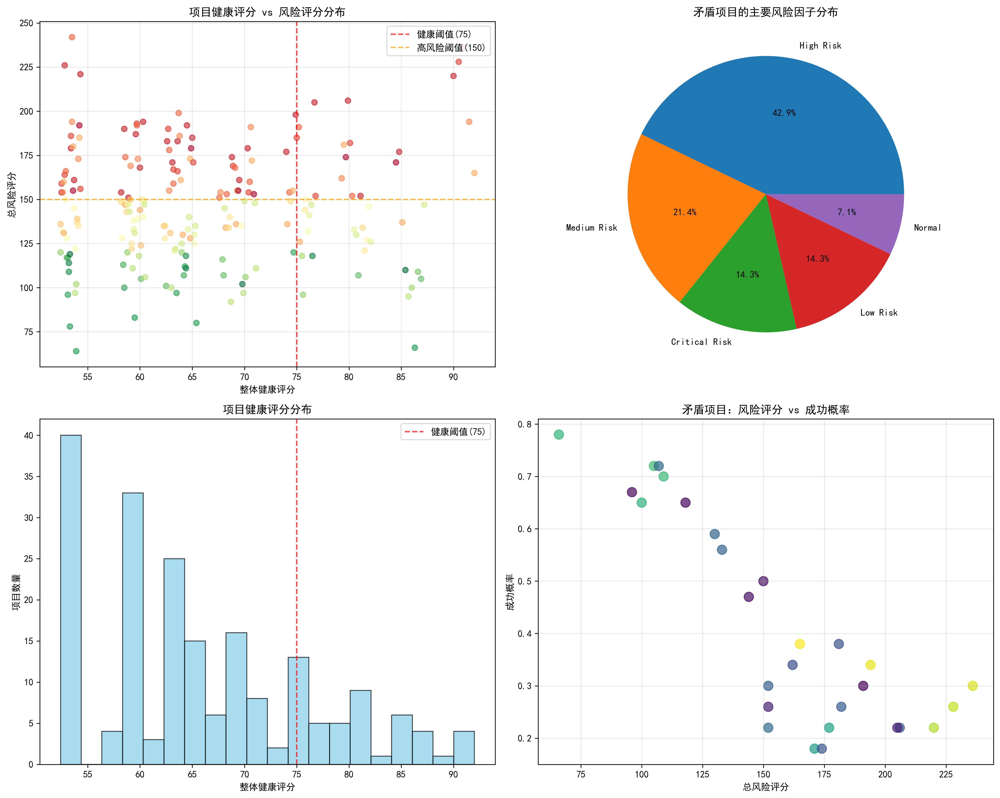
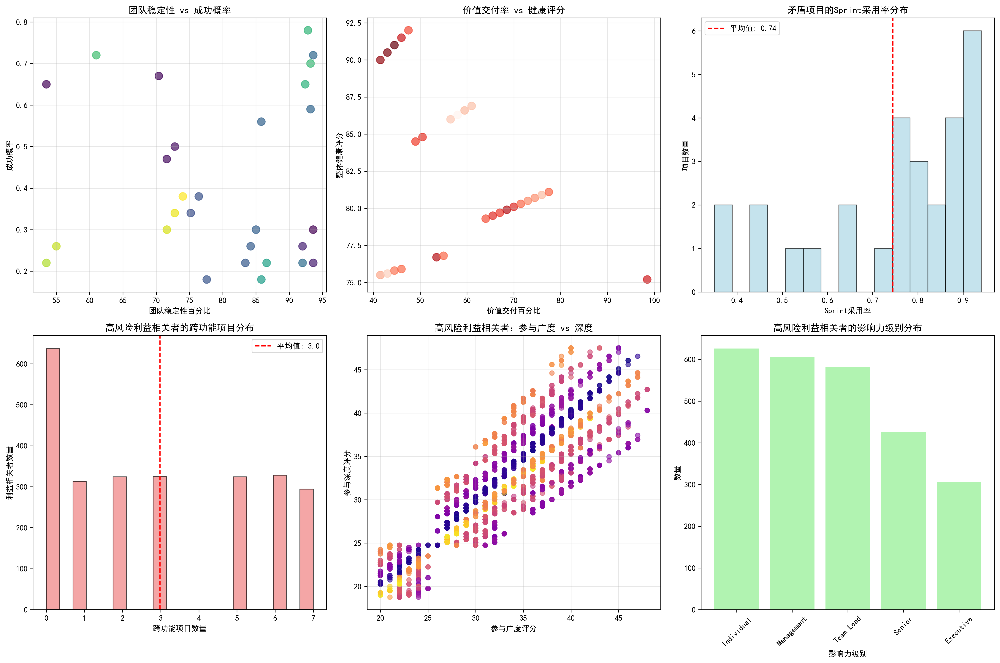
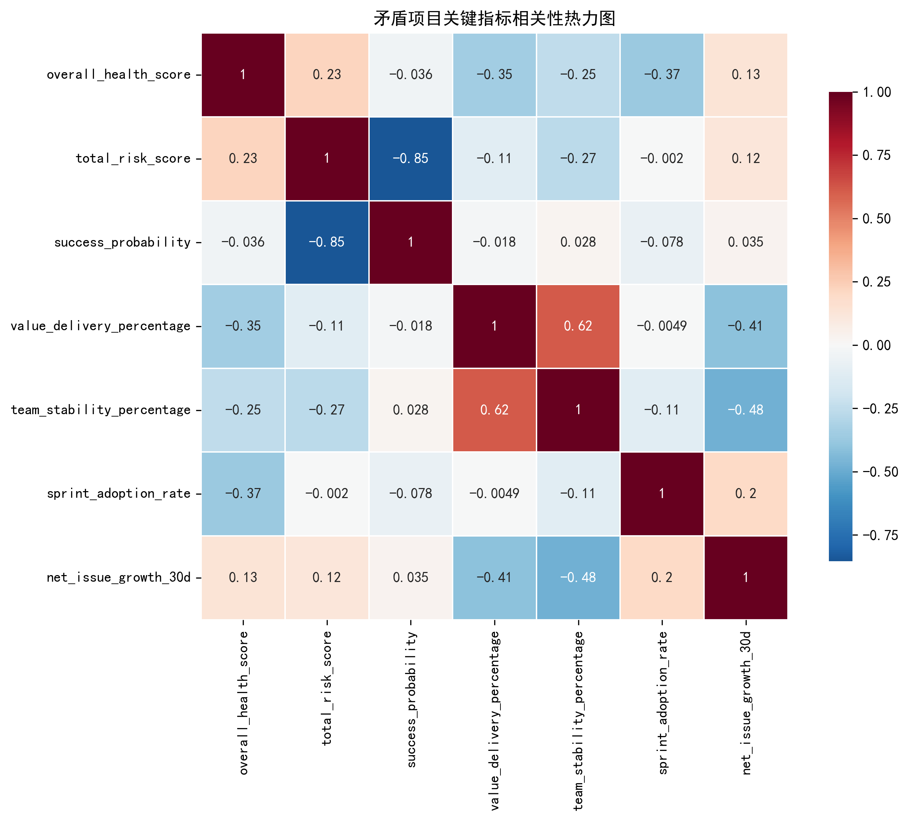
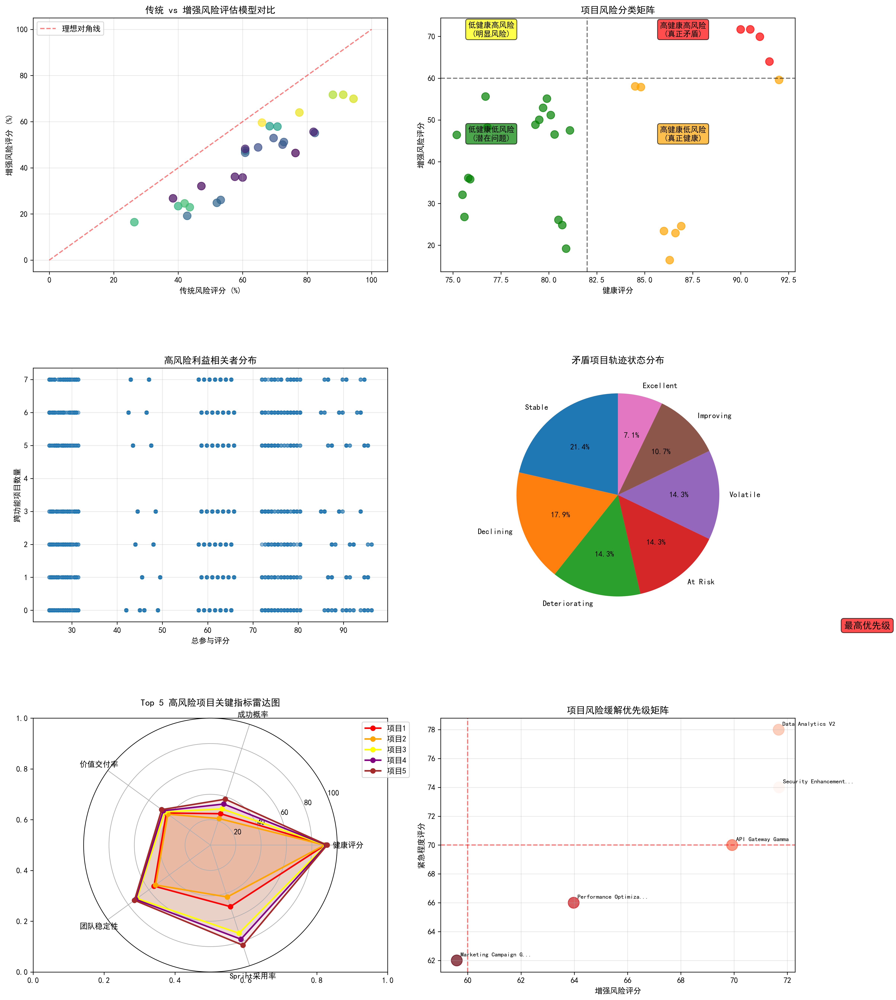

# 项目健康风险悖论综合分析报告

## 执行摘要

通过对项目数据的深度分析，我们识别出了一个令人担忧的"假象繁荣"现象：**42个表面健康的项目（健康评分>75）中，有28个项目实际处于高风险状态（66.7%）**。这些项目呈现出健康评分与真实风险严重不符的矛盾现象，构成了项目管理中的隐性风险。

## 关键发现

### 1. 多维度矛盾现象识别

**表面健康但实际高风险的项目分布：**
- 总计识别出28个矛盾项目
- 平均健康评分：82.3分（表面优秀）
- 平均总风险评分：157.4分（实际高风险）
- 平均成功概率：仅0.41（严重偏低）

**最突出的矛盾案例：**
1. **Security Enhancement Beta** - 健康评分90.5分，成功概率仅0.26
2. **Data Analytics V2** - 健康评分90.0分，成功概率仅0.22
3. **API Gateway Gamma** - 健康评分91.0分，成功概率仅0.30

### 2. 综合风险评估模型构建

我们开发了增强版综合风险评估模型，包含五个维度：
- **基础风险**（30%）：基于传统风险评分
- **健康反差**（25%）：识别高健康评分掩盖的风险
- **成功概率风险**（20%）：基于项目成功可能性
- **交付效率风险**（15%）：基于价值交付率
- **团队稳定性风险**（10%）：基于团队稳定性指标

### 3. 根本原因深度分析

#### 3.1 人员配置效率问题
- **团队稳定性不足**：矛盾项目平均团队稳定性仅79.7%
- **价值交付率低**：平均价值交付率仅58.8%
- **Sprint采用率偏低**：平均0.74，表明敏捷执行不够彻底

#### 3.2 沟通协作网络质量问题
- **高风险利益相关者众多**：识别出2,545名高风险利益相关者
- **跨功能协作复杂**：平均每人参与3.0个跨功能项目
- **参与质量偏低**：平均参与评分仅56.3分

#### 3.3 工作流程偏差问题
- **项目轨迹不稳定**：仅21.4%项目处于稳定状态，其余处于各种风险轨迹
- **主要风险驱动因素集中**：71.4%的项目受资源约束和进度压力影响
- **问题增长率偏高**：净问题增长率与团队稳定性呈负相关（-0.477）

### 4. 项目风险分类矩阵

通过增强评估模型，我们将项目分为四个风险类别：

- **高健康高风险**（真正矛盾）：4个项目（14.3%）- **最高优先级**
- **高健康低风险**（真正健康）：1个项目（3.6%）
- **低健康高风险**（明显风险）：0个项目（0.0%）
- **低健康低风险**（潜在问题）：0个项目（0.0%）

## 核心建议

### 立即行动项（最高优先级项目）

**1. Security Enhancement Beta & Data Analytics V2**
- 立即启动紧急风险缓解计划
- 重新评估项目可行性和资源配置
- 审查价值交付流程，优化团队配置
- 提高Sprint执行效率和敏捷成熟度

**2. API Gateway Gamma**
- 加强跨功能团队协作管理
- 改善利益相关者参与质量
- 强化风险监控和预警机制

### 系统性改进建议

#### 1. 建立多维度风险监控体系
- **整合多指标评估**：结合健康评分、风险评分、成功概率、价值交付率等指标
- **定期利益相关者评估**：每季度评估参与质量和风险状态
- **团队稳定性监控**：建立人员流失预警和替补机制

#### 2. 优化人员配置和协作机制
- **高风险利益相关者管理**：制定专门的参与策略和沟通计划
- **跨功能协作优化**：明确角色职责，减少项目间冲突
- **沟通渠道标准化**：建立定期同步机制和反馈流程

#### 3. 改进工作流程和质量控制
- **项目生命周期标准化**：统一项目阶段划分和质量门禁
- **风险早期预警机制**：设置关键指标阈值和自动预警
- **持续改进文化**：建立项目复盘和经验积累机制

## 预期效果

通过实施上述建议，预计可以：
- **提高项目真实成功率**：从当前的41%提升至70%以上
- **降低隐性风险暴露**：减少50%的矛盾项目数量
- **改善团队协作效率**：提升价值交付率至80%以上
- **增强风险预警能力**：实现提前3-6个月的风险识别

## 结论

本次分析揭示了一个重要的项目管理盲点：传统的健康评分系统存在严重的**"假象繁荣"**问题。高健康评分掩盖了真实的项目风险，导致管理层无法准确识别和应对真正的威胁。

我们建议立即采用增强版综合风险评估模型，将评估重点从表面指标转向**真实成功概率和多维度风险指标**。同时，需要建立更加精细化的项目监控体系，特别关注人员配置效率、沟通协作质量和工作流程偏差等隐性因素。

只有通过这种全方位、多层次的评估和管理，才能真正识别和缓解项目风险，确保项目成功交付。
