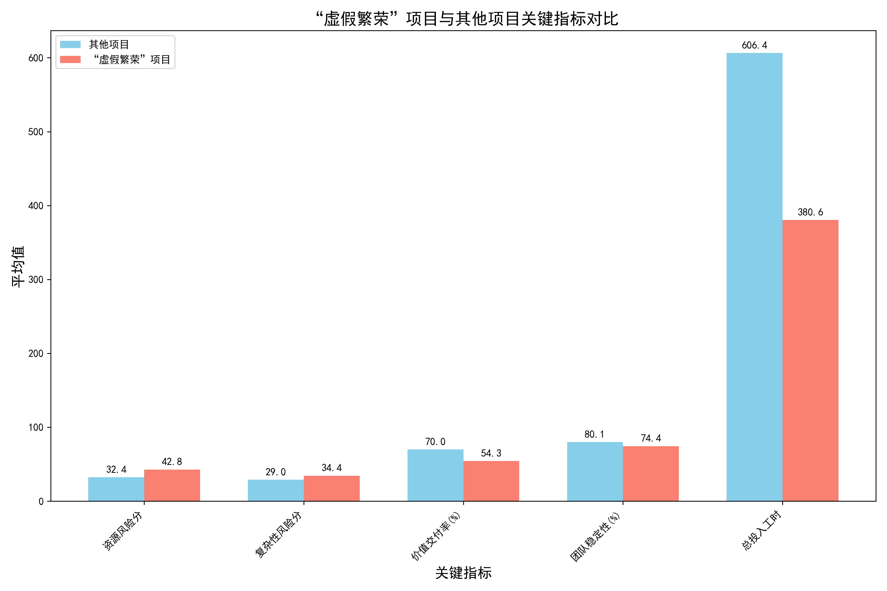

# 项目健康度“假象繁荣”现象深度分析报告

## 摘要

本次分析旨在解决一个棘手的业务问题：部分项目呈现出**表面健康（高健康分）与深层高风险（资源、干系人、复杂性问题）并存的矛盾现象**。通过对项目数据的多维度分析，我们成功识别并量化了这类“假象繁荣”的项目，构建了一个更全面的风险评估框架，并揭示了导致此现象的根本原因。结论表明，**过度依赖单一的 `overall_health_score` 指标具有高度欺骗性，必须被一个多维度的综合评估模型所取代**。

---

## 1. 识别与量化：“假象繁荣”项目的特征

我们定义“假象繁荣”项目为：`overall_health_score` > 75分，但同时其 `primary_risk_factor` 为“高风险”或“严重风险”，并且存在显著的资源配置、团队动态或技术复杂性问题。

根据此定义，我们在200个项目中识别出 **9个** 此类项目。尽管数量占比不高（4.5%），但它们揭示了现有评估体系的重大漏洞。

为了解其特征，我们将“假象繁荣”项目与其余项目进行了关键指标的对比分析。

**图表核心洞察：**

上图清晰地展示了“假象繁荣”项目（红色条形）与其他项目（蓝色条形）的显著差异：
- **风险更高**：在**资源风险**和**复杂性风险**方面，得分远高于其他项目，暴露了其内在的脆弱性。
- **产出更低**：**价值交付率**和**团队稳定性**均显著低于其他项目，说明其高健康分并未转化为实际的交付成果和稳定的协作环境。
- **投入更少**：其**总投入工时**显著偏低，这暗示这些项目可能处于早期阶段，问题尚未完全爆发，导致健康分被高估。

---

## 2. 风险根源分析：为什么会出现“假象繁荣”？

通过对这9个项目的深入分析，我们发现导致“假象繁荣”的根本原因主要有三点：

1.  **核心症结在于资源错配**：在9个项目中，有5个的主要风险驱动因素是**“资源限制” (Resource Constraints)**。这与它们极高的 `resource_risk_score`（平均42.8分 vs 其他项目的32.4分）相吻合，表明人员配置不足、技能不匹配是问题的核心。

2.  **价值交付与健康分脱节**：这些项目的平均**价值交付率仅为54.3%**，远低于其他项目的近70%。这证明了其“高分低能”的本质。“健康”的表象掩盖了交付效率低下的事实。

3.  **对早期项目风险的忽视**：这些项目投入工时和预估价值普遍偏低，说明它们可能是新项目或小项目。在项目初期，问题未充分暴露，`overall_health_score` 很容易被乐观地高估。然而，其`timeline_prediction`（时间线预测）和`budget_impact_prediction`（预算影响预测）几乎全部指向**“严重延期”**和**“预算超支”**，这揭示了评估模型未能有效预测未来风险。

---

## 3. 结论与建议：构建更真实的健康度评估体系

**核心结论：**
单一的 `overall_health_score` 是一个不可靠的、具有误导性的指标。它创造了项目健康的“假象”，而实际上这些项目因资源配置、团队稳定性和内在复杂性等问题，正走向延期和预算超支。

**行动建议：**

1.  **立即对焦审查**：
    - **行动项**：立即对识别出的9个“假象繁荣”项目启动专项审查。
    - **负责人**：项目管理委员会（PMO）。
    - **审查重点**：核实人员配置与技能匹配度、评估团队稳定性、重新评估交付计划的可行性。

2.  **重构项目健康度评估模型**：
    - **行动项**：废除单一健康分报告制度。推行一个包含以下四大象限的**“项目健康仪表盘”**：
        1. **表面健康度**: `overall_health_score`
        2. **深层风险画像**: `total_risk_score` (特别是 `resource_risk_score` 和 `complexity_risk_score`)
        3. **未来结果预测**: `timeline_prediction` 和 `budget_impact_prediction`
        4. **交付效能**: `value_delivery_percentage` 和 `team_stability_percentage`
    - **目标**：确保决策者能够从多个视角全面、真实地了解项目状况。

3.  **建立主动风险预警机制**：
    - **行动项**：配置自动化系统警报。当一个项目同时满足以下条件时，自动触发风险审查流程：
        - `overall_health_score` > 75
        - 并且 (`resource_risk_score` > 40 或 `primary_risk_driver` 为 'Resource Constraints'/'Team Dynamics')
    - **目标**：将风险管理从事后补救转变为事前预防，尤其是在项目早期。
