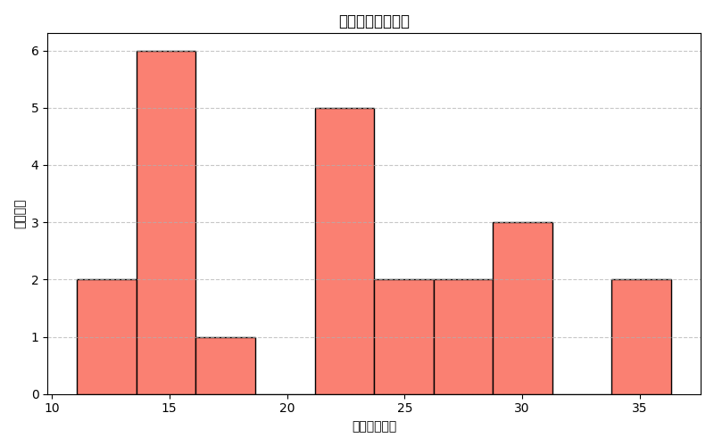

# 综合项目风险管理分析报告

## 1. 项目分布特征

我们识别出了一些“表面健康”的项目，它们具有以下特征：
- **Overall Health Score > 75**
- **Team Stability Percentage > 80**

这些项目在团队绩效方面表现出色，但也显示出一定的风险。

## 2. 风险评估模型

我们构建了一个**综合风险评分模型**，通过以下公式计算：
```
composite_risk_score = 0.6 * complexity_risk_score + 0.4 * (100 - team_stability_percentage)
```

### 综合风险评分分布


图表显示了综合风险评分的分布情况。评分越高，意味着项目潜在的风险越大。

## 3. 根本原因分析

造成“表面健康”项目潜在风险的根本原因可能包括：
- **资源配置效率**：尽管团队稳定性高，但可能存在资源分配不当或效率低下的问题。
- **沟通与协作质量**：团队的稳定性可能掩盖了内部沟通不畅或跨职能协作不足的问题。
- **流程偏差**：项目在执行过程中可能存在流程偏差，导致潜在风险未被及时识别和解决。

## 4. 推荐策略

为了降低“表面健康”项目的潜在风险，建议采取以下策略：
- **加强风险管理机制**：定期评估项目复杂性与资源分配情况，确保资源利用率最大化。
- **提升沟通质量**：鼓励团队内部和跨职能团队之间的沟通与协作，建立透明的信息共享机制。
- **优化工作流程**：识别并修正流程中的偏差，确保项目在快速发展的同时保持高质量交付。

---

报告总结了对“表面健康”项目的综合分析，识别了潜在风险并提出了可行的改进策略，以确保项目的长期成功。
