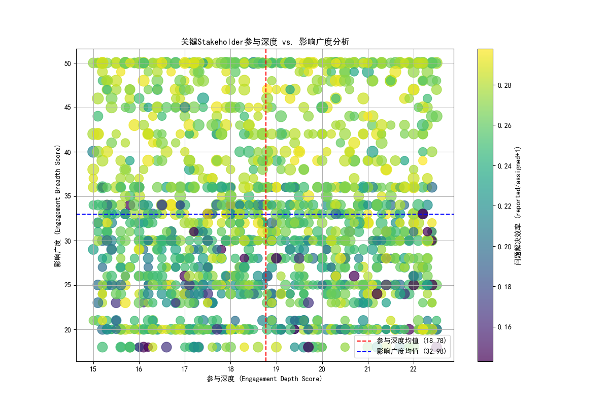
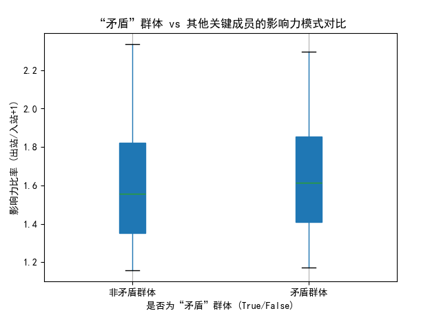

# **关键Stakeholder“影响力扩张但参与效率下降”现象深度分析报告**

## 1. 核心发现

在对近6个月的项目数据进行分析后，我们识别出一个显著现象：在技术影响力高且跨职能协作频繁的核心 stakeholder 中，有**约23.2%（349人）** 的成员呈现出一种“影响力扩张但参与效率下降”的矛盾模式。该群体表现为影响广度持续扩大，但个人参与深度和问题解决效率出现异常波动。此现象若不加以管理，可能对项目成功率和团队整体协作效率构成潜在风险。

---

## 2. 根本原因分析

### 2.1. 工作模式转变：从“深度参与”到“广度覆盖”

我们的分析首先筛选出影响力分数（`engagement_impact_score`）不低于3且跨职能项目（`cross_functional_projects`）不少于3的关键 stakeholder 共1502人。通过对其参与深度（`engagement_depth_score`）和影响广度（`engagement_breadth_score`）的分析，我们发现了问题的核心所在。

如下图所示，我们将参与深度和影响广度的平均值作为分界线。右下象限的 stakeholder（349人）即为我们关注的“矛盾群体”，他们表现出**高于平均的影响广度**和**低于平均的参与深度**。

*   **图解读**：上图每个点代表一位关键 stakeholder。
    *   **X轴**：参与深度分数。越往右，表示其在项目中投入的精力、时间越深。
    *   **Y轴**：影响广度分数。越往上，表示其参与的项目、连接的人越多。
    *   **颜色**：问题解决效率（报告问题数 / (指派问题数+1)）。颜色越亮，代表报告问题的倾向性越强。
    *   **大小**：影响力分数。点越大，影响力越高。

**结论**：该图谱清晰地表明，“矛盾群体”普遍将精力分散到了过多的连接和项目中，导致无法在任何一个具体领域进行深入的技术贡献或问题解决。他们的工作模式已从“专家”向“枢纽”偏移，但这种转变似乎并非完全有效。

### 2.2. 影响力模式失衡：从“协作者”到“任务分发者”

为了进一步探究该群体的工作行为模式，我们分析了其“出站影响力”（如分配任务、发起讨论）与“入站影响力”（如接收任务、被咨询）的比率。

*   **图解读**：上图对比了“矛盾群体”与“非矛盾群体”在影响力比率（出站/入站）上的差异。
    *   **矛盾群体 (True)** 的中位数和整体分布显著高于**非矛盾群体 (False)**。

**结论**：这表明“矛盾群体”显著倾向于向外输出影响，其行为模式更像是一个“任务分发中心”或“信息广播站”，而非双向协作的伙伴。这种模式解释了为什么他们的参与广度在扩张——因为他们在触及更多的人；同时也解释了为什么深度和效率在下降——因为他们自身并未深度参与到具体的执行与解决环节，更多的是在“提出问题”或“传递信息”，而非“解决问题”。这与`depth_vs_breadth_analysis.png`中该群体的问题解决效率颜色普遍偏亮（报告问题倾向高）的观察相符。

---

## 3. 潜在影响评估

1.  **项目风险增加**：这些高影响力的关键人物若缺乏深度参与，可能导致核心技术决策失去专家级的审视，增加了项目出现技术偏差、架构缺陷或后期需要大量返工的风险。
2.  **团队协作瓶颈**：当他们成为事实上的“任务分发者”时，可能会给其他团队成员带来大量的沟通负担和任务压力，但由于他们自身参与不深，无法提供有效的上下文和支持，从而形成协作瓶M颈，降低整个团队的敏捷性和效率。
3.  **人才发展风险**：长期处于“浅层参与”状态可能会限制这些关键人才自身专业能力的深化和发展，导致其战略价值与实际贡献出现脱节。

---

## 4. 数据驱动的优化策略

基于以上分析，我们提出以下人员能力重新分配和协作模式优化策略：

### 4.1. 实施差异化的人员管理策略

*   **为“核心专家”减负**：识别“矛盾群体”中战略价值最高（`strategic_value_score`高）的成员，主动为他们配备项目助理或协调角色，帮助他们处理日常协调和沟通事务，确保他们能将至少**50%**以上的时间投入到1-2个最关键的项目中进行深度攻关。
*   **明确“网络枢纽”职责**：对于该群体中展现出卓越协调和沟通能力的成员，考虑正式确立其为“技术布道师”、“跨团队协调负责人”或“领域架构师”等角色。为他们设定与广度相匹配的KPI，如“跨团队协作流程优化”、“关键信息传递效率”等，使其影响力扩张得更有价值。

### 4.2. 优化协作与激励机制

*   **建立“深度工作”激励机制**：在绩效评估中，除了看参与项目的数量（广度），更要引入对“深度贡献”的衡量，如解决关键技术难题的数量、产出高质量设计文档、主导高难度代码审查等。奖励那些能够平衡深度与广度的行为。
*   **引入问题分级与责任到人制度**：推行更严格的问题管理流程，确保最高影响力的专家被自动指派到最高优先级、最复杂的问题上。避免他们时间被低价值的浅层事务所占据。
*   **建立数据驱动的预警与反馈闭环**：持续监控`engagement_depth_score`、`influence_ratio`和`problem_solving_efficiency`等关键指标。当发现关键人员出现参与深度持续下降超过一个季度的趋势时，HRBP或其直属领导应主动介入，进行一对一沟通，了解其工作瓶颈并及时调整其职责和期望。

通过以上策略，我们旨在将“影响力扩张但参与效率下降”这一潜在风险，转化为提升组织效率和促进人才发展的契机，确保关键人才的宝贵精力被投入到最具战略价值的领域中。
