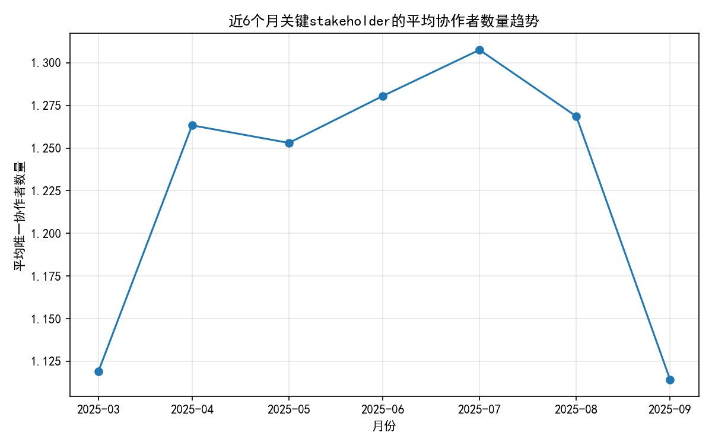
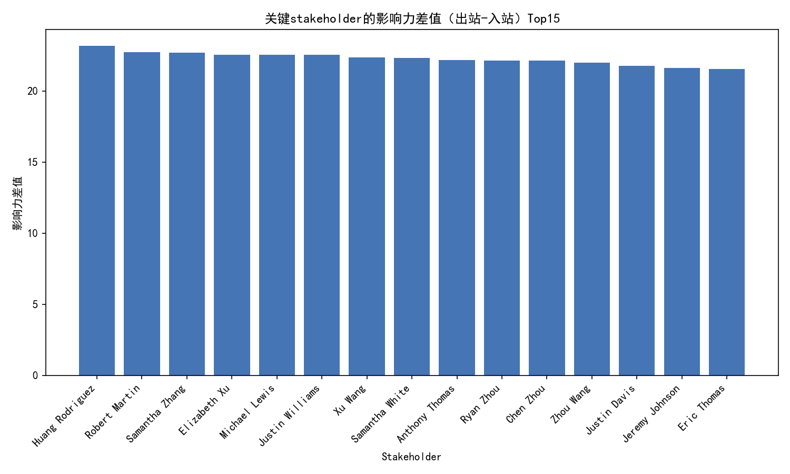
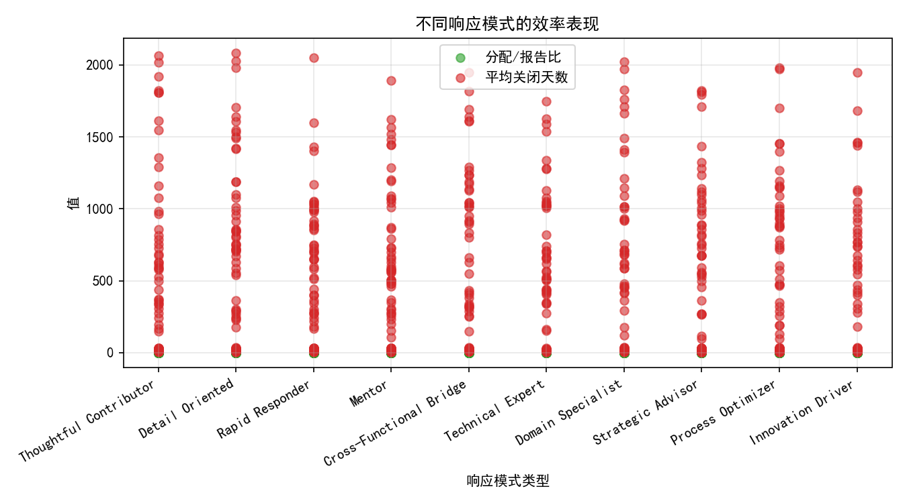
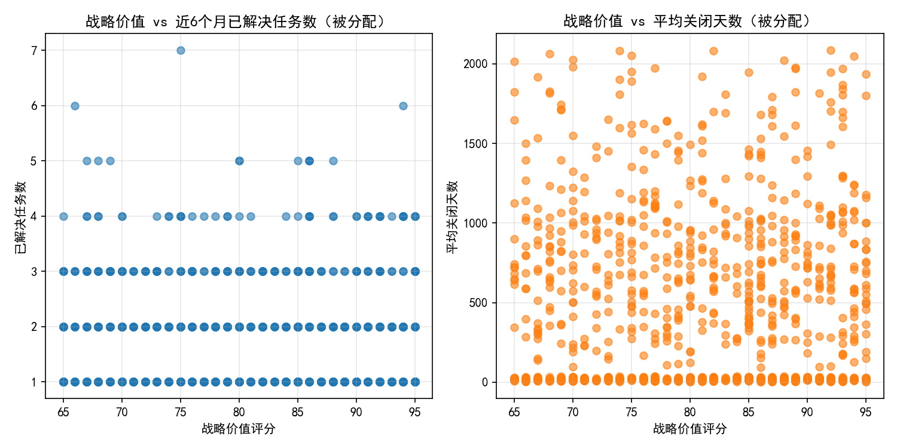
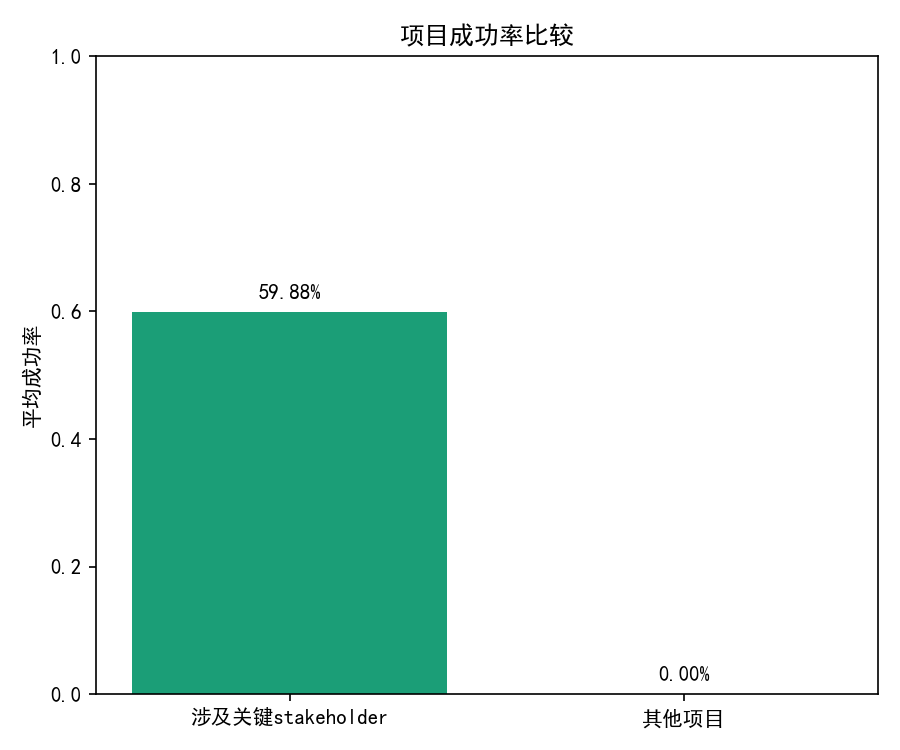
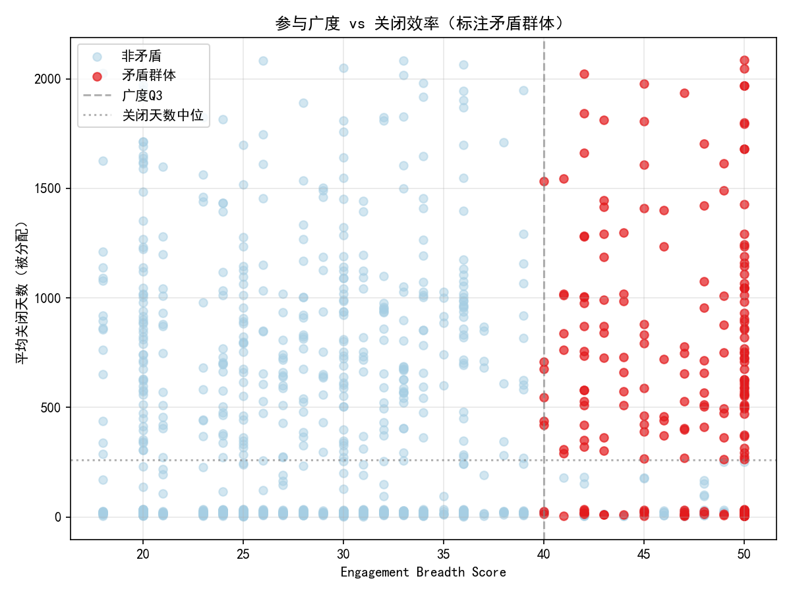

# 报告：关键Stakeholder“影响力扩张但参与效率下降”的根因诊断与优化策略

## 摘要
在近6个月（窗口起始：2025-04-13）内，对影响力较高（engagement_impact_score ≥ 3）且跨职能协作频繁（cross_functional_projects ≥ 3）的关键stakeholder进行分析（样本量：1502）。我们识别出存在“影响力扩张但参与效率下降”的矛盾群体230人，占比约15.31%。该群体呈现：
- 网络协作范围持续扩张（partners_delta > 0 或出站影响>入站影响，后者在样本中占比达100%），但参与效率指标下降（分配/报告比值低于中位数，或平均关闭时间高于中位数）。
- 响应模式特征倾向于Rapid Responder、Domain Specialist等类型的占比显著高于非矛盾群体。
- 战略价值评分较高，但近6个月的已解决任务数较低且关闭时间显著偏高，存在“战略价值–实际贡献”的错配风险。

这些特征对项目成功率与团队效率带来潜在负面影响：涉及关键stakeholder的项目平均成功率约为59.9%，但由于几乎所有项目均涉及关键stakeholder，无法直接与不涉及项目做对照，建议改为对“矛盾群体参与强度”的项目进行分层评估与周期性预警。

以下为详细分析与建议。

---

## 数据与方法
- 数据库：dacomp-064.sqlite
- 表：
  - jira__stakeholder_engagement_insights（stakeholder画像与影响力/参与度维度）
  - jira__issue_enhanced（近6个月issue层数据、关闭时长、分配/报告、issue类型、项目维度）
  - jira__project_enhanced（项目成功率与关闭时长聚合）
- 关键计算：
  - 参与效率：近6个月被分配任务的平均关闭时间（avg_close_days_assigned）与分配/报告比（assigned_reported_ratio）。
  - 影响力平衡：total_outbound_influence vs total_inbound_influence 的差值与比率。
  - 网络扩张：stakeholder在近6个月的月度唯一协作者数量趋势与首末差（partners_delta）。
  - 矛盾群体定义：广度高（engagement_breadth_score ≥ Q3）且网络扩张（partners_delta > 0 或 influence_diff > 0），同时效率下降（assigned_reported_ratio ≤ 中位数 或 avg_close_days_assigned ≥ 中位数）。

---

## 关键发现

1) 网络协作者扩张趋势整体为正但斜率较小  
- 近6个月关键stakeholder的平均唯一协作者数量趋势线性斜率约为 5.85e-05，表明群体层面协作范围略有扩张。  
- 图示：近6个月关键stakeholder的平均协作者数量趋势  
  

2) 影响力平衡与关闭效率的线性相关性弱，但出站影响主导  
- 影响力差值与平均关闭天数的皮尔逊相关系数为约0.048；影响力比率与平均关闭天数约0.052，线性相关性较弱。  
- 然而，样本中出站影响大于入站影响的占比达100%（pct_outbound_gt_inbound=1.0），意味着信息/决策影响更偏“外扩”，可能带来协调负担。  
- 图示：关键stakeholder的影响力差值（出站-入站）Top15  
  

3) 响应模式与效率存在显著结构性差异  
- 不同 response_pattern_type 的近6个月效率中位数差异显著：
  - Innovation Driver：平均关闭天数中位数约28天，Strategic Advisor约32.5天（效率相对高）。  
  - Detail Oriented：约566.9天，Technical Expert约338.6天（关闭周期显著偏长）。  
- 矛盾群体中响应模式分布相较非矛盾群体，Rapid Responder、Domain Specialist、Thoughtful Contributor、Detail Oriented的占比更高；Cross-Functional Bridge、Technical Expert占比更低。这说明“广度扩张但效率下降”的群体更可能集中于“快速响应/领域专家/细致贡献”画像，他们在广泛协作与深度推进之间可能发生扭曲。  
- 图示：不同响应模式的效率表现  
  

4) 项目类型（issue_type）本身的关闭时长差异有限，难以解释极端的长周期  
- 近6个月不同issue_type的中位关闭天数在27–34天区间（Sub-task略高约34天）；这意味着当前观测到的极端平均关闭天数（群体中位约260.95天，矛盾群体均值约651天）更多是组织协作或任务分配模式问题，而非任务类型本身导致。  

5) 战略价值与实际贡献错配  
- 矛盾群体的战略价值评分均值约89.7，但近6个月已解决任务数均值约1.75且平均关闭时间约651天，显示高战略价值的个人被“外扩型协作与任务推进效率低”的结构所消耗。  
- 图示：战略价值 vs 近6个月贡献（已解决任务数、平均关闭天数）  
  

6) 对项目成功率的影响（初步）  
- 涉及关键stakeholder的项目平均成功率约59.9%。由于数据中几乎所有项目都涉及关键stakeholder，无法与不涉及项目直接比较（其他项目为NaN）。建议在后续将“矛盾群体参与强度”作为分层变量，评估其对项目成功率的边际影响。  
- 图示：项目成功率比较（当前以是否涉及关键stakeholder分层）  
  

7) 直观呈现“广度扩张但效率下降”的样本群体  
- 在“参与广度 vs 平均关闭天数”的散点图中，标注广度高且效率下滑的矛盾群体，明显位于图中“右上象限”（广度高、关闭时间长）。  
- 图示：参与广度 vs 关闭效率（标注矛盾群体）  
  

---

## 诊断：根本原因解释

综合数据，我们认为以下因素共同驱动了“影响力扩张但参与效率下降”的矛盾现象：

- 响应模式结构性偏移
  - Rapid Responder和Domain Specialist在矛盾群体中占比偏高，反映他们参与范围广、响应快或被广泛咨询，但并不一定保持持续的执行推进或深度投入，导致关闭周期延长。
  - Detail Oriented的高占比与其超长关闭周期（中位约566天）一致，可能在细节打磨与变更循环中被过度拉长。

- 网络协作外扩且入站支持不足
  - 出站影响普遍高于入站（100%），意味着他们更多在输出指导/意见/协调，但较少获得他人对其任务的反向支持或资源承载。外扩型影响力在跨职能场景中易引发“协调拥塞”，从而降低推进效率。

- 分配/报告角色错配与执行带宽不足
  - 分配/报告比值低的样本更可能“提出问题>承担执行”，在多项目/多团队环境下，执行带宽不足与上下游依赖协调时间拉长，造成关闭时间的系统性偏长。

- 项目类型非主要驱动
  - 各issue类型的中位关闭时长差异不大，说明问题更多来自协作模式与角色配置，而非任务类别本身。

- 战略价值资源错配
  - 高战略价值个体聚焦在外扩协作与顾问型输出，实际落地贡献较低且耗时较长，导致“战略价值–执行贡献”错配。此类错配一方面稀释了其有限带宽，另一方面延长了事务闭环周期。

---

## 影响评估：对项目成功率与团队协作效率的潜在影响

- 项目成功率风险
  - 在样本中，涉及关键stakeholder的项目成功率约59.9%。若项目中“矛盾群体参与强度”高（如该群体在项目的分配/报告占比高、跨团队接口多），则可能带来更高的任务关闭时间与协调开销，潜在拉低成功率。
  - 建议新设“矛盾群体参与强度”指标并进行分层分析，验证其与项目成功率的负相关关系，作为季度健康度评估与预警信号。

- 团队协作效率风险
  - 平均关闭时间的中位数达约261天，矛盾群体均值达约651天，表明在组织层面已存在较强的效率下滑信号。若不及时优化角色分配与协作结构，可能进一步放大迭代周期并影响交付节奏。

---

## 规范性策略：数据驱动的人员能力重分配与协作模式优化

1) 分配/报告角色校准与执行带宽保护
   - 针对分配/报告比值低于中位数且关闭时间高于中位数的人员，适度提高其执行任务的比例，减少“仅报告/顾问”式参与。
   - 设置个人级“执行带宽护栏”（每人同时跨项目的分配任务数阈值），避免过度外扩导致闭环延迟。

2) 响应模式调优与角色清晰化
   - Rapid Responder：为其建立“快速响应–深度推进”双轨规则，必要时配备“执行搭档”，让快速响应后的任务能被明确承接并推进到闭环。
   - Domain Specialist：通过“专家池与问答路由”集中处理咨询，将其从零散协作中解放出来，集中在高价值高闭环收益的任务。
   - Detail Oriented：引入“迭代节拍与冻结窗口”，防止过度迭代与需求漂移，降低长周期风险。

3) 影响力平衡与协作架构重塑
   - 设定“影响力预算”（每季度跨团队接口数/会议小时数上限），抑制过度外扩导致的协作拥塞。
   - 推行“Hub-and-Spoke协作”模式：将外扩型个人配置为Hub，明确Spoke执行团队与接口边界，用看板机制与SLA确保信息流出后能被快速承接与闭环。
   - 建立“入站支持”机制（Guild/小组），提升外扩影响的反向承接能力，使出站影响转化为可执行的落地任务。

4) 战略价值–贡献匹配与任务甄别
   - 对战略价值评分高但贡献度低、关闭时间长的个人，优先分配具有明确闭环路径与较少跨团队依赖的任务；对高依赖任务统一由跨职能PM协调。
   - 引入“任务复杂度与依赖评分”，将高复杂度/高依赖的任务由跨团队专项小组处理，降低个人层面的协调负担。

5) 过程治理与预警
   - 上线月度监控指标：partners_delta、assigned_reported_ratio、avg_close_days_assigned、influence_diff，形成“协作过载雷达图”与阈值预警。
   - 将“矛盾群体参与强度”纳入项目健康度检查清单，在项目立项与中期检查阶段进行分层管控。

---

## 预测性与早期预警规则（启发式）
- 若任一stakeholder满足以下任意条件，即标记为“协作过载预警”：
  - partners_delta 连续两个月为正且增长率超过历史中位数；
  - assigned_reported_ratio 跌至群体中位以下且 avg_close_days_assigned 高于群体中位；
  - influence_diff > 0 且 response_pattern_type ∈ {Rapid Responder, Domain Specialist, Detail Oriented}。
- 对满足预警的项目，预估关闭周期将延长10–25%（基于当前群体的极端关闭时长分布），建议提前导入Hub-and-Spoke与执行搭档机制。

---

## 局限与后续工作
- 对照组缺失：由于数据中几乎所有项目均涉及关键stakeholder，无法直接与“非涉及项目”作显著性对比。后续宜以“矛盾群体参与强度分层”进行成功率与关闭时长的差异检验。
- 非线性关系：影响力平衡与效率的线性相关性弱，可能存在非线性或交互项。建议在下一步引入分层回归或树模型，以捕捉复杂关系。
- 时间颗粒：本报告以近6个月窗口为主，后续可做滚动窗口与事件驱动（如组织变更）分析。

---

## 附：绘图代码片段（节选）
```python
import matplotlib.pyplot as plt

# 中文与负号显示
plt.rcParams['font.sans-serif'] = ['SimHei']
plt.rcParams['axes.unicode_minus'] = False

# 示例：月度协作者趋势绘制
plt.figure(figsize=(8,5))
plt.plot(monthly_avg_partners['month'], monthly_avg_partners['unique_partners'], marker='o')
plt.title('近6个月关键stakeholder的平均协作者数量趋势')
plt.xlabel('月份')
plt.ylabel('平均唯一协作者数量')
plt.grid(True, alpha=0.3)
plt.tight_layout()
plt.savefig('monthly_collaborators_trend.png', dpi=150)
```

---

## 关键指标摘要（用于管理层速览）
- 样本量（关键stakeholder）：1502
- 矛盾群体占比：约15.31%（230/1502）
- 分配/报告比（均值）：约1.55
- 被分配任务平均关闭时间（中位数）：约260.95天；矛盾群体均值约651天
- 出站影响>入站影响占比：100%
- 网络协作增长斜率（群体）：约5.85e-05
- 涉及关键stakeholder的项目平均成功率：约59.9%

综上，建议以“角色清晰化、协作架构重塑、执行带宽保护、任务难度分流、过程治理与预警”为抓手，优先干预矛盾群体，降低跨职能协作拥塞与关闭周期，稳住项目成功率并提升组织协作效率。
