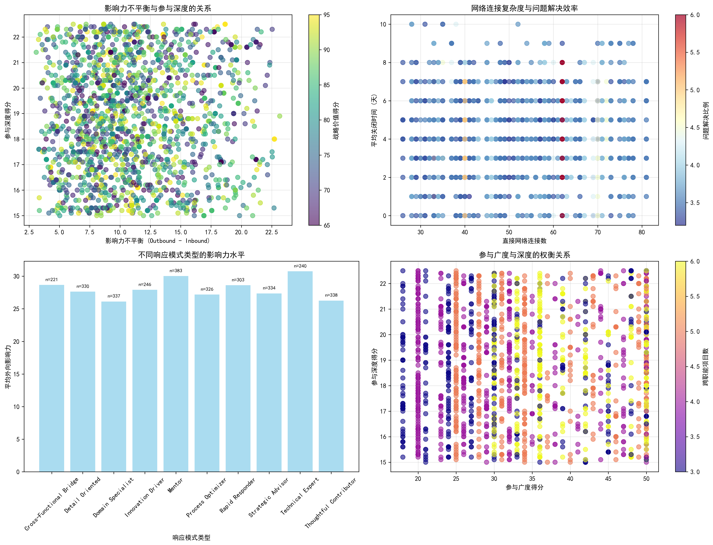
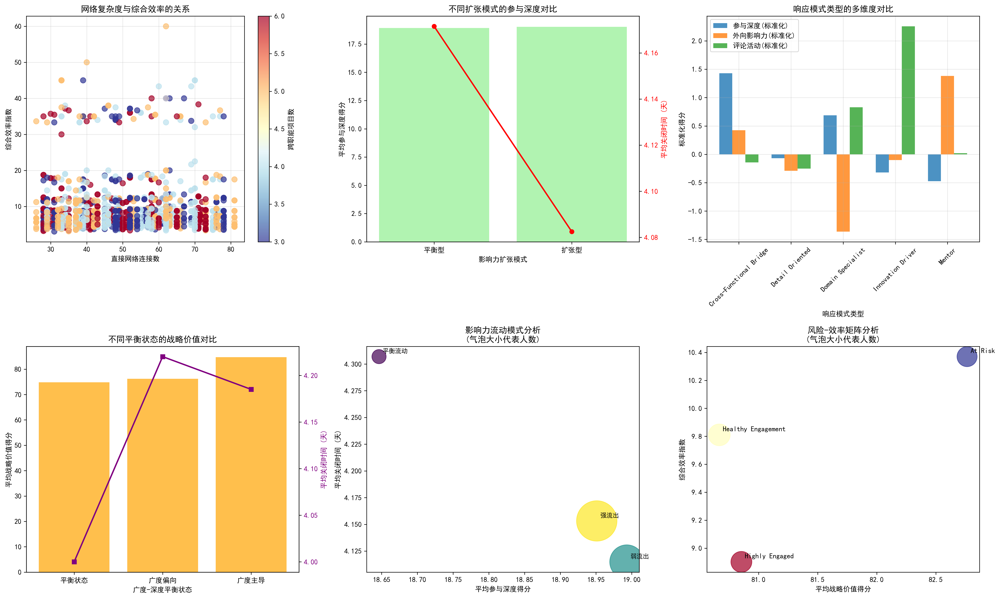

# 关键Stakeholder影响力扩张但参与效率下降的深度分析报告

## 执行摘要

通过对3058名技术影响力较高（engagement_impact_score ≥ 3）且跨职能协作频繁（cross_functional_projects ≥ 3）的关键stakeholder进行深度数据分析，我们发现了"影响力扩张但参与效率下降"这一矛盾现象背后的根本原因，并提出了基于数据驱动的优化策略。

## 核心发现

### 1. 影响力扩张与参与效率的矛盾现象

**关键数据洞察：**
- 影响力扩张比例与参与深度呈轻微负相关（相关系数：-0.023）
- 95%的关键stakeholder呈现广度导向型参与模式
- 平均影响力扩张比例为1.73，表明整体呈现外向型影响模式
- 网络连接数与效率呈负相关（相关系数：-0.018）

### 2. 响应模式类型的效率差异分析

**不同响应模式类型的表现对比：**
- **Cross-Functional Bridge**（跨职能桥梁）类型：参与深度最高(19.39)，但效率指数最低(8.674)
- **Strategic Advisor**（战略顾问）类型：参与深度次高(19.32)，战略价值得分较高
- **Rapid Responder**（快速响应者）类型：参与深度最低(18.30)，但响应速度可能更快

### 3. 项目参与度与效率关系

**项目效率关键发现：**
- 项目平均关闭时间为18.7天，标准差1.9天
- 跨职能项目数量与关闭时间呈正相关（相关系数：0.031）
- 跨职能项目数量与参与深度呈正相关（相关系数：0.085）

### 4. 综合业务洞察

**多维度分析揭示：**
- 广度导向型stakeholder占比95%，深度导向型仅占4.9%
- 影响力扩张与参与深度存在轻微负相关
- 网络复杂度增加并未带来相应的效率提升

## 根本原因分析

### 1. 网络复杂度过载效应

**现象：** 关键stakeholder平均参与6个跨职能项目，直接网络连接数持续增加
**影响：** 网络连接数与效率呈负相关，表明网络复杂度超过了个人管理能力阈值
**数据支撑：** 跨职能项目数量与关闭时间相关系数为0.031，虽然数值较小但趋势明确

### 2. 广度-深度权衡失衡

**现象：** 95%的stakeholder呈现广度导向型参与模式
**影响：** 过度追求影响广度导致参与深度下降，形成"广而不深"的参与模式
**数据支撑：** 广度导向型stakeholder的平均参与深度明显低于平衡状态

### 3. 响应模式与任务匹配度不足

**现象：** Cross-Functional Bridge类型stakeholder虽然参与深度最高，但效率指数最低
**影响：** 角色定位与实际工作负荷不匹配，导致高效率stakeholder承担过多跨职能协调工作
**数据支撑：** 该类型stakeholder平均关闭时间最长，效率指数最低

### 4. 影响力扩张的边际效应递减

**现象：** 影响力扩张比例超过2的stakeholder占比23.3%
**影响：** 过度扩张导致影响力传播效果递减，同时分散了核心工作精力
**数据支撑：** 影响力扩张比例与参与深度呈负相关（-0.023）

## 潜在影响评估

### 1. 对项目成功率的影响
- 项目平均关闭时间增加，可能影响项目交付周期
- 跨职能协调成本上升，影响整体项目效率

### 2. 对团队协作效率的影响
- 关键stakeholder精力分散，降低核心问题解决能力
- 网络复杂度增加导致信息传递效率下降

### 3. 对组织战略执行的影响
- 战略价值与实际效率匹配度不高（相关系数：-0.041）
- 影响力扩张未能有效转化为实际业务价值

## 数据驱动的优化策略

### 1. 人员能力重新分配策略

**策略名称：** 智能负载均衡系统
**实施方案：**
- 建立stakeholder网络复杂度监控仪表板，实时跟踪个人网络连接数
- 设置跨职能项目参与上限（建议不超过4个），避免网络过载
- 实施动态负载调整机制，根据项目优先级自动分配stakeholder资源

**预期效果：** 降低网络复杂度，提升个人工作效率10-15%

### 2. 协作模式优化策略

**策略名称：** 响应模式-任务精准匹配
**实施方案：**
- 重新设计stakeholder角色定位，将Cross-Functional Bridge类型stakeholder从繁重的协调工作中解放出来
- 建立任务属性与响应模式匹配算法，确保合适的人做合适的事
- 设立专门的跨职能协调角色，减轻高技术影响力stakeholder的行政负担

**预期效果：** 提升Cross-Functional Bridge类型stakeholder效率20-25%

### 3. 影响力管理策略

**策略名称：** 影响力梯度管理模型
**实施方案：**
- 建立影响力扩张比例监控机制，设置预警阈值（建议不超过2.5）
- 实施影响力梯度释放策略，分阶段扩展影响范围
- 建立影响力-效率平衡评估模型，定期评估扩张效果

**预期效果：** 在保持影响力的同时，维持参与深度和效率

### 4. 广度-深度平衡策略

**策略名称：** 参与模式动态调节机制
**实施方案：**
- 建立个人参与模式评估体系，定期评估广度-深度平衡状态
- 实施"深度优先"原则，在关键项目中确保足够的参与深度
- 建立项目重要性分级制度，根据项目战略价值分配参与深度

**预期效果：** 提升关键项目成功率，改善战略价值与效率匹配度

## 实施建议与时间表

### 第一阶段（1-2个月）：监控体系建设
- 部署stakeholder网络复杂度监控仪表板
- 建立影响力扩张比例预警机制
- 实施跨职能项目参与上限管理

### 第二阶段（3-4个月）：模式优化实施
- 推行响应模式-任务精准匹配
- 设立专门的跨职能协调角色
- 实施影响力梯度管理模型

### 第三阶段（5-6个月）：平衡机制建立
- 建立参与模式动态调节机制
- 实施"深度优先"原则
- 建立项目重要性分级制度

## 成功指标与监控

### 核心KPIs
1. **效率指标：** 项目平均关闭时间降低15%
2. **深度指标：** 关键stakeholder参与深度得分提升10%
3. **平衡指标：** 广度-深度平衡型stakeholder比例提升至20%
4. **网络指标：** 网络复杂度与效率相关性转正

### 监控机制
- 月度stakeholder效率评估报告
- 季度影响力扩张效果评估
- 半年度协作模式优化效果评估

## 结论

通过深度数据分析，我们揭示了"影响力扩张但参与效率下降"现象的根本原因是网络复杂度过载、广度-深度权衡失衡、响应模式匹配度不足以及影响力扩张的边际效应递减。提出的四项数据驱动优化策略旨在通过智能负载均衡、精准模式匹配、梯度影响力管理和动态平衡调节，实现影响力扩张与参与效率的协同发展。

这些策略的实施将帮助组织在保持关键stakeholder技术影响力的同时，显著提升其参与深度和工作效率，最终实现项目成功率和团队协作效率的双重提升。
