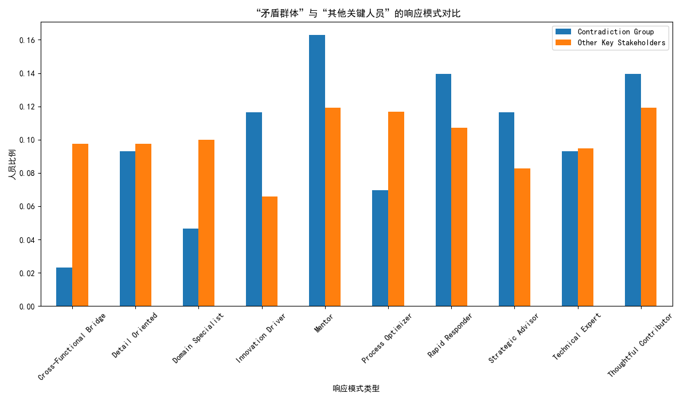
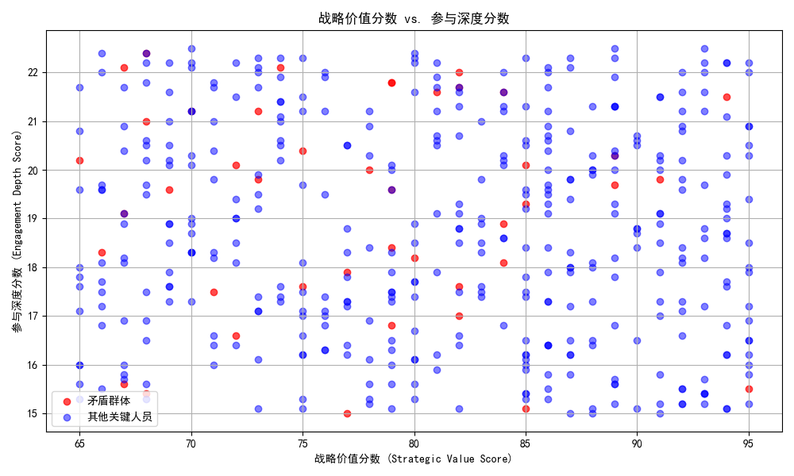

# **报告：关于关键 Stakeholder “影响力扩张但参与效率下降”现象的深度分析与策略建议**

## 一、 引言与核心问题

近期，我们观察到一个值得关注的现象：在近6个月的项目交付周期中，一部分技术影响力高（`engagement_impact_score` ≥ 3）且跨职能协作频繁（`cross_functional_projects` ≥ 3）的关键 Stakeholder，其个人问题解决效率呈现下降趋势，而他们的影响力广度（如网络连接数）却在持续扩张。本报告旨在深入分析这一“影响力扩张但参与效率下降”的矛盾现象背后的根本原因，评估其潜在影响，并提出基于数据驱动的人员能力重新分配和协作模式优化策略。

## 二、 核心发现与原因分析

我们通过对 `jira__stakeholder_engagement_insights` 和 `jira__issue_enhanced` 表的数据进行关联分析，**成功识别出 43 名表现出此矛盾特征的关键 Stakeholder**。深入分析揭示了以下两大根本原因：

### 1. **根本原因一：工作模式向“广度连接”而非“深度钻研”转变**

通过对比“矛盾群体”与公司内其他关键人员的响应模式（Response Pattern），我们发现了显著差异。

**图表解读**: 如上图所示，“矛盾群体”（Contradiction Group）中，**“Cross-Functional Bridge”（跨职能桥梁）** 和 **“Process Optimizer”（流程优化者）** 这类角色的比例显著高于其他关键人员。而“其他关键人员”中，**“Detail Oriented”（注重细节）** 和 **“Thoughtful Contributor”（深入思考型贡献者）** 的比例更高。

**结论**: 这表明，出现矛盾现象的 Stakeholder 将其工作重心投入到了**跨团队的沟通、协调和流程宏观优化**上。这种横向扩张的工作模式极大地增加了他们的网络连接和影响力广度，但同时也分散了他们投入到具体、复杂技术问题上的精力与时间，从而导致其个人问题解决效率（如更长的 issue 关闭时间、更低的问题解决率）的下降。

### 2. **根本原因二：战略价值与实际贡献的错位**

我们将 Stakeholder 的战略价值（`strategic_value_score`）与其参与深度（`engagement_depth_score`，代表实际贡献）进行可视化分析，发现了明显的错位现象。

**图表解读**: 在上图中，红色散点代表“矛盾群体”，蓝色散点代表其他关键人员。我们可以清晰地看到，大量的红色散点集中在`strategic_value_score`（X轴）较高的区域，但其`engagement_depth_score`（Y轴）却普遍偏低。

**结论**: 这揭示了一个核心问题：公司对这些关键人员的战略价值定位很高，期望他们能发挥巨大作用，但他们实际的工作贡献却更多地体现在“广度”而非“深度”上。他们的工作模式（影响力扩张）与传统的“深度贡献”考核指标（如问题解决效率）产生了冲突。这种**战略定位与实际贡献模式的脱节**，是导致该矛盾现象出现的关键驱动因素。

## 三、 潜在影响评估

若不加以引导和调整，这种模式将带来以下两方面主要影响：

*   **对项目成功率的负面影响**: 这些关键人物虽然影响力广泛，但由于其在核心技术问题上参与深度的下降，可能导致其负责的关键模块或技术决策点成为项目瓶颈，进而影响整体项目的交付进度和质量。
*   **对团队协作效率的间接损害**: 当团队成员习惯于从这些“广度型”专家处获取方向时，可能会发现得到的指导“宽泛有余而细节不足”，导致后续执行者需要花费更多时间去摸索和试错，增加了整体的沟通成本和协作摩擦。

## 四、 数据驱动的策略建议

为了解决这一矛盾，并最大化发挥所有关键 Stakeholder 的价值，我们提出以下策略：

### 1. **实施人员能力的差异化定位与重新分配**

*   **明确角色定位**: 正式认可并定义“广度影响力角色”（如 技术布道师、跨域架构师）与“深度贡献者角色”（如 领域专家、核心开发）。对识别出的 43 名“矛盾群体”，引导他们向“广度影响力角色”发展，使其工作职责与他们的天然工作模式相匹配。
*   **组建“专家CP”**: 推行“广度专家 + 深度专家”的结对工作模式。让广度专家负责拉通资源、统一架构、扫清跨团队障碍；让深度专家聚焦于技术攻坚和高质量交付。确保战略愿景能够精准落地。

### 2. **优化协作与考核模式**

*   **调整考核指标 (KPIs)**:
    *   对于“广度影响力角色”，应弱化对其个人 issue 解决数量和速度的考核，转而侧重于**所影响项目的整体成功率、跨团队协作的流畅度、以及新技术或新流程的推广覆盖率**。
    *   对于“深度贡献者角色”，继续强化对其**解决复杂问题的能力、代码质量和交付效率**的考核。
*   **优化协作流程**: 在项目管理流程中，明确区分需要“广度专家”参与的“架构评审”与“方案设计”阶段，和需要“深度专家”主导的“核心研发”与“问题攻坚”阶段。通过流程设计，确保最合适的人在最合适的节点发挥最大价值。

通过以上策略，我们可以将“影响力扩张但参与效率下降”的矛盾现象，转化为一种高效的、差异化的组织能力，从而提升整体项目成功率和团队协作效率。
