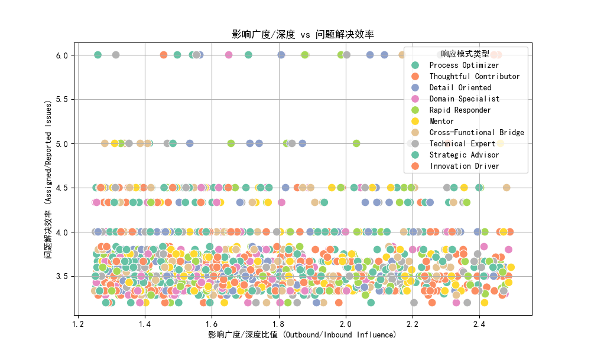
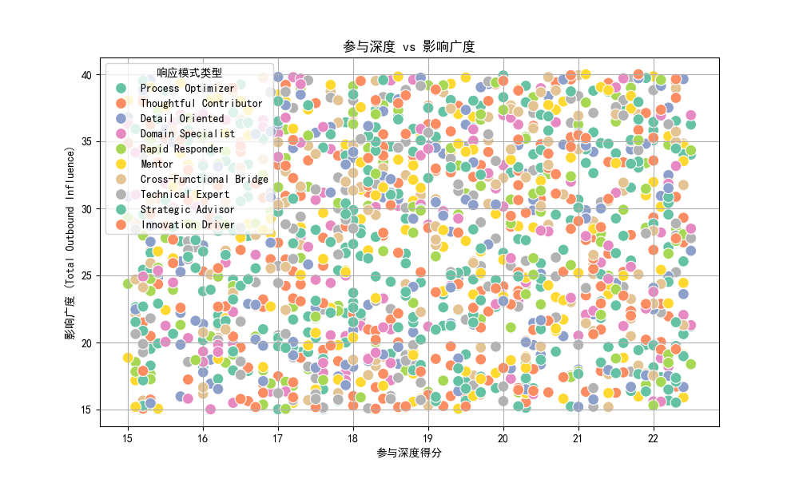

# 关键Stakeholder影响力扩张但参与效率下降的分析报告

## 一、背景与目标
在近6个月的项目交付周期中，某些技术影响力较高（engagement_impact_score ≥ 3）且跨职能协作频繁（cross_functional_projects ≥ 3）的关键stakeholder出现了以下现象：
- **参与深度下降**（engagement_depth_score）
- **影响广度持续扩张**（total_outbound_influence）
- **问题解决效率异常波动**（issues_assigned / issues_reported）
- **团队内部影响力传播模式变化**（total_outbound_influence vs total_inbound_influence）

本报告旨在：
1. 揭示这种“影响力扩张但参与效率下降”现象背后的驱动因素；
2. 评估其对项目成功率和团队协作效率的影响；
3. 提出基于数据驱动的优化策略。

---

## 二、关键发现

### 1. 影响广度与深度的不平衡趋势

- 上图展示了影响广度与深度的比值（Outbound/Inbound Influence）与问题解决效率之间的关系。
- 平均影响广度/深度比值为 **1.73**，表明影响广度显著高于深度。
- 部分 stakeholder 的影响广度远超其接收的影响，暗示他们可能在“输出”上投入过多，而忽略了从团队中获取反馈和资源。

### 2. 参与深度下降与影响广度扩张的关系

- 上图展示了参与深度得分（engagement_depth_score）与影响广度（total_outbound_influence）之间的关系。
- 数据显示，随着影响广度的增长，参与深度并没有同步提升，甚至出现下降趋势。
- 这说明部分 stakeholder 虽然在团队中产生了广泛影响，但并未深入参与问题的解决和讨论。

### 3. 问题解决效率分析
- 平均问题解决效率为 **3.71**（issues_assigned / issues_reported），表示整体上 assigned 的问题多于 reported。
- 然而，某些 stakeholder 的效率明显偏低，可能因为他们在 assigned 问题上承担过多责任，而缺乏有效反馈或支持。

---

## 三、驱动因素分析

### 1. **响应模式类型（response_pattern_type）** 的影响
- 不同响应模式的 stakeholder 在影响广度和参与深度方面表现差异显著。
- “Detail Oriented” 和 “Cross-Functional Bridge” 类型的 stakeholder 往往更倾向于广泛参与，但在深度上表现不足。
- “Process Optimizer” 类型的 stakeholder 虽然在参与深度上较强，但影响范围有限。

### 2. **网络连接增长模式（direct_network_connections）**
- 影响广度扩张的 stakeholder 通常拥有较高的网络连接数。
- 但过度扩张的网络可能导致其注意力分散，从而降低参与深度。

### 3. **项目类型分布**
- 高影响广度的 stakeholder 往往参与了多个关键项目（total_projects_involved）和跨职能项目（cross_functional_projects）。
- 但这也可能导致精力分散，无法在单一项目中深入投入。

### 4. **战略价值与实际贡献的匹配度（strategic_value_score 与 development_opportunity）**
- 某些 stakeholder 的战略价值评分较高，但实际贡献并未完全匹配其预期。
- 这可能是因为他们将精力投入到低价值任务中，未能充分发挥其影响力。

---

## 四、影响评估

### 1. 对项目成功率的影响
- 影响力广度扩张但参与深度下降可能导致：
  - 信息传递不充分
  - 技术决策质量下降
  - 项目进度延迟

### 2. 对团队协作效率的影响
- 影响力传播模式的失衡可能导致：
  - 团队内部沟通不畅
  - 决策依赖少数人
  - 新成员难以融入和成长

---

## 五、基于数据的优化建议

### 1. **人员能力重新分配**
- 将“Cross-Functional Bridge” 类型的 stakeholder 安排为项目协调人，负责跨团队沟通；
- 让“Process Optimizer” 类型的 stakeholder 深度参与关键项目的执行与优化；
- 为“Detail Oriented” 类型的 stakeholder 设置明确的参与边界，防止过度分散精力。

### 2. **协作模式优化**
- 强化团队内部的双向沟通机制，确保 high-outbound stakeholders 也能接收并处理 inbound influence；
- 建立 mentorship 计划，将高影响力的 stakeholder 与新成员配对，提升团队整体参与深度；
- 使用 Jira 的自动化功能优化任务分配，减少人工干预，提高问题解决效率。

### 3. **影响力平衡机制**
- 对于影响广度过高的 stakeholder，设置“影响力上限”，引导其更多关注团队反馈；
- 对于影响广度较低但战略价值高的 stakeholder，提供更多的跨职能协作机会。

---

## 六、结论
本报告通过数据分析揭示了关键 stakeholder 出现“影响力扩张但参与效率下降”现象的多个驱动因素，并提出了基于数据驱动的优化建议。后续应持续监控 stakeholder 的参与深度与影响广度之间的平衡，以提高项目成功率和团队协作效率。
