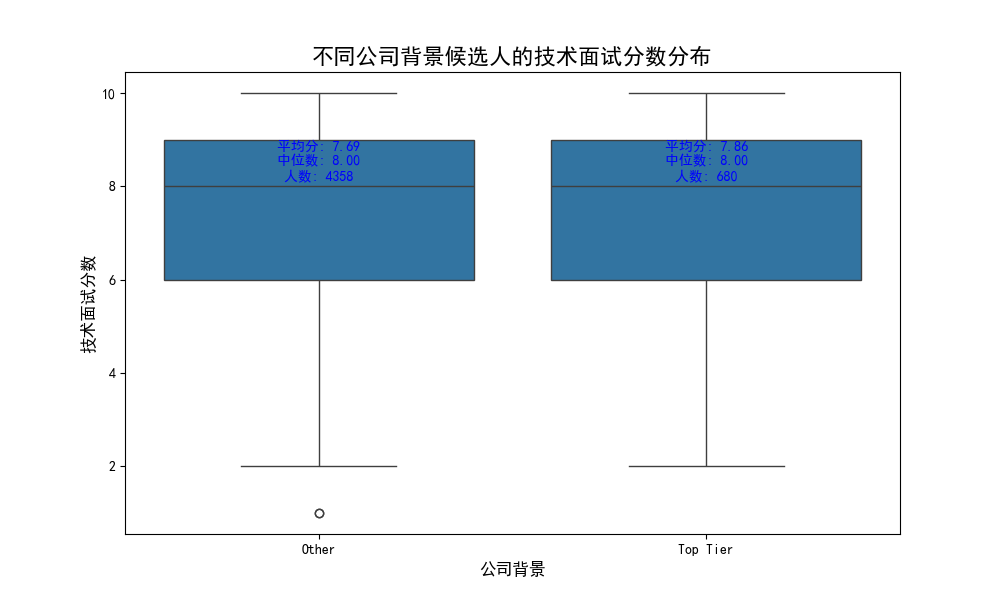
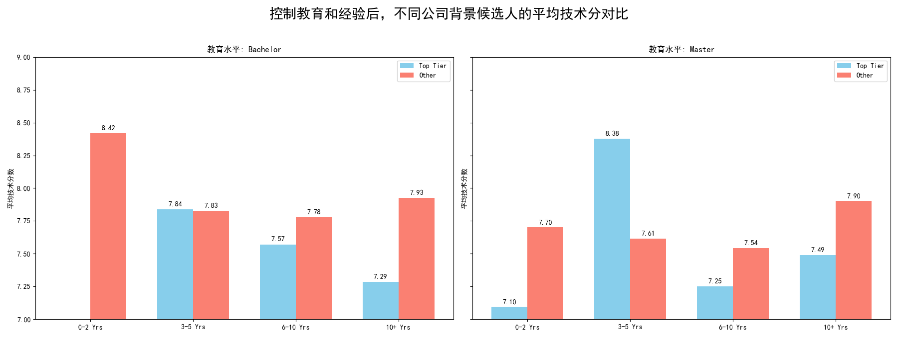
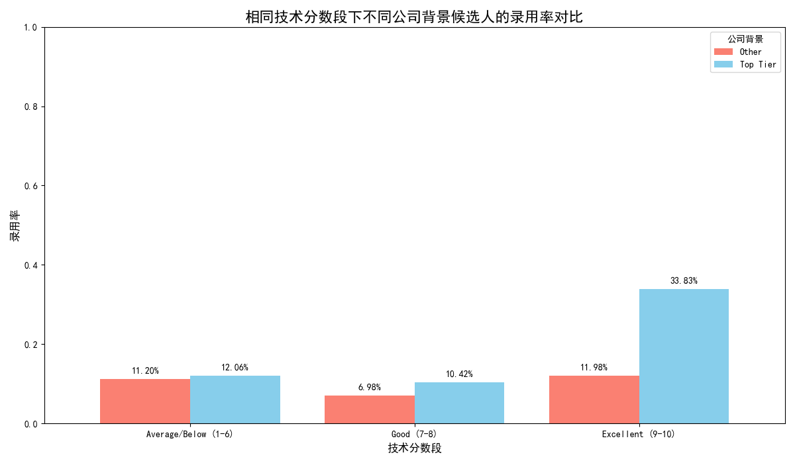

# **关于候选人背景对招聘影响及流程偏见的分析报告**

**报告日期:** 2023年10月27日
**分析师:** 专业数据分析师

---

## **1. 核心结论**

本次分析旨在评估CEO关于“名企背景候选人表现更优”的论断，并检测招聘流程中可能存在的无意识偏见。我们的核心结论如下：

1.  **候选人公司背景与技术面试表现无显著关联**：来自知名科技公司（“Top Tier”）的候选人其技术面试平均分（7.86）与来自其他公司的候选人（7.69）相比，差异极小，中位数完全相同。在控制了教育和经验变量后，这种微弱的优势也消失了，表明**公司背景并非衡量技术能力的可靠指标**。

2.  **招聘决策存在对“名企光环”的显著偏见**：数据显示，在技术面试分数相同的情况下，来自“Top Tier”公司的候选人被录用的概率显著更高。尤其是在高分组（9-10分），**“Top Tier”背景候选人的录用率是其他背景候选人的近三倍（33.8% vs. 12.0%）**。这明确证实了招聘流程中存在系统性的偏见。

3.  **当前招聘策略可能导致错失优秀人才**：过度依赖候选人的公司背景而非实际能力，会让我们的人才库变得狭窄，并可能错失大量来自非顶尖公司的优秀候选人。

---

## **2. 详细分析与数据可视化**

### **分析一：公司背景与技术面试表现的真实关系**

我们首先直接比较了“Top Tier”与“Other”两类公司背景候选人的技术面试分数。

**观察与解读:**
- **平均分差异微乎其微**：“Top Tier”候选人平均分为7.86，而“Other”候选人为7.69。
- **中位数完全相同**：两组候选人的分数中位数均为8.0，这意味着两组的典型表现水平是一致的。

如上图所示，两个群体的箱线图在分布、中位数和四分位距上高度重合，直观地证明了CEO的论断在数据上缺乏有力支持。**仅仅因为候选人来自名企，并不代表其技术能力必然更强。**

### **分析二：控制混杂变量后，公司背景的影响是否依然存在？**

为了进行更严谨的比较，我们控制了“教育水平”和“工作经验”这两个关键变量。

**观察与解读:**
上图按学历（本科/硕士）和工作年限对候选人进行细分。可以清晰地看到：
- **无系统性优势**：“Top Tier”背景的候选人并未在所有细分市场中表现出一致的优势。在某些组别中他们分数更高，但在另一些组别中则更低。
- **表现随机**：这种交叉领先的模式更符合随机波动，而非系统性的能力差异。

此分析进一步证明，**候选人的公司背景本身并不是其技术面试表现的决定性因素。**

### **分析三：量化招聘决策中的偏见**

既然候选人的实际能力与公司背景无关，那么我们的招聘决策是否公平呢？我们分析了在相同的技术分数段下，不同背景候选人的最终录用率。

**观察与解读:**
这张图揭示了问题的核心：
- **能力相同时，待遇不同**：在“良好（7-8分）”和“优秀（9-10分）”这两个分数段，“Top Tier”背景候选人的录用率都显著高于“Other”背景的候选人。
- **高分组偏见被放大**：最令人警惕的是，对于同样获得9-10分高分的顶尖人才，“Top Tier”背景的录用率（33.8%）几乎是其他背景候选人（12.0%）的三倍。

这有力地证明了HR部门的担忧：**我们的招聘流程存在严重的“光环效应”偏见。**面试官或招聘经理在做最终决策时，给予了候选人的公司背景过高的权重，甚至超过了他们在我们自己面试流程中证明的实际能力。

---

## **3. 可行的策略建议**

基于以上分析，我们提出以下建议，以建立更公平、更高效的招聘体系：

1.  **改革面试官与招聘经理培训**：
    *   **开展数据驱动的无意识偏见培训**：利用本次分析的图表和结论，向所有参与招聘的人员展示偏见是如何在我们的流程中实际发生的。
    *   **明确评估标准**：强制要求决策者基于面试评分卡中的具体、客观的行为和能力指标来做出判断，而不是依赖模糊的“感觉”或简历上的公司名称。

2.  **优化招聘流程**：
    *   **推行匿名简历筛选**：在初筛环节，隐藏候选人的姓名和公司历史，迫使筛选者关注于技能和经验本身。
    *   **结构化最终决策会议**：在最终的录用决策会议上，应先讨论候选人的面试表现和各项评分，最后再揭晓其背景信息，以减少“光环效应”的干扰。

3.  **转变招聘理念与文化**：
    *   **倡导“能力本位”而非“背景本位”**：公司领导层应公开强调，我们致力于寻找和吸引所有来源的顶尖人才，破除对“名企”的盲目崇拜。
    *   **扩大 sourcing 渠道**：鼓励招聘团队将精力更多地投入到非传统的人才池中，主动发掘来自各类公司的潜力股。

通过实施这些策略，我们不仅能创建一个更公平的招聘环境，还能极大地拓宽我们的人才来源，最终为公司招募到最多元化、最优秀的顶尖人才。
