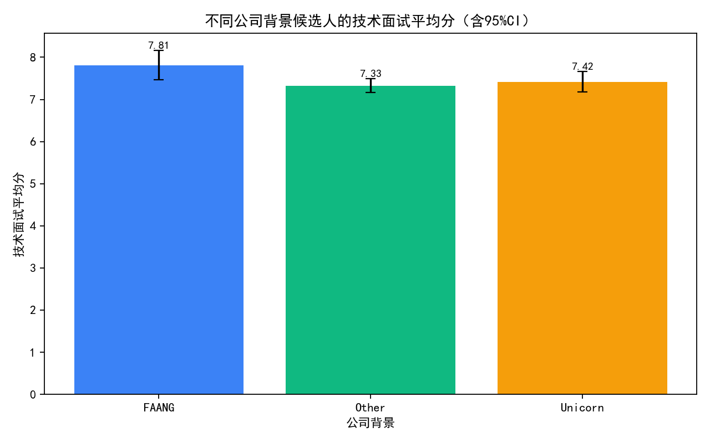
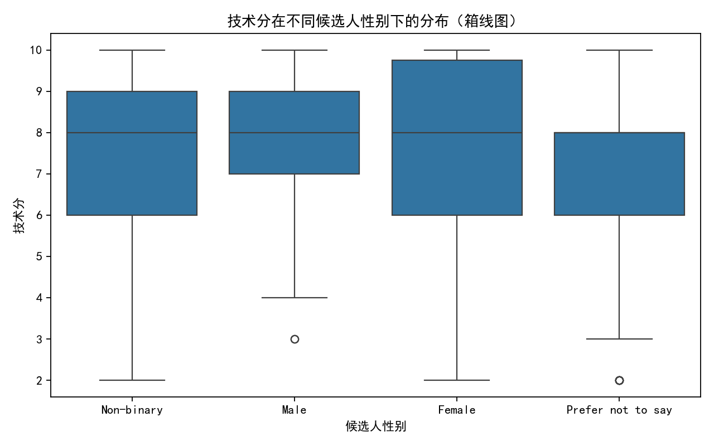
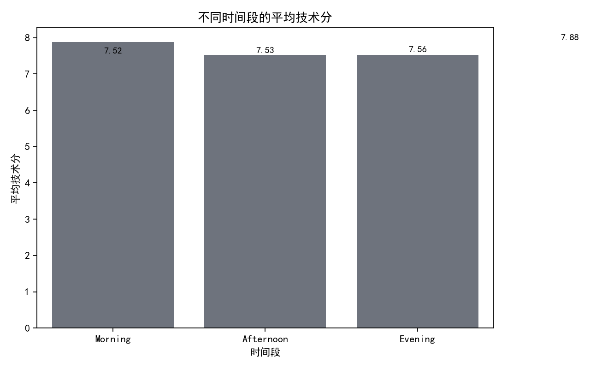
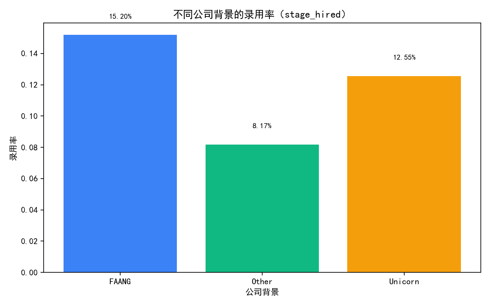

# 招聘数据偏见与表现分析报告

## 概述
CEO提出“来自知名科技公司（FAANG、独角兽）的候选人在技术面试中表现更优秀”，HR担心流程存在无意识偏见。基于Greenhouse增强数据（applications与interviews两表），我们对公司背景、教育水平、工作经验、技术技能等因素与面试表现及录用结果进行评估，并识别面试过程中的潜在偏见。

关键样本说明：
- 技术面试有评分的应用级样本：964个（去重后的application）。
- 技术面试逐条评分记录用于偏见检验的样本：714条。
- 公司背景分布（964个applications）：FAANG 125、Unicorn 239、Other 600。

公司背景口径定义：
- FAANG：Google/Alphabet、Meta/Facebook、Apple、Amazon、Netflix。
- Unicorn：Uber、Airbnb、Stripe、Palantir、ByteDance、Coinbase、Instacart、Robinhood、Revolut、Notion、Spotify、Twilio、Shopify、MongoDB、Snowflake、Databricks、DoorDash、Snap、Pinterest、Atlassian、Cloudflare、Reddit、Brex、Rippling、Scale AI、OpenAI、Figma。
- 其余公司归为Other。

## 1）不同公司背景候选人的技术面试真实表现差异是否显著

- 技术面试平均分（去重后应用级）：
  - FAANG：7.815（n=125，std=1.965）
  - Unicorn：7.421（n=239，std=1.901）
  - Other：7.326（n=600，std=2.057）
- 单因素ANOVA：F=3.065，p=0.0471，Eta²=0.0063（效应量较小）。
  - 结论：公司背景与技术面试分数存在统计学上显著的差异，但效应量很小；FAANG候选人平均分略高于Unicorn和Other。

可视化：不同公司背景的技术面试平均分（含95%CI）



## 2）控制教育背景和工作经验后，公司背景的影响是否依然存在

- 多元线性回归（稳健标准误HC3）：avg_tech_score ~ 公司背景 + 教育层级 + 学校层级 + GPA + 年限/总经验月数 + 技能数量 + GitHub活动 + 领导/创业/开源经历。
  - 公司背景相对基准（FAANG）的系数：
    - Other：-0.451（p=0.044，95%CI [-0.891, -0.012]）
    - Unicorn：-0.355（p=0.136，95%CI [-0.822, 0.112]）
  - 模型解释度：R²=0.017（较低）。
- 结论：在控制教育与工作经验等因素后，FAANG相对Other的优势仍然存在且在统计上显著，但幅度不大；与Unicorn的差异不显著。整体来看，公司背景对技术面试分数的边际影响小于教育与技能因素，且模型整体解释度较低，提示面试表现受更多未观测因素影响（如现场解题表现、题目匹配度等）。

## 3）识别并量化面试过程中可能存在的系统性偏见

对逐条技术面试记录进行OLS回归（稳健SE），控制时间段、难度、面试官属性：technical_score ~ 候选人性别/种族 + 面试官性别 + 面试官经验 + 时间段 + 星期 + 季节 + 难度。

- 候选人性别（基准为Female）：
  - Male：+0.420（p=0.063，边缘显著）
  - Non-binary：+0.521（p=0.011，显著）
  - Prefer not to say：-0.038（p=0.860，不显著）
- 候选人种族（基准为某一类别，模型中显示White为负但不显著）：
  - Hispanic：+0.628（p=0.0059，显著）
  - Native American：+0.579（p=0.0208，显著）
  - Black：+0.455（p=0.138，不显著）
  - Other：+0.347（p=0.152，不显著）
  - White：-0.231（p=0.346，不显著）
- 面试官性别（基准为Female）：
  - Non-binary：-1.087（p=0.0011，显著负向）
  - Male：-0.244（p=0.157，不显著）
- 面试难度与时间：
  - 难度（Hard/Medium相对Easy）系数接近0且不显著。
  - 时间段（Morning/Afternoon/Evening）不显著。
- 模型指标：R²=0.123，N=714。

解读与偏见迹象：
- 某些候选人群体（Non-binary、Hispanic、Native American）在技术分上表现为显著正向差异；这可能来自实际表现、样本构成或题目匹配度，但也需警惕“不同面试官/题目分配”带来的系统性差异。
- Non-binary面试官显著给出更低技术分，提示“面试官打分风格差异”或“面试官—候选人匹配”导致评分分布不同，是重要的过程性偏差来源。
- 时间段与难度未见显著影响，意味着排程和题目标注在平均意义上并非主要偏差来源，但不排除个别面试官或团队的具体分配模式影响。

相关可视化：

- 候选人性别与技术分的分布（箱线图）



- 不同时间段的平均技术分



## 录用结果与公司背景、技术分的关系

- 录用率（stage_hired均值）：FAANG 15.2%，Unicorn 12.6%，Other 8.17%。
- 逻辑回归（录用~公司背景+技术分+教育经验）：
  - Other：-0.648（p=0.051，边界显著，较FAANG录用几率更低）。
  - Unicorn：-0.155（p=0.660，不显著）。
  - avg_tech_score：+0.024（p=0.660，不显著）。
  - Pseudo R²=0.028（模型解释度较低）。
- 结论：在控制技术分与教育经验后，公司背景仍对录用有边界显著影响（FAANG更易被录用，Other较难），技术分对录用的直接影响在整体模型中不显著，提示最终决策可能受公司背景或其他维度影响。

可视化：不同公司背景的录用率



## 诊断性洞察（为什么会这样）

- 面试表现的公司背景差异虽显著但效应小，可能原因：
  - FAANG候选人更熟悉“标准化技术面试范式”（刷题、白板），在评分规则下略占优势。
  - 非公司背景因素（教育层级、技能积累、GitHub活跃度等）仍是表现的主要驱动，模型R²较低说明有大量未观测因素（现场思路清晰度、沟通、题目契合度）。
- 录用环节可能存在“公司背景偏好”：
  - 在控制技术分后，Other相对FAANG录用率仍更低，可能反映决策委员会的“简历光环”效应或风险偏好差异。
- 面试过程的系统性偏差：
  - 面试官性别（Non-binary）与评分显著负相关，提示“打分尺度”或“题目/候选人匹配”问题，需要校准与审视。
  - 候选人性别/种族系数中的显著正向，可能来源于实际表现、题目分配或评估关注点差异，需通过更细致的Rubric与题目版本追踪核查。

## 预测性与规范性建议

若维持当前流程：
- 预测：录用将继续对FAANG背景候选人倾斜，Other背景候选人被录用的相对概率偏低；技术分的边际影响较小，决策更受公司背景等非技术因素影响。

建议（可操作）：
- 面试评分校准与标准化：
  - 引入“评分Rubric校准会”，使用锚定题和示例答案，定期对所有面试官进行打分对齐；对不同面试官的评分分布实施Z-score标准化或“面试官内标准化”，减少主观差异。
  - 对Non-binary面试官评分偏差进行复核（同时避免针对个体的偏见），通过双评与小组评估来中和个人尺度差异。
- 减轻公司背景信息对决策的影响：
  - 在技术面试与综合评审阶段对“公司名称”进行脱敏展示，聚焦实际作品与面试分；引入“盲评”机制（匿名代码作业）。
  - 在最终拟录用评审中，强制呈现“控制变量后的证据”（如技术分、作品质量、项目难度）以抑制简历光环。
- 公平性监控与流程审计：
  - 建立季度“公平性看板”，跟踪各候选人群体与面试官群体的评分差异、通过率与录用率，并进行事后校正（如阈值调优、额外复面）。
  - 对题目库进行版本化与难度回归（记录题目ID与难度），避免不同群体系统性地遭遇更难或更不匹配的题目。
- 技术分与录用的衔接：
  - 提升技术分在最终决策中的权重，明确“低分需强证据才能破例”、并记录破例原因以供事后审计。
  - 引入结构化评审会议模板，要求以“证据条目”议论（代码质量、复杂度、可维护性）而非背景印象。

## 方法与数据说明

- 数据源：SQLite数据库（greenhouse__application_enhanced，greenhouse__interview_enhanced）。
- 技术面试真实表现度量：每个application在Technical Interview阶段的技术分technical_score的平均值（avg_tech_score）。
- 控制变量：教育层级（education_level）、学校层级（university_tier）、GPA、工作经验（years_of_experience、total_experience_months）、技能数量（skill_count）、GitHub仓库与星标数、领导/创业/开源经验。
- 录用度量：stage_hired（均值作比例）与Logit拟合的二元变量（>0视为录用）。
- 偏见检验：逐条面试记录的OLS回归，控制面试官属性与时间、难度。
- 重要提醒：本分析为观察性统计，相关不等于因果；未做数据清洗，仅做类型转换以便计算。

## 绘图Python代码片段（用于复现图片）
```python
import pandas as pd
import numpy as np
import matplotlib.pyplot as plt
import seaborn as sns

plt.rcParams['font.sans-serif'] = ['SimHei']
plt.rcParams['axes.unicode_minus'] = False

# 读取数据（应用级与逐面试记录）
dapp = pd.read_csv('app_level_with_tech_dedup.csv')
interviews = pd.read_csv('technical_interviews.csv')

# 图1：不同公司背景的技术面试平均分（含95%CI）
grp_stats = dapp.groupby('company_background')['avg_tech_score'].agg(['count','mean','std']).reset_index()
means = grp_stats['mean'].values
ns = grp_stats['count'].values
stds = grp_stats['std'].values
cis = 1.96 * stds/np.sqrt(np.where(ns>0, ns, 1))
fig1, ax1 = plt.subplots(figsize=(8,5))
ax1.bar(grp_stats['company_background'], means, yerr=cis, capsize=4, color=['#3b82f6','#10b981','#f59e0b'])
ax1.set_title('不同公司背景候选人的技术面试平均分（含95%CI）')
ax1.set_xlabel('公司背景')
ax1.set_ylabel('技术面试平均分')
fig1.tight_layout(); fig1.savefig('fig_company_tech.png', dpi=160)

# 图2：不同公司背景的录用率（stage_hired）
hire_rate = dapp.groupby('company_background')['stage_hired'].mean().reset_index()
fig2, ax2 = plt.subplots(figsize=(8,5))
ax2.bar(hire_rate['company_background'], hire_rate['stage_hired'], color=['#3b82f6','#10b981','#f59e0b'])
ax2.set_title('不同公司背景的录用率（stage_hired）')
ax2.set_xlabel('公司背景')
ax2.set_ylabel('录用率')
fig2.tight_layout(); fig2.savefig('fig_hire_rates.png', dpi=160)

# 图3：技术分在不同候选人性别下的分布（箱线图）
fig3, ax3 = plt.subplots(figsize=(8,5))
sns.boxplot(data=interviews, x='candidate_gender', y='technical_score', ax=ax3)
ax3.set_title('技术分在不同候选人性别下的分布（箱线图）')
ax3.set_xlabel('候选人性别')
ax3.set_ylabel('技术分')
fig3.tight_layout(); fig3.savefig('fig_bias_gender.png', dpi=160)

# 图4：不同时间段的平均技术分
time_means = interviews.groupby('interview_time_of_day')['technical_score'].mean().reset_index()
fig4, ax4 = plt.subplots(figsize=(8,5))
sns.barplot(data=time_means, x='interview_time_of_day', y='technical_score', ax=ax4, color='#6b7280')
ax4.set_title('不同时间段的平均技术分')
ax4.set_xlabel('时间段')
ax4.set_ylabel('平均技术分')
fig4.tight_layout(); fig4.savefig('fig_timeofday.png', dpi=160)
```

## 结论摘要
- 公司背景与技术分存在显著但很小的差异，FAANG略占优势；在控制教育与经验后，相对Other的优势仍存在但幅度有限。
- 录用环节显示出对FAANG的边界显著偏好，技术分在整体模型中对录用的边际影响不显著，需提升技术证据权重。
- 面试过程中存在“面试官打分风格差异”及候选人群体差异的迹象，应通过评分标准化、双评与盲评机制降低无意识偏见并持续监控公平性指标。
