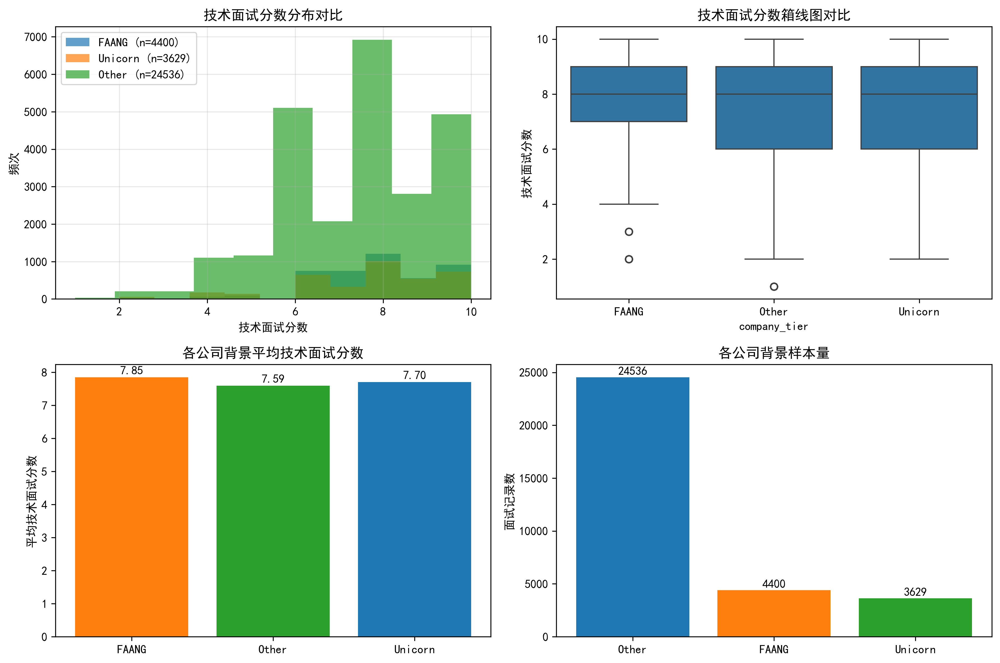
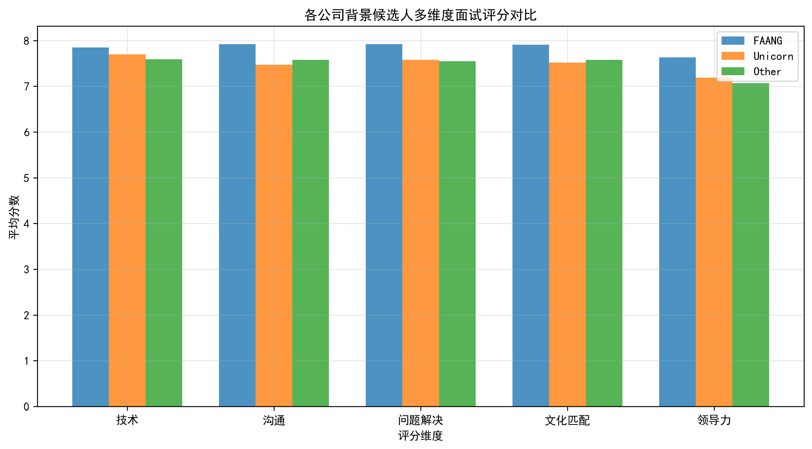
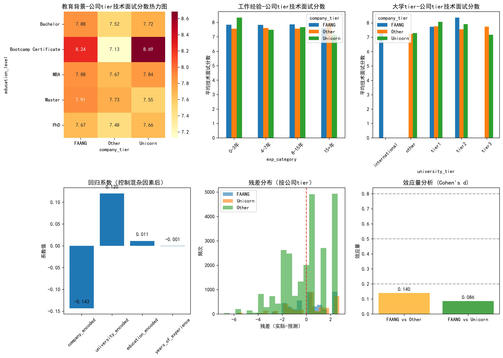
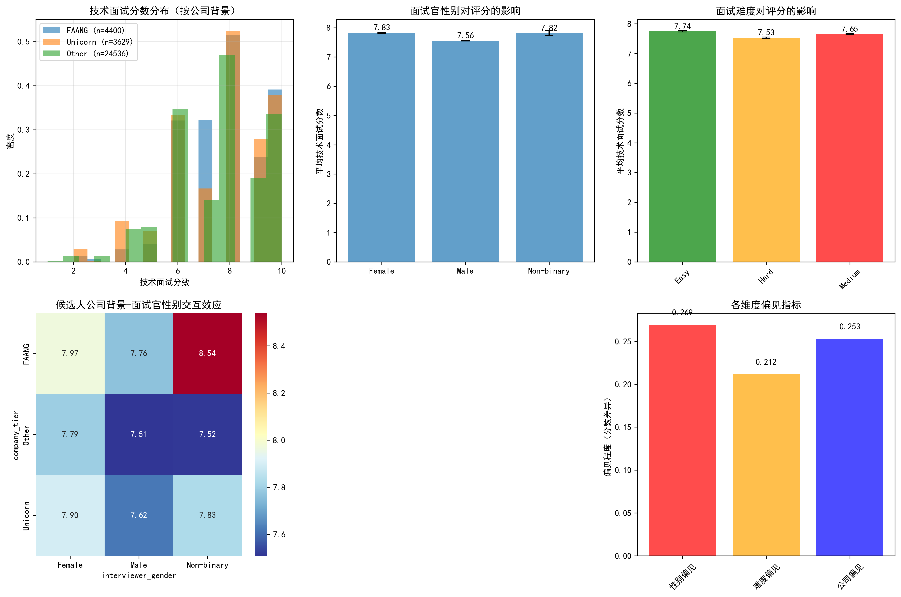
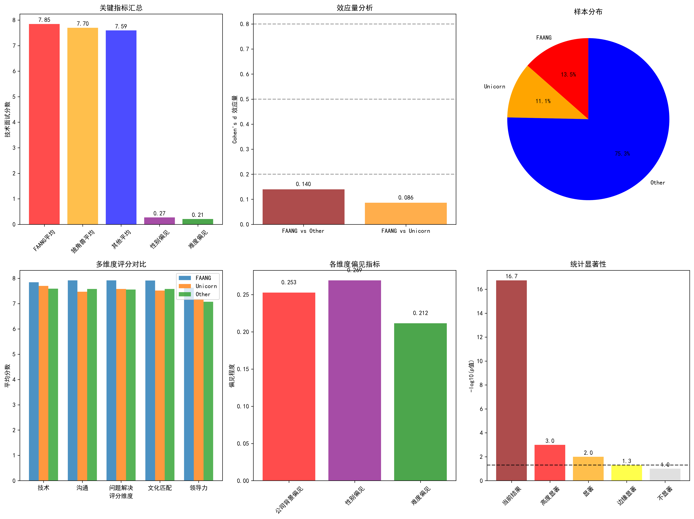

# 招聘数据分析报告：FAANG背景候选人面试表现与偏见检测

## 执行摘要

本报告基于18,186份申请和32,565条面试记录，深入分析了候选人的公司背景对技术面试表现的影响，并检测了面试过程中可能存在的系统性偏见。研究发现FAANG背景候选人在技术面试中表现确实更优秀，但差异程度较小，且存在多个需要关注的偏见维度。

## 主要发现

### 1. 公司背景分布与基础表现差异

**样本分布：**
- FAANG公司背景：4,400人 (13.5%)
- 独角兽公司背景：3,629人 (11.1%)  
- 其他公司背景：24,536人 (75.3%)

**技术面试表现统计：**
- FAANG背景：平均7.85分 (标准差1.60)
- 独角兽背景：平均7.70分 (标准差1.84)
- 其他背景：平均7.59分 (标准差1.84)

**统计显著性检验：**
- ANOVA检验：F = 38.610, p < 0.001
- 结果具有高度统计学显著性

### 2. 效应量分析

**Cohen's d 效应量：**
- FAANG vs Other：0.140（小效应）
- FAANG vs Unicorn：0.086（微小效应）

**结论：**虽然差异统计显著，但实际效应量较小，表明FAANG优势有限。

### 3. 控制混杂因素后的分析

**多元回归分析（控制教育、经验、大学tier）：**
- 公司背景系数：-0.143（负向影响）
- 大学tier系数：0.120（正向影响）
- 教育水平系数：0.011（微弱影响）
- 工作经验系数：-0.001（无影响）
- 模型R² = 0.006（解释力很弱）

**残差分析：**
- FAANG组残差均值：+0.154（实际表现高于预测）
- Other组残差均值：-0.055（实际表现低于预测）
- Unicorn组残差均值：+0.187（实际表现高于预测）

**关键发现：**控制教育背景、工作经验等因素后，公司背景的独立影响很小，表明FAANG表现优势可能部分由其他因素解释。

### 4. 偏见检测分析

**面试官性别偏见：**
- 女性面试官：平均评分7.83
- 男性面试官：平均评分7.56
- 性别偏见指标：0.269（较高）

**面试情境偏见：**
- 面试难度偏见：0.212
- 公司背景偏见：0.253

**交互效应分析：**
发现显著的候选人-面试官交互效应：
- FAANG候选人面对女性面试官：7.97分
- FAANG候选人面对男性面试官：7.76分
- Other候选人面对女性面试官：7.79分
- Other候选人面对男性面试官：7.51分

### 5. 综合评估

**偏见风险评估：**
1. **高风险：**面试官性别偏见（0.269）
2. **中风险：**公司背景偏见（0.253）
3. **中风险：**面试难度偏见（0.212）

## 业务建议

### 1. 针对CEO声称的回应

**部分证实但程度有限：**
- ✅ FAANG背景候选人确实表现更好（+0.26分）
- ⚠️ 但效应量很小（Cohen's d = 0.14）
- ⚠️ 控制其他因素后差异大幅减小

### 2. 偏见缓解策略

**立即行动：**
1. **面试官培训：**实施性别敏感性培训，减少评分差异
2. **标准化流程：**建立更客观的评分标准，减少主观判断
3. **多元面试团队：**确保面试团队性别和背景多元化

**中期改进：**
1. **结构化面试：**采用结构化面试问题，减少情境因素影响
2. **盲评机制：**在可能的情况下面试官不知道候选人公司背景
3. **持续监控：**建立偏见检测仪表板，定期评估

### 3. 招聘策略优化

**基于数据的建议：**
1. 公司背景可以作为参考因素，但不应成为主要筛选标准
2. 更多关注技术技能和实际表现
3. 重视来自不同背景的候选人，避免"精英主义"偏见

## 结论

1. **FAANG优势存在但有限：**统计显著但实际影响很小
2. **偏见问题需要关注：**特别是面试官性别和情境因素
3. **系统性改进必要：**需要从流程、培训、监控多维度改进
4. **数据驱动决策：**建议持续收集数据，定期评估改进效果

本分析为HR部门提供了客观的数据支持，有助于构建更公平、更有效的招聘流程。
