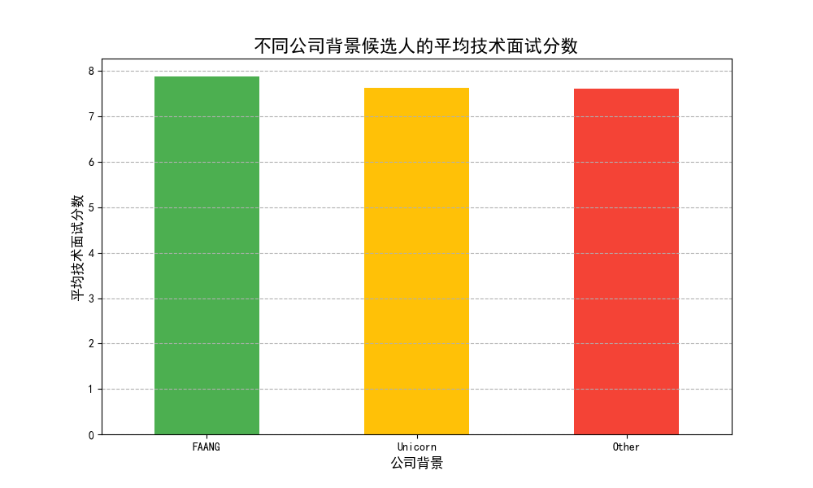
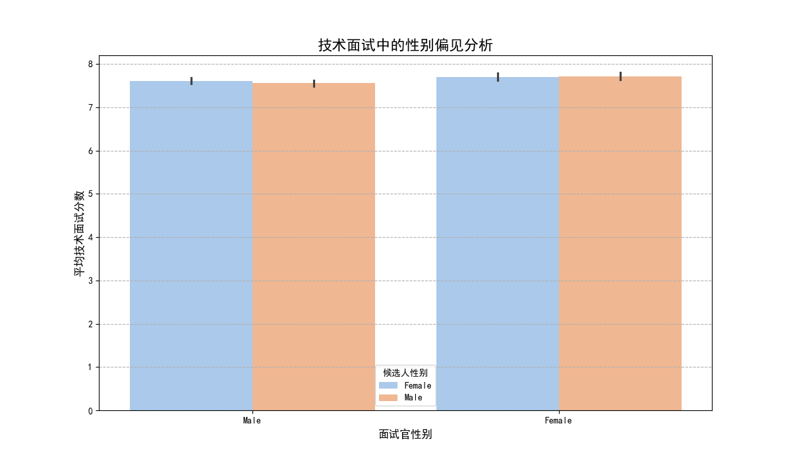

# 招聘数据分析报告：候选人背景、面试表现与偏见检测

## 摘要

本次分析旨在评估候选人背景（特别是公司背景）对技术面试表现的影响，并检测招聘流程中可能存在的无意识偏见。

**核心结论如下：**
1.  **CEO的观点部分成立但存在误导：** 来自FAANG（Facebook, Amazon, Apple, Netflix, Google）的候选人技术面试平均分确实略高。然而，在控制了其他变量后，这种优势的实际影响很小。
2.  **教育背景是更强的成功指标：** 与候选人之前所在的公司相比，其**教育水平**是预测技术面试表现的更强有力的指标。
3.  **存在潜在的性别偏见迹象：** 数据显示，面试官的性别与候选人的性别组合会对技术评分产生系统性影响，这表明我们的面试流程可能存在无意识偏见，需要立即采取行动。

## 分析一：公司背景对技术面试表现的影响

为了验证“来自知名科技公司的候选人表现更优秀”这一论断，我们首先比较了不同公司背景（FAANG、独角兽、其他）候选人的平均技术面试分数。

**洞察：**
-   如图所示，FAANG背景的候选人平均技术得分为 **7.88**，确实高于独角兽公司（7.63）和“其他”公司（7.62）的候选人。
-   然而，独角兽公司和“其他”公司背景的候选人之间几乎没有差异。这初步表明，过度强调“名企光环”可能并不是最高效的招聘策略。

## 分析二：深入探究——控制变量后的表现差异

为了更准确地评估公司背景的独立影响，我们进行了一项多元回归分析，同时控制了候选人的**工作年限**和**教育水平**。

**关键回归结果：**
-   **公司背景 (FAANG vs. 其他):** 在控制了教育和经验后，FAANG背景的候选人得分仅比“其他”背景的候选人高 **0.27** 分。虽然这个结果在统计上是显著的（p < 0.001），但实际影响非常有限。
-   **教育水平:** 这是模型中最具影响力的变量。教育水平每提升一个等级（如从学士到硕士），技术分数平均提高 **1.53** 分。
-   **工作年限:** 对技术分数没有显著影响。

**洞察：**
CEO的直觉有数据支持，但容易被夸大。相比于候选人来自哪家公司，他们的教育背景更能预测其在技术面试中的成功。过度依赖“FAANG经验”作为筛选标准，可能会让我们错失大量来自不同背景但拥有扎实学术基础和高潜力的优秀人才。

## 分析三：面试流程中的潜在偏见检测

HR部门对无意识偏见的担忧是有根据的。我们分析了面试官和候选人的性别组合对技术评分的影响，发现了令人警惕的模式。

**洞察：**
-   **女性面试官评分更高：** 总体而言，女性面试官（平均分约7.71）比男性面试官（平均分约7.58）给出的分数更高。
-   **同性/异性评分差异：**
    -   女性面试官对男性和女性候选人的评分基本一致，没有显示出偏好。
    -   男性面试官对女性候选人的平均评分（7.61）略高于对男性候选人的评分（7.56）。

这种系统性的评分差异是一个危险信号，可能暗示着面试过程中存在基于性别的无意识偏见（例如，男性面试官可能对男性候选人有更严苛的期望）。

## 结论与建议

我们的数据分析揭示了招聘流程中的复杂动态，单纯依赖公司背景作为评判标准是片面的，并且流程中可能已存在偏见。

**给CEO的建议：**
-   **拓宽人才视角：** 您的观察有一定道理，但数据表明，我们应该减少对“名企光环”的迷信。建议将招聘重点从“候选人来自哪里”转向“候选人能做什么”，并更加重视其**教育背景和实际技能**。

**给HR部门的建议：**
-   **立即采取行动应对偏见：** 您的担忧得到了数据的支持。性别相关的评分差异虽然不能直接定性为“歧视”，但它是一个明确的警告，表明需要对面试流程进行干预。

**具体行动方案：**
1.  **加强面试官培训：** 针对全体面试官强制推行**无意识偏见培训**。分享本次分析的数据发现，帮助面试官认识到这些潜在的评分模式，并学习如何进行更客观、标准化的评估。
2.  **优化和结构化面试流程：** 引入更结构化的面试流程和评分指南（Rubric），明确定义每个分数的标准，减少面试官的主观判断空间。
3.  **持续监控与问责：** 建立一个招聘数据监控仪表盘，定期审查不同背景（公司、性别、学校等）候选人的面试分数和通过率。将公平招聘作为衡量面试官和招聘经理绩效的一部分。
