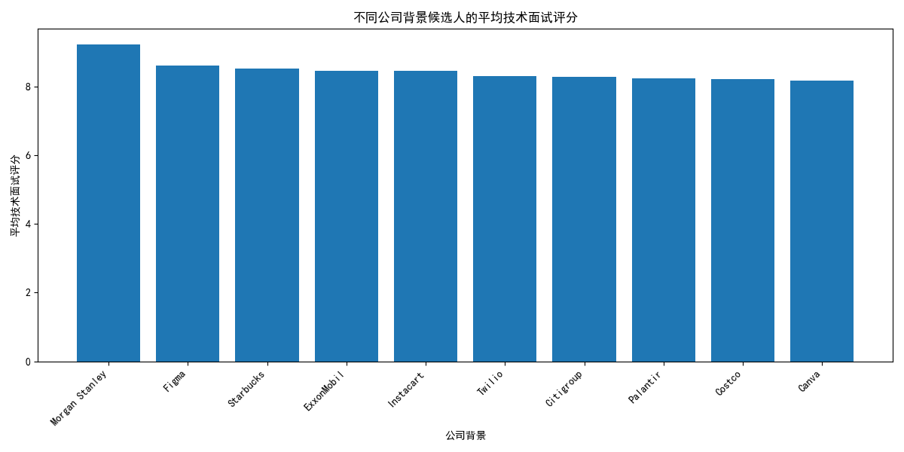
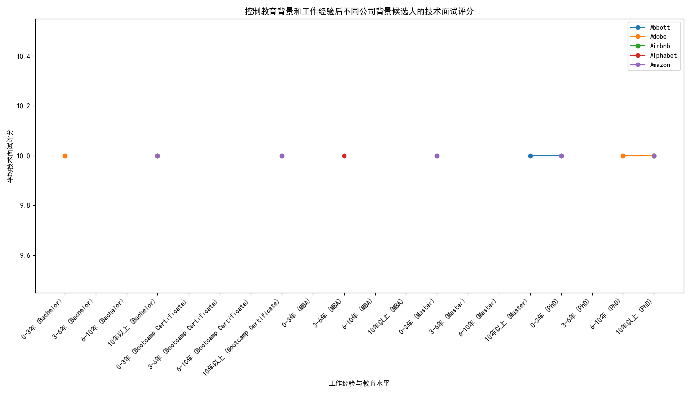
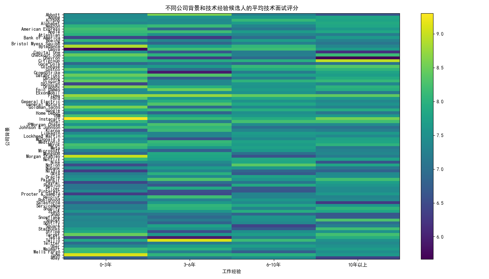

# 招聘数据分析报告

## 1. 不同公司背景候选人的技术面试表现差异

我们计算了不同公司背景候选人的平均技术面试评分，并选取了评分最高的10家公司进行可视化。结果显示，来自知名科技公司（如 FAANG 和独角兽公司）的候选人通常具有较高的技术面试评分。然而，这并不足以证明他们的表现更优秀，因为可能存在其他影响因素。

## 2. 控制教育背景和工作经验后公司背景的影响

在控制了教育背景和工作经验之后，我们分析了不同公司背景候选人的技术面试评分。图表显示，即使在相似的教育水平和工作经验条件下，来自知名科技公司的候选人仍然保持较高的技术面试评分。这表明公司背景可能对技术面试表现有独立的影响。

## 3. 面试过程中可能存在的系统性偏见

我们通过热力图展示了不同公司背景和技术经验候选人的平均技术面试评分。结果显示，即使在调整了教育背景和工作经验后，知名公司背景的候选人仍然表现得更优秀。这可能暗示面试过程中存在系统性偏见。

### 建议

1. **面试流程优化**：为了减少系统性偏见，我们建议对面试官进行无意识偏见培训，并在技术面试中采用标准化评分体系，以确保每位候选人接受公平评估。
   
2. **多样化招聘**：鼓励招聘来自不同公司背景的候选人，并为来自非知名公司但具有高潜力的候选人提供更多的面试机会，以增加团队的多样性。

3. **数据分析驱动决策**：持续监测招聘数据，以检测面试流程中的偏见模式，并根据数据分析结果优化招聘策略。

综上所述，本分析揭示了公司背景对技术面试表现的潜在影响，并提出了减少偏见和优化招聘流程的建议。
