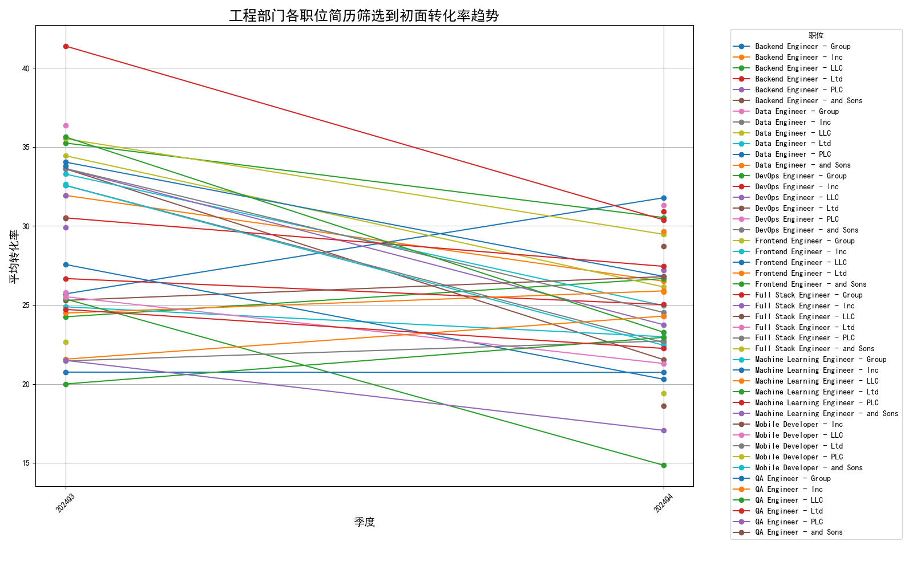
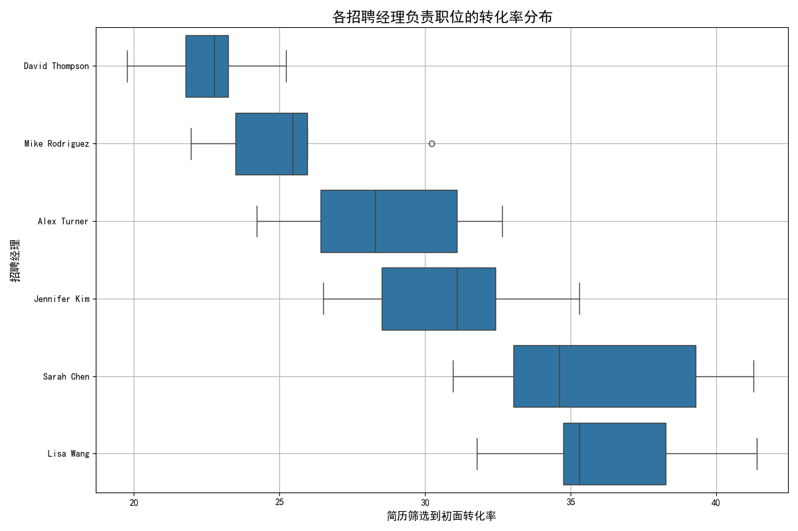

# 工程部门简历到初面转化率下降问题分析报告

## 核心结论

过去6个月，公司工程部门的简历到初面转化率从35%显著下降至22%。经分析，此次下降并非普遍性问题，而是**主要集中在特定职位，并与部分招聘经理的表现密切相关**。

- **问题职位**: **机器学习工程师 (Machine Learning Engineer)** 和 **后端工程师 (Backend Engineer)** 是转化率下降最严重的职位，部分岗位的转化率下降超过10个百分点。
- **人员问题**:
    1.  **系统性低效**: 招聘经理 **David Thompson** 负责的职位转化率一直处于团队最低水平 (平均22.6%)，属于系统性问题。
    2.  **近期表现下滑**: 历史表现优异的招聘经理 **Sarah Chen** 和 **Lisa Wang**，其负责的职位在近期出现了最急剧的转化率下滑，是导致部门整体数据下降的主要增量因素。
- **其他因素**: 招聘专员或寻源顾问的数量与转化率无明显相关性，并非问题根源。

---

## 1. 整体趋势：工程部门各职位转化率普遍承压

我们首先分析了工程部门下所有职位的转化率变化趋势。如下图所示，大部分职位的转化率在过去几个季度中都呈现出不同程度的下降趋势，表明整个部门都面临着招聘市场竞争加剧或内部流程效率下降的压力。

从图中可以清晰地看到，多条代表不同职位的折线向下倾斜。其中，**`Machine Learning Engineer`** 和 **`Backend Engineer`** 相关职位的下降尤为突出，是我们需要重点关注的对象。

---

## 2. 根源分析：招聘经理表现差异是关键驱动因素

为了探究转化率下降的根本原因，我们进一步分析了招聘经理与转化率之间的关系。分析结果揭示了招聘经理间的表现存在巨大差异。

上图（箱形图）直观地展示了不同招聘经理负责的所有职位的转化率分布情况。结合数据分析，我们发现两个关键问题点：

### 2.1 系统性转化率偏低：David Thompson

- **数据表现**: David Thompson 负责的职位平均转化率仅为 **22.6%**，在所有工程招聘经理中排名垫底，远低于团队平均水平。
- **问题定性**: 他的问题并非近期才出现，而是一贯表现。箱形图显示，其负责职位的转化率中位数和上限均处于最低水平。这表明他在简历筛选、职位要求定义或初步沟通环节可能存在系统性的问题。

### 2.2 近期转化率急剧下滑：Sarah Chen & Lisa Wang

- **数据表现**: Sarah Chen (平均35.8%) 和 Lisa Wang (平均36.3%) 是团队中历史平均转化率最高的招聘经理。然而，她们负责的职位也是近期转化率**下降幅度最大**的，分别下降了**6.5**和**5.9**个百分点。
- **问题定性**: 她们是导致部门整体转化率从35%下降到22%的主要“贡献者”。问题可能不在于她们的能力，而在于她们所负责的核心职位（如机器学习、后端）近期在市场上遇到了新的挑战，或者内部的招聘标准与流程发生了变化。

---

## 3. 建议与后续步骤

针对以上分析，我们提出以下具体、可行的建议，以期扭转工程部门招聘转化率的下降趋势：

1.  **专项辅导 David Thompson**:
    - **负责人**: 人力资源业务伙伴 (HRBP) / 招聘总监
    - **措施**: 立即与 David Thompson 进行一对一沟通，复盘他负责的所有职位的招聘流程。重点审查**职位描述（JD）是否清晰且有吸引力**、**简历筛选标准是否过于严苛或模糊**。必要时提供招聘技巧培训或安排与高绩效经理的跟岗学习。

2.  **深入访谈 Sarah Chen 与 Lisa Wang**:
    - **负责人**: 工程部门负责人 / HRBP
    - **措施**: 与 Sarah Chen 和 Lisa Wang 进行深入访谈，全面了解她们负责的**机器学习**和**后端**工程师岗位近期面临的挑战。关键问题包括：
        - 市场上的竞争对手是否提高了薪酬标准？
        - 我们设定的职位要求是否高于市场平均水平？
        - 当前的招聘流程（如笔试、在线测试）是否过于冗长，导致候选人放弃？

3.  **全面审查高降幅职位**:
    - **负责人**: 招聘团队与工程部门技术负责人
    - **措施**: 立即启动对“机器学习工程师”和“后端工程师”这两个职位的全面审查。将我们的职位要求、薪酬福利包与市场上的同类职位进行对标分析，确保我们的岗位具有竞争力。

4.  **建立最佳实践分享机制**:
    - **负责人**: 招聘总监
    - **措施**: 组织定期的招聘经验分享会。邀请 Sarah Chen 和 Lisa Wang 分享她们过去维持高转化率的成功经验，同时也为 David Thompson 等人提供一个正式的学习和改进平台，促进团队整体能力的提升。
