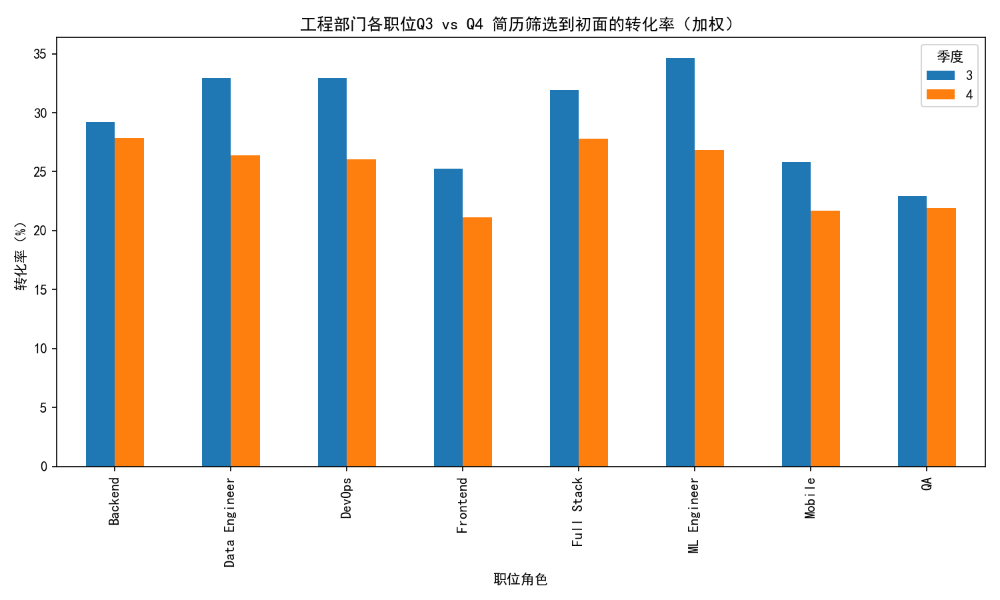
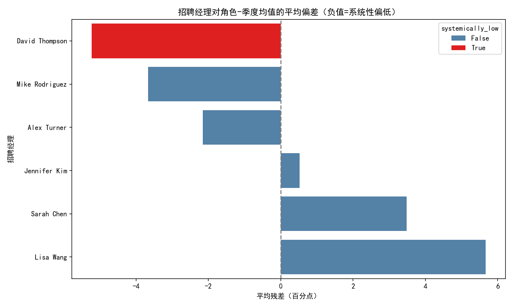
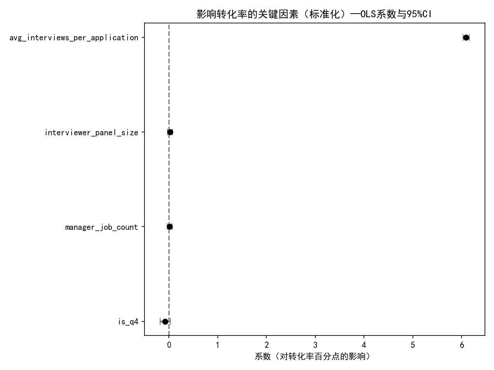
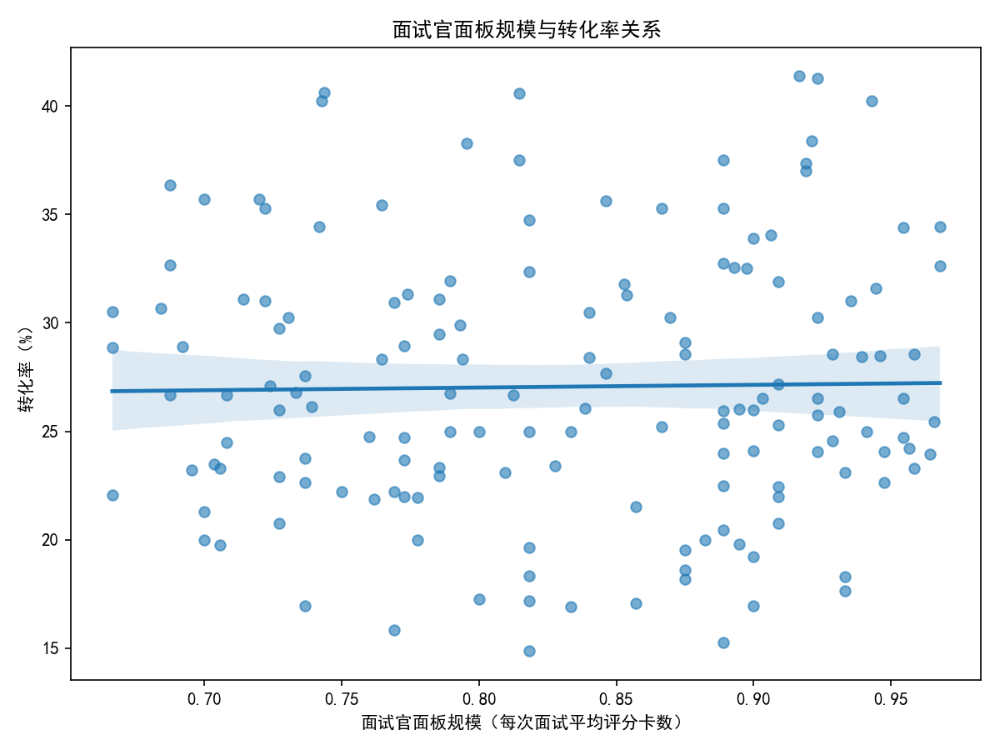

# 工程部门“简历筛选→初面”转化率下滑诊断（Q3→Q4，2024）

> 目标：识别工程部门哪些具体职位的转化率下降最严重；结合招聘经理和面试官配置，判断是否存在系统性偏低的招聘经理；量化面试官数量、招聘经理经验等因素对转化率的影响，并提出改进建议。

## 数据与口径
- 数据源：SQLite 数据库 dacomp-066.sqlite
  - greenhouse__recruitment_performance（季度级绩效指标，含 interview_rate = 简历筛选到初面转化率）
  - greenhouse__job_enhanced（岗位维度增强信息，含部门、招聘经理、面试官/评分卡统计等）
- 分析范围：2024年Q3、Q4；部门=Engineering 为主，并与 Marketing 做对比校准。
- 关键口径：转化率均用百分比数值（如 34.5 表示 34.5%）。

为保证中文绘图，代码中包含如下配置：
```python
plt.rcParams['font.sans-serif'] = ['SimHei']
plt.rcParams['axes.unicode_minus'] = False
```

---

## 1. 总体对比：工程 vs 市场
- 工程部门（加权，按申请量加权）：
  - Q3：29.56%
  - Q4：25.09%
  - 变动：-4.47 个百分点（明显下滑）
- 市场部门（加权）：
  - Q3：53.04%
  - Q4：53.56%
  - 变动：+0.52 个百分点（基本持平）

解读：工程部门转化率在过去两个季度出现明显下滑，而市场部门保持稳定，表明问题集中在工程端的岗位/流程上。

---

## 2. 哪些工程职位降幅最大？
使用岗位标题提取角色（Frontend、Backend、Data Engineer、DevOps、ML Engineer、QA、Mobile、Full Stack），计算各角色的“加权转化率”（按申请量加权）。

- Q3→Q4 加权转化率变化（百分点）：
  - ML Engineer：34.63% → 26.84%，-7.78pp（最大降幅）
  - DevOps：32.92% → 26.05%，-6.87pp
  - Data Engineer：32.92% → 26.38%，-6.54pp
  - Frontend：25.28% → 21.12%，-4.16pp
  - Full Stack：31.94% → 27.81%，-4.13pp
  - Mobile：25.79% → 21.70%，-4.09pp
  - Backend：29.20% → 27.86%，-1.34pp（相对稳定）
  - QA：22.91% → 21.93%，-0.98pp（相对稳定）

图示（各职位Q3 vs Q4 加权转化率）：



诊断要点：
- 下滑集中在“ML Engineer / DevOps / Data Engineer”，且 Data Engineer 申请量在Q4还略有上升（1227→1285），放大了对整体的负面影响。
- Backend 与 QA 基本稳定，说明下滑并非全行业务一刀切，而是角色结构性问题。

---

## 3. 是否存在系统性偏低的招聘经理？
方法：对每个岗位-季度样本，计算相对于“同角色-同季度加权均值”的残差（interview_rate – role_q_mean），再对招聘经理求平均残差，并以阈值判断“系统性偏低”（平均残差 ≤ -5pp 且样本数≥3）。

结果摘要：
- David Thompson：平均残差 -5.23pp，样本量 25，系统性偏低=True（显著落后于角色-季度基准）
- 次之（未达系统性阈值）：
  - Mike Rodriguez：-3.67pp（n=27）
  - Alex Turner：-2.16pp（n=24）
- 表现更优的经理：
  - Lisa Wang：+5.67pp（n=28）
  - Sarah Chen：+3.48pp（n=23）

图示（招聘经理对角色-季度均值的平均偏差）：



结论：存在系统性偏低的招聘经理（David Thompson）。对其负责的岗位进行流程审计与辅导，有望回收约 5 个百分点的转化率缺口（相对同角色同季度的基线）。

---

## 4. 面试官配置、招聘经理“经验”等因素对转化率的影响（回归定量）
建模口径：OLS 回归（因变量=interview_rate；自变量含：Q4虚拟变量、角色dummy、面试官面板规模、平均每申请的面试次数、招聘经理经验代理）。
- 面试官数量代理：每次面试平均评分卡数（interviewer_panel_size），近似代表单次面试参与的评审人数。
- 招聘经理经验代理：该经理负责的岗位数（manager_job_count）。
- 控制：角色虚拟变量，季度虚拟变量（is_q4）。

关键系数与显著性（标准化解释，系数单位≈百分点变化/1个标准差）：
- 平均每申请的面试次数：+6.09pp（95%CI：+6.03, +6.16），显著正相关
- 面试官面板规模（评分卡/面试）：+0.02pp（95%CI 包含0），不显著
- 招聘经理经验代理（岗位数）：+0.01pp（95%CI 包含0），不显著
- Q4虚拟变量：-0.07pp（95%CI 包含0），不显著

图示（关键变量系数与95%CI）：



额外关系图（散点+回归线）：



解读与启示：
- 最具影响的是“平均每申请的面试次数”（avg_interviews_per_application），其提高伴随更高的筛选→初面转化率。这可能反映：
  1) 流程端对候选人更积极地安排初面（更宽松的初筛阈值/更强的排期能力），带来更高转化；
  2) 同时存在反向因果：对更合适的候选池，本就更愿意给出面试机会。
  建议以实验化方式验证，避免简单因果推断。
- 面试官面板规模与经理“经验代理”在本数据中不显著，说明“拉更多面试官参与单次面试”或“经理经手岗位数量更大”并不能直接解释转化率差异。
- is_q4在控制其它因素后不显著，提示“季度本身的季节性”并非主因；下滑更可能来自角色结构变化与角色内流程/口径变化（见第2节）。

---

## 5. 归因总结（What & Why）
- What：工程部门整体转化率 Q3→Q4 下滑 4.47pp；市场部基本稳定。
- Where：下滑集中在 ML Engineer、DevOps、Data Engineer 三类角色（降幅分别为 -7.78pp、-6.87pp、-6.54pp）。
- Who：存在系统性偏低的招聘经理（David Thompson，-5.23pp vs 角色-季度基线）。
- Why：
  - 角色结构性与角色内的流程口径变化可能是主因（is_q4不显著）；
  - 面试官“面板规模”与经理“经验代理”并非主要解释变量；
  - “平均每申请的面试次数”强相关，提示初筛阈值/排期能力对转化率的关键作用。

---

## 6. 建议（Do What）
针对角色与经理差异，提出分层策略，以诊断性试验为主：

A. 针对降幅最大的角色（ML/DevOps/Data Eng）
- 调整初筛口径与JD：
  - 放宽非核心“必选项”（如特定框架年限、特定云厂商经验），转为“加分项”；
  - 优化JD以减少过度筛选信号（避免“全能型”要求），明确“必须/加分”清单。
- 提升初面排期能力：
  - 在需求高峰期设立“快速初筛”日或批量初面（10—15分钟）机制；
  - 结合回归结果，试点提升 avg_interviews_per_application（例如每100份申请至少触达、邀约并安排X%的初面），以 A/B 测试评估对转化与后续面试质量的净影响。
- 渠道与人才池扩展：
  - 针对ML/DevOps/Data Eng，补充高校/训练营应届、开源贡献者、细分社群等渠道；
  - 引入技能测评/作业替代部分简历筛选，降低“简历好但不匹配关键词”的漏斗损失。

B. 招聘经理定向赋能与治理
- 对 David Thompson 进行专项复盘：
  - 审视其初筛标准与Rubric，复用表现优异经理（如 Lisa Wang）的评分范式与正例库；
  - 建立“影子面试/互评”与“周度校准会”，对边界样本进行交叉校准；
  - 设立阶段性KPI：相对同角色-季度的残差提升目标（例如从-5pp收敛至>-1pp）。

C. 面试官/流程配置
- 面试官“面板规模”不显著，优先优化“速度与一致性”而非“人数”：
  - 统一初面Checklist与通过标准，减少“口径不一”导致的冻结；
  - 对评分卡进行结构化改版，缩短初面时长，提高单位时间处理量。

D. 监控与实验
- 建立按“角色×季度/月份”级别的加权转化率监控，周报跟踪；
- 对“提高初面排期比例”的策略进行灰度：设置控制组与试验组，观察简历→初面、初面→复试、总体Hire Rate 的联动影响，确保质量与效率的平衡；
- 对系统性偏低经理，跟踪残差回归至0附近的速度，作为辅导成效指标。

---

## 7. 附：关键输出文件
- 角色Q3/Q4加权转化率图：engineering_role_drop.png
- 招聘经理相对角色均值偏差图：manager_residuals.png
- 回归关键系数图：regression_coeffs.png
- 面试官面板规模与转化率关系图：panel_vs_rate.png
- CSV明细：
  - role_quarter_weighted_rates.csv（角色×季度加权转化率与申请量）
  - manager_residuals_stats.csv（经理平均残差、样本量与标注）
  - engineering_quarter_rates.csv（工程整体加权转化率）
  - marketing_quarter_rates.csv（市场整体加权转化率）

---

## 方法说明与局限
- 本分析未进行数据清洗，仅做必要的数值化与派生变量计算；
- “面试官数量”“招聘经理经验”为代理变量（评分卡/面试 ≈ 面试参与人数；经手岗位数 ≈ 经验年限），不排除测量误差；
- 回归为相关性分析，存在潜在内生性（如更愿意安排初面→avg_interviews_per_application更高），需通过A/B实验验证因果。

如需，我们可以进一步：
- 做“角色内分层”更细化的队列（如不同经验段/技术栈）以定位更精确的口径；
- 结合来源渠道、JD变更日志、SLA等运营数据，做更完备的多变量归因。
