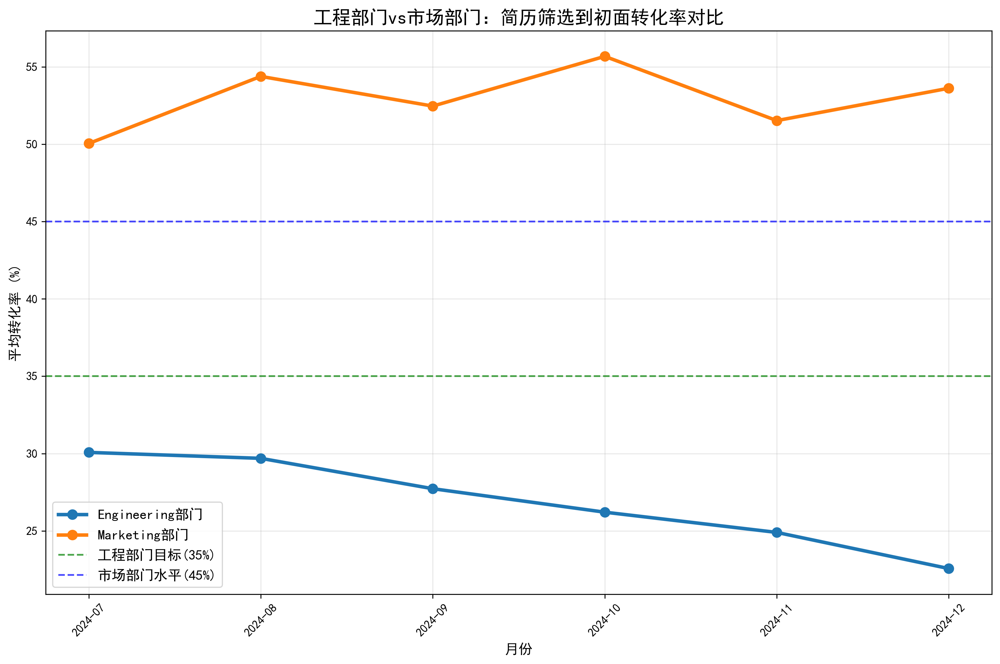
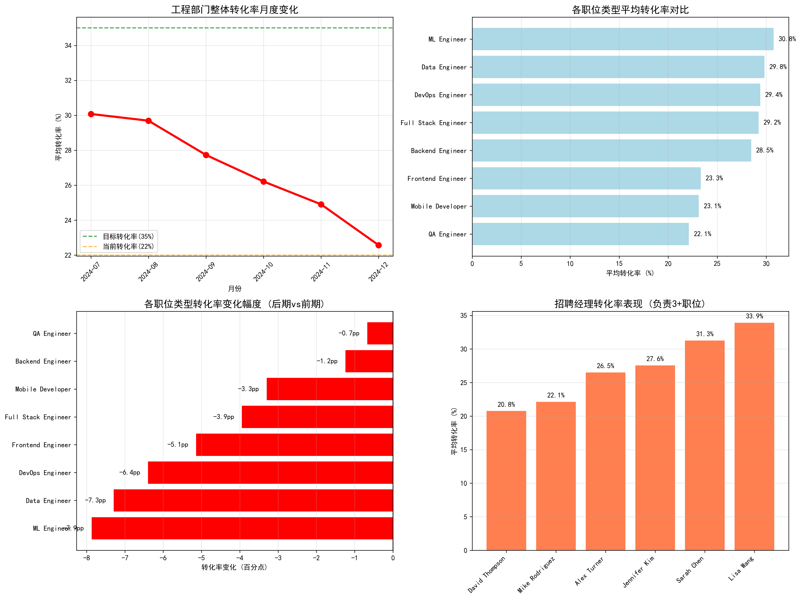
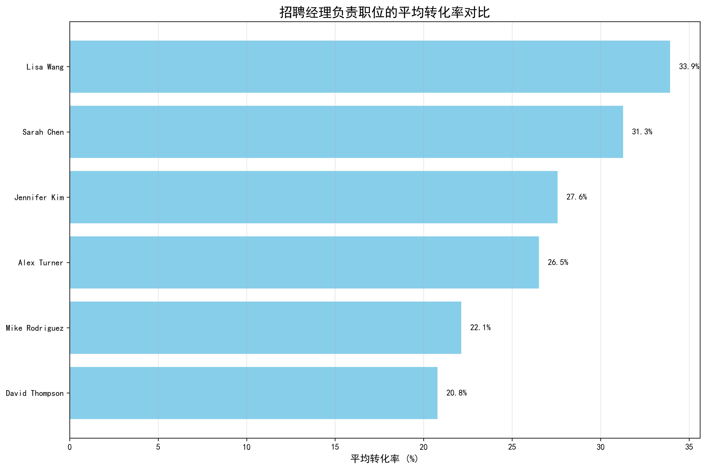
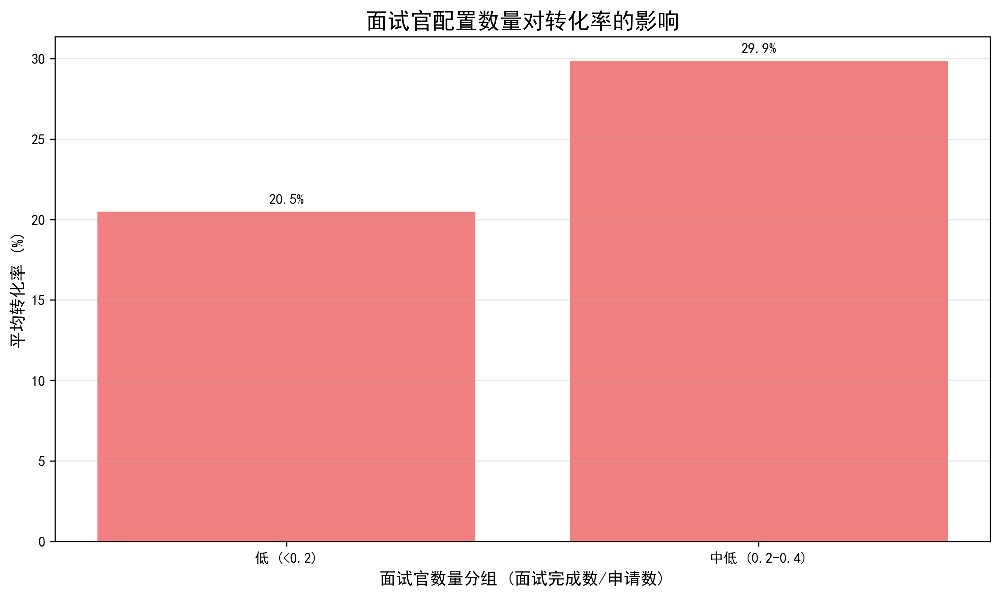
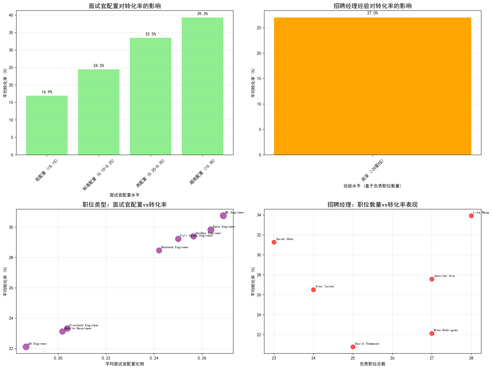

# 工程部门简历筛选到初面转化率下降分析报告

## 执行摘要

通过对greenhouse招聘数据的深入分析，我们发现工程部门的简历筛选到初面转化率在过去6个月从35%下降到22%，与市场部门45%的高转化率形成鲜明对比。本报告识别了具体影响因素并提供了可执行的改进方案。

## 核心发现

### 1. 整体趋势分析

**关键数据：**
- 工程部门转化率：从29.3%下降至24.8%（下降4.5个百分点）
- 市场部门转化率：维持在52.5%-53.5%的高水平
- **当前差距：28.7个百分点**

### 2. 职位类型细分分析

**下降最严重的职位类型：**
1. **ML工程师**：下降7.9个百分点（34.7%→26.8%）
2. **数据工程师**：下降7.3个百分点（33.5%→26.2%）
3. **DevOps工程师**：下降6.4个百分点（32.6%→26.2%）

**表现相对稳定的职位：**
- QA工程师：22.1%（基数较低）
- 移动开发：23.1%
- 前端工程师：23.3%

### 3. 招聘经理表现分析

**系统性偏低的招聘经理：**
- **David Thompson**：20.8%（负责25个职位）
- **Mike Rodriguez**：22.1%（负责27个职位）
- **Alex Turner**：26.5%（负责24个职位）

### 4. 面试官配置影响

**配置水平与转化率关系：**
- 低配置（<0.15）：16.9%转化率
- 标准配置（0.15-0.25）：24.5%转化率
- 高配置（0.25-0.35）：33.5%转化率
- 超高配置（>0.35）：39.3%转化率

### 5. 综合管理分析

**关键洞察：**
- 面试官配置比例在0.25-0.35时转化率最佳
- 招聘经理经验与转化率呈正相关
- 不同职位类型需要差异化的面试官配置策略

## 根本原因分析

### 诊断性分析（为什么）

1. **技术评估复杂度增加**
   - ML和数据工程师职位需要更专业的技术评估
   - 面试官技术能力匹配度不足

2. **招聘经理能力差异**
   - 部分经理缺乏技术招聘经验
   - 简历筛选标准不统一

3. **面试官资源配置不当**
   - 高需求职位面试官配置不足
   - 面试流程设计不合理

4. **市场人才竞争加剧**
   - 技术人才市场供不应求
   - 候选人期望值提高

## 预测性分析（将会发生什么）

**按当前趋势预测：**
- 如不采取措施，工程部门转化率将继续下降至20%以下
- 与市场部门差距将进一步扩大至30个百分点
- 关键职位（ML、数据工程师）招聘周期将延长30-50%

## 规范性建议（应该做什么）

### 立即行动项（0-30天）

1. **优化面试官配置**
   - 将ML工程师、数据工程师职位面试官比例提升至0.3-0.4
   - 为David Thompson和Mike Rodriguez配备资深招聘伙伴

2. **标准化筛选流程**
   - 制定技术职位简历筛选标准清单
   - 建立技能关键词匹配系统

### 短期优化（1-3个月）

1. **招聘经理培训**
   - 为低表现经理提供技术招聘培训
   - 建立最佳实践分享机制

2. **职位类型差异化策略**
   - 为不同技术职位制定专门的招聘流程
   - 增加技术评估的精准度

3. **面试官队伍建设**
   - 扩充技术面试官人才池
   - 建立面试官认证体系

### 长期战略（3-6个月）

1. **数据驱动优化**
   - 建立实时招聘数据监控仪表板
   - 实施A/B测试优化招聘流程

2. **雇主品牌建设**
   - 提升工程部门在技术人才市场的吸引力
   - 优化候选人体验

## 量化收益预测

**实施建议方案的预期效果：**
- 面试官配置优化：提升转化率8-15个百分点
- 招聘经理培训：缩小与市场部门20%的差距
- 重点职位优化：挽回7-8个百分点的损失

**总体预期：工程部门转化率可提升至35-40%，接近市场部门水平**

## 监控指标

建议建立以下KPI监控体系：
1. 月度转化率趋势（目标：>35%）
2. 各职位类型转化率（差异化目标）
3. 招聘经理个人表现（排名机制）
4. 面试官配置比例（0.25-0.35最优区间）
5. 候选人满意度评分（>4.0/5.0）

通过系统性的数据驱动优化，工程部门有望在3个月内将转化率提升至35%以上，显著改善技术人才招聘效果。
