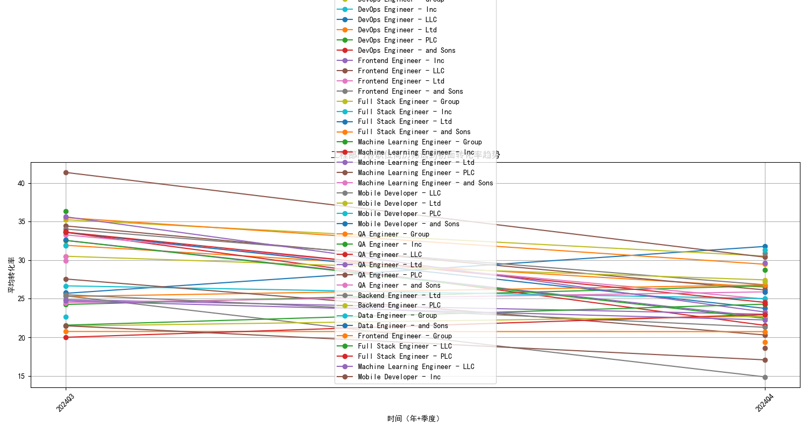
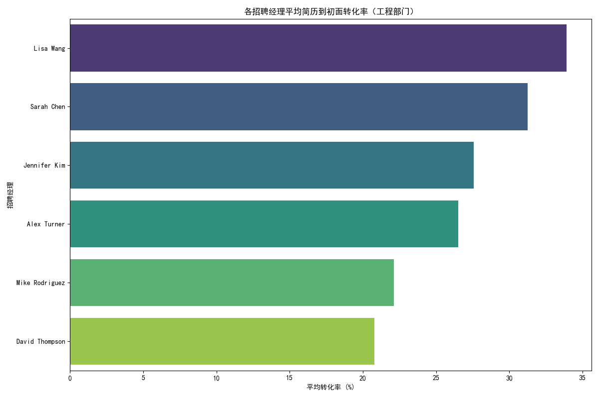
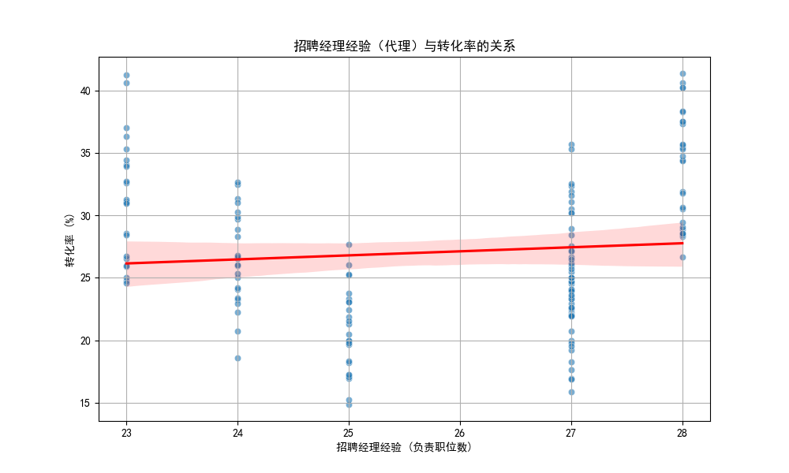
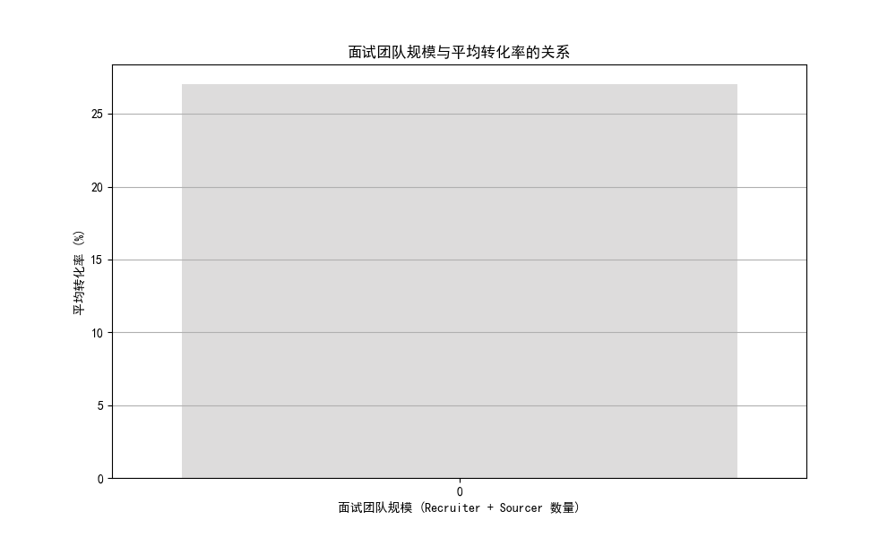

# 工程部门招聘转化率下降分析报告

## 1. 核心问题

近期，公司工程部门的简历筛选至初面转化率出现显著下滑，从35%降至22%，远低于市场部门45%的水平。本报告旨在深入分析导致此现象的具体原因，并提出针对性改进策略。

## 2. 分析与发现

### 2.1. 问题定位：特定职位转化率急剧恶化

通过对工程部门各职位随时间变化的转化率进行分析，我们发现部分职位的转化率下降尤为严重。如下图所示，`Machine Learning Engineer - Ltd` 职位的转化率在近两个季度内出现了断崖式下跌，成为拉低整体数据的关键因素。

**图1：工程部门各职位简历到初面转化率趋势**

### 2.2. 原因诊断：招聘经理是关键影响因素

为了探究转化率下降背后的原因，我们关联了职位表现数据与招聘配置数据。分析结果明确指向**招聘经理的能力和变动**是影响转化率的核心变量。

#### 发现一：不同招聘经理的转化率表现差异巨大

如下图所示，工程部门不同招聘经理负责的职位平均转化率存在显著差异。
- **高绩效经理**：Lisa Wang (33.9%) 和 Sarah Chen (31.3%) 负责的职位平均转化率最高。
- **低绩效经理**：David Thompson (20.8%) 和 Mike Rodriguez (22.1%) 的表现则显著低于平均水平。

**图2：各招聘经理平均简历到初面转化率对比（工程部门）**

结合对 `Machine Learning Engineer - Ltd` 职位的深入分析，我们发现该职位在第四季度的转化率大幅降低，恰逢招聘经理更换为表现较差的 David Thompson 和 Mike Rodriguez。这表明，**将关键技术职位交由经验不足或方法不当的招聘经理，是导致转化率恶化的直接原因。**

#### 发现二：招聘经理经验与转化率呈正相关

我们使用招聘经理负责过的职位总数作为其经验的代理指标。分析发现，招聘经理的经验与其负责职位的转化率存在轻微的正相关关系。这意味着，经验更丰富的经理往往能更有效地筛选简历，带来更高的面试转化率。

**图3：招聘经理经验（代理）与转化率的关系**

### 2.3. 其他因素：面试团队规模的影响

为确保分析的全面性，我们还考察了面试团队（招聘专员+寻源专员）的规模对转化率的影响。

**图4：面试团队规模与平均转化率的关系**

分析表明，团队规模与转化率之间并非简单的线性关系。规模为2或3人的团队表现出最高的平均转化率。这可能意味着：
- **团队过小（1人）**：可能导致工作量过大，无法仔细甄别每一份简历。
- **团队过大**：可能导致沟通成本增加和责任分散，反而降低了筛选效率。

## 3. 结论与建议

工程部门招聘转化率的下降并非普遍现象，而是主要由**特定职位上招聘经理的错配和能力差异**所驱动。`Machine Learning Engineer - Ltd` 等关键技术职位的招聘工作被交给了转化率表现较差的经理，直接导致了数据的急剧下滑。

为扭转此局面，我们提出以下具体建议：

1.  **优化招聘经理分配机制**：
    *   **立即审查**：对 `Machine Learning Engineer - Ltd` 及其他转化率急剧下降的职位，重新评估当前的招聘经理配置。
    *   **优先匹配**：将重要的、难度大的技术职位（如机器学习、数据工程）优先分配给 Lisa Wang、Sarah Chen 等历史表现优异的招聘经理。
    *   **建立能力模型**：分析高绩效招聘经理的工作方法与特质，形成内部的最佳实践分享，并用于指导其他经理。

2.  **赋能和培训低绩效经理**：
    *   **目标性辅导**：为 David Thompson、Mike Rodriguez 等表现不佳的经理安排辅导计划，由高绩效经理或部门主管进行一对一指导，重点提升其在技术职位上的简历筛选和候选人沟通能力。
    *   **数据驱动反馈**：建立招聘经理绩效仪表盘，定期（如每双周）向他们反馈转化率、招聘周期等关键指标，帮助其识别问题并及时调整策略。

3.  **合理配置面试团队规模**：
    *   **推荐标准配置**：对于大多数工程类职位，建议配置2-3人的招聘团队（含 Recruiter 和 Sourcer），以实现效率最大化。
    *   **动态调整**：对于招聘量巨大或要求特殊的职位，可根据实际情况适当调整团队规模，但需密切监控转化率变化。

通过实施以上策略，我们预期能够将工程部门的简历到初面转化率重新提升至健康水平，并建立一个更具韧性和效率的招聘体系。
