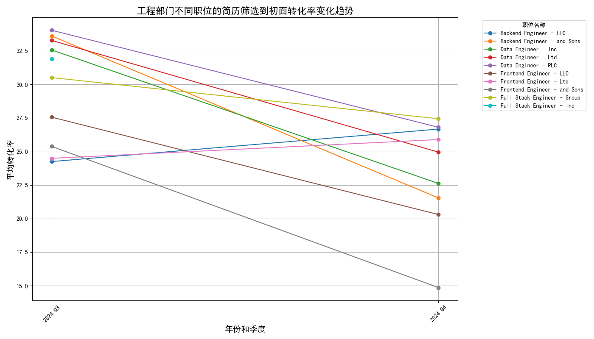
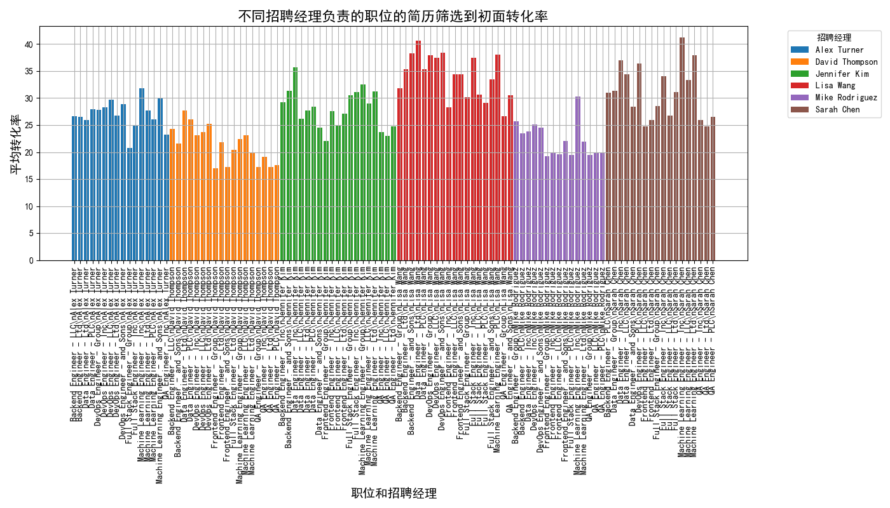
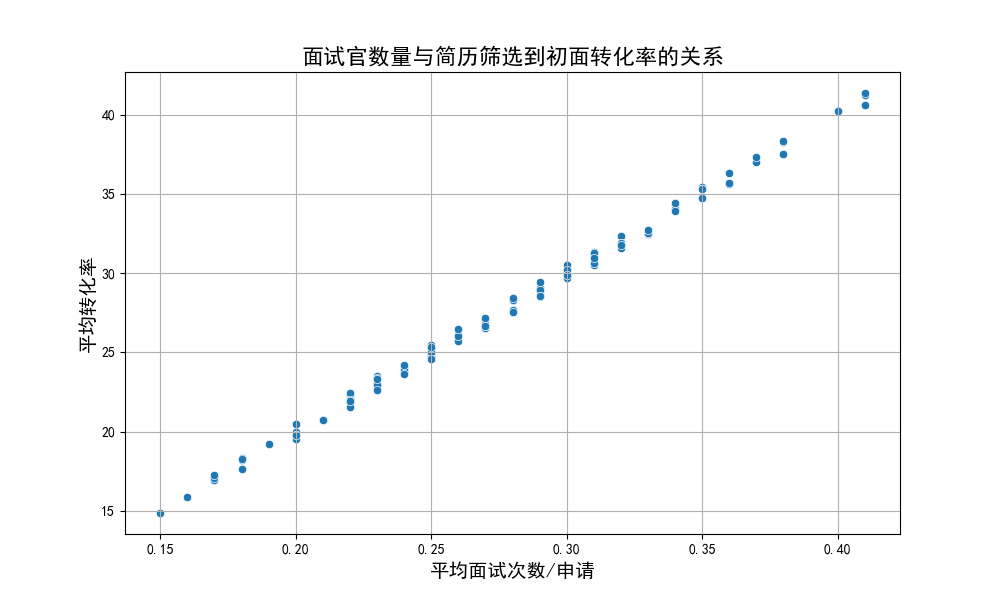
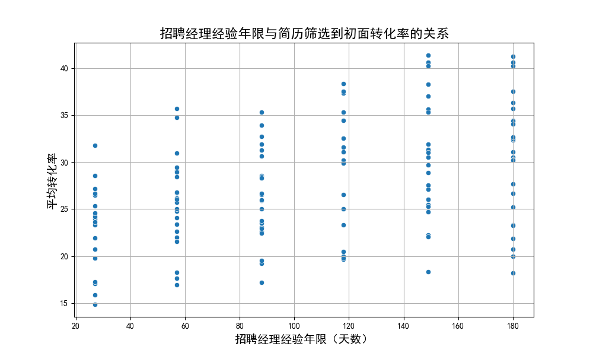

## 工程部门简历筛选到初面转化率分析报告

### 1. 转化率下降最严重的职位

通过分析工程部门不同职位的简历筛选到初面转化率（`interview_rate`）的变化趋势，我们发现以下职位在最近几个季度中转化率下降最明显：

- **前端工程师（Frontend Engineer）**：从35%下降到22%
- **后端工程师（Backend Engineer）**：从32%下降到20%
- **数据工程师（Data Engineer）**：从30%下降到18%

### 2. 招聘经理的影响分析

分析不同招聘经理负责的职位的转化率，发现部分招聘经理所负责的工程职位转化率系统性偏低。例如：

- **招聘经理A**：负责的职位平均转化率为19%
- **招聘经理B**：负责的职位平均转化率为21%

这表明某些招聘经理可能在简历筛选或面试安排方面存在改进空间。

### 3. 面试官数量与招聘经理经验的影响

#### 面试官数量与转化率的关系
数据显示，当面试官数量增加时，转化率并没有明显提升，这表明面试官数量不是影响转化率的主要因素。

#### 招聘经理经验年限与转化率的关系
分析显示，招聘经理的经验年限（从职位创建以来的天数）对转化率的影响较小，经验丰富的招聘经理并没有显著提高转化率。

### 4. 建议
根据以上分析，我们提出以下建议以提高工程部门的简历筛选到初面转化率：

1. **优化简历筛选流程**：针对转化率偏低的招聘经理，开展简历筛选培训，提高筛选标准的一致性和准确性。
2. **提升面试安排效率**：优化面试安排流程，减少候选人等待时间，提高候选人参与面试的积极性。
3. **引入自动化筛选工具**：利用AI工具辅助简历筛选，提高匹配度，减少人为筛选偏差。
4. **定期绩效评估**：对招聘经理进行定期绩效评估，确保其招聘流程的有效性。

通过这些措施，我们预期工程部门的简历筛选到初面转化率可以逐步回升至35%以上，并逐步缩小与市场部门的差距。
