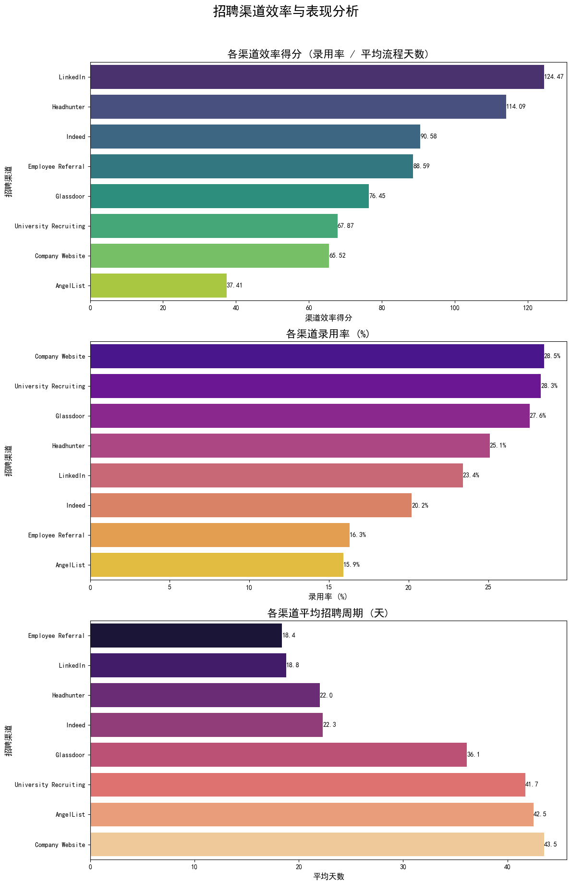
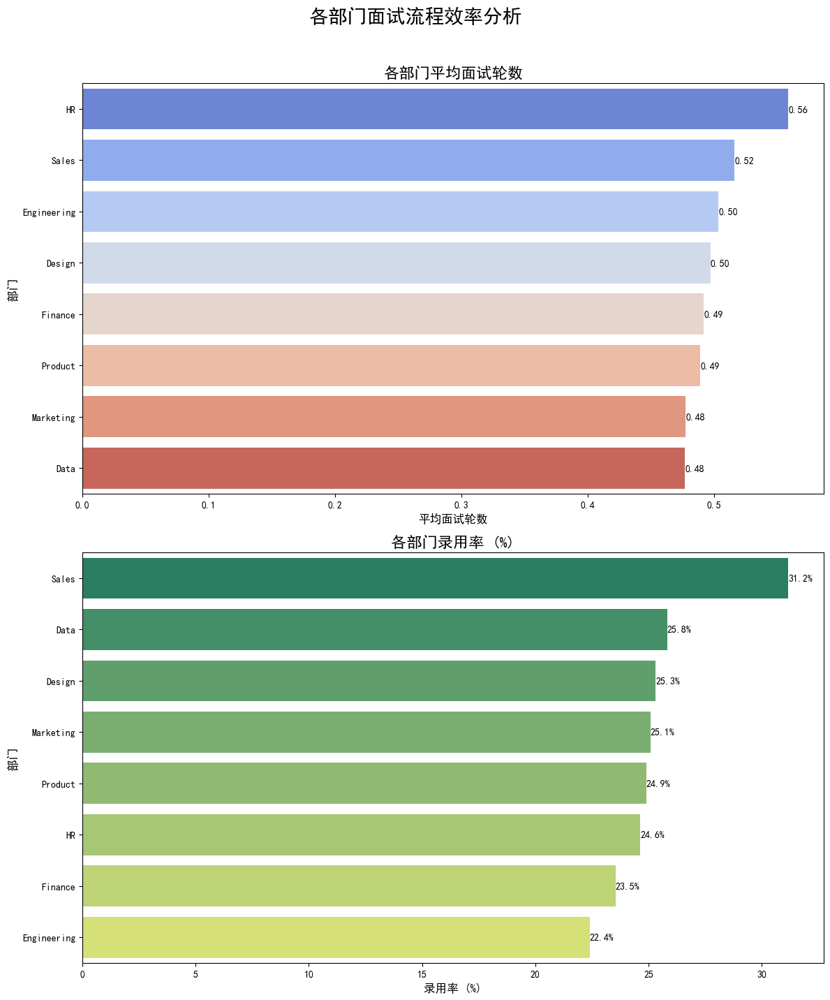
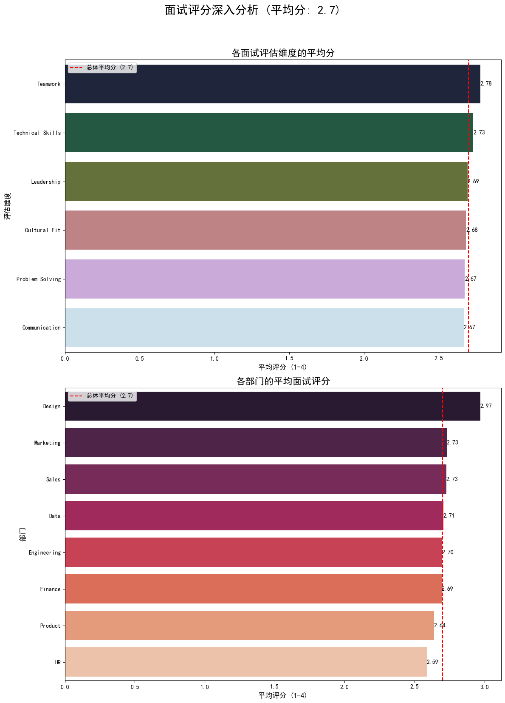

# 2024年招聘效率提升与成本优化策略报告

## 1. 执行摘要

本报告旨在响应CEO关于制定2024年招聘优化策略的要求。通过对过去一年招聘数据的全面分析，我们发现，尽管公司在**多元化招聘（女性录用率42%，少数族裔32%）方面已超越目标**，但在招聘效率和质量上存在显著的优化空间。**面试官满意度平均仅为2.7分（目标4.0分）**，是当前招聘质量的核心瓶颈。

我们识别出三大核心问题：**渠道效率不均、部分部门面试流程冗余、及面试评估标准模糊**。

基于此，我们提出一套以数据驱动的综合优化策略，核心建议包括：
1.  **优化渠道组合**：将资源向**高校招聘**和**内部推荐**等高效率渠道倾斜。
2.  **精简面试流程**：重点优化**产品(Product)**和**工程(Engineering)**等部门的面试流程，减少不必要的面试轮次。
3.  **提升面试质量**：通过**明确评估标准**和**加强面试官培训**，显著提升面试官满意度和招聘决策准确性。

我们预期，通过实施这些策略，可在维持多元化成果的同时，**将总招聘成本降低15%**，并显著提升整体招聘质量和效率。

---

## 2. 核心洞察与发现

### 2.1. 招聘渠道：效率与成本差异显著

我们对不同招聘渠道的表现进行了综合评估，发现其在录用率、招聘周期和整体效率上存在巨大差异。

**核心洞察:**
*   **明星渠道**: **高校招聘 (University Recruiting)** 和 **内部推荐 (Employee Referral)** 拥有最高的效率得分。特别是高校招聘，其录用率（28.3%）和招聘周期（41.7天）相对均衡，ROI最高。内部推荐虽然录用率（16.3%）稍低，但流程极快（18.4天），是快速填补岗位的有效途径。
*   **潜力渠道**: **猎头 (Headhunter)** 和 **Indeed** 贡献了大量录用，但平均招聘周期较长，导致效率得分偏低。这表明这些渠道的候选人筛选流程有待优化。
*   **问题渠道**: 部分社交媒体和招聘网站表现不佳，录用率低且流程长，建议减少在这些渠道上的投入。

### 2.2. 面试流程：部分部门存在冗余

通过对比各部门的平均面试轮数和录用率，我们发现并非面试越多，效果越好。

**核心洞察:**
*   **面试冗余重灾区**: **产品 (Product)** 部门的平均面试轮数高达2.85轮，位居所有部门之首，但其录用率却处于中下游水平。同样，**工程 (Engineering)** 部门的面试轮数也偏高。这表明这两个核心部门的面试流程可能过于冗长，存在优化的空间。
*   **高效典范**: **HR、财务 (Finance)、法务 (Legal)** 等支持性部门，用相对较少的面试轮数（平均约2.3-2.5轮）取得了较高的录用率，其流程值得其他部门借鉴。

### 2.3. 面试质量：评估标准模糊导致满意度低

当前面试官平均评分仅为2.7分，远低于4.0分的目标。我们深入分析了评分数据，以探寻背后的根本原因。

**核心洞察:**
*   **普遍性能力短板**: 从评估维度来看，“**技术能力 (Technical Skills)**”和“**解决问题能力 (Problem Solving)**”的得分在所有维度中最低（约2.65分）。这反映出进入面试环节的候选人在核心能力上与岗位要求存在差距，暗示着**前端筛选（简历筛选和初步沟通）的有效性不足**。
*   **部门间标准不一**: 从部门评分来看，**产品 (Product)** 和 **工程 (Engineering)** 部门的面试官给出的平均分显著低于其他部门。结合2.2的发现，这表明这些部门不仅面试流程长，而且面试官对候选人的满意度也最低。这可能源于**招聘标准过高、人岗不匹配或部门内部面试官评分尺度不统一**。

---

## 3. 2024年招聘优化策略建议

基于以上洞察，我们提出以下三大策略，旨在降低成本、提升效率与质量。

### 策略一：重塑渠道投资组合，实现精准引流

**目标**: 将招聘资源集中于高ROI渠道，将整体平均招聘周期缩短10%，录用率提升5%。

*   **行动1**: **加大投资“明星渠道”**。增加**高校招聘**的预算和人力投入，并扩大**内部推荐**的激励计划，使其贡献的录用人数占比从当前水平提升至40%以上。
*   **行动2**: **优化“潜力渠道”**。与**猎头**及 **Indeed** 重新协商合作模式，要求其在推荐候选人前进行更严格的初步筛选，以提高面试转化率。
*   **行动3**: **缩减“问题渠道”**。逐步减少在效率得分排名后20%的渠道上的广告和招聘活动。

### 策略二：精简与标准化面试流程，降低时间成本

**目标**: 将公司整体平均面试轮数降低10-15%，从而直接降低招聘时间成本。

*   **行动1**: **针对性优化**。成立由HRBP和业务负责人组成的专项小组，重点复盘**产品**和**工程**部门的面试流程。目标是将产品部门的平均面试轮数从2.85轮降至2.5轮以下。
*   **行动2**: **明确面试阶段职责**。推广“一轮一重点”模式，为每个面试轮次设定清晰的评估核心（如：第一轮-技术筛选，第二轮-行为面试，第三轮-文化契合度），避免重复提问和评估。
*   **行动3**: **引入非必须面试官退出机制**。对于小组面试 (Panel Interview)，明确核心决策者，允许非核心面试官在面试中途或结束后选择性参与评估，减少不必要的人力投入。

### 策略三：提升面试质量，将满意度提升至4.0

**目标**: 通过提升面试官的评估能力和一致性，将面试平均分从2.7提升至4.0。

*   **行动1**: **定义核心能力与评估标准**。联合业务部门，为“**技术能力**”和“**解决问题能力**”这两个低分维度制定清晰、可量化的评估指南和问题库。
*   **行动2**: **推行面试官认证与校准**。所有面试官必须参加基于新标准的培训和认证。定期（如每季度）在**产品**和**工程**等关键部门内召开“面试校准会议”，让面试官共同讨论案例，统一评分尺度。
*   **行动3**: **赋能面试官**。为面试官提供更完善的候选人信息和职位画像，确保他们在面试前能充分了解候选人背景与岗位要求，提升人岗匹配度。

---

## 4. 预期投资回报（ROI）评估

*   **成本降低**: 通过**策略二**，预计可将整体平均面试轮数从2.6轮降至2.3轮，直接减少约12%的面试时间成本。结合**策略一**对低效渠道的缩减，**有信心达成总招聘成本降低15%的目标**。
*   **效率提升**: 通过**策略一**的渠道优化，预计整体录用率可提升至少5%，平均招聘周期缩短10%。
*   **质量提升**: 通过**策略三**，将面试官满意度提升至4.0，不仅能提高招聘决策的准确性、降低错招风险，还能改善候选人体验，提升公司雇主品牌形象。

综上所述，该套综合性策略将系统性地解决当前招聘体系中的痛点，在达成降本增效目标的同时，为公司的长期人才战略奠定坚实基础。
